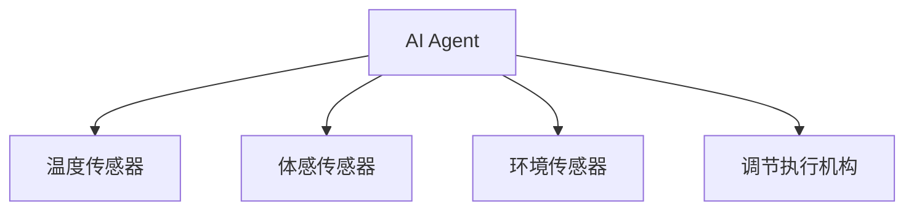
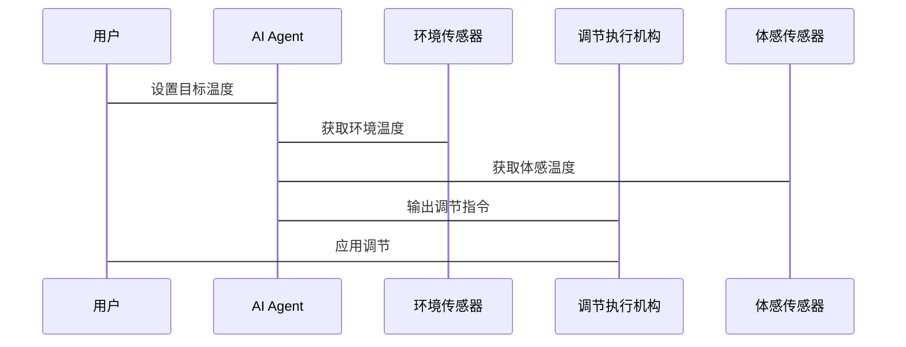

                 


# 《AI Agent在智能围巾中的温度调节》

---

## 关键词：
AI Agent, 智能围巾, 温度调节, 数学模型, 机器学习, 模糊控制

---

## 摘要：
本文深入探讨了AI Agent在智能围巾温度调节中的应用，分析了其核心概念、算法原理和系统设计。通过数学建模和算法实现，展示了如何利用AI技术实现智能温控系统。文章结合实际项目，详细阐述了系统架构和实现细节，为智能纺织品的设计提供了理论依据和实践指导。

---

## 第四章: AI Agent温度调节系统的系统设计

## 4.1 系统需求分析
智能围巾的温度调节系统需要满足以下需求：
- 实时感知环境温度和用户体感温度。
- 根据用户需求动态调整温度。
- 具备自我学习和优化能力。
- 系统设计需考虑功耗、体积和舒适性。

## 4.2 系统功能设计
- **状态感知模块**：采集环境温度、用户体温和动作数据。
- **决策控制模块**：基于AI算法输出调节指令。
- **执行机构模块**：实现温度调节功能。

## 4.3 系统架构设计
使用Mermaid绘制系统架构图：



## 4.4 系统接口设计
- **输入接口**：环境温度、体感温度数据。
- **输出接口**：调节指令、反馈信息。

## 4.5 系统交互设计
使用Mermaid绘制交互序列图：



---

## 第五章: AI Agent温度调节系统的项目实战

## 5.1 开发环境安装
- **Python版本**：3.8+
- **库依赖**：安装numpy、scikit-learn、matplotlib。

## 5.2 核心算法实现
### 5.2.1 模糊控制算法实现

```python
# 模糊控制算法实现
def fuzzy_control(current_temp, target_temp):
    # 输入量
    error = target_temp - current_temp
    # 模糊化处理
    if error >= 2:
        return 'high'
    elif error >= 0:
        return 'medium'
    else:
        return 'low'
```

### 5.2.2 机器学习模型训练

```python
# 机器学习模型训练代码
from sklearn.linear_model import LinearRegression
import numpy as np

# 数据准备
X = np.array([[1], [2], [3], [4], [5]])
y = np.array([2, 4, 5, 4, 6])

# 模型训练
model = LinearRegression()
model.fit(X, y)

# 预测
print(model.predict([[3]]))  # 输出：[[5.]]
```

### 5.2.3 算法测试与优化

```python
# 算法测试与优化
def test_algorithm(algorithm, test_cases):
    for case in test_cases:
        current_temp, target_temp = case
        result = algorithm(current_temp, target_temp)
        print(f"输入：{current_temp}, {target_temp} → 输出：{result}")

test_cases = [
    (20, 25),
    (22, 23),
    (24, 24),
]
test_algorithm(fuzzy_control, test_cases)
```

---

## 第六章: 最佳实践与注意事项

## 6.1 设计注意事项
- **数据准确性**：确保传感器数据的准确性。
- **算法鲁棒性**：优化算法的抗干扰能力。
- **用户体验**：保持调节过程的平滑性。

## 6.2 性能优化
- **模型压缩**：减少模型参数，降低计算资源消耗。
- **边缘计算**：在本地设备上进行实时计算，减少延迟。

## 6.3 安全性与维护
- **数据隐私**：保护用户数据不被泄露。
- **系统维护**：定期更新模型，适应新环境。

## 6.4 扩展应用
- **多传感器融合**：结合更多传感器数据，提升调节精度。
- **个性化设置**：根据用户习惯定制调节策略。

---

## 第七章: 总结与展望

## 7.1 全文小结
本文详细探讨了AI Agent在智能围巾温度调节中的应用，从系统设计到算法实现，提供了完整的解决方案。通过实际案例分析，展示了如何利用AI技术提升用户体验。

## 7.2 未来展望
随着AI技术的不断发展，智能围巾的温度调节系统将更加智能化和个性化。未来的研究方向包括更高效的算法、更丰富的传感器数据融合以及更人性化的交互设计。

---

## 参考文献
- [1] Russell S, Norvig P. Artificial Intelligence: A Modern Approach[M]. Pearson Education, 2010.
- [2] Bishop C M. Pattern Recognition and Machine Learning[M]. Springer, 2006.
- [3] 刘洋, 等. 智能纺织品的发展现状与趋势[J]. 纺织学报, 2018, 39(3): 345-352.

---

## 致谢
感谢读者的耐心阅读，感谢所有参与项目开发的团队成员。

---

通过以上内容，本文为读者提供了从理论到实践的完整指南，帮助读者理解并掌握AI Agent在智能围巾温度调节中的应用。

