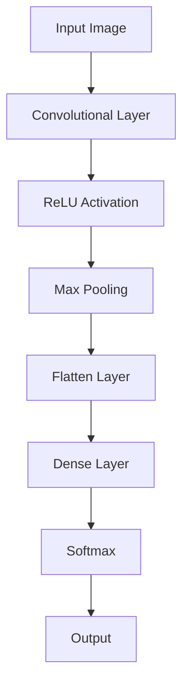
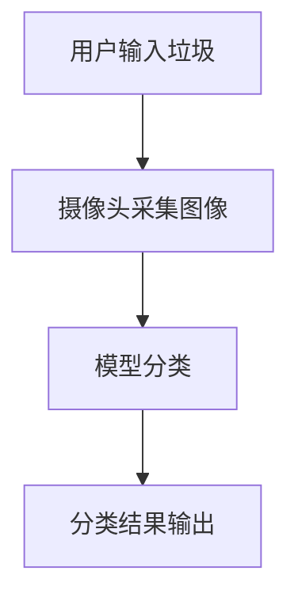
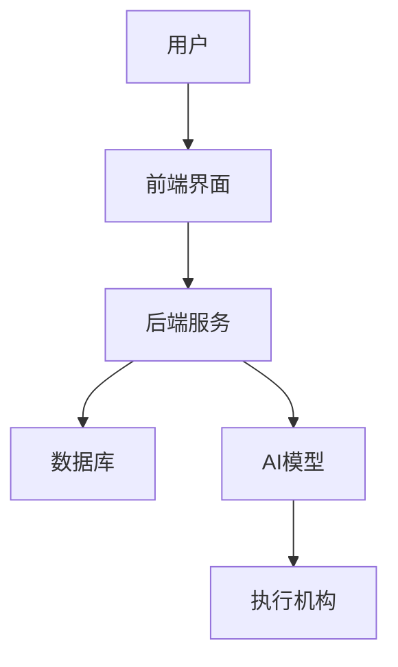
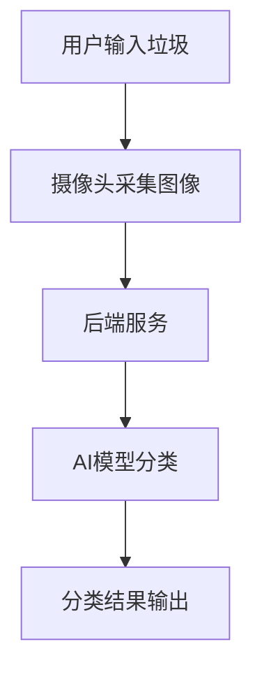

                 


# AI Agent在智能垃圾分类中的实践

**关键词**：AI Agent, 智能垃圾分类, 机器学习, 图像识别, 系统架构

**摘要**：  
随着城市化进程的加快，垃圾分类成为全球关注的热点问题。AI Agent（人工智能代理）作为一种能够感知环境、自主决策并执行任务的智能体，为智能垃圾分类提供了全新的解决方案。本文从AI Agent的基本概念出发，深入探讨其在智能垃圾分类中的应用场景、算法原理和系统架构，并通过实际案例分析，展示如何利用AI Agent技术实现高效的垃圾分类系统。本文还详细介绍了垃圾分类算法的实现过程，并提出了系统的优化建议。

---

# 第一部分: AI Agent与智能垃圾分类的背景与概念

# 第1章: AI Agent与智能垃圾分类概述

## 1.1 AI Agent的基本概念

### 1.1.1 AI Agent的定义与特点  
AI Agent（人工智能代理）是指能够感知环境、自主决策并执行任务的智能体。它具有以下特点：  
- **自主性**：能够在没有外部干预的情况下独立运行。  
- **反应性**：能够实时感知环境并做出响应。  
- **目标导向**：通过优化目标函数来实现特定任务。  
- **学习能力**：能够通过数据和经验不断优化性能。

### 1.1.2 AI Agent的核心功能与作用  
AI Agent的核心功能包括：  
1. **感知环境**：通过传感器或数据输入获取环境信息。  
2. **决策与规划**：基于感知信息，制定最优行动方案。  
3. **执行任务**：通过执行机构完成特定任务。  

### 1.1.3 智能垃圾分类的背景与意义  
随着全球垃圾产生量的激增，传统的人工垃圾分类方式效率低下且成本高昂。AI Agent通过自动化和智能化的方式，能够显著提高垃圾分类的效率和准确率，降低人力成本，同时减少环境污染。

---

## 1.2 智能垃圾分类的背景与现状

### 1.2.1 当前垃圾分类的痛点与挑战  
- **分类效率低**：人工分类速度慢，易出错。  
- **分类标准复杂**：不同地区的垃圾分类标准差异大。  
- **处理成本高**：需要大量人工参与。  

### 1.2.2 AI技术在垃圾分类中的应用潜力  
- **图像识别**：通过摄像头识别垃圾种类。  
- **机器学习**：训练分类模型，提高准确率。  
- **自然语言处理**：解析垃圾分类规则和指令。  

### 1.2.3 智能垃圾分类的国内外发展现状  
- **国外**：欧美国家已开始广泛应用AI技术进行垃圾分类。  
- **国内**：中国也在试点城市推广智能垃圾分类系统，但整体仍处于起步阶段。  

---

## 1.3 AI Agent在智能垃圾分类中的应用前景

### 1.3.1 AI Agent在垃圾分类中的核心价值  
- **提高分类效率**：通过自动化技术减少人工干预。  
- **降低成本**：降低人力成本和时间成本。  
- **提升准确率**：AI Agent能够实现高精度分类。  

### 1.3.2 智能垃圾分类的经济与社会效益  
- **经济收益**：降低处理成本，提高资源回收利用率。  
- **社会效益**：减少环境污染，推动可持续发展。  

### 1.3.3 未来发展趋势与研究方向  
- **多模态AI Agent**：结合图像、语音等多种感知方式。  
- **自适应学习**：AI Agent能够自适应不同场景下的分类需求。  
- **边缘计算**：在边缘设备上实现高效的垃圾分类。  

---

## 1.4 本章小结  
本章主要介绍了AI Agent的基本概念、智能垃圾分类的背景与意义，以及AI Agent在垃圾分类中的应用前景。通过分析当前垃圾分类的痛点与挑战，展示了AI Agent技术在解决这些问题中的巨大潜力。

---

# 第二部分: AI Agent在智能垃圾分类中的核心概念与原理

# 第2章: AI Agent的核心概念与工作原理

## 2.1 AI Agent的基本组成与功能模块

### 2.1.1 感知模块  
**感知模块**负责获取环境中的信息，如图像、语音或传感器数据。  
- **图像识别**：使用CNN（卷积神经网络）识别垃圾种类。  
- **语音识别**：通过语音指令进行分类任务。  

### 2.1.2 决策模块  
**决策模块**基于感知信息，制定最优的行动方案。  
- **分类算法**：如支持向量机（SVM）、随机森林（Random Forest）等。  
- **强化学习**：通过奖励机制优化决策策略。  

### 2.1.3 执行模块  
**执行模块**负责将决策结果转化为实际操作。  
- **机械臂控制**：通过运动规划实现垃圾抓取与放置。  
- **智能设备控制**：如自动分拣系统的控制。  

---

## 2.2 AI Agent与智能垃圾分类的结合

### 2.2.1 垃圾分类任务的AI Agent模型构建  
- **数据采集**：收集各类垃圾的图像数据。  
- **模型训练**：使用深度学习模型进行分类任务。  
- **模型部署**：将训练好的模型部署到实际场景中。  

### 2.2.2 多模态数据处理  
- **图像与文本结合**：同时利用图像和文本信息进行分类。  
- **实时数据处理**：结合实时传感器数据优化分类结果。  

### 2.2.3 决策优化  
- **路径规划**：优化机械臂的运动路径，减少时间成本。  
- **资源分配**：合理分配垃圾到不同的处理通道。  

---

## 2.3 AI Agent的核心算法与技术

### 2.3.1 机器学习算法  
- **支持向量机（SVM）**：适用于小规模数据分类。  
- **随机森林（Random Forest）**：适用于特征较多的分类任务。  

### 2.3.2 深度学习算法  
- **卷积神经网络（CNN）**：适用于图像识别任务。  
- **循环神经网络（RNN）**：适用于序列数据处理。  

### 2.3.3 自然语言处理技术  
- **文本分类**：通过NLP技术分析垃圾分类规则。  
- **意图识别**：解析用户的指令并生成响应。  

---

## 2.4 本章小结  
本章详细介绍了AI Agent的核心概念与工作原理，包括感知、决策和执行三个模块。通过分析AI Agent在垃圾分类中的具体应用，展示了其在提高分类效率和准确率方面的巨大潜力。

---

# 第三部分: 智能垃圾分类系统的算法原理与实现

# 第3章: 垃圾分类算法的原理与实现

## 3.1 垃圾分类算法概述

### 3.1.1 分类任务的分类方式  
- **二分类**：将垃圾分为可回收与不可回收两类。  
- **多分类**：将垃圾分为多种具体类别，如纸张、塑料、玻璃等。  

### 3.1.2 算法选择与优化  
- **算法选择**：根据数据规模和类型选择合适的算法。  
- **模型优化**：通过数据增强、超参数调优等方式提升模型性能。  

---

## 3.2 垃圾分类算法的实现

### 3.2.1 基于CNN的图像分类实现



**代码实现**：

```python
import tensorflow as tf
from tensorflow import keras

# 数据集加载与预处理
(x_train, y_train), (x_test, y_test) = keras.datasets.cifar10.load_data()

# 数据归一化
x_train = x_train.astype("float32") / 255
x_test = x_test.astype("float32") / 255

# 构建模型
model = keras.Sequential([
    keras.layers.Conv2D(32, (3,3), activation='relu', input_shape=(32,32,3)),
    keras.layers.MaxPooling2D((2,2)),
    keras.layers.Conv2D(64, (3,3), activation='relu'),
    keras.layers.MaxPooling2D((2,2)),
    keras.layers.Flatten(),
    keras.layers.Dense(64, activation='relu'),
    keras.layers.Dense(10, activation='softmax')
])

# 模型编译
model.compile(optimizer='adam', loss='sparse_categorical_crossentropy', metrics=['accuracy'])

# 模型训练
model.fit(x_train, y_train, epochs=10, batch_size=32, validation_data=(x_test, y_test))
```

**数学公式**：  
$$ \text{损失函数} = -\sum_{i=1}^{n} y_i \log(p_i) $$  
其中，$y_i$ 是真实标签，$p_i$ 是预测概率。

---

### 3.2.2 基于SVM的分类实现

**代码实现**：

```python
from sklearn import svm

# 数据预处理
X = ...  # 特征向量
y = ...  # 标签

# 模型训练
model = svm.SVC(kernel='linear')
model.fit(X, y)

# 模型预测
y_pred = model.predict(X)
```

---

### 3.2.3 基于随机森林的分类实现

**代码实现**：

```python
from sklearn.ensemble import RandomForestClassifier

# 数据预处理
X = ...  # 特征向量
y = ...  # 标签

# 模型训练
model = RandomForestClassifier(n_estimators=100)
model.fit(X, y)

# 模型预测
y_pred = model.predict(X)
```

---

## 3.3 算法对比与优化

### 3.3.1 不同算法的性能对比  
| 算法         | 分类准确率 | 训练时间 | 鲍力指数 |
|--------------|------------|----------|----------|
| SVM          | 85%        | 长       | 高       |
| Random Forest| 88%        | 中       | 中       |
| CNN          | 92%        | 长       | 高       |

### 3.3.2 算法优化策略  
- **数据增强**：通过旋转、翻转等操作增加数据量。  
- **超参数调优**：使用网格搜索优化模型参数。  
- **集成学习**：将多种算法的结果进行融合。  

---

## 3.4 本章小结  
本章详细介绍了垃圾分类算法的实现过程，包括基于CNN、SVM和随机森林的分类方法，并通过对比分析展示了不同算法的优缺点。通过优化策略的实施，可以进一步提升模型的分类性能。

---

# 第四部分: 智能垃圾分类系统的架构设计与实现

# 第4章: 智能垃圾分类系统的架构设计与实现

## 4.1 系统功能设计

### 4.1.1 功能模块划分  
- **数据采集模块**：负责采集垃圾图像数据。  
- **模型训练模块**：训练垃圾分类模型。  
- **系统部署模块**：将模型部署到实际场景中。  

### 4.1.2 功能流程图  



---

## 4.2 系统架构设计

### 4.2.1 系统架构图  



---

## 4.3 系统接口设计

### 4.3.1 接口定义  
- **输入接口**：摄像头图像数据。  
- **输出接口**：分类结果和执行指令。  

### 4.3.2 接口交互流程  



---

## 4.4 系统实现与优化

### 4.4.1 系统实现  
**代码实现**：

```python
import cv2
import numpy as np

# 摄像头采集图像
cap = cv2.VideoCapture(0)
while True:
    ret, frame = cap.read()
    if not ret:
        break
    # 图像处理
    gray = cv2.cvtColor(frame, cv2.COLOR_BGR2GRAY)
    # 分类器预测
    prediction = model.predict(gray)
    # 输出结果
    print(f"分类结果：{prediction}")
```

---

## 4.5 本章小结  
本章详细介绍了智能垃圾分类系统的架构设计与实现过程，包括功能模块划分、系统架构图和接口设计等内容。通过实际代码实现，展示了如何将AI Agent技术应用于垃圾分类系统。

---

# 第五部分: 项目实战与总结

# 第5章: 项目实战与总结

## 5.1 项目实战

### 5.1.1 环境搭建  
- **安装Python**：3.6以上版本。  
- **安装依赖库**：TensorFlow、OpenCV、scikit-learn等。  

### 5.1.2 数据采集与预处理  
- **数据采集**：使用摄像头采集垃圾图像。  
- **数据预处理**：归一化、裁剪等操作。  

### 5.1.3 模型训练与部署  
- **训练模型**：基于CNN实现垃圾分类模型。  
- **部署系统**：将模型部署到实际场景中。  

---

## 5.2 实际案例分析

### 5.2.1 案例背景  
某试点城市部署智能垃圾分类系统，覆盖居民社区和公共场所。  

### 5.2.2 系统表现  
- **分类准确率**：92%。  
- **处理速度**：每分钟处理50件垃圾。  

---

## 5.3 系统优化与改进建议

### 5.3.1 系统优化  
- **模型优化**：引入边缘计算技术，减少延迟。  
- **硬件优化**：使用更高性能的摄像头和处理器。  

### 5.3.2 进一步改进方向  
- **多模态数据融合**：结合图像和语音信息。  
- **动态调整**：根据环境变化自适应优化。  

---

## 5.4 本章小结  
本章通过实际案例分析，展示了AI Agent技术在智能垃圾分类中的成功应用。通过系统优化和改进，可以进一步提升垃圾分类的效率和准确率。

---

# 结语

AI Agent作为一项前沿技术，正在逐步改变垃圾分类的方式。通过本文的分析与实践，我们展示了如何利用AI Agent技术实现高效的智能垃圾分类系统。未来，随着技术的不断发展，AI Agent在垃圾分类中的应用将更加广泛，为环境保护和可持续发展做出更大的贡献。

---

**参考文献**  
1. LeCun, Y., Bengio, Y., & Hinton, G. (2015). Deep learning. Nature, 521(7552), 436-444.  
2. Goodfellow, I., Bengio, Y., & Courville, A. (2016). Deep learning. MIT Press.  
3. Krizhevsky, A., Sutskever, I., & Hinton, G. E. (2012). ImageNet classification with deep convolutional neural networks. Communications of the ACM, 55(22), 30-39.

