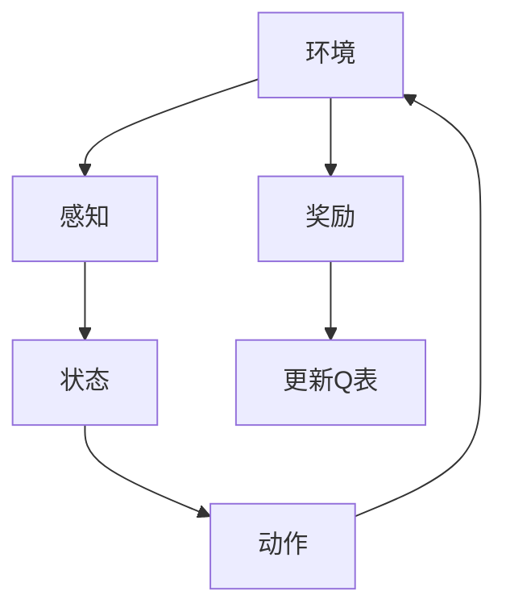
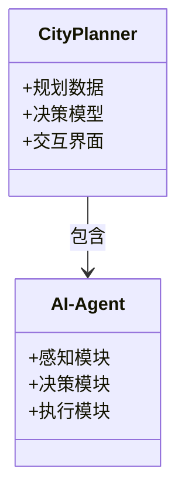
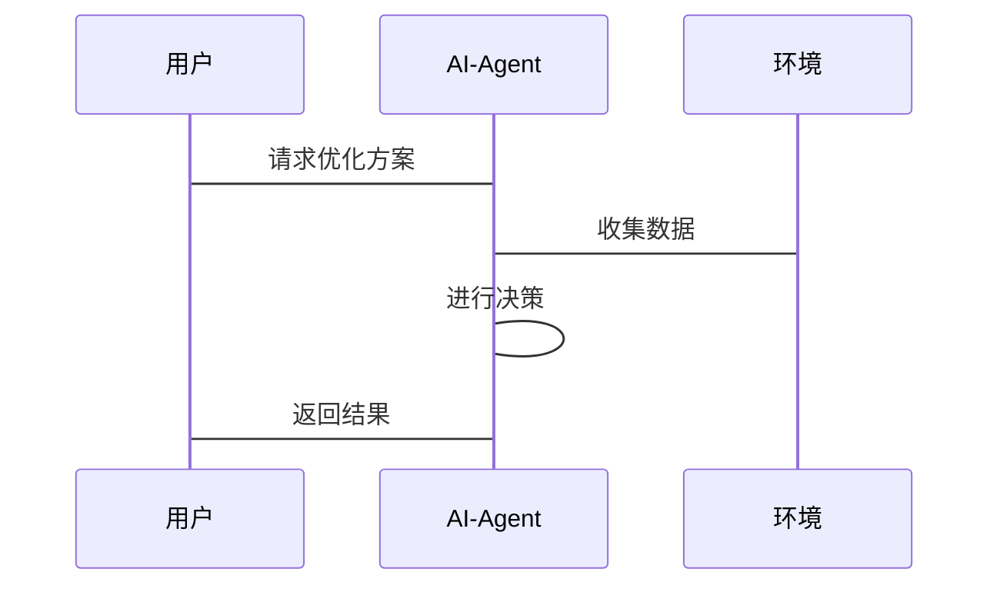

                 


# AI Agent在智能城市规划决策支持中的应用

> 关键词：AI Agent，智能城市，城市规划，决策支持，算法原理，系统架构

> 摘要：本文详细探讨了AI Agent在智能城市规划中的应用，从基本概念到算法原理，再到系统架构设计，结合实际案例分析，全面解析了AI Agent如何助力城市规划决策支持。

---

## 第一部分: AI Agent与智能城市规划概述

### 第1章: AI Agent的基本概念与背景介绍

#### 1.1 AI Agent的定义与核心概念
##### 1.1.1 从传统Agent到AI Agent的演进
传统的Agent（智能体）是能够感知环境并采取行动的实体，而AI Agent则是在此基础上，结合人工智能技术，具备更强的学习和适应能力。AI Agent能够通过数据驱动不断优化决策，适应复杂的城市环境变化。

##### 1.1.2 AI Agent的核心属性与特征
AI Agent具备以下核心属性：
- **自主性**：能够在没有外部干预的情况下自主运作。
- **反应性**：能够实时感知环境并做出反应。
- **学习性**：通过机器学习算法不断优化决策模型。
- **协作性**：能够与其他Agent或系统协同工作，共同完成复杂任务。

##### 1.1.3 AI Agent在智能城市中的作用与价值
在智能城市中，AI Agent可以用于交通管理、资源分配、环境监测等领域，帮助城市管理者做出更高效、更科学的决策。

#### 1.2 智能城市规划的背景与挑战
##### 1.2.1 智能城市的概念与发展现状
智能城市是指通过先进的信息技术，将城市各个系统有机整合，实现智能化管理和服务的城市形态。当前，全球范围内许多城市都在积极推进智能化转型，以应对人口增长、资源短缺等挑战。

##### 1.2.2 智能城市规划中的关键问题
智能城市规划面临以下关键问题：
- **复杂性**：城市系统相互交织，决策需要考虑多个因素。
- **动态性**：城市环境不断变化，需要实时调整规划。
- **不确定性**：许多因素难以预测，如交通流量、天气变化等。

##### 1.2.3 AI Agent在智能城市规划中的应用前景
AI Agent能够通过实时数据分析和决策优化，帮助城市规划者应对复杂性和不确定性，提升规划的科学性和可操作性。

---

### 第2章: AI Agent在智能城市规划中的核心概念与联系

#### 2.1 AI Agent的核心原理
##### 2.1.1 AI Agent的感知与决策机制
AI Agent通过传感器、摄像头等设备感知环境，收集数据后，利用机器学习算法进行分析，生成决策方案。

##### 2.1.2 基于强化学习的决策模型
强化学习是一种通过试错机制优化决策模型的方法。AI Agent通过与环境的交互，不断调整策略，以获得最大化的累积奖励。

##### 2.1.3 多智能体协作的实现方式
在智能城市中，通常需要多个AI Agent协作完成任务。通过通信协议和协作机制，各Agent可以共享信息、协调行动，共同实现目标。

#### 2.2 核心概念对比与ER实体关系图
##### 2.2.1 AI Agent与传统决策模型的对比分析
| 特性 | 传统决策模型 | AI Agent |
|------|---------------|----------|
| 数据依赖 | 依赖于预设规则 | 数据驱动 |
| 灵活性 | 较低 | 较高 |
| 学习能力 | 无 | 有 |

##### 2.2.2 实体关系图（ER图）展示城市规划中的关键要素
```mermaid
erd
    entity City_Plan {
        id_Plan
        Plan_Name
        Start_Time
        End_Time
        Status
    }
    entity AI-Agent {
        id-Agent
        Name
        Function
        Status
    }
    entity Decision_Making {
        id_Decision
        Description
        Outcome
    }
    City_Plan -->> Decision_Making: 包含
    AI-Agent -->> Decision_Making: 参与
```

---

### 第3章: AI Agent的算法原理与数学模型

#### 3.1 强化学习算法的原理与流程
##### 3.1.1 Q-Learning算法的实现流程
Q-Learning是一种经典的强化学习算法，通过更新Q值表来学习最优策略。



##### 3.1.2 Deep Q-Network（DQN）的算法框架
DQN通过神经网络近似Q值函数，解决高维状态空间的问题。

##### 3.1.3 算法的数学模型与公式推导
Q-Learning的数学公式：
$$ Q(s, a) = Q(s, a) + \alpha [r + \gamma \max Q(s', a') - Q(s, a)] $$

DQN的损失函数：
$$ \text{损失函数} = \frac{1}{2} (r + \gamma Q(s', a') - Q(s, a))^2 $$

---

### 第4章: 系统分析与架构设计方案

#### 4.1 项目背景与目标
##### 4.1.1 项目背景介绍
本项目旨在利用AI Agent技术，提升城市交通管理的智能化水平。

##### 4.1.2 项目目标与范围
目标：优化交通信号灯控制，减少拥堵，提高通行效率。

#### 4.2 系统功能设计
##### 4.2.1 领域模型设计（Mermaid类图）


##### 4.2.2 系统架构设计（Mermaid架构图）
```mermaid
containerDiagram
    container 智能城市系统 {
        component 数据采集模块
        component 数据处理模块
        component AI Agent
        component 决策模块
        component 执行模块
    }
    数据采集模块 --> 数据处理模块
    数据处理模块 --> AI Agent
    AI Agent --> 决策模块
    决策模块 --> 执行模块
```

#### 4.3 系统接口与交互设计
##### 4.3.1 接口设计
- 数据采集接口：接收传感器数据。
- 决策接口：输出控制指令。
- 交互界面：供用户监控和调整。

##### 4.3.2 交互设计（Mermaid序列图）


---

## 第五部分: 总结与展望

### 第5章: 总结与展望

#### 5.1 全书内容总结
本文全面介绍了AI Agent在智能城市规划中的应用，从基本概念到算法原理，再到系统架构设计，为读者提供了完整的知识体系。

#### 5.2 未来展望与改进方向
随着技术的发展，AI Agent在智能城市中的应用将更加广泛和深入。未来的研究方向包括：
- 提高AI Agent的自主性和协作能力。
- 开发更高效的算法，应对更大的数据规模。
- 探索AI Agent在更多领域的应用。

---

通过本文的系统介绍，读者可以深入了解AI Agent在智能城市规划中的重要作用，并为实际应用提供参考。

