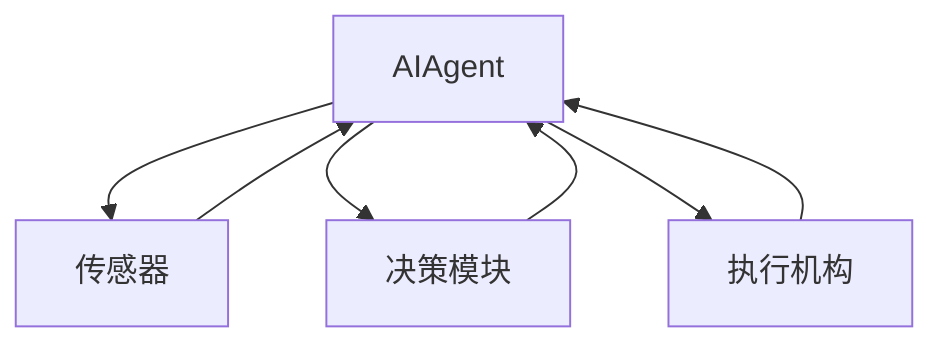
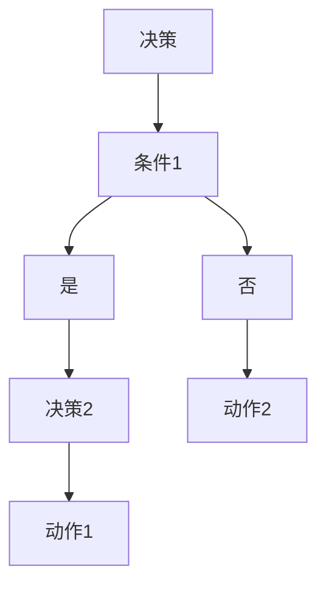
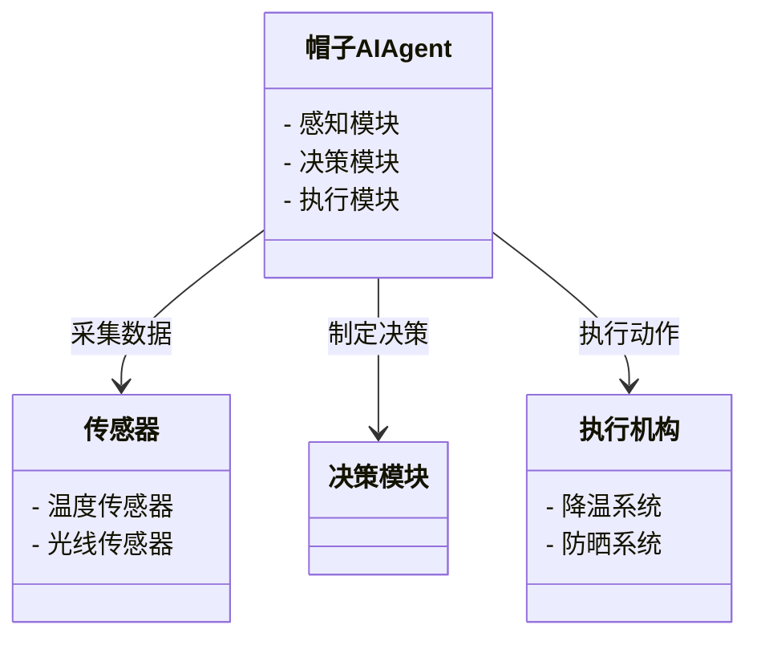
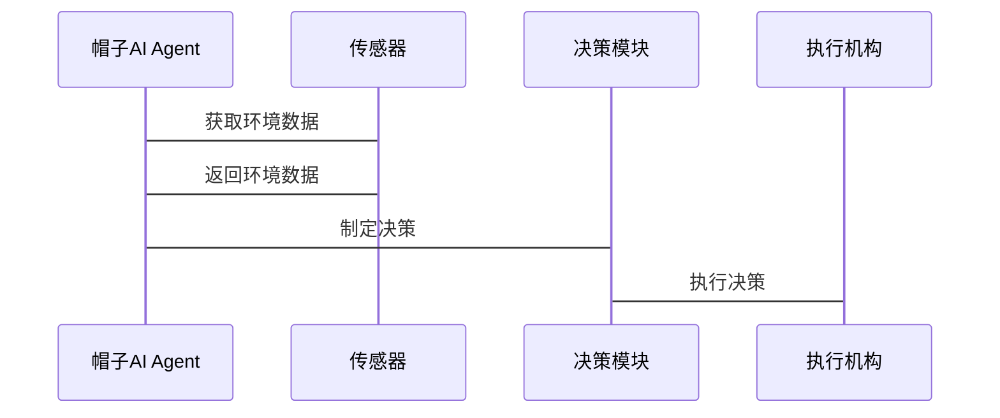

                 


# AI Agent在智能帽子中的头部保护功能

> 关键词：AI Agent、智能帽子、头部保护、算法原理、系统架构、项目实战

> 摘要：本文详细探讨了AI Agent在智能帽子中的头部保护功能，从背景介绍、核心概念、算法原理、系统架构到项目实战，全面解析了AI Agent在智能帽子中的应用。文章通过具体案例分析和系统设计，展示了AI Agent如何通过感知、决策和执行机制实现智能头部保护功能，并提供了详细的代码实现和系统架构设计。

---

# 第一部分: AI Agent在智能帽子中的头部保护功能概述

## 第1章: AI Agent与智能帽子的背景介绍

### 1.1 AI Agent的基本概念

AI Agent（人工智能代理）是指能够感知环境、做出决策并执行动作的智能实体。它具备以下特点：

- **自主性**：能够在没有外部干预的情况下自主运行。
- **反应性**：能够实时感知环境并做出反应。
- **目标导向**：具有明确的目标，并通过行为实现目标。
- **学习能力**：能够通过数据和经验不断优化自身性能。

AI Agent的应用场景非常广泛，包括自动驾驶、智能助手、机器人控制等领域。在智能帽子中，AI Agent主要用于头部保护功能，通过感知环境和实时决策来保护佩戴者的头部安全。

### 1.2 智能帽子的头部保护功能背景

智能帽子是一种结合了AI技术的可穿戴设备，其核心功能是通过AI Agent实现对佩戴者头部的智能保护。传统帽子仅具备遮阳、保暖等基本功能，而智能帽子则通过集成传感器、AI算法和执行机构，能够实时监测环境并采取相应的保护措施。

### 1.3 AI Agent在智能帽子中的独特性

AI Agent在智能帽子中的应用具有以下独特性：

- **实时感知**：通过集成的传感器实时感知头部周围的环境信息，包括温度、湿度、光照强度等。
- **智能决策**：基于感知到的信息，AI Agent能够快速做出决策，例如在高温环境下启动降温模式。
- **自主执行**：根据决策结果，智能帽子能够自主执行相应的动作，例如调整帽子的通风系统或启动防晒模式。

---

## 第2章: AI Agent的核心概念与联系

### 2.1 AI Agent的核心原理

AI Agent的核心原理包括感知、决策和执行三个主要环节：

#### 2.1.1 感知机制

AI Agent通过集成的传感器感知环境信息，例如温度、湿度、光照强度等。感知过程可以表示为：

$$
\text{感知结果} = f(\text{环境输入})
$$

其中，$f$ 是感知算法，$\text{环境输入}$ 是传感器采集的环境数据。

#### 2.1.2 决策机制

在感知到环境信息后，AI Agent需要根据预设的规则或模型做出决策。决策过程可以表示为：

$$
\text{决策结果} = g(\text{感知结果}, \text{规则库})
$$

其中，$g$ 是决策算法，$\text{规则库}$ 是用于决策的规则集合。

#### 2.1.3 执行机制

AI Agent根据决策结果执行相应的动作，例如调整帽子的通风系统或启动防晒模式。执行过程可以表示为：

$$
\text{执行结果} = h(\text{决策结果}, \text{执行机构})
$$

其中，$h$ 是执行算法，$\text{执行机构}$ 是帽子的执行机构，例如电机、传感器等。

### 2.2 AI Agent与智能帽子的实体关系

以下是AI Agent与智能帽子的实体关系图：



从图中可以看出，AI Agent与传感器、决策模块和执行机构之间存在相互作用关系。传感器负责采集环境数据，决策模块负责根据感知数据做出决策，执行机构负责执行决策结果。

---

## 第3章: AI Agent的算法原理

### 3.1 感知算法

#### 3.1.1 数据采集与特征提取

感知算法的核心是数据采集与特征提取。例如，通过温度传感器采集环境温度数据，并通过特征提取算法将温度数据转换为有用的特征。

#### 3.1.2 感知模型的构建

感知模型的构建可以通过机器学习算法实现。例如，使用回归算法预测环境温度：

$$
y = \beta_0 + \beta_1 x_1 + \beta_2 x_2 + \epsilon
$$

其中，$y$ 是预测的温度，$x_1$ 和 $x_2$ 是输入特征，$\beta_0$、$\beta_1$、$\beta_2$ 是模型参数，$\epsilon$ 是误差项。

#### 3.1.3 感知算法的实现

以下是感知算法的Python代码实现：

```python
import numpy as np
from sklearn.linear_model import LinearRegression

# 数据准备
X = np.array([[1, 2], [3, 4], [5, 6]])
y = np.array([7, 8, 9])

# 感知模型训练
model = LinearRegression()
model.fit(X, y)

# 预测
new_X = np.array([[2, 3]])
predicted_y = model.predict(new_X)
print(predicted_y)
```

### 3.2 决策算法

#### 3.2.1 决策树的构建

决策树是一种常用的决策算法。以下是决策树的构建过程：



#### 3.2.2 基于规则的决策

基于规则的决策算法可以通过预定义的规则实现。例如，如果温度大于30度，则启动降温模式：

```python
if temperature > 30:
    activate_cooling_mode()
else:
    do_not_activate_cooling_mode()
```

#### 3.2.3 基于概率的决策

基于概率的决策算法可以通过贝叶斯定理实现。例如，计算某事件发生的概率：

$$
P(A|B) = \frac{P(B|A)P(A)}{P(B)}
$$

### 3.3 执行算法

#### 3.3.1 执行策略的优化

执行策略的优化可以通过强化学习实现。例如，通过不断试错优化执行策略：

$$
Q(s, a) = r + \gamma \max_{a'} Q(s', a')
$$

其中，$Q$ 是Q值函数，$s$ 是状态，$a$ 是动作，$\gamma$ 是折扣因子，$r$ 是奖励。

#### 3.3.2 执行过程的监控

执行过程的监控可以通过反馈机制实现。例如，通过传感器实时监控执行结果，并根据反馈调整执行策略。

#### 3.3.3 执行结果的反馈

执行结果的反馈可以通过闭环控制系统实现。例如，通过反馈环不断优化执行结果：

$$
\text{输出} = \text{输入} + \text{反馈}
$$

---

## 第4章: AI Agent的数学模型与公式

### 4.1 感知模型的数学表达

感知模型的数学表达可以通过回归算法实现。例如，线性回归模型：

$$
y = \beta_0 + \beta_1 x + \epsilon
$$

其中，$y$ 是目标变量，$x$ 是输入特征，$\beta_0$ 和 $\beta_1$ 是模型参数，$\epsilon$ 是误差项。

### 4.2 决策模型的数学表达

决策模型的数学表达可以通过决策树实现。例如，决策树的结构可以用以下公式表示：

$$
\text{决策} = \text{if } (x_1 > \text{阈值}) \text{ then } \text{动作1} \text{ else } \text{动作2}
$$

### 4.3 执行模型的数学表达

执行模型的数学表达可以通过强化学习实现。例如，Q-learning算法的更新公式：

$$
Q(s, a) = Q(s, a) + \alpha (r + \gamma \max_{a'} Q(s', a') - Q(s, a))
$$

其中，$\alpha$ 是学习率，$\gamma$ 是折扣因子，$r$ 是奖励。

---

## 第5章: AI Agent的系统分析与架构设计

### 5.1 问题场景介绍

智能帽子的头部保护功能需要在复杂环境中实时感知、决策和执行。例如，在高温环境下，智能帽子需要通过感知环境温度，决策是否启动降温模式，并通过执行机构实现降温。

### 5.2 系统功能设计

以下是智能帽子的系统功能设计：



### 5.3 系统架构设计

以下是智能帽子的系统架构设计：


### 5.4 系统接口设计

以下是智能帽子的系统接口设计：



---

## 第6章: AI Agent的项目实战

### 6.1 环境安装

为了运行智能帽子的AI Agent，需要安装以下环境：

- Python 3.8 或更高版本
- NumPy
- scikit-learn
- Mermaid

安装命令如下：

```bash
pip install numpy scikit-learn
```

### 6.2 系统核心实现

以下是智能帽子AI Agent的核心代码：

```python
import numpy as np
from sklearn.linear_model import LinearRegression

class AIAgent:
    def __init__(self):
        self.sensor = Sensor()
        self.decision = Decision()
        self.executor = Executor()

    def感知(self):
        data = self.sensor采集数据()
        return data

    def 决策(self, data):
        return self.decision制定决策(data)

    def 执行(self, decision):
        self.executor执行动作(decision)

class Sensor:
    def 采集数据(self):
        # 返回环境数据
        return np.array([20, 25, 30])

class Decision:
    def 制定决策(self, data):
        # 简单的决策逻辑
        if data > 25:
            return '启动降温模式'
        else:
            return '关闭降温模式'

class Executor:
    def 执行动作(self, decision):
        # 执行决策
        print(f'执行动作：{decision}')
```

### 6.3 实际案例分析

以下是智能帽子AI Agent在高温环境下的实际案例分析：

1. **感知阶段**：传感器采集到环境温度为35度。
2. **决策阶段**：AI Agent根据感知到的温度数据，决定启动降温模式。
3. **执行阶段**：执行机构启动降温系统，降低帽子内部温度。

---

## 第7章: AI Agent的最佳实践

### 7.1 小结

本文详细探讨了AI Agent在智能帽子中的头部保护功能，从背景介绍、核心概念、算法原理、系统架构到项目实战，全面解析了AI Agent在智能帽子中的应用。

### 7.2 注意事项

- **数据隐私**：智能帽子需要处理佩戴者的环境数据，需要注意数据隐私保护。
- **算法优化**：AI Agent的算法需要不断优化，以适应不同的环境场景。
- **系统稳定性**：智能帽子的系统需要具备高稳定性，确保在复杂环境下正常运行。

### 7.3 拓展阅读

- 《机器学习实战》
- 《深度学习入门》
- 《强化学习入门》

---

通过本文的详细讲解，读者可以全面理解AI Agent在智能帽子中的头部保护功能，并能够将其应用到实际项目中。

