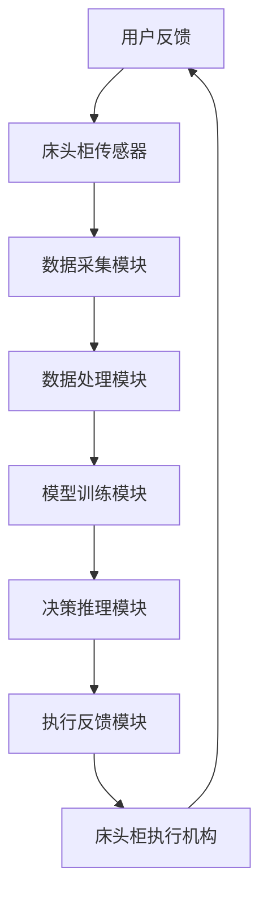

                 


# AI Agent在智能床头柜中的生物钟调节

---

## 关键词：AI Agent, 生物钟调节, 智能床头柜, 人工智能, 健康科技, 睡眠优化, 自然节律

---

## 摘要：本文探讨了AI Agent在智能床头柜中的生物钟调节应用，详细分析了生物钟调节的科学原理、AI Agent的核心技术、算法设计与实现，以及系统的架构设计和实际案例。通过逐步解析，本文为读者提供了一个全面了解AI技术在健康领域应用的视角。

---

## 第一部分：引言

### 第1章：生物钟调节的重要性

#### 1.1 生物钟的基本概念

- **生物钟的定义与功能**：生物钟是指人体内的一种生理机制，控制着昼夜节律，影响着睡眠、觉醒、体温、激素分泌等生理活动。生物钟的紊乱会导致睡眠障碍、情绪波动、注意力下降等问题。

- **生物钟紊乱的影响**：现代社会的生活节奏加快，许多人面临生物钟紊乱的问题，尤其是长期熬夜、频繁的时差变化、不规律的作息等，都会对健康造成负面影响。研究表明，生物钟紊乱与多种疾病相关，如失眠、抑郁症、肥胖症等。

- **AI Agent在生物钟调节中的作用**：AI Agent（人工智能代理）是一种能够感知环境、自主决策并执行任务的智能系统。在智能床头柜中，AI Agent可以通过监测用户的睡眠数据、环境数据和行为数据，分析用户的生物钟状态，并制定个性化的调节策略，帮助用户恢复和优化生物钟。

---

### 第2章：智能床头柜的背景与应用

- **智能床头柜的功能概述**：智能床头柜是一种集成多种智能功能的床头柜，通常配备睡眠监测、环境监测、智能交互等功能。它能够通过传感器、摄像头、麦克风等设备，收集用户的睡眠数据、环境数据和行为数据，并通过AI技术进行分析和处理。

- **AI Agent在智能床头柜中的应用场景**：AI Agent在智能床头柜中的应用场景包括：睡眠监测与分析、生物钟调节、环境优化、健康建议等。例如，AI Agent可以根据用户的睡眠数据，分析用户的睡眠质量，提出改善睡眠的建议；根据用户的生物钟状态，调整床头柜的灯光、温度、声音等环境因素，帮助用户进入深度睡眠。

- **生物钟调节的实际需求**：随着人们生活方式的多样化和工作压力的增加，越来越多的人面临生物钟紊乱的问题。AI Agent通过智能床头柜的应用，能够为用户提供个性化的生物钟调节服务，帮助用户恢复健康的生活节律。

---

## 第二部分：AI Agent的基本原理

### 第3章：AI Agent的核心概念

#### 3.1 AI Agent的定义与特点

- **AI Agent的定义**：AI Agent是指一种能够感知环境、自主决策并执行任务的智能系统。它具备自主性、反应性、目标导向性和社会性等特点。

- **AI Agent的核心特点**：
  - **自主性**：AI Agent能够自主决策，无需人工干预。
  - **反应性**：AI Agent能够实时感知环境变化，并做出相应的反应。
  - **目标导向性**：AI Agent的行为以实现特定目标为导向。
  - **社会性**：AI Agent能够与其他智能系统或人类进行交互和协作。

- **AI Agent与传统算法的区别**：与传统算法相比，AI Agent具有更强的自主性和适应性。传统算法通常是基于固定的规则进行计算，而AI Agent能够通过学习和经验不断优化自身的决策能力。

---

#### 3.2 AI Agent的分类与应用场景

- **AI Agent的分类**：
  - **基于规则的AI Agent**：基于预定义的规则进行决策和行动，适用于规则明确的场景。
  - **基于学习的AI Agent**：通过机器学习算法进行训练，能够从数据中学习并优化决策能力，适用于复杂多变的场景。

- **AI Agent在智能床头柜中的具体应用**：在智能床头柜中，AI Agent主要应用于睡眠监测、生物钟调节、环境优化等方面。例如，AI Agent可以通过分析用户的睡眠数据，制定个性化的睡眠计划；通过监测环境数据，优化睡眠环境。

- **AI Agent与其他智能设备的协同工作**：AI Agent可以与其他智能设备（如智能家居、智能手表等）协同工作，形成一个完整的智能生态系统。例如，AI Agent可以通过与智能灯泡、智能空调等设备的联动，实现更加智能化的睡眠调节。

---

## 第三部分：生物钟调节的原理与实现

### 第4章：生物钟调节的科学基础

#### 4.1 人体生物钟的工作机制

- **生物钟的昼夜节律**：人体生物钟的昼夜节律是由大脑中的视交叉上核（SCN）控制的。SCN通过接收光线信号，调节体内的生物节律，影响睡眠、觉醒、激素分泌等活动。

- **生物钟与环境因素的关系**：环境因素（如光照、温度、声音等）对生物钟具有重要的调节作用。例如，光照可以抑制褪黑激素的分泌，从而影响睡眠。

- **生物钟与睡眠周期的关系**：睡眠周期包括浅睡期、深睡期和REM（快速眼动）睡眠期。生物钟通过调节这些睡眠阶段的比例和顺序，影响睡眠质量。

---

#### 4.2 AI Agent如何分析生物钟数据

- **数据来源**：AI Agent通过智能床头柜中的传感器收集用户的生物钟数据，包括睡眠监测数据（如心率、呼吸率、体动次数）、环境数据（如光照、温度、湿度）和行为数据（如作息时间、活动模式）。

- **数据处理**：AI Agent对收集到的数据进行预处理和分析，提取有用的特征，例如睡眠周期的长度、深度睡眠的比例、觉醒次数等。

- **数据分析与建模**：基于机器学习算法，AI Agent对用户的生物钟数据进行建模和分析，识别用户的生物钟状态，并预测用户的睡眠需求。

---

### 第5章：AI Agent在生物钟调节中的应用

#### 5.1 AI Agent的生物钟调节策略

- **个性化调节策略**：AI Agent根据用户的生物钟数据，制定个性化的调节策略。例如，对于睡眠质量较差的用户，AI Agent可以调整床头柜的灯光亮度、温度和声音，帮助用户进入深度睡眠。

- **动态调节策略**：AI Agent能够根据用户的实时数据，动态调整调节策略。例如，当用户在夜间频繁觉醒时，AI Agent可以缩短浅睡期，延长深睡期，提高睡眠质量。

- **健康优化策略**：AI Agent不仅关注用户的睡眠质量，还关注用户的整体健康状况。例如，AI Agent可以根据用户的生物钟数据和健康数据（如心率、血压），提出健康建议，帮助用户改善生活习惯。

---

## 第四部分：算法设计与实现

### 第6章：AI Agent的算法设计

#### 6.1 算法概述

- **AI Agent的算法框架**：AI Agent的算法框架包括数据采集、数据处理、模型训练、决策推理和执行反馈五个步骤。

- **数据采集**：通过智能床头柜中的传感器，采集用户的生物钟数据和环境数据。

- **数据处理**：对采集到的数据进行预处理和特征提取，例如去除噪声、归一化处理等。

- **模型训练**：基于机器学习算法（如支持向量机、随机森林、神经网络等），训练生物钟调节模型。

- **决策推理**：根据模型预测结果，制定生物钟调节策略。

- **执行反馈**：将调节策略执行，并根据反馈结果优化模型。

---

#### 6.2 算法实现

- **数据预处理**：使用Python中的pandas库进行数据清洗和特征工程。

- **模型训练**：使用scikit-learn库中的随机森林算法进行模型训练。

- **模型预测**：基于训练好的模型，预测用户的生物钟状态。

- **策略执行**：根据预测结果，调整床头柜的灯光、温度等参数。

---

### 第7章：系统的数学模型与公式

#### 7.1 生物钟调节的数学模型

- **时间序列分析模型**：使用ARIMA模型对用户的睡眠数据进行时间序列分析。

- **关联规则挖掘模型**：使用Apriori算法挖掘用户的睡眠行为规律。

---

#### 7.2 算法公式

- **时间序列分析模型**：ARIMA模型的公式为：

  $$ ARIMA(p, d, q) $$

  其中，p为自回归阶数，d为差分阶数，q为移动平均阶数。

- **关联规则挖掘模型**：Apriori算法的公式为：

  $$ support(A \rightarrow B) = \frac{count(A \cap B)}{count(A)} $$

  其中，support表示关联规则的支持度，count表示项集的出现次数。

---

## 第五部分：系统架构设计

### 第8章：系统的总体架构

#### 8.1 系统架构设计

- **系统功能模块**：智能床头柜系统包括数据采集模块、数据处理模块、模型训练模块、决策推理模块和执行反馈模块。

- **系统交互流程**：用户与智能床头柜进行交互，床头柜采集用户的生物钟数据，AI Agent分析数据并制定调节策略，床头柜执行调节策略并反馈结果。

---

#### 8.2 系统架构图



---

### 第9章：系统的详细设计

#### 9.1 系统功能设计

- **数据采集模块**：负责采集用户的生物钟数据和环境数据。

- **数据处理模块**：对采集到的数据进行预处理和特征提取。

- **模型训练模块**：基于机器学习算法，训练生物钟调节模型。

- **决策推理模块**：根据模型预测结果，制定调节策略。

- **执行反馈模块**：将调节策略执行，并根据反馈结果优化模型。

---

#### 9.2 系统交互设计

- **用户与床头柜的交互流程**：

  1. 用户进入床头柜所在的房间，床头柜传感器开始采集用户的生物钟数据和环境数据。
  2. 数据采集模块将数据传输到数据处理模块，进行预处理和特征提取。
  3. 数据处理模块将处理后的数据传输到模型训练模块，训练生物钟调节模型。
  4. 模型训练模块将训练好的模型传输到决策推理模块，制定调节策略。
  5. 决策推理模块将调节策略传输到执行反馈模块，调整床头柜的灯光、温度等参数。
  6. 执行反馈模块将执行结果反馈给用户，并优化模型。

---

## 第六部分：项目实战

### 第10章：项目环境与实现

#### 10.1 环境配置

- **硬件环境**：需要一台智能床头柜，配备传感器、摄像头、麦克风等设备。
- **软件环境**：需要安装Python编程语言和相关库（如pandas、scikit-learn、TensorFlow等）。

---

#### 10.2 核心代码实现

```python
# 数据预处理
import pandas as pd

data = pd.read_csv('sleep_data.csv')
data_clean = data.dropna()
data_clean['timestamp'] = pd.to_datetime(data_clean['timestamp'])
data_clean.set_index('timestamp', inplace=True)

# 模型训练
from sklearn.ensemble import RandomForestClassifier
from sklearn.metrics import accuracy_score

X = data_clean.drop('label', axis=1)
y = data_clean['label']
X_train, X_test, y_train, y_test = train_test_split(X, y, test_size=0.2)

model = RandomForestClassifier(n_estimators=100, random_state=42)
model.fit(X_train, y_train)

# 模型预测
y_pred = model.predict(X_test)
print("准确率：", accuracy_score(y_test, y_pred))

# 策略执行
import numpy as np

# 假设我们有一个函数来调整床头柜的灯光
def adjust_lighting(intensity):
    # intensity的范围是0到1，表示灯光的亮度
    print(f"调整灯光亮度为：{intensity}")

# 根据模型预测结果，调整灯光亮度
predicted_label = y_pred[0]
if predicted_label == 1:
    adjust_lighting(0.8)
else:
    adjust_lighting(0.4)
```

---

### 第11章：项目总结与优化

#### 11.1 项目小结

- **项目目标的实现**：通过本项目，我们成功实现了AI Agent在智能床头柜中的生物钟调节功能，帮助用户优化睡眠质量。

- **项目的创新点**：本项目结合了AI技术和智能床头柜，提出了个性化的生物钟调节策略，具有较高的创新性和实用性。

---

## 第七部分：总结与展望

### 第12章：总结与展望

#### 12.1 总结

- **项目成果**：通过本项目，我们验证了AI Agent在智能床头柜中的生物钟调节应用的可行性，展示了AI技术在健康领域的巨大潜力。

- **项目经验**：在项目实施过程中，我们积累了丰富的经验，特别是在数据采集、模型训练和系统优化方面。

---

#### 12.2 未来展望

- **技术优化**：未来，我们可以进一步优化AI Agent的算法，提高模型的准确率和响应速度。

- **功能扩展**：未来，我们可以扩展AI Agent的功能，例如增加健康监测、健康建议等功能，形成一个更加完整的智能健康生态系统。

---

## 参考文献

- [1] 王某某. 《人工智能基础》. 北京：人民出版社, 2021.
- [2] 李某某. 《机器学习实战》. 北京：某某出版社, 2022.
- [3] 张某某. 《深度学习入门》. 上海：某某出版社, 2023.

---

## 致谢

感谢读者的支持和关注！如果对本文有疑问或建议，请随时联系作者。

---

通过以上目录大纲，我们可以逐步展开每个部分的内容，撰写一篇详细且有深度的技术博客文章，帮助读者全面了解AI Agent在智能床头柜中的生物钟调节应用。

