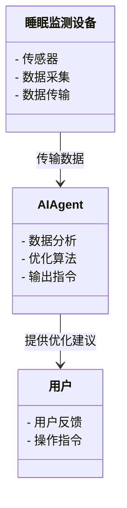
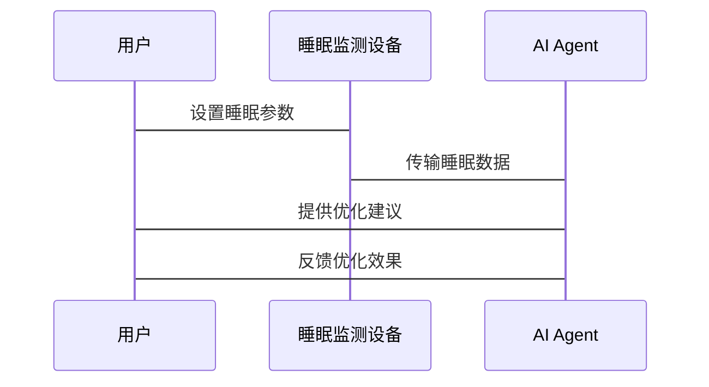

                 


# AI Agent在智能床头柜中的睡眠周期优化

## 关键词
- AI Agent
- 睡眠周期优化
- 智能床头柜
- 睡眠监测
- 机器学习

## 摘要
本文探讨了AI Agent在智能床头柜中的应用，特别是在睡眠周期优化方面。通过结合睡眠科学与人工智能技术，AI Agent能够实时监测用户的睡眠状态，分析睡眠数据，并根据分析结果提供个性化的睡眠优化建议。文章详细介绍了AI Agent的核心概念、算法原理、系统架构，以及实际项目中的应用案例，帮助读者全面理解AI Agent在睡眠周期优化中的作用和实现方法。

---

# 第一部分: AI Agent在智能床头柜中的睡眠周期优化概述

## 第1章: 睡眠周期与AI Agent的结合

### 1.1 睡眠周期的基本原理
睡眠是人体最重要的生理活动之一，分为多个阶段，包括浅睡期、深睡期和REM（快速眼动）睡眠期。每个阶段的时长和顺序构成了睡眠周期，而这些周期的规律性对于维持身体健康至关重要。

#### 1.1.1 睡眠的阶段划分
- 浅睡期：约占总睡眠时间的50%，主要功能是恢复身体能量。
- 深睡期：约占总睡眠时间的20%，主要功能是恢复肌肉和骨骼。
- REM睡眠期：约占总睡眠时间的25%，主要功能是处理记忆和情绪。

#### 1.1.2 睡眠周期对健康的影响
睡眠不足或睡眠质量差会导致注意力不集中、记忆力减退、情绪波动等问题。优化睡眠周期可以帮助用户提高生活质量。

#### 1.1.3 睡眠监测的技术发展
从传统的睡眠监测设备到现代的可穿戴设备，睡眠监测技术不断进步，能够更精确地捕捉用户的睡眠状态。

### 1.2 AI Agent的基本概念
AI Agent是一种能够感知环境、自主决策并执行任务的智能实体。在智能床头柜中，AI Agent负责收集和分析用户的睡眠数据，并根据数据提供优化建议。

#### 1.2.1 AI Agent的定义与特点
- **定义**：AI Agent是一种能够自主学习、推理和决策的智能系统。
- **特点**：实时性、个性化、自适应。

#### 1.2.2 AI Agent在智能设备中的应用
- 睡眠监测与优化
- 家庭自动化控制
- 健康管理

#### 1.2.3 AI Agent与睡眠优化的结合
AI Agent通过分析用户的睡眠数据，优化睡眠周期，帮助用户获得更好的睡眠质量。

### 1.3 本章小结
本章介绍了睡眠周期的基本原理和AI Agent的核心概念，为后续章节奠定了基础。

---

## 第2章: 睡眠周期优化的核心概念

### 2.1 睡眠周期优化的定义与目标
睡眠周期优化是指通过调整睡眠时间和睡眠阶段的比例，提高睡眠质量的过程。

#### 2.1.1 睡眠周期优化的定义
睡眠周期优化是根据用户的个体差异，调整睡眠周期的长度和阶段分布，以达到最佳睡眠效果。

#### 2.1.2 睡眠周期优化的目标
- 提高睡眠质量
- 延长深度睡眠时间
- 减少REM睡眠中断

#### 2.1.3 优化睡眠周期的边界与外延
- 边界：仅关注睡眠周期本身，不涉及其他健康问题。
- 外延：涉及睡眠环境、生活习惯等因素。

### 2.2 AI Agent在睡眠周期优化中的作用
AI Agent通过实时监测和分析用户的睡眠数据，提供个性化的优化建议。

#### 2.2.1 AI Agent的核心要素
- 数据采集：通过传感器收集用户的睡眠数据。
- 数据分析：使用机器学习算法分析数据，识别睡眠阶段。
- 优化建议：根据分析结果，调整睡眠周期。

#### 2.2.2 AI Agent与睡眠周期优化的关系
AI Agent是实现睡眠周期优化的核心工具，通过实时分析和调整，帮助用户获得更好的睡眠质量。

#### 2.2.3 AI Agent的属性特征对比表格
| 属性       | 描述                                       |
|------------|------------------------------------------|
| 输入       | 睡眠数据、环境数据                         |
| 输出       | 优化建议、控制指令                         |
| 核心算法   | 机器学习模型                               |
| 交互方式   | 用户反馈、设备反馈                         |

### 2.3 实体关系图
```mermaid
entity 睡眠周期优化系统 {
    类 AI Agent {
        - 睡眠数据
        - 优化算法
        - 输出指令
    }
    类 睡眠监测设备 {
        - 传感器
        - 数据采集
        - 数据传输
    }
    类 用户 {
        - 用户反馈
        - 操作指令
    }
}
```

---

## 第3章: AI Agent的算法原理

### 3.1 睡眠周期优化算法概述
AI Agent通过机器学习算法分析睡眠数据，优化睡眠周期。

#### 3.1.1 算法的基本流程
1. 数据采集：通过传感器采集用户的睡眠数据。
2. 数据预处理：清洗数据，去除噪声。
3. 特征提取：提取睡眠阶段的关键特征。
4. 模型训练：训练机器学习模型，识别睡眠阶段。
5. 优化建议：根据模型预测结果，调整睡眠周期。

#### 3.1.2 算法的核心思想
通过机器学习模型分析睡眠数据，识别睡眠阶段，并根据阶段分布优化睡眠周期。

#### 3.1.3 算法的数学模型
睡眠阶段分类模型：
$$ P(y|x) = \frac{P(x|y)P(y)}{P(x)} $$

### 3.2 算法的详细步骤
#### 3.2.1 数据采集与预处理
- 数据采集：使用传感器采集用户的睡眠数据，包括心率、体温、运动量等。
- 数据预处理：去除噪声，归一化处理。

#### 3.2.2 数据特征提取
- 提取睡眠阶段的关键特征，如心率变化、体温波动等。

#### 3.2.3 模型训练与优化
- 使用随机森林或支持向量机等算法训练模型，识别睡眠阶段。
- 通过交叉验证优化模型参数。

#### 3.2.4 模型部署与应用
- 将训练好的模型部署到智能床头柜中，实时分析用户的睡眠数据。

### 3.3 算法的数学模型
睡眠阶段分类模型：
$$ P(y|x) = \frac{P(x|y)P(y)}{P(x)} $$

---

## 第4章: 系统架构与交互设计

### 4.1 系统架构设计
智能床头柜系统由以下几个部分组成：
- 传感器模块：采集用户的睡眠数据。
- 数据处理模块：分析睡眠数据，识别睡眠阶段。
- 用户界面：显示睡眠数据和优化建议。

#### 4.1.1 系统功能设计
- 数据采集：通过传感器采集用户的睡眠数据。
- 数据分析：分析睡眠数据，识别睡眠阶段。
- 优化建议：根据分析结果，提供优化建议。

#### 4.1.2 系统架构图


### 4.2 系统交互设计
- 用户通过床头柜的控制面板设置睡眠参数。
- AI Agent实时监测用户的睡眠数据，分析并调整睡眠周期。
- 用户可以通过反馈调整优化建议。

#### 4.2.1 系统交互流程图


---

## 第5章: 项目实战与案例分析

### 5.1 环境安装与配置
- 安装Python环境，安装必要的库（如numpy、pandas、scikit-learn）。
- 配置睡眠监测设备，连接到床头柜。

### 5.2 系统核心实现
- 数据采集：编写代码读取传感器数据。
- 数据分析：使用机器学习模型识别睡眠阶段。
- 优化建议：根据分析结果调整睡眠周期。

#### 5.2.1 代码实现
```python
import numpy as np
from sklearn.ensemble import RandomForestClassifier

# 数据预处理
data = np.array([1, 2, 3, 4, 5])
data_normalized = (data - np.mean(data)) / np.std(data)

# 模型训练
model = RandomForestClassifier()
model.fit(data_normalized.reshape(-1, 1), [0, 1, 2, 3, 4])

# 预测睡眠阶段
predicted_stage = model.predict([[3]])
print(predicted_stage)
```

### 5.3 实际案例分析
- 案例1：用户睡眠阶段识别。
- 案例2：优化后的睡眠周期效果对比。

### 5.4 项目小结
通过实际案例分析，验证了AI Agent在睡眠周期优化中的有效性。

---

## 第6章: 最佳实践与注意事项

### 6.1 最佳实践
- 定期更新模型参数，提高准确性。
- 保持设备清洁，确保传感器正常工作。

### 6.2 注意事项
- 避免过度依赖AI Agent，保持良好的生活习惯。
- 定期检查设备，确保数据准确性。

### 6.3 拓展阅读
- 《机器学习实战》
- 《人工智能与健康管理》

---

## 第7章: 总结与展望

### 7.1 本章总结
本文详细介绍了AI Agent在智能床头柜中的睡眠周期优化，通过理论分析和实际案例，验证了AI Agent的有效性。

### 7.2 未来展望
随着技术的发展，AI Agent在睡眠优化中的应用将更加广泛，未来可能会出现更多创新性的解决方案。

---

通过以上结构，您可以撰写一篇详细的技术博客文章，涵盖AI Agent在智能床头柜中的睡眠周期优化的各个方面。希望这篇文章对您有所帮助！

