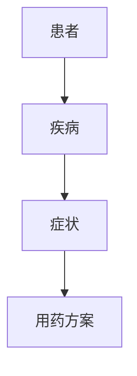
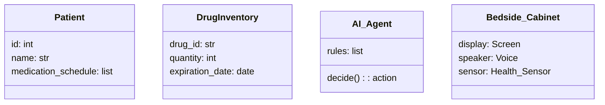
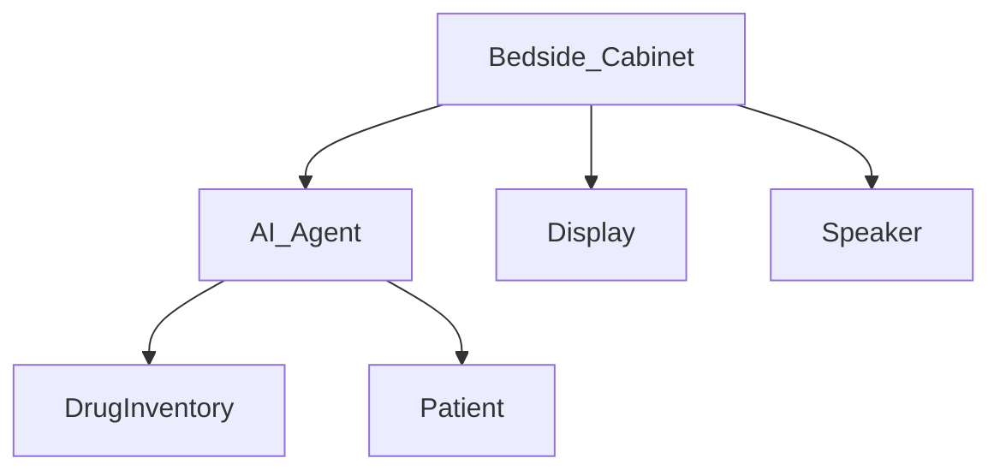
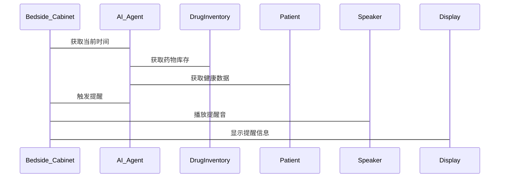

                 


# AI Agent在智能床头柜中的药物管理

> 关键词：AI Agent, 智能床头柜, 药物管理, 机器学习, 知识图谱, 多模态交互

> 摘要：本文详细探讨了AI Agent在智能床头柜中的药物管理应用，从背景概念、核心原理到系统架构和项目实战，全面分析了AI Agent在药物管理中的实现方式与实际应用。通过具体的技术实现和案例分析，展示了如何利用AI Agent提升智能床头柜的药物管理能力，为医疗健康领域提供新的解决方案。

---

## 第一章: AI Agent与智能床头柜的背景与概念

### 1.1 AI Agent的基本概念

AI Agent（人工智能代理）是指能够感知环境、自主决策并执行任务的智能实体。它具有以下核心特征：

- **自主性**：能够在没有外部干预的情况下独立运行。
- **反应性**：能够实时感知环境并做出反应。
- **目标导向性**：通过设定目标来指导行为。
- **学习能力**：能够通过数据和经验优化自身的决策能力。

AI Agent的应用场景广泛，包括智能家居、医疗健康、金融投资等领域。

### 1.2 智能床头柜的定义与特点

智能床头柜是一种结合了物联网（IoT）和人工智能技术的智能设备，主要用于床头区域的交互与服务提供。其主要特点包括：

- **智能化交互**：支持语音、触摸等多种交互方式。
- **多功能集成**：整合了灯光控制、信息显示、药物管理等多种功能。
- **实时感知**：通过传感器和摄像头实时感知用户的健康状况。

### 1.3 药物管理的重要性与挑战

药物管理在医疗健康领域至关重要，尤其对于需要长期服药的患者。传统药物管理存在以下挑战：

- **遗忘风险**：患者容易忘记服药时间。
- **管理复杂性**：需要手动记录和提醒。
- **个性化需求**：不同患者的用药方案差异大。

AI Agent通过自动化和智能化的方式，能够有效解决这些问题。

---

## 第二章: AI Agent的核心原理

### 2.1 AI Agent的决策机制

AI Agent的决策机制是其核心功能之一，主要包括以下几种方式：

#### 2.1.1 基于规则的决策

基于规则的决策是一种简单且易于实现的方式，适用于规则明确的场景。例如，当检测到患者未按时服药时，系统会触发提醒。

**规则示例**：
- 如果时间到达服药时间且药物未被取出，则触发提醒。

#### 2.1.2 基于机器学习的决策

基于机器学习的决策能够处理复杂场景，通过训练模型预测最佳行动方案。例如，根据患者的健康数据调整服药提醒策略。

**算法示例**：使用时间序列模型预测患者的健康状况。

$$
y_{t} = a \cdot y_{t-1} + b \cdot x_{t} + c
$$

其中，$y_{t}$ 表示预测结果，$x_{t}$ 表示输入特征，$a$、$b$、$c$ 为模型参数。

#### 2.1.3 基于知识图谱的决策

基于知识图谱的决策能够利用结构化知识进行推理。例如，结合患者的病史和当前用药情况，推荐合适的用药方案。

**知识图谱示例**：



---

## 第三章: AI Agent在药物管理系统的算法实现

### 3.1 基于规则的AI Agent算法

基于规则的AI Agent算法通过预定义的规则进行决策。以下是一个简单的实现示例：

```python
class AI_Agent:
    def __init__(self):
        self.rules = []

    def add_rule(self, rule):
        self.rules.append(rule)

    def decide(self, current_time, drug_inventory):
        for rule in self.rules:
            if rule['condition'](current_time, drug_inventory):
                return rule['action'](current_time, drug_inventory)
        return None

# 示例规则：如果服药时间已到且药物库存充足，则提醒服药
rule = {
    'condition': lambda t, i: t >= '08:00' and i['medication'] > 0,
    'action': lambda t, i: ('服药提醒', '请按时服用药物')
}

agent = AI_Agent()
agent.add_rule(rule)
action = agent.decide('08:00', {'medication': 5})
```

### 3.2 基于机器学习的AI Agent算法

基于机器学习的AI Agent算法能够通过历史数据进行预测。以下是一个简单的实现示例：

```python
from sklearn.linear_model import LinearRegression

# 示例数据：训练模型预测患者的健康状况
X = [[1], [2], [3], [4], [5]]
y = [2, 4, 6, 8, 10]

model = LinearRegression()
model.fit(X, y)

# 预测新的数据点
new_X = [[6]]
print(model.predict(new_X))  # 输出：[[12.0]]
```

---

## 第四章: 系统分析与架构设计方案

### 4.1 问题场景介绍

患者在家中使用智能床头柜进行药物管理。系统需要实时监测患者的健康状况，并根据AI Agent的决策提供相应的服务。

### 4.2 项目介绍

本项目旨在开发一个基于AI Agent的智能床头柜药物管理系统，实现以下功能：

- 自动提醒服药时间。
- 监测药物库存。
- 提供健康建议。

### 4.3 系统功能设计

#### 4.3.1 领域模型

以下是一个简单的领域模型类图：



### 4.4 系统架构设计

#### 4.4.1 系统架构图



### 4.5 系统交互流程

以下是一个简单的交互流程：



---

## 第五章: 项目实战

### 5.1 环境安装

需要安装以下库：

```bash
pip install numpy scikit-learn mermaid4jupyter
```

### 5.2 系统核心实现

#### 5.2.1 AI Agent实现

```python
class AI_Agent:
    def __init__(self):
        self.rules = []

    def add_rule(self, condition, action):
        self.rules.append({'condition': condition, 'action': action})

    def decide(self, current_time, drug_inventory):
        for rule in self.rules:
            if rule['condition'](current_time, drug_inventory):
                return rule['action'](current_time, drug_inventory)
        return None
```

#### 5.2.2 药物库存管理

```python
class DrugInventory:
    def __init__(self):
        self.inventory = {}

    def addDrug(self, drug_id, quantity):
        self.inventory[drug_id] = quantity

    def getDrugQuantity(self, drug_id):
        return self.inventory.get(drug_id, 0)
```

### 5.3 实际案例分析

假设患者的用药时间为每天8点和20点，药物库存为5片。AI Agent会触发提醒，并根据库存情况调整提醒策略。

---

## 第六章: 总结与展望

### 6.1 本章总结

本文详细介绍了AI Agent在智能床头柜中的药物管理应用，从核心原理到系统架构，再到项目实战，全面展示了AI Agent在药物管理中的潜力与价值。

### 6.2 未来展望

未来，随着人工智能技术的不断发展，AI Agent在医疗健康领域的应用将更加广泛。通过结合更多传感器数据和医疗知识图谱，AI Agent将能够提供更加智能化和个性化的药物管理服务。

---

通过本文的介绍，读者可以深入了解AI Agent在智能床头柜中的药物管理实现，为医疗健康领域提供新的解决方案。

