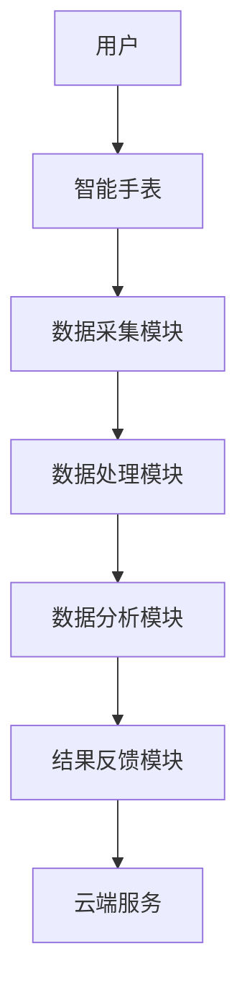
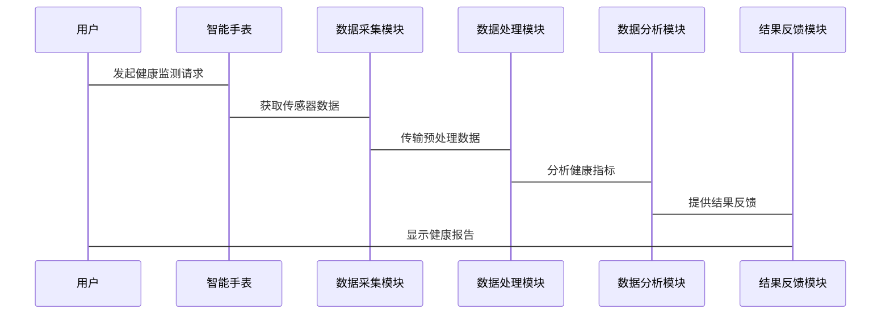

                 


# 第3章: 健康监测算法的数学模型与公式

## 3.1 健康监测算法的数学模型

### 3.1.1 数据预处理模型
在健康监测中，首先需要对智能手表采集到的原始数据进行预处理。常见的预处理方法包括去噪和平滑处理。

#### 数据去噪模型
使用均值滤波器对心率信号进行去噪处理：

$$ y_{\text{filtered}}(i) = \frac{1}{n} \sum_{j=i-n}^{i} y_{\text{raw}}(j) $$

其中，$y_{\text{filtered}}(i)$ 是去噪后的信号值，$y_{\text{raw}}(j)$ 是原始信号值，$n$ 是滤波窗口的长度。

#### 数据平滑模型
使用移动平均法对血压信号进行平滑处理：

$$ s_{\text{smooth}}(t) = \frac{1}{N} \sum_{i=t-N+1}^{t} s_{\text{raw}}(i) $$

其中，$s_{\text{smooth}}(t)$ 是平滑后的信号值，$s_{\text{raw}}(i)$ 是原始信号值，$N$ 是平滑窗口的长度。

### 3.1.2 健康指标预测模型

#### 基于机器学习的心率预测模型
使用线性回归模型预测心率：

$$ \hat{y}(t) = a \cdot x(t) + b $$

其中，$\hat{y}(t)$ 是预测的心率值，$x(t)$ 是输入特征向量，$a$ 和 $b$ 是模型参数。

#### 基于深度学习的血压预测模型
使用长短期记忆网络（LSTM）预测血压：

$$ \text{LSTM}(\cdot) = \text{f\_gate} \cdot \text{i\_gate} + \text{o\_gate} \cdot \text{LSTM\_state} $$

其中，$\text{f\_gate}$ 是遗忘门，$\text{i\_gate}$ 是输入门，$\text{o\_gate}$ 是输出门，$\text{LSTM\_state}$ 是LSTM状态。

## 3.2 健康监测算法的实现

### 3.2.1 数据采集与特征提取

#### 数据采集流程
智能手表通过光学传感器采集心率信号：

$$ \text{HR} = \text{AD Conversion}(\text{Photo Plethysmogram}) $$

其中，$\text{HR}$ 是心率值，$\text{Photo Plethysmogram}$ 是光电容积曲线，$\text{AD Conversion}$ 是模数转换过程。

#### 特征提取方法
从心率信号中提取时域和频域特征：

- 时域特征：最大值、最小值、平均值、标准差
- 频域特征：心率变异指数（RMSSD）、功率谱密度（PSD）

### 3.2.2 算法实现步骤

#### 步骤1: 数据预处理
对采集到的原始数据进行去噪和平滑处理。

#### 步骤2: 特征提取
从预处理后的数据中提取健康相关特征。

#### 步骤3: 模型训练
使用训练数据训练机器学习或深度学习模型。

#### 步骤4: 健康指标预测
将实时数据输入训练好的模型，得到健康指标预测结果。

## 3.3 算法实现的Python代码示例

### 3.3.1 数据预处理代码

```python
import numpy as np
import pandas as pd

def moving_average(signal, window_size):
    return pd.Series(signal).rolling(window_size).mean().values

# 示例数据
raw_signal = np.random.normal(0, 1, 100)
filtered_signal = moving_average(raw_signal, 5)

print("原始信号:", raw_signal)
print("平滑后的信号:", filtered_signal)
```

### 3.3.2 基于机器学习的心率预测代码

```python
from sklearn.linear_model import LinearRegression

# 示例数据
X = np.array([1, 2, 3, 4, 5]).reshape(-1, 1)
y = np.array([2, 4, 6, 8, 10])

# 训练模型
model = LinearRegression()
model.fit(X, y)

# 预测
new_X = np.array([[6]]).reshape(-1, 1)
prediction = model.predict(new_X)

print("预测的心率值:", prediction[0])
```

### 3.3.3 基于深度学习的血压预测代码

```python
import tensorflow as tf
from tensorflow.keras.layers import LSTM, Dense

# 示例数据
X = np.random.randn(10, 1, 10)
y = np.random.randn(10, 1)

# 构建模型
model = tf.keras.Sequential()
model.add(LSTM(64, input_shape=(1, 10)))
model.add(Dense(1))
model.compile(loss='mean_squared_error', optimizer='adam')

# 训练模型
model.fit(X, y, epochs=10, batch_size=1)

# 预测
new_X = np.random.randn(1, 1, 10)
new_y = model.predict(new_X)

print("预测的血压值:", new_y[0][0])
```

## 3.4 算法实现的注意事项

- 数据预处理是关键，需要选择合适的滤波窗口和算法。
- 特征提取要结合具体健康指标，选择合适的时域和频域特征。
- 模型选择要考虑数据量和复杂度，机器学习和深度学习模型各有优劣。
- 模型训练需要大量的标注数据，确保数据质量和多样性。

# 第四部分: AI Agent在智能手表中的系统分析与架构设计

## 4.1 健康监测系统的场景与需求分析

智能手表健康监测系统需要实现以下功能：

- 数据采集：心率、血压、血氧、体温、运动数据等。
- 数据处理：去噪、平滑、特征提取。
- 数据分析：健康指标预测、异常检测、健康状态评估。
- 结果反馈：用户通知、健康建议、数据可视化。

## 4.2 健康监测系统的功能模块设计

### 4.2.1 数据采集模块

- 传感器类型：光学传感器、加速度计、温度传感器。
- 数据格式：时间戳、传感器值、设备信息。
- 数据接口：通过蓝牙或Wi-Fi传输到云端或本地数据库。

### 4.2.2 数据处理模块

- 数据预处理：去噪、平滑、归一化。
- 特征提取：时域、频域、时频域特征。
- 数据存储：本地缓存、云端存储。

### 4.2.3 数据分析模块

- 健康指标预测：机器学习模型、深度学习模型。
- 异常检测：基于统计的方法、基于模型的方法。
- 健康状态评估：健康评分、健康趋势分析。

### 4.2.4 结果反馈模块

- 用户通知：实时警报、定期报告。
- 健康建议：个性化建议、健康计划。
- 数据可视化：图表展示、趋势分析。

## 4.3 健康监测系统的架构设计

### 4.3.1 系统架构图



### 4.3.2 系统接口设计

- 数据采集接口：API调用、数据格式化。
- 数据处理接口：函数调用、模块通信。
- 数据分析接口：模型调用、结果返回。
- 结果反馈接口：用户通知、数据展示。

### 4.3.3 系统交互流程图



## 4.4 系统实现与优化

### 4.4.1 系统实现步骤

1. 硬件集成：安装必要的传感器，确保数据采集的准确性。
2. 软件开发：编写数据采集、处理、分析和反馈模块。
3. 系统测试：进行功能测试、性能测试和用户体验测试。
4. 系统优化：优化算法效率，提升数据处理速度和准确性。

### 4.4.2 系统优化策略

- 硬件优化：选择更高精度的传感器，减少数据采集误差。
- 软件优化：优化数据处理流程，减少计算延迟。
- 算法优化：改进模型结构，提升预测准确率和效率。
- 系统集成：优化模块间通信，减少数据传输延迟。

# 第五部分: AI Agent在智能手表中的项目实战

## 5.1 项目实战环境搭建

### 5.1.1 环境配置

- 操作系统：Windows/Mac/Linux
- 开发工具：PyCharm/VS Code
- 依赖库安装：Python、TensorFlow、Keras、Scikit-learn、Matplotlib、Seaborn

### 5.1.2 数据集准备

- 数据来源：公开健康数据集（如Kaggle、UCI）
- 数据格式：CSV/JSON/Excel
- 数据预处理：清洗、归一化、特征选择

## 5.2 项目核心实现

### 5.2.1 数据采集与预处理代码

```python
import numpy as np
import pandas as pd

def load_data(file_path):
    data = pd.read_csv(file_path)
    return data

def preprocess_data(data):
    # 去除缺失值
    data = data.dropna()
    # 标准化处理
    data = (data - data.mean()) / data.std()
    return data

# 加载数据
data = load_data('health_data.csv')
# 数据预处理
processed_data = preprocess_data(data)
print("原始数据:", data.head())
print("处理后的数据:", processed_data.head())
```

### 5.2.2 健康指标预测代码

```python
from sklearn.model_selection import train_test_split
from sklearn.linear_model import LinearRegression
from sklearn.metrics import mean_squared_error

# 数据分割
X = processed_data.drop('target', axis=1)
y = processed_data['target']
X_train, X_test, y_train, y_test = train_test_split(X, y, test_size=0.2, random_state=42)

# 模型训练
model = LinearRegression()
model.fit(X_train, y_train)

# 模型预测
y_pred = model.predict(X_test)

# 模型评估
mse = mean_squared_error(y_test, y_pred)
print("均方误差:", mse)
print("预测结果:", y_pred[:5])
```

### 5.2.3 结果可视化代码

```python
import matplotlib.pyplot as plt

# 绘制实际值与预测值对比图
plt.figure(figsize=(10, 6))
plt.scatter(y_test, y_pred)
plt.xlabel('真实值')
plt.ylabel('预测值')
plt.title('真实值与预测值对比图')
plt.show()
```

## 5.3 项目小结与优化建议

### 5.3.1 项目小结

- 通过本项目，我们实现了AI Agent在智能手表中的健康监测功能。
- 系统包括数据采集、预处理、特征提取、模型训练和结果反馈等模块。
- 使用机器学习算法实现了健康指标的预测，并通过可视化展示了预测结果。

### 5.3.2 优化建议

- 数据采集端：使用更高精度的传感器，提升数据质量。
- 数据处理端：优化算法效率，减少计算延迟。
- 模型优化：尝试使用更复杂的深度学习模型，提升预测准确率。
- 系统集成：优化模块间通信，提升整体系统性能。

# 第六部分: 总结与展望

## 6.1 总结

通过本文的详细讲解，我们了解了AI Agent在智能手表中的健康监测应用。从背景介绍、核心概念、算法原理、系统设计到项目实战，我们全面探讨了如何利用AI技术提升智能手表的健康监测能力。通过实际案例的分析和代码实现，我们展示了AI Agent在智能手表中的巨大潜力和实际应用价值。

## 6.2 展望

未来，随着AI技术的不断进步和智能手表硬件的升级，AI Agent在健康监测中的应用将更加广泛和深入。我们可以期待以下发展：

- 更智能的健康监测系统，能够实时预测健康风险，提供个性化健康建议。
- 更高效的算法，能够在低功耗条件下完成复杂的健康监测任务。
- 更广泛的应用场景，包括慢性病监测、健康预警、运动指导等。

总之，AI Agent在智能手表中的健康监测是人工智能与物联网技术结合的重要方向，具有广阔的应用前景。

## 6.3 最佳实践 tips

- 数据隐私保护：在设计系统时，必须确保用户数据的安全和隐私。
- 模型优化：不断优化算法，提升预测准确率和计算效率。
- 系统集成：注重模块间的协同工作，确保系统的稳定性和高效性。
- 用户体验：提供友好的用户界面和个性化的健康建议，提升用户体验。

## 6.4 结束语

AI Agent在智能手表中的健康监测不仅是一项技术挑战，更是一项关乎人类健康的使命。通过技术创新和应用实践，我们有理由相信，未来的智能手表将能够为用户提供更加智能、精准和个性化的健康监测服务，真正成为人们健康生活的重要伙伴。

---

### 关键词：
AI Agent, 智能手表, 健康监测, 机器学习, 深度学习, 健康指标预测

### 摘要：
本文详细探讨了AI Agent在智能手表中的健康监测应用，从核心概念、算法原理、系统设计到项目实战，全面分析了如何利用AI技术提升智能手表的健康监测能力。文章结合实际案例，展示了AI Agent在智能手表中的巨大潜力和实际应用价值，并对未来的发展方向进行了展望。

