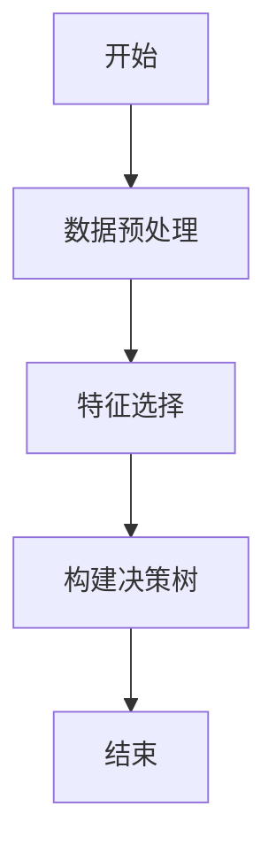
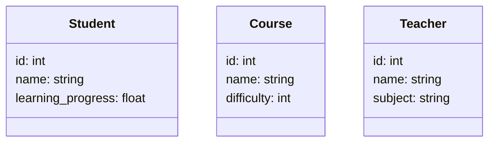
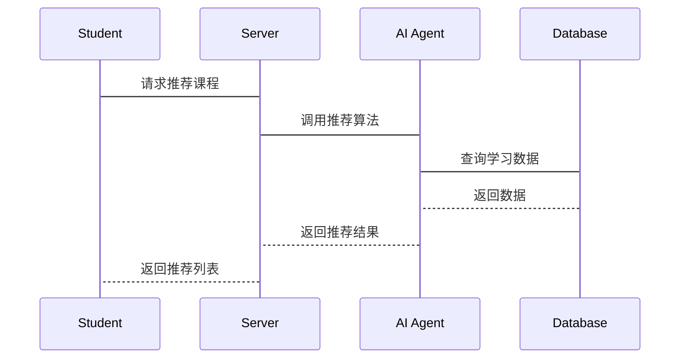
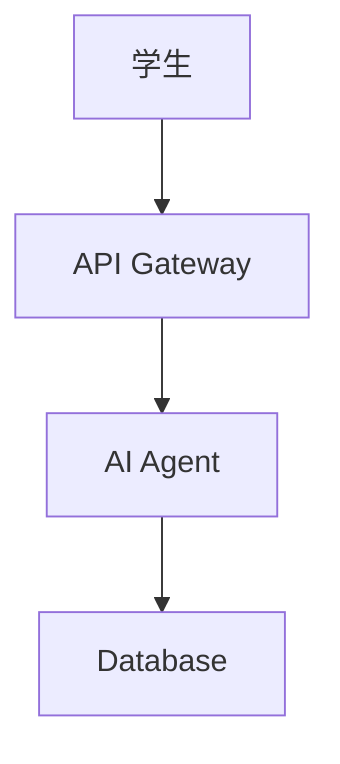
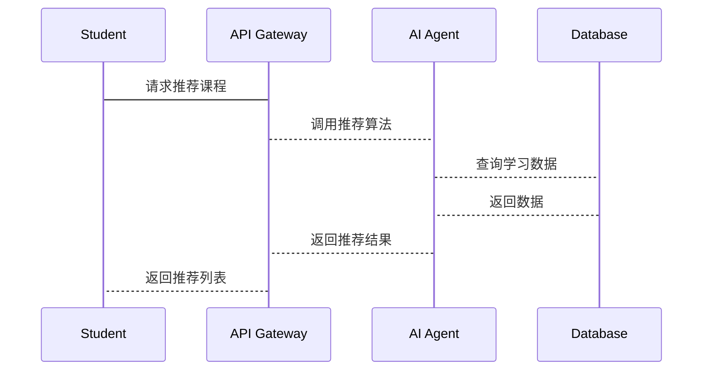

                 


# AI Agent在智能教育系统中的实现

> 关键词：AI Agent, 智能教育系统, 机器学习, 自适应学习, 教育信息化

> 摘要：AI Agent在智能教育系统中的实现，通过分析教育信息化的需求，结合AI Agent的核心原理，详细讲解了AI Agent在教育系统中的应用价值、技术实现、系统设计以及实际案例，帮助读者全面理解AI Agent在智能教育中的重要作用和实现方法。

---

## 第一部分: AI Agent在智能教育系统中的实现概述

### 第1章: AI Agent的基本概念与背景介绍

#### 1.1 AI Agent的定义与核心概念
##### 1.1.1 AI Agent的定义
AI Agent（人工智能代理）是指能够感知环境、自主决策并采取行动以实现目标的智能实体。在教育领域，AI Agent通常用于提供个性化学习建议、自动化教学辅助和智能化管理服务。

##### 1.1.2 AI Agent的核心要素
- **感知能力**：通过传感器或数据输入获取环境信息。
- **推理能力**：基于知识库和推理算法，分析信息并得出结论。
- **决策能力**：根据推理结果制定行动方案。
- **执行能力**：通过执行模块实现决策方案。

##### 1.1.3 AI Agent与传统教育系统的关系
AI Agent作为教育系统的核心组件，能够增强系统的智能化水平，实现个性化教学和自适应学习。

#### 1.2 智能教育系统的背景与需求
##### 1.2.1 智能教育系统的定义
智能教育系统是指利用人工智能、大数据和物联网等技术，构建的能够实现个性化教学、智能化管理的教育平台。

##### 1.2.2 教育信息化的发展趋势
- 数据驱动的教育决策
- 个性化学习体验
- 智能化教学管理

##### 1.2.3 AI Agent在教育中的应用价值
- 提供个性化的学习建议
- 自动化教学辅助
- 智能化教学管理

#### 1.3 问题背景与需求分析
##### 1.3.1 当前教育系统中存在的问题
- 教学资源浪费
- 学生学习效率低
- 教学管理复杂

##### 1.3.2 AI Agent如何解决这些问题
- 个性化学习路径
- 智能化资源分配
- 自动化教学反馈

##### 1.3.3 AI Agent在教育中的边界与外延
- 边界：专注于提供教育相关的AI服务
- 外延：涵盖学习、教学、管理等多个方面

#### 1.4 核心概念与联系
##### 1.4.1 AI Agent的核心原理
- 感知环境
- 推理分析
- 决策行动
- 执行反馈

##### 1.4.2 智能教育系统的概念结构
- 学生
- 教师
- 课程
- 教学资源

##### 1.4.3 核心要素对比表格
| 核心要素 | 描述 |
|----------|------|
| 感知模块 | 数据采集与处理 |
| 推理算法 | 知识分析与决策 |
| 执行模块 | 行动方案实施 |

##### 1.4.4 ER实体关系图架构
```mermaid
er
actor Student {
  id: int
  name: string
  learning_progress: float
}
actor Teacher {
  id: int
  name: string
  subject: string
}
actor Course {
  id: int
  name: string
  difficulty: int
}
```

### 第2章: AI Agent的核心原理与技术实现

#### 2.1 AI Agent的感知与推理机制
##### 2.1.1 感知模块的功能与实现
- 数据采集：学生学习数据、课程信息
- 数据处理：数据清洗、特征提取

##### 2.1.2 推理算法的选择与优化
- 决策树：用于分类和回归
- 支持向量机：用于模式识别
- 神经网络：用于复杂模式识别

##### 2.1.3 知识表示与推理模型
- 知识图谱：构建教育领域的知识网络
- 推理规则：基于规则的推理引擎

#### 2.2 AI Agent的决策与执行机制
##### 2.2.1 决策算法的原理与应用
- 强化学习：基于奖励机制优化决策
- 遗传算法：用于全局优化

##### 2.2.2 执行模块的设计与实现
- 行动方案生成：基于决策结果制定具体行动
- 行动执行：通过API或用户界面触发执行

##### 2.2.3 决策与执行的协同优化
- 决策模块与执行模块的交互设计
- 反馈机制：根据执行结果优化决策策略

#### 2.3 AI Agent的算法原理与流程图
##### 2.3.1 算法原理的数学模型
- 决策树的构建过程：
  1. 数据预处理：清洗和特征提取
  2. 特征选择：基于信息增益选择最优特征
  3. 递归分割：构建决策树

##### 2.3.2 算法流程的mermaid图


##### 2.3.3 Python代码示例
```python
import pandas as pd
from sklearn.tree import DecisionTreeClassifier

# 数据预处理
data = pd.read_csv('data.csv')
X = data.drop('label', axis=1)
y = data['label']

# 特征选择
selector = SelectKBest(score_func=chi2, k=3)
selector.fit(X, y)
X_selected = selector.transform(X)

# 构建决策树
clf = DecisionTreeClassifier()
clf.fit(X_selected, y)
```

### 第3章: AI Agent在智能教育系统中的系统分析与架构设计

#### 3.1 系统需求分析
##### 3.1.1 功能需求分析
- 学生信息管理
- 课程推荐
- 学习效果评估

##### 3.1.2 性能需求分析
- 响应时间：<= 2秒
- 吞吐量：>= 100次/分钟

##### 3.1.3 用户需求分析
- 学生：个性化学习
- 教师：教学辅助
- 管理员：系统管理

#### 3.2 系统功能设计
##### 3.2.1 领域模型


##### 3.2.2 系统架构设计


##### 3.2.3 系统接口设计
- API接口：RESTful API
- 数据格式：JSON

##### 3.2.4 系统交互流程


#### 3.3 系统架构实现
##### 3.3.1 系统功能模块
- 学生信息管理模块
- 课程推荐模块
- 学习效果评估模块

##### 3.3.2 系统架构图


##### 3.3.3 系统接口设计
- API接口：RESTful API
- 数据格式：JSON

##### 3.3.4 系统交互流程


### 第4章: AI Agent在智能教育系统中的项目实战

#### 4.1 环境搭建
- 安装Python和相关库（如scikit-learn、pandas）
- 安装Jupyter Notebook用于开发和测试

#### 4.2 核心代码实现
##### 4.2.1 数据预处理
```python
import pandas as pd
from sklearn.tree import DecisionTreeClassifier
from sklearn.model_selection import train_test_split

# 数据加载
data = pd.read_csv('data.csv')

# 数据分割
X = data.drop('label', axis=1)
y = data['label']

X_train, X_test, y_train, y_test = train_test_split(X, y, test_size=0.2)
```

##### 4.2.2 模型训练
```python
clf = DecisionTreeClassifier()
clf.fit(X_train, y_train)
```

##### 4.2.3 模型预测
```python
y_pred = clf.predict(X_test)
```

##### 4.2.4 模型评估
```python
from sklearn.metrics import accuracy_score

accuracy = accuracy_score(y_test, y_pred)
print(f'Accuracy: {accuracy}')
```

#### 4.3 案例分析
##### 4.3.1 案例背景
某教育平台希望提高学生的学习效率，引入AI Agent进行个性化推荐。

##### 4.3.2 数据分析
分析学生的学习数据，提取关键特征，构建决策树模型进行课程推荐。

##### 4.3.3 模型优化
通过网格搜索优化决策树参数，提高推荐准确率。

#### 4.4 项目总结
通过AI Agent实现个性化推荐，显著提高了学生的学习效率和教师的教学效果。

### 第5章: AI Agent在智能教育系统中的最佳实践

#### 5.1 最佳实践
- 数据质量：确保数据的准确性和完整性
- 模型选择：根据具体需求选择合适的算法
- 系统设计：注重模块化和可扩展性

#### 5.2 小结
AI Agent在智能教育系统中的实现，通过智能化的决策和执行，显著提升了教育系统的效率和效果。

#### 5.3 注意事项
- 数据隐私保护
- 系统性能优化
- 用户体验设计

#### 5.4 拓展阅读
建议阅读相关书籍和论文，深入理解AI Agent在教育中的应用。

---

# 结语
AI Agent在智能教育系统中的实现，不仅是技术的进步，更是教育信息化的重要里程碑。通过本文的详细讲解，读者可以全面理解AI Agent的核心原理和实际应用，为未来的教育创新提供有力的技术支持。

---

