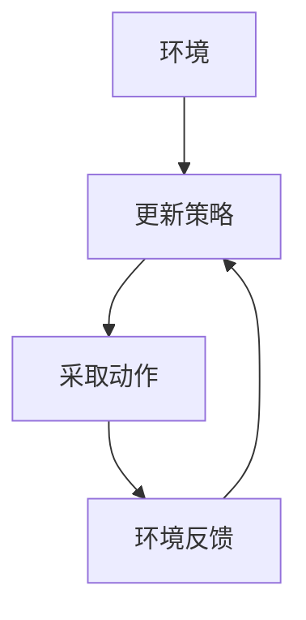
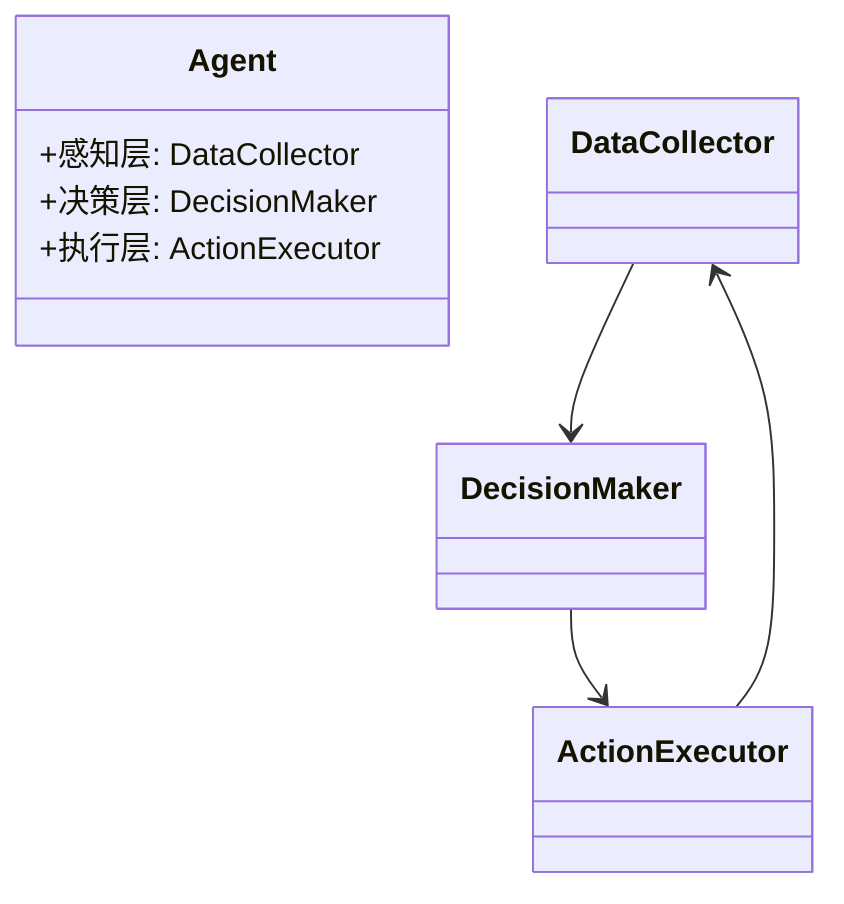
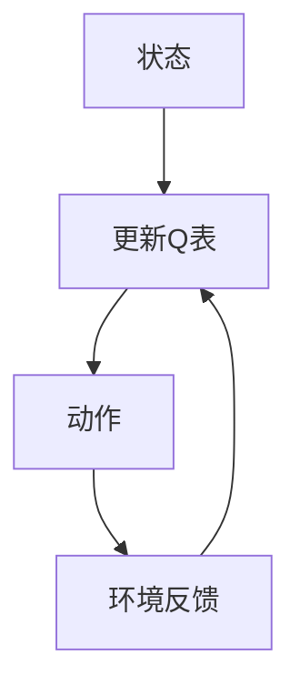
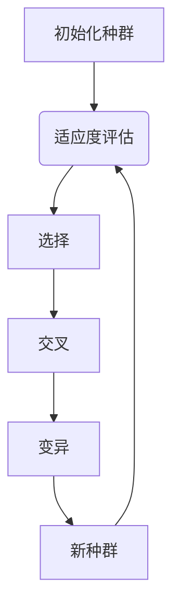
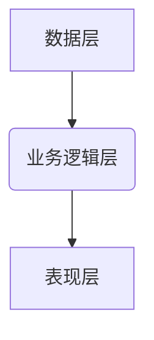
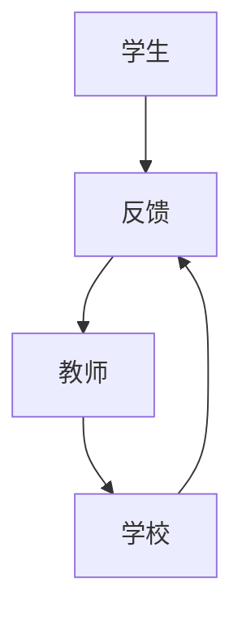

                 


# AI Agent在智能教育资源优化分配中的应用

## 关键词：AI Agent, 智能教育, 资源优化, 教育分配, 强化学习

## 摘要：  
随着人工智能技术的快速发展，AI Agent（人工智能代理）在教育领域的应用日益广泛。本文将探讨AI Agent在智能教育资源优化分配中的应用，分析其核心概念、算法原理、系统架构设计以及实际应用场景。通过详细阐述AI Agent在教育资源分配中的作用，本文旨在为教育领域的技术从业者和研究者提供理论支持和实践指导，帮助他们更好地理解和应用AI技术来优化教育资源分配，提升教育质量和效率。

---

# 第1章: AI Agent与智能教育概述

## 1.1 AI Agent的基本概念  
AI Agent（人工智能代理）是一种能够感知环境、自主决策并执行任务的智能系统。它通过与环境的交互，利用感知数据做出决策，并通过执行动作影响环境。AI Agent的核心特点包括自主性、反应性、目标导向性和学习能力。  

在教育领域，AI Agent可以用于优化教育资源分配、个性化教学、学习效果评估等场景。  

## 1.2 AI Agent在教育领域的应用背景  
当前，教育资源分配存在以下问题：  
1. **资源分配不均**：不同地区、学校之间的教育资源分布不均，导致教育质量参差不齐。  
2. **资源利用效率低**：部分教育资源未被充分利用，而部分资源需求旺盛的地区却缺乏资源。  
3. **个性化需求难以满足**：学生的个性化学习需求难以得到充分满足，教学资源的分配往往过于笼统。  

AI Agent可以通过智能感知、数据分析和自主决策，帮助实现教育资源的精准分配和优化利用。  

## 1.3 智能教育的定义与特点  
智能教育是指利用人工智能、大数据、物联网等技术，构建智能化的教育系统，以实现教育资源的高效利用、教学过程的个性化指导和学习效果的精准评估。其特点包括：  
1. **数据驱动**：基于大量数据的分析和挖掘，提供个性化建议。  
2. **动态调整**：根据实时数据和反馈，动态优化教育资源分配策略。  
3. **人机协作**：AI Agent与教师、学生协同工作，共同提升教育质量。  

---

# 第2章: AI Agent的核心概念与原理  

## 2.1 AI Agent的核心概念  
AI Agent在教育资源优化分配中的核心概念包括感知层、决策层和执行层。  

### 2.1.1 感知层: 数据采集与处理  
AI Agent通过传感器、数据库、API等方式采集教育资源相关数据，例如学生的学习需求、教师的教学能力、学校的资源情况等。数据采集后，需要进行清洗、预处理和特征提取，以便后续分析和决策。  

**示例：**  
- 采集数据：学生的学习成绩、兴趣爱好、出勤记录等。  
- 数据处理：通过机器学习模型对数据进行分类，识别学生的个性化需求。  

### 2.1.2 决策层: 算法与策略  
决策层是AI Agent的核心，负责根据感知数据制定资源分配策略。常用的算法包括强化学习、迁移学习和遗传算法等。  

### 2.1.3 执行层: 动作与反馈  
执行层根据决策层的指令，执行实际的资源分配动作，并将反馈信息传递给感知层，形成闭环。  

---

## 2.2 AI Agent的算法原理  

### 2.2.1 强化学习算法  
强化学习是一种通过试错机制优化决策的算法。AI Agent通过与环境的交互，不断尝试不同的动作，逐步优化资源分配策略。  

**算法流程图：**  


**代码示例：**  
```python
import numpy as np
import gym

env = gym.make('CartPole-v0')
env.seed(1)

# 初始化策略
policy = np.random.randn(4, 1)

while True:
    observation = env.reset()
    for _ in range(1000):
        action = np.dot(observation, policy)[0]
        action = int(np.round(action))
        observation, reward, done, info = env.step(action)
        if done:
            break
```

### 2.2.2 迁移学习算法  
迁移学习是一种将已知任务的知识迁移到新任务的技术。在教育资源分配中，迁移学习可以帮助AI Agent快速适应不同场景。  

### 2.2.3 联合学习算法  
联合学习是一种通过分布式协作优化决策的算法，适用于多机构、多地区的教育资源分配场景。  

---

## 2.3 AI Agent的系统架构  

### 2.3.1 分层架构  
分层架构将AI Agent的功能分为感知层、决策层和执行层，每一层独立运行并协同工作。  

**类图：**  


---

# 第3章: 智能教育资源优化分配的数学模型与算法  

## 3.1 资源分配问题的数学建模  
资源分配问题可以转化为一个优化问题，目标函数和约束条件如下：  

**目标函数：**  
$$ \text{最大化 } J = \sum_{i=1}^{n} w_i x_i $$  
其中，$w_i$为资源的权重，$x_i$为资源分配量。  

**约束条件：**  
$$ \sum_{i=1}^{n} x_i \leq R $$  
$$ x_i \geq 0 $$  

## 3.2 基于强化学习的资源分配算法  

### 3.2.1 Q-learning算法  
Q-learning是一种经典的强化学习算法，适用于离散动作空间的场景。  

**算法流程图：**  


**代码示例：**  
```python
import numpy as np

# 初始化Q表
Q = np.zeros((state_space, action_space))

# 状态转移
next_state = transition(state, action)

# 更新Q值
Q[state][action] = Q[state][action] + learning_rate * (reward + discount_factor * max(Q[next_state]))
```

### 3.2.2 Deep Q-Networks算法  
Deep Q-Networks（DQN）通过深度神经网络近似Q值函数，适用于连续动作空间的场景。  

**数学模型：**  
$$ Q(s, a; \theta) = \theta^T \phi(s, a) $$  
其中，$\theta$为网络参数，$\phi(s, a)$为输入特征。  

---

## 3.3 基于遗传算法的资源分配优化  

### 3.3.1 遗传算法的基本原理  
遗传算法通过模拟自然选择和遗传机制，逐步优化解空间。  

**流程图：**  


**代码示例：**  
```python
def fitness(individual):
    # 计算个体的适应度
    return sum(individual)

# 初始化种群
population = [np.random.randint(0, 2, size=10) for _ in range(100)]

# 迭代优化
for _ in range(100):
    # 适应度评估
    fitness_scores = [fitness(individual) for individual in population]
    # 选择
    selected = select(population, fitness_scores)
    # 交叉
    crossed = crossover(selected)
    # 变异
    mutated = mutate(crossed)
    population = mutated
```

---

# 第4章: 智能教育资源优化分配的系统架构设计  

## 4.1 系统功能需求分析  
系统需要实现以下功能：  
1. 数据采集与管理：收集学生、教师、课程等信息。  
2. 资源分配与调度：根据需求动态分配教育资源。  
3. 系统监控与反馈：实时监控资源分配效果并提供反馈。  

## 4.2 系统架构设计  

### 4.2.1 分层架构设计  
系统采用分层架构，包括数据层、业务逻辑层和表现层。  

**架构图：**  


---

## 4.3 系统接口设计  
系统需要提供以下接口：  
1. 数据接口：与数据库交互。  
2. API接口：供外部系统调用。  
3. 用户接口：供教师和学生使用。  

---

## 4.4 系统交互设计  

### 4.4.1 序列图  


---

# 第5章: 项目实战  

## 5.1 环境安装  
安装Python、TensorFlow、Keras等依赖库。  

## 5.2 核心代码实现  

### 5.2.1 数据采集与预处理  
```python
import pandas as pd

# 采集数据
data = pd.read_csv('resources.csv')

# 数据清洗
data.dropna(inplace=True)
data = pd.get_dummies(data)
```

### 5.2.2 模型训练与优化  
```python
from tensorflow.keras import layers

# 构建模型
model = keras.Sequential([
    layers.Dense(64, activation='relu'),
    layers.Dense(1, activation='sigmoid')
])

# 编译模型
model.compile(optimizer='adam', loss='binary_crossentropy', metrics=['accuracy'])

# 训练模型
model.fit(x_train, y_train, epochs=10, batch_size=32)
```

### 5.2.3 系统实现  
```python
def allocate_resources(requests):
    # 根据需求分配资源
    resources = {}
    for request in requests:
        resources[request['type']] += request['quantity']
    return resources
```

## 5.3 案例分析  
以某学校为例，分析AI Agent如何优化课程分配。  

---

## 5.4 项目小结  
通过项目实战，验证了AI Agent在教育资源优化分配中的有效性。  

---

# 第6章: 总结与展望  

## 6.1 总结  
本文详细探讨了AI Agent在智能教育资源优化分配中的应用，分析了其核心概念、算法原理和系统架构设计，并通过项目实战验证了其有效性。  

## 6.2 展望  
未来，AI Agent在教育领域的应用将更加广泛，例如智能课堂管理、个性化学习推荐等。同时，如何解决数据隐私、模型泛化能力等问题，仍需进一步研究。  

---

## 最佳实践 Tips  
1. 在实际应用中，需注意数据隐私保护。  
2. 模型的泛化能力需要通过大量数据进行训练。  
3. 系统设计时，应充分考虑可扩展性和可维护性。  

---

通过本文的分析，读者可以深入了解AI Agent在智能教育资源优化分配中的应用，并为实际应用提供参考。

