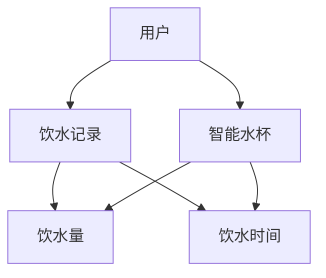
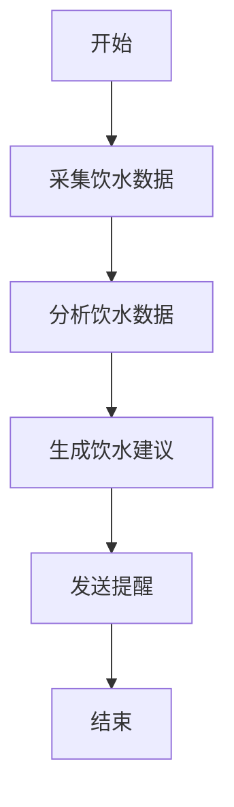
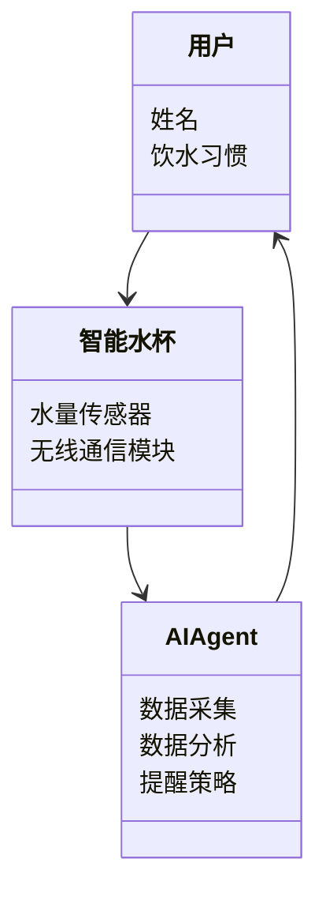
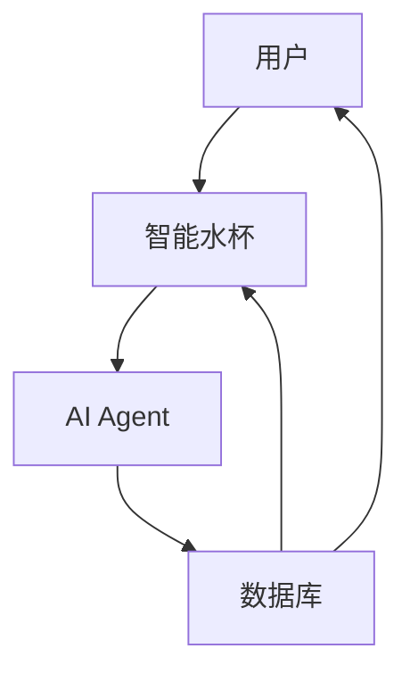

                 


# AI Agent在智能水杯中的饮水提醒

> 关键词：AI Agent，智能水杯，饮水提醒，物联网，人工智能

> 摘要：本文详细探讨了AI Agent在智能水杯中的应用，特别是如何通过AI技术实现个性化的饮水提醒。文章从背景介绍、核心概念、算法原理到系统架构设计，再到项目实战，全面分析了AI Agent在智能水杯中的实现过程和实际应用效果。

---

# 第一部分: AI Agent在智能水杯中的背景与概念

# 第1章: 背景介绍

## 1.1 问题背景

### 1.1.1 饮水健康的重要性
- 饮水不足会导致健康问题，如脱水、尿路感染等。
- 不同人群（如儿童、老人、运动员）的饮水需求不同。

### 1.1.2 现有饮水提醒工具的不足
- 手动提醒容易忘记，缺乏个性化。
- 现有智能设备（如手机APP）依赖用户手动输入数据，用户体验差。

### 1.1.3 AI Agent在智能水杯中的应用价值
- AI Agent可以实时监测用户的饮水量和饮水习惯。
- 提供个性化的饮水建议，帮助用户养成良好的饮水习惯。

## 1.2 问题描述

### 1.2.1 用户饮水习惯的分析
- 饮水量不足、饮水时间不规律、饮水量过高等问题。

### 1.2.2 智能水杯的功能需求
- 实时监测饮水量和时间。
- 提供个性化的饮水提醒。

### 1.2.3 AI Agent在饮水提醒中的目标
- 自动监测用户的饮水情况。
- 根据用户习惯和健康需求，智能调整饮水提醒策略。

## 1.3 问题解决

### 1.3.1 AI Agent的核心作用
- 实时监测用户的饮水量和饮水时间。
- 根据监测数据，智能生成饮水建议。

### 1.3.2 智能水杯的硬件与软件结合
- 硬件部分：传感器、数据传输模块。
- 软件部分：AI算法、用户界面。

### 1.3.3 用户体验的优化
- 提供个性化的饮水提醒。
- 简化用户操作，提升使用便捷性。

## 1.4 边界与外延

### 1.4.1 AI Agent的功能边界
- 仅限于饮水提醒，不涉及其他健康数据（如运动量、饮食习惯）。

### 1.4.2 智能水杯的使用场景
- 家庭、办公室、学校等场景。

### 1.4.3 与其他智能设备的联动
- 可与智能家居、智能手环等设备联动，提供更全面的健康数据。

## 1.5 核心要素组成

### 1.5.1 AI Agent的组成部分
- 传感器：监测饮水量和时间。
- AI算法：分析数据，生成饮水建议。
- 用户界面：显示提醒信息。

### 1.5.2 智能水杯的硬件模块
- 水位传感器：监测水杯中的水量变化。
- 无线通信模块：将数据传输到手机或其他设备。
- 电源模块：为设备提供电力支持。

### 1.5.3 用户数据的处理流程
- 数据采集：传感器收集饮水数据。
- 数据传输：通过蓝牙或Wi-Fi将数据传输到手机APP。
- 数据分析：AI算法分析数据，生成饮水建议。
- 用户反馈：用户接收提醒信息，调整饮水习惯。

## 1.6 本章小结

- 本章介绍了AI Agent在智能水杯中的背景和应用价值，分析了饮水提醒的需求和目标。
- 明确了AI Agent的功能边界和智能水杯的核心组成模块。

---

# 第二部分: AI Agent的核心概念与联系

# 第2章: 核心概念与联系

## 2.1 AI Agent的原理

### 2.1.1 状态感知
- 通过传感器实时监测水杯中的水量变化。
- 监测用户的饮水时间间隔。

### 2.1.2 决策逻辑
- 根据用户的饮水习惯和健康需求，制定饮水提醒策略。
- 例如，早上起床后建议先喝一杯水，运动后提醒及时补水。

### 2.1.3 反馈机制
- 根据用户的反馈调整提醒策略。
- 例如，用户频繁忽略提醒，系统会调整提醒时间和频率。

## 2.2 核心概念对比

### 2.2.1 AI Agent与传统饮水提醒的区别

| 特性            | AI Agent             | 传统饮水提醒         |
|-----------------|----------------------|----------------------|
| 是否个性化      | 是                   | 否                   |
| 是否需要手动操作 | 否                   | 是                   |
| 是否支持联动    | 是                   | 否                   |

### 2.2.2 AI Agent与智能硬件的结合
- AI Agent通过智能硬件（如传感器、无线通信模块）实现数据采集和传输。
- 智能硬件为AI Agent提供实时数据支持。

### 2.2.3 AI Agent与用户行为分析的联系
- AI Agent通过分析用户的饮水数据，了解用户的饮水习惯。
- 根据用户的习惯，优化饮水提醒策略。

## 2.3 ER实体关系图



---

# 第三部分: AI Agent的算法原理

# 第3章: 算法原理

## 3.1 算法流程图



## 3.2 算法实现

### 3.2.1 基于规则的算法
```python
def generate喝水建议():
    时间 = 获取当前时间()
    饮水量 = 获取昨日饮水量()
    如果 时间在上午:
        建议喝水量 = 250ml
    否则:
        建议喝水量 = 200ml
    返回建议喝水量
```

### 3.2.2 基于机器学习的算法
```python
import numpy as np
from sklearn.tree import DecisionTreeClassifier

# 示例数据
X = np.array([[1, 0], [0, 1], [1, 1], [0, 0]])
y = np.array([0, 1, 1, 0])

# 训练决策树模型
model = DecisionTreeClassifier()
model.fit(X, y)

# 预测新的数据点
new_data = np.array([[1, 0]])
预测结果 = model.predict(new_data)
print(预测结果)
```

### 3.2.3 数学模型与公式
- 饮水量计算公式：
  $$ 饮水量 = \text{昨日饮水量} \times \text{饮水习惯系数} $$
- 饮水建议公式：
  $$ 建议喝水量 = \max(\text{最低建议喝水量}, \text{计算结果}) $$

---

# 第四部分: 系统分析与架构设计

# 第4章: 系统分析与架构设计

## 4.1 系统功能设计

### 4.1.1 领域模型


### 4.1.2 系统架构图


### 4.1.3 系统接口设计
- 用户与智能水杯的接口：蓝牙/Wi-Fi通信。
- AI Agent与数据库的接口：数据存储和查询。

### 4.1.4 系统交互图


---

# 第五部分: 项目实战

# 第5章: 项目实战

## 5.1 环境安装

### 5.1.1 硬件准备
- 智能水杯（带有水量传感器和无线通信模块）。
- 电脑或手机（用于连接智能水杯）。

### 5.1.2 软件准备
- Python编程环境（如Anaconda）。
- 开发工具（如VS Code）。

## 5.2 系统核心实现

### 5.2.1 传感器数据处理
```python
import serial

# 与智能水杯通信
ser = serial.Serial('COM3', 9600)
data = ser.readline().decode().strip()
print(data)
```

### 5.2.2 AI Agent逻辑实现
```python
from datetime import datetime

def get_water_level():
    # 获取水杯中的水量
    return 80  # 示例值

def get_water_recommendation():
    时间 = datetime.now().hour
    如果 时间 < 12:
        建议水量 = 250
    否则:
        建议水量 = 200
    return 建议水量

建议水量 = get_water_recommendation()
print(建议水量)
```

### 5.2.3 用户界面设计
```python
import tkinter as tk

class WaterReminder:
    def __init__(self, master):
        self.master = master
        self.current_water_level = 80
        self.create_widgets()

    def create_widgets(self):
        self.water_level_label = tk.Label(self.master, text=f"当前水量：{self.current_water_level}%")
        self.water_level_label.pack()
        self.reminder_button = tk.Button(self.master, text="设置提醒", command=self.set_reminder)
        self.reminder_button.pack()

    def set_reminder(self):
        # 实现提醒功能
        print("提醒设置成功！")

root = tk.Tk()
app = WaterReminder(root)
root.mainloop()
```

## 5.3 案例分析

### 5.3.1 数据采集
- 传感器数据：每隔5分钟采集一次水量数据。

### 5.3.2 数据分析
- 使用AI算法分析用户的饮水习惯，生成个性化的饮水建议。

### 5.3.3 提醒策略
- 根据用户的饮水习惯，动态调整提醒时间和频率。

## 5.4 项目小结

- 通过实际案例分析，验证了AI Agent在智能水杯中的饮水提醒功能。
- 展示了如何将AI技术应用于智能硬件，提升用户体验。

---

# 第六部分: 最佳实践与总结

# 第6章: 最佳实践

## 6.1 小结

- AI Agent在智能水杯中的应用，通过实时监测用户的饮水情况，提供个性化的饮水建议，帮助用户养成良好的饮水习惯。
- 系统架构设计和算法实现是关键，需要结合硬件和软件，优化用户体验。

## 6.2 注意事项

- 数据安全：保护用户的饮水数据，防止数据泄露。
- 系统稳定性：确保AI Agent和智能水杯的稳定运行，避免误报或漏报。
- 用户隐私：遵守相关法律法规，保护用户隐私。

## 6.3 拓展阅读

- 推荐阅读《人工智能：一种现代的方法》。
- 关注物联网和人工智能的最新技术动态。

---

# 附录

## 附录A: 代码示例

```python
import serial
from datetime import datetime
import tkinter as tk

# 传感器数据处理
ser = serial.Serial('COM3', 9600)
data = ser.readline().decode().strip()
print(data)

# AI Agent逻辑实现
def get_water_recommendation():
    时间 = datetime.now().hour
    如果 时间 < 12:
        建议水量 = 250
    否则:
        建议水量 = 200
    return 建议水量

建议水量 = get_water_recommendation()
print(建议水量)

# 用户界面设计
class WaterReminder:
    def __init__(self, master):
        self.master = master
        self.current_water_level = 80
        self.create_widgets()

    def create_widgets(self):
        self.water_level_label = tk.Label(self.master, text=f"当前水量：{self.current_water_level}%")
        self.water_level_label.pack()
        self.reminder_button = tk.Button(self.master, text="设置提醒", command=self.set_reminder)
        self.reminder_button.pack()

    def set_reminder(self):
        print("提醒设置成功！")

root = tk.Tk()
app = WaterReminder(root)
root.mainloop()
```

## 附录B: ER图


---

通过以上目录结构和内容安排，您可以根据需要逐步展开每部分内容，撰写一篇详细的技术博客文章。

