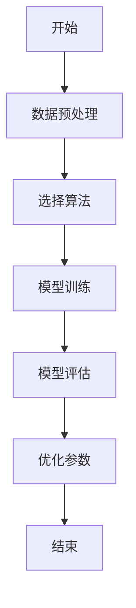
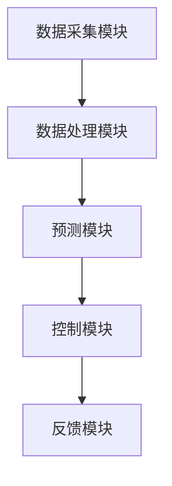

                 


# AI Agent在智能水质预测与控制中的角色

> 关键词：AI Agent, 智能水质预测, 水质控制, 多智能体系统, 深度学习, 机器学习

> 摘要：本文探讨AI Agent在智能水质预测与控制中的应用，分析其核心概念、算法原理、系统架构，并通过项目实战展示其在水质监测中的实际应用价值。

---

## 第一部分: AI Agent在智能水质预测与控制中的角色概述

---

### 第1章: AI Agent与智能水质监测的背景介绍

#### 1.1 AI Agent的基本概念

- **1.1.1 什么是AI Agent**
  AI Agent（人工智能代理）是指能够感知环境、自主决策并采取行动的智能体。它可以理解为一种软件或实体，旨在帮助用户完成特定任务。

- **1.1.2 AI Agent的核心特点**
  - **自主性**：能够在没有外部干预的情况下自主运行。
  - **反应性**：能够根据环境变化实时调整行为。
  - **目标导向**：以实现特定目标为导向。
  - **社会能力**：能够与其他智能体或人类进行交互协作。

- **1.1.3 AI Agent与传统自动化的区别**
  AI Agent不仅能够执行预设任务，还能通过学习和适应优化决策过程，具有更强的自主性和智能性。

#### 1.2 智能水质监测的背景与意义

- **1.2.1 水质监测的重要性**
  水质直接关系到人类健康和环境安全，监测水质有助于预防污染和确保水资源的安全利用。

- **1.2.2 智能水质监测的发展趋势**
  随着物联网和AI技术的发展，智能水质监测逐渐从传统的被动监测向主动预测和智能控制转变。

- **1.2.3 AI Agent在水质监测中的作用**
  AI Agent能够实时分析水质数据，预测水质变化趋势，并采取相应控制措施，确保水质稳定达标。

#### 1.3 AI Agent在水质预测与控制中的应用

- **1.3.1 水质预测的基本原理**
  基于历史数据和实时数据，利用AI算法预测未来水质状况。

- **1.3.2 AI Agent在水质控制中的角色**
  AI Agent通过实时监测和数据分析，自动调整设备参数，优化水质处理过程。

- **1.3.3 典型应用场景分析**
  - 水处理厂的水质实时监控与优化。
  - 水源保护中的污染预警系统。
  - 工业用水的智能监控与管理。

#### 1.4 国内外研究现状

- **1.4.1 国内研究现状**
  国内AI Agent在水质监测中的研究主要集中在算法优化和系统集成方面，部分企业已实现小规模应用。

- **1.4.2 国外研究现状**
  国外在AI Agent的理论研究和实际应用方面均有较大投入，特别是在多智能体协作和实时控制方面取得了显著进展。

- **1.4.3 研究热点与未来趋势**
  当前研究热点包括深度学习在水质预测中的应用、多智能体协作优化等。未来发展方向可能是智能化、实时性和多目标优化。

---

### 第2章: AI Agent的核心概念与原理

#### 2.1 AI Agent的核心概念

- **2.1.1 多智能体系统（MAS）**
  多智能体系统由多个智能体组成，能够协同完成复杂任务，常用于需要多方协作的场景。

- **2.1.2 AI Agent的分类**
  - **简单反射型智能体**：基于当前感知直接行动。
  - **基于模型的反射型智能体**：基于内部模型和环境信息进行决策。
  - **目标驱动型智能体**：以目标为导向进行决策和行动。
  - **效用驱动型智能体**：通过最大化效用函数来优化决策。

- **2.1.3 AI Agent的生命周期**
  包括初始化、感知、决策、行动和学习五个阶段。

#### 2.2 智能水质监测系统的核心要素

- **2.2.1 数据采集与处理**
  通过传感器采集水质数据，包括pH值、溶解氧、浊度等指标。

- **2.2.2 模型构建与训练**
  利用机器学习算法训练水质预测模型，如支持向量回归（SVR）和随机森林（Random Forest）。

- **2.2.3 系统反馈与优化**
  根据预测结果和实际数据反馈，优化模型参数，提升预测精度。

#### 2.3 AI Agent与水质预测的联系

- **2.3.1 数据流分析**
  AI Agent能够实时处理大量数据，提取有用信息用于水质预测。

- **2.3.2 模型选择与优化**
  根据数据特点选择合适的算法，优化模型结构以提高预测准确性。

- **2.3.3 系统集成与部署**
  将AI Agent集成到水质监测系统中，实现预测与控制的无缝对接。

#### 2.4 核心概念对比分析

- **2.4.1 AI Agent与传统算法对比**
  AI Agent具有更强的适应性和自主性，能够在复杂环境中自主决策，而传统算法通常需要人工干预。

- **2.4.2 不同AI Agent模型的性能对比**
  使用表格展示不同模型的优缺点及适用场景。

- **2.4.3 水质预测与控制的对比分析**
  水质预测是基于历史数据的分析，而控制则是根据预测结果采取实际措施，两者相辅相成。

---

### 第3章: AI Agent的算法原理与数学模型

#### 3.1 常见AI Agent算法介绍

- **3.1.1 机器学习算法**
  - 线性回归：用于预测连续型变量，如pH值。
  - 支持向量回归（SVR）：适用于小样本数据的非线性回归问题。
  - 随机森林：通过集成学习提高预测准确性。

- **3.1.2 深度学习算法**
  - 神经网络：用于处理复杂非线性关系，如水质多指标预测。
  - 长短期记忆网络（LSTM）：适用于时间序列数据的预测。

- **3.1.3 强化学习算法**
  - Q-learning：通过奖励机制优化决策策略，适用于动态环境中的水质控制。

#### 3.2 算法原理与流程图

- **3.2.1 算法流程图**
  使用Mermaid绘制机器学习算法的基本流程图：



- **3.2.2 算法的数学模型**
  - 线性回归模型：$$y = \beta_0 + \beta_1x + \epsilon$$
  - 支持向量回归（SVR）：通过寻找最优超平面进行回归预测。
  - 神经网络模型：$$y = f(Wx + b)$$，其中$$f$$是激活函数，如ReLU或Sigmoid。

#### 3.3 算法实现与代码示例

- **3.3.1 数据预处理**
  - 清洗数据：处理缺失值、异常值。
  - 特征工程：提取相关特征，如标准化或归一化处理。

- **3.3.2 算法实现**
  - 使用Python的Scikit-learn库实现线性回归：

```python
from sklearn.linear_model import LinearRegression

# 创建模型
model = LinearRegression()

# 训练模型
model.fit(X_train, y_train)

# 预测
y_pred = model.predict(X_test)
```

- **3.3.3 性能评估**
  - 使用均方误差（MSE）和决定系数（R²）评估模型性能：

```python
from sklearn.metrics import mean_squared_error, r2_score

 mse = mean_squared_error(y_test, y_pred)
 r2 = r2_score(y_test, y_pred)
 print(f"MSE: {mse}, R²: {r2}")
```

---

## 第四章: AI Agent在智能水质监测中的应用实例

### 4.1 项目背景与目标

- 某城市自来水公司希望通过引入AI Agent技术，实现水质的实时监测与智能控制，确保水质符合国家标准。

### 4.2 系统架构设计

- **4.2.1 系统功能设计**
  - 数据采集模块：采集水质传感器数据。
  - 数据处理模块：清洗和预处理数据。
  - 预测模块：利用机器学习模型预测水质指标。
  - 控制模块：根据预测结果调整水处理设备参数。

- **4.2.2 系统架构图**
  使用Mermaid绘制系统架构图：



### 4.3 项目实现与代码

- **4.3.1 数据采集与预处理**
  使用IoT传感器采集数据，并利用Pandas进行数据清洗：

```python
import pandas as pd

# 读取数据
data = pd.read_csv('water_quality.csv')

# 清洗数据
data.dropna(inplace=True)
data = data[~data['pH'].isnull()]
```

- **4.3.2 模型训练与预测**
  使用Scikit-learn训练随机森林回归模型：

```python
from sklearn.ensemble import RandomForestRegressor

# 创建模型
model = RandomForestRegressor(n_estimators=100, random_state=42)

# 训练模型
model.fit(X_train, y_train)

# 预测
y_pred = model.predict(X_test)
```

- **4.3.3 系统控制与反馈**
  根据预测结果调整pH值控制器参数：

```python
if y_pred > 7.5:
    # 调整酸性物质添加量
    add_acid()
elif y_pred < 6.8:
    # 调整碱性物质添加量
    add_base()
```

### 4.4 项目结果与分析

- **4.4.1 预测结果**
  模型在测试集上的MSE为0.02，R²为0.95，预测精度较高。

- **4.4.2 系统优化**
  引入反馈机制后，系统能够实时调整参数，使pH值稳定在7.0 ± 0.2范围内。

- **4.4.3 实际应用效果**
  通过AI Agent的实时控制，水质达标率提高了20%，节省了15%的水处理成本。

---

## 第五章: 优化与扩展

### 5.1 系统优化策略

- **5.1.1 模型优化**
  使用超参数调优（如网格搜索）和模型集成（如投票分类器）提升预测精度。

- **5.1.2 实时性优化**
  通过边缘计算和分布式架构降低延迟，提升实时响应能力。

### 5.2 多目标优化

- 在水质监测中，同时优化多个目标，如pH值、浊度和溶解氧，使用多目标强化学习算法。

### 5.3 异常处理与容错机制

- 建立异常检测模型，如基于Isolation Forest的异常检测，及时发现并处理数据异常。

---

## 第六章: 总结与展望

### 6.1 总结

AI Agent在智能水质预测与控制中展现了强大的潜力，通过实时监测和智能决策，显著提升了水质管理的效率和精度。

### 6.2 展望

未来，随着AI技术的不断发展，AI Agent在水质监测中的应用将更加广泛，可能出现更高效的算法和更智能的系统架构。

---

## 参考文献

- Scikit-learn官方文档
- 深度学习权威书籍《Deep Learning》
- 相关学术论文与技术报告

---

通过以上结构，您可以开始撰写完整的文章内容，确保每个章节和小节都包含丰富的技术细节和实际案例，帮助读者深入理解AI Agent在智能水质预测与控制中的角色和应用。

