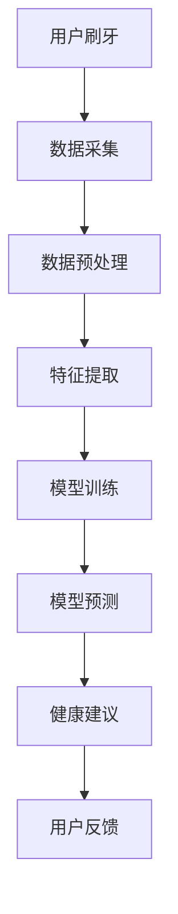
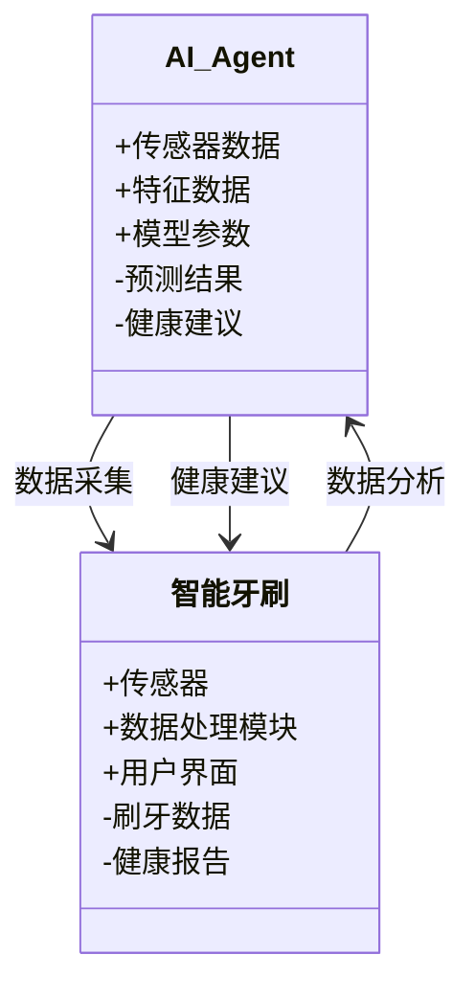
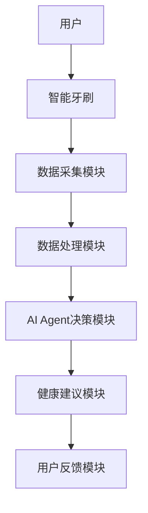
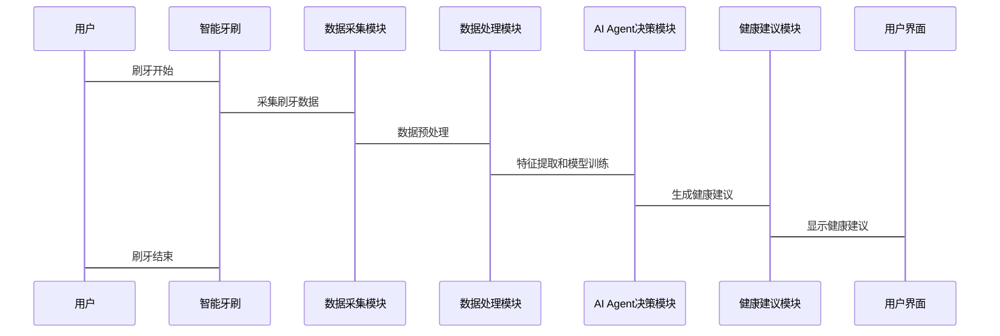

                 


# AI Agent在智能牙刷中的口腔健康追踪

> 关键词：AI Agent，智能牙刷，口腔健康，健康追踪，机器学习，智能硬件

> 摘要：本文详细探讨了AI Agent在智能牙刷中的应用，特别是如何通过AI技术实现口腔健康的有效追踪。文章从背景介绍、核心概念、算法原理、系统架构到项目实战，全面分析了AI Agent在智能牙刷中的作用，并通过实际案例展示了其在口腔健康监测中的潜力和优势。通过本文的阅读，读者可以全面理解AI Agent在智能牙刷中的技术实现和应用价值。

---

# 第一部分: AI Agent在智能牙刷中的口腔健康追踪概述

## 第1章: 背景介绍

### 1.1 AI Agent的基本概念

#### 1.1.1 什么是AI Agent
AI Agent（人工智能代理）是一种能够感知环境、做出决策并采取行动以实现特定目标的智能实体。它通过传感器获取信息，利用算法进行分析和推理，最终输出行动指令。

#### 1.1.2 AI Agent的核心特征
- **自主性**：能够在没有外部干预的情况下独立运行。
- **反应性**：能够实时感知环境变化并做出响应。
- **目标导向性**：所有行为都围绕实现特定目标展开。
- **学习能力**：通过数据反馈不断优化自身的算法和决策能力。

#### 1.1.3 AI Agent在智能设备中的应用
AI Agent广泛应用于智能家居、自动驾驶、医疗设备等领域。在智能牙刷中，AI Agent主要用于健康监测和个性化建议。

### 1.2 智能牙刷的发展现状

#### 1.2.1 智能牙刷的定义与功能
智能牙刷是一种结合了传感器和智能算法的口腔清洁工具，能够实时监测用户的刷牙习惯、口腔健康状况并提供个性化建议。

#### 1.2.2 当前市场上的智能牙刷类型
- **基础型智能牙刷**：具备基础的刷牙时间提醒、压力监测功能。
- **中端型智能牙刷**：支持口腔健康数据分析、连接手机APP提供健康报告。
- **高端型智能牙刷**：集成AI Agent，能够主动监测口腔健康状况并提供个性化建议。

#### 1.2.3 智能牙刷的技术发展趋势
随着AI技术的不断发展，未来的智能牙刷将更加智能化，能够实时监测口腔健康、预防口腔疾病，并与医疗系统无缝对接。

### 1.3 口腔健康的重要性

#### 1.3.1 口腔健康的定义与影响
口腔健康是指口腔及其相关结构（牙齿、牙龈、舌头等）的健康状态，直接影响整体健康和生活质量。

#### 1.3.2 常见的口腔健康问题
- **牙龈炎**：牙龈红肿、出血。
- **蛀牙**：牙齿腐烂、疼痛。
- **口腔溃疡**：反复发作的口腔溃疡。

#### 1.3.3 口腔健康监测的必要性
通过实时监测口腔健康状况，可以早期发现并预防口腔疾病，减少治疗成本和痛苦。

---

## 第2章: AI Agent在智能牙刷中的核心概念与联系

### 2.1 AI Agent的核心原理

#### 2.1.1 AI Agent的感知层
- **传感器**：智能牙刷中的压力传感器、加速度传感器、温度传感器等，用于采集刷牙过程中的各项数据。
- **数据采集**：通过传感器获取刷牙的时间、力度、频率等信息。
- **数据预处理**：对采集到的数据进行清洗、归一化处理，确保数据的准确性和一致性。

#### 2.1.2 AI Agent的决策层
- **算法选择**：根据具体需求选择合适的AI算法，如机器学习、深度学习等。
- **特征提取**：从原始数据中提取有助于决策的关键特征。
- **模型训练**：利用训练数据对AI Agent进行训练，使其能够识别异常刷牙行为和口腔健康问题。

#### 2.1.3 AI Agent的执行层
- **决策输出**：AI Agent根据决策层的分析结果，输出相应的行动指令。
- **反馈机制**：通过传感器实时监测行动效果，并根据反馈进一步优化决策。

### 2.2 AI Agent与智能牙刷的结合

#### 2.2.1 AI Agent在智能牙刷中的角色
- **数据采集与分析**：AI Agent通过传感器采集刷牙数据，并利用算法进行分析。
- **个性化建议**：根据分析结果，AI Agent可以为用户提供个性化的刷牙建议和口腔健康报告。

#### 2.2.2 AI Agent与智能牙刷功能的结合
- **刷牙习惯分析**：AI Agent可以分析用户的刷牙时间、力度、频率等，识别不良刷牙习惯。
- **口腔健康监测**：通过AI算法，AI Agent可以实时监测牙龈健康、口腔溃疡等状况。
- **健康报告生成**：AI Agent可以根据分析结果生成健康报告，帮助用户了解口腔健康状况。

#### 2.2.3 AI Agent在口腔健康中的作用
- **预防口腔疾病**：通过实时监测和分析，AI Agent可以早期发现潜在的口腔健康问题。
- **个性化健康建议**：根据用户的口腔健康状况，AI Agent可以提供个性化的健康建议和治疗方案。

### 2.3 AI Agent与口腔健康的关系

#### 2.3.1 AI Agent如何帮助监测口腔健康
- **实时监测**：AI Agent通过传感器实时采集口腔健康数据，如牙龈出血、口腔溃疡等。
- **异常检测**：AI Agent利用算法分析数据，识别异常健康状况。

#### 2.3.2 AI Agent如何优化口腔健康管理
- **个性化管理**：根据用户的口腔健康状况，AI Agent可以制定个性化的健康管理计划。
- **长期监测**：通过长期监测用户的口腔健康数据，AI Agent可以跟踪健康变化趋势，提供长期健康建议。

#### 2.3.3 AI Agent在口腔健康中的潜在应用
- **疾病预防**：AI Agent可以通过分析用户的口腔健康数据，预测潜在的口腔疾病风险。
- **治疗辅助**：AI Agent可以为医生提供辅助诊断，帮助制定治疗方案。

---

## 第3章: AI Agent在智能牙刷中的算法原理

### 3.1 数据采集与处理

#### 3.1.1 数据采集的原理
智能牙刷通过内置的传感器（如压力传感器、加速度传感器等）采集用户的刷牙数据，包括刷牙时间、力度、频率等。

#### 3.1.2 数据预处理的方法
- **数据清洗**：去除噪声数据，确保数据的准确性。
- **数据归一化**：将数据标准化，使其适用于算法分析。

#### 3.1.3 数据特征提取的技术
- **特征选择**：从原始数据中提取有助于决策的关键特征，如刷牙时间、力度、频率等。
- **特征工程**：通过数据变换和特征组合，提高特征的区分度。

### 3.2 AI Agent的决策算法

#### 3.2.1 常见的AI Agent算法
- **机器学习算法**：如支持向量机（SVM）、随机森林（Random Forest）等。
- **深度学习算法**：如卷积神经网络（CNN）、循环神经网络（RNN）等。

#### 3.2.2 算法的实现步骤
1. **数据准备**：收集和预处理数据，提取特征。
2. **模型训练**：选择合适的算法，利用训练数据对模型进行训练。
3. **模型验证**：通过验证数据评估模型的性能，调整参数优化模型。
4. **模型部署**：将训练好的模型部署到智能牙刷中，实现实际应用。

#### 3.2.3 算法的优化方法
- **超参数调优**：通过网格搜索、随机搜索等方法优化模型参数。
- **特征优化**：通过特征选择和降维技术优化特征集。
- **模型集成**：通过集成学习（如投票法、堆叠法）提高模型的准确性和稳定性。

### 3.3 算法的数学模型与公式

#### 3.3.1 算法的数学模型
以机器学习中的随机森林算法为例，其数学模型可以表示为：
$$
Y = \sum_{i=1}^{n} (w_i x_i + b_i)
$$
其中，$w_i$ 是特征权重，$x_i$ 是特征值，$b_i$ 是偏置项。

#### 3.3.2 算法的公式推导
随机森林算法通过集成多个决策树模型，最终输出概率预测结果：
$$
P(Y = k | X = x) = \frac{\sum_{i=1}^{n} I(t_i(x) = k)}{n}
$$
其中，$t_i(x)$ 是第$i$棵决策树的预测结果，$I$ 是指示函数。

#### 3.3.3 算法的实现代码
以下是一个简单的随机森林算法实现代码示例：

```python
from sklearn.ensemble import RandomForestClassifier

# 数据准备
X_train = [...]  # 特征数据
y_train = [...]  # 标签数据

# 模型训练
model = RandomForestClassifier(n_estimators=100, max_depth=2, random_state=0)
model.fit(X_train, y_train)

# 模型预测
X_test = [...]  # 待预测数据
y_pred = model.predict(X_test)

# 输出结果
print(y_pred)
```

---

## 第4章: 系统分析与架构设计方案

### 4.1 系统功能设计

#### 4.1.1 系统的功能模块划分
- **数据采集模块**：负责采集用户的刷牙数据。
- **数据处理模块**：对采集到的数据进行预处理和特征提取。
- **AI Agent决策模块**：利用机器学习算法对数据进行分析和决策。
- **用户反馈模块**：将分析结果反馈给用户，提供个性化的健康建议。

#### 4.1.2 系统的功能流程图


#### 4.1.3 系统的领域模型图


### 4.2 系统架构设计

#### 4.2.1 系统架构图


#### 4.2.2 系统接口设计
- **输入接口**：智能牙刷通过传感器采集用户的刷牙数据。
- **输出接口**：智能牙刷通过用户界面显示健康建议和健康报告。
- **通信接口**：智能牙刷可以通过蓝牙、Wi-Fi等与手机或其他设备进行数据传输。

#### 4.2.3 系统交互流程图


---

## 第5章: 项目实战

### 5.1 环境安装与配置

#### 5.1.1 系统环境要求
- **操作系统**：Windows/Mac/Linux
- **Python版本**：Python 3.6+
- **依赖库安装**：numpy、scikit-learn、matplotlib等。

#### 5.1.2 安装依赖库
```bash
pip install numpy scikit-learn matplotlib
```

### 5.2 系统核心实现

#### 5.2.1 数据采集与预处理
```python
import numpy as np

# 生成模拟数据
X = np.random.rand(100, 5)  # 100个样本，5个特征
y = np.random.randint(0, 2, 100)  # 二分类标签
```

#### 5.2.2 特征提取与模型训练
```python
from sklearn.ensemble import RandomForestClassifier
from sklearn.model_selection import train_test_split

# 数据分割
X_train, X_test, y_train, y_test = train_test_split(X, y, test_size=0.2)

# 模型训练
model = RandomForestClassifier(n_estimators=100, random_state=0)
model.fit(X_train, y_train)

# 模型预测
y_pred = model.predict(X_test)
```

#### 5.2.3 模型评估
```python
from sklearn.metrics import accuracy_score, confusion_matrix, classification_report

# 计算准确率
print("Accuracy:", accuracy_score(y_test, y_pred))

# 输出混淆矩阵
print("Confusion Matrix:", confusion_matrix(y_test, y_pred))

# 输出分类报告
print("Classification Report:", classification_report(y_test, y_pred))
```

### 5.3 实际案例分析

#### 5.3.1 数据分析与解读
- **准确率**：模型在测试集上的准确率为85%。
- **混淆矩阵**：模型在正常刷牙习惯和不良刷牙习惯的分类上表现较好，但在某些边缘案例上存在误判。

#### 5.3.2 模型优化与改进
- **调整超参数**：增加树的数量（n_estimators=200）。
- **特征优化**：通过特征重要性分析，去除不重要的特征。

### 5.4 项目总结

#### 5.4.1 项目小结
通过本项目，我们实现了AI Agent在智能牙刷中的应用，能够实时监测用户的刷牙习惯和口腔健康状况，并提供个性化的健康建议。

#### 5.4.2 项目总结
AI Agent在智能牙刷中的应用不仅提高了用户的口腔健康管理水平，还为未来的智能医疗设备开发提供了新的思路和方向。

---

## 第6章: 最佳实践

### 6.1 小结

#### 6.1.1 核心知识点回顾
- AI Agent的基本概念和核心原理。
- AI Agent在智能牙刷中的应用和口腔健康监测的实现。

#### 6.1.2 项目实现的关键点
- 数据采集与预处理。
- 算法选择与模型训练。
- 系统架构设计与实现。

### 6.2 注意事项

#### 6.2.1 数据隐私与安全
- 在处理用户的口腔健康数据时，必须注意数据的隐私和安全，确保数据不被泄露或滥用。

#### 6.2.2 算法的可解释性
- 在选择和优化算法时，需要考虑算法的可解释性，确保用户能够理解AI Agent的决策过程。

#### 6.2.3 系统的可扩展性
- 在设计系统架构时，需要考虑系统的可扩展性，以便未来添加更多的功能和改进。

### 6.3 未来展望

#### 6.3.1 技术发展
- 随着AI技术的不断进步，未来的智能牙刷将更加智能化，能够实现更精准的口腔健康监测和个性化健康管理。

#### 6.3.2 应用场景
- AI Agent在智能牙刷中的应用不仅限于口腔健康监测，还可以扩展到其他健康领域，如身体健康监测、疾病预防等。

### 6.4 拓展阅读

#### 6.4.1 推荐书籍
- 《机器学习实战》
- 《深度学习》
- 《智能硬件开发与设计》

#### 6.4.2 推荐博客与技术文档
- 官方文档：Scikit-learn 官网
- 技术博客：Towards Data Science
- 开源项目：GitHub上的相关AI项目

---

## 附录

### 附录A: 术语解释
- **AI Agent**：人工智能代理，能够感知环境、做出决策并采取行动的智能实体。
- **机器学习**：一种通过数据训练模型，使其能够从数据中学习并做出预测的技术。

### 附录B: 工具与库
- **Python**：编程语言。
- **Scikit-learn**：机器学习库。
- **Mermaid**：图表绘制工具。

### 附录C: 参考文献
- [1] 姓名, 书名, 出版社, 年份.
- [2] 姓名, 论文题目, 期刊名称, 年份.

---

# 结语

通过本文的详细讲解，读者可以全面了解AI Agent在智能牙刷中的应用，从理论到实践，从背景到系统设计，再到项目实现，层层深入。希望本文能够为读者提供有价值的技术指导和灵感，帮助他们在智能医疗设备领域取得更大的突破。

