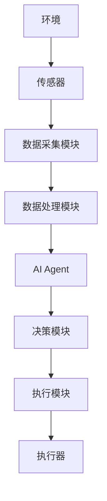
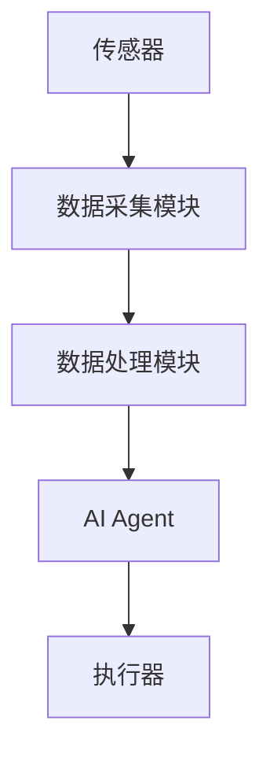
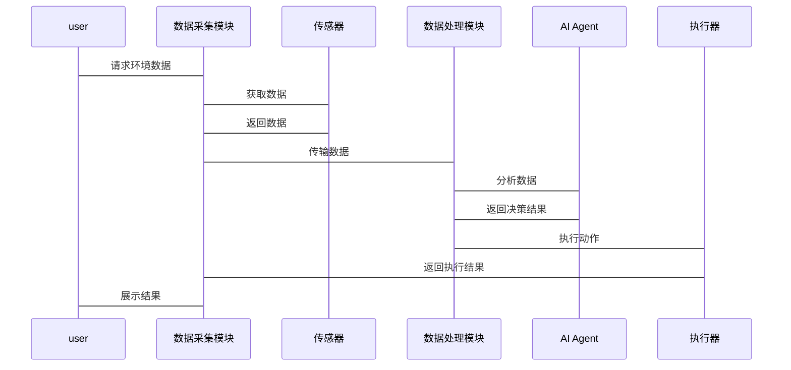

                 


# AI Agent在智能环境污染监测中的实践

## 关键词：AI Agent、智能环境监测、环境污染、人工智能、监测系统

## 摘要：本文将详细介绍AI Agent在智能环境污染监测中的应用与实践。从AI Agent的基本概念到其在环境污染监测中的核心作用，从算法原理到系统架构设计，再到项目实战，全面解析AI Agent在智能环境污染监测中的技术细节与实现方案。通过本文，读者将能够理解并掌握AI Agent在智能环境污染监测中的核心原理、实现方法及应用案例。

---

# 第1章 AI Agent与智能环境污染监测的背景介绍

## 1.1 AI Agent的基本概念与核心功能
### 1.1.1 AI Agent的定义
AI Agent（人工智能代理）是指能够感知环境、做出决策并执行动作的智能实体。AI Agent通过传感器获取环境信息，利用算法进行分析和推理，最终实现目标。

### 1.1.2 AI Agent的核心功能
- **感知环境**：通过传感器或数据源获取环境信息。
- **状态推理**：根据感知信息，推断环境的状态。
- **决策制定**：基于状态信息，制定最优动作。
- **动作执行**：通过执行机构或接口，完成决策动作。

### 1.1.3 AI Agent与智能环境污染监测的关系
AI Agent能够通过感知环境数据，分析污染情况，并制定相应的监测和治理策略，从而实现智能环境污染监测。

## 1.2 智能环境污染监测的背景与挑战
### 1.2.1 环境污染监测的重要性
环境污染监测是保护环境、保障人类健康的重要手段。传统的环境污染监测依赖于人工操作，效率低且成本高。

### 1.2.2 传统环境污染监测的局限性
- 数据采集范围有限。
- 数据处理效率低下。
- 监测结果缺乏实时性。

### 1.2.3 AI Agent在环境污染监测中的优势
- 高效性：AI Agent能够快速处理大量数据，提高监测效率。
- 实时性：AI Agent能够实时感知环境变化，及时发出预警。
- 智能性：AI Agent能够根据环境数据，自适应地调整监测策略。

## 1.3 本章小结
本章介绍了AI Agent的基本概念及其在智能环境污染监测中的重要性，分析了传统环境污染监测的局限性，并阐述了AI Agent在环境污染监测中的优势。

---

# 第2章 AI Agent的核心概念与联系

## 2.1 AI Agent的核心概念
### 2.1.1 知识表示与推理
知识表示是AI Agent进行推理的基础。通过知识图谱或规则库，AI Agent能够理解环境数据的意义。

### 2.1.2 状态感知与决策
AI Agent通过感知环境状态，利用算法进行决策。常见的决策算法包括基于规则的决策和基于学习的决策。

### 2.1.3 行为规划与执行
AI Agent根据决策结果，规划并执行相应的动作。执行动作可以通过执行器或接口完成。

## 2.2 AI Agent的核心原理
### 2.2.1 知识表示的数学模型
知识表示可以通过图论中的图结构表示，节点表示概念，边表示关系。

### 2.2.2 状态空间与动作空间的定义
- **状态空间**：所有可能的环境状态的集合。
- **动作空间**：所有可能的动作的集合。

### 2.2.3 决策树与策略网络的对比
| 对比维度 | 决策树 | 策略网络 |
|----------|--------|----------|
| 决策方式 | 基于规则 | 基于学习 |
| 适应性 | 固定规则 | 可自适应 |
| 复杂度 | 低 | 高 |

## 2.3 AI Agent的实体关系图



---

# 第3章 AI Agent的算法原理与数学模型

## 3.1 AI Agent的算法原理
### 3.1.1 基于规则的AI Agent算法
基于规则的AI Agent通过预定义的规则进行决策。例如，如果空气质量指数超过一定值，则触发预警。

### 3.1.2 基于学习的AI Agent算法
基于学习的AI Agent通过机器学习算法（如随机森林、神经网络）进行数据训练，学习环境数据的特征。

### 3.1.3 基于强化学习的AI Agent算法
基于强化学习的AI Agent通过与环境的交互，学习最优策略。例如，使用Q-Learning算法进行状态-动作-奖励的三元组学习。

## 3.2 AI Agent的数学模型
### 3.2.1 状态空间的数学表示
状态空间可以表示为一个集合：
$$ S = \{ s_1, s_2, \ldots, s_n \} $$
其中，$s_i$ 表示环境状态。

### 3.2.2 动作空间的数学表示
动作空间可以表示为一个集合：
$$ A = \{ a_1, a_2, \ldots, a_m \} $$
其中，$a_i$ 表示动作。

### 3.2.3 奖励函数的数学公式
奖励函数可以表示为：
$$ R(s, a) = \sum_{i=1}^{n} w_i x_i $$
其中，$w_i$ 是权重，$x_i$ 是状态特征。

## 3.3 AI Agent的算法实现
### 3.3.1 基于规则的AI Agent实现
```python
def rule_based_agent(perceived_state):
    if perceived_state['AQI'] > 100:
        return 'trigger_alarm'
    else:
        return 'no_action'
```

### 3.3.2 基于强化学习的AI Agent实现
```python
import numpy as np

class QLearningAgent:
    def __init__(self, state_space_size, action_space_size):
        self.q_table = np.zeros((state_space_size, action_space_size))
    
    def choose_action(self, state, epsilon=0.1):
        if np.random.random() < epsilon:
            return np.random.randint(0, action_space_size)
        else:
            return np.argmax(self.q_table[state])
    
    def update_q_table(self, state, action, reward, next_state, learning_rate=0.1):
        self.q_table[state][action] = (1 - learning_rate) * self.q_table[state][action] + \
                                        learning_rate * (reward + np.max(self.q_table[next_state]))
```

### 3.3.3 基于深度学习的AI Agent实现
```python
import torch
import torch.nn as nn

class DQNAgent(nn.Module):
    def __init__(self, input_dim, output_dim):
        super(DQNAgent, self).__init__()
        self.fc1 = nn.Linear(input_dim, 64)
        self.fc2 = nn.Linear(64, output_dim)
    
    def forward(self, x):
        x = torch.relu(self.fc1(x))
        x = self.fc2(x)
        return x
```

---

# 第4章 智能环境污染监测系统的架构与设计

## 4.1 系统功能需求分析
### 4.1.1 数据采集与预处理
- 数据采集：通过传感器采集环境数据。
- 数据预处理：对数据进行清洗、归一化等处理。

### 4.1.2 环境数据建模与分析
- 数据建模：构建环境数据的数学模型。
- 数据分析：通过机器学习算法分析环境数据。

### 4.1.3 智能决策与反馈
- 智能决策：基于AI Agent的决策模块，制定最优动作。
- 反馈机制：根据执行结果，调整决策策略。

## 4.2 系统架构设计
### 4.2.1 分层架构设计
- **感知层**：传感器和数据采集模块。
- **计算层**：数据处理模块和AI Agent。
- **执行层**：执行器和接口。

### 4.2.2 微服务架构设计
- **数据采集服务**：负责数据采集。
- **数据处理服务**：负责数据预处理和建模。
- **AI决策服务**：负责环境数据的分析和决策。

### 4.2.3 数据流与控制流设计


## 4.3 系统接口设计
### 4.3.1 数据接口
- **输入接口**：传感器数据接口。
- **输出接口**：执行器控制接口。

### 4.3.2 用户接口
- **前端界面**：展示环境数据和决策结果。
- **后端接口**：处理用户请求和数据交互。

## 4.4 系统交互流程图


---

# 第5章 项目实战：基于AI Agent的智能环境污染监测系统

## 5.1 环境安装
### 5.1.1 安装Python与相关库
```bash
pip install numpy pandas scikit-learn torch
```

### 5.1.2 安装传感器与执行器
- 传感器：MQ-135空气质量传感器。
- 执行器：继电器控制的空气净化器。

## 5.2 系统核心实现
### 5.2.1 数据采集模块实现
```python
import serial

ser = serial.Serial('COM3', 9600)

def read_sensor_data():
    data = ser.readline().decode().strip()
    return {'AQI': float(data.split(',')[0]), 'PM2.5': float(data.split(',')[1])}
```

### 5.2.2 AI Agent实现
```python
class AI-Agent:
    def __init__(self):
        self.model = DQNAgent(input_dim=2, output_dim=2)
    
    def decide(self, state):
        with torch.no_grad():
            action = self.model(torch.tensor(state).float())
            return torch.argmax(action).item()
```

### 5.2.3 执行器控制
```python
import RPi.GPIO as GPIO

class Actuator:
    def __init__(self, pin):
        self.pin = pin
        GPIO.setup(pin, GPIO.OUT)
    
    def execute_action(self, action):
        if action == 'on':
            GPIO.output(self.pin, GPIO.HIGH)
        else:
            GPIO.output(self.pin, GPIO.LOW)
```

## 5.3 案例分析
### 5.3.1 数据采集与分析
- 数据集：空气质量指数（AQI）和PM2.5浓度数据。
- 数据分析：使用随机森林算法进行数据建模。

### 5.3.2 AI Agent决策与执行
- 决策过程：AI Agent根据环境数据，决定是否触发预警或启动空气净化器。
- 执行结果：记录执行动作和环境变化。

## 5.4 项目小结
本章通过实际案例，详细讲解了基于AI Agent的智能环境污染监测系统的实现过程，包括环境安装、系统核心实现和案例分析。

---

# 第6章 总结与展望

## 6.1 最佳实践 tips
- **数据质量**：确保环境数据的准确性和完整性。
- **算法选择**：根据实际需求选择合适的AI算法。
- **系统优化**：定期优化系统架构和算法模型。

## 6.2 本章小结
本文详细介绍了AI Agent在智能环境污染监测中的应用与实践，从理论到实践，全面解析了AI Agent的核心概念、算法原理和系统架构设计。

## 6.3 注意事项
- 确保系统安全性和稳定性。
- 定期维护和更新系统。

## 6.4 拓展阅读
- 《强化学习：算法与应用》
- 《人工智能在环境科学中的应用》

---

# 附录

## 附录A 环境数据集
- 数据集名称：空气质量指数（AQI）数据集。
- 数据来源：公开环境监测数据。

## 附录B 算法实现代码
- 数据采集模块代码。
- AI Agent实现代码。
- 执行器控制代码。

---

# 参考文献
- 强化学习相关文献。
- 人工智能相关文献。
- 环境监测相关文献。

