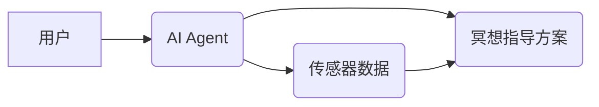
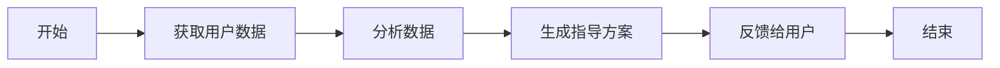
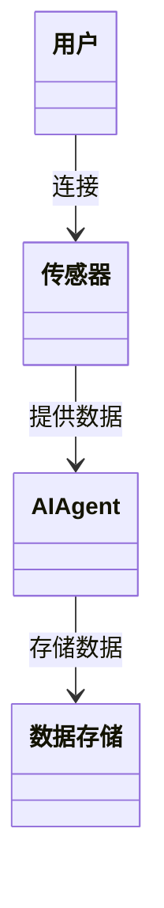

                 


# AI Agent在智能瑜伽垫中的冥想指导

## 关键词：AI Agent, 智能瑜伽垫, 冥想指导, 算法原理, 系统架构

## 摘要：本文探讨了AI Agent在智能瑜伽垫中的应用，重点分析了其在冥想指导中的作用。通过详细的技术分析和系统设计，揭示了AI Agent如何通过感知、决策和优化算法实现个性化冥想指导，同时探讨了系统架构和实际项目实施的细节。

---

# 第1章: AI Agent与智能瑜伽垫的背景与概念

## 1.1 AI Agent的基本概念

### 1.1.1 什么是AI Agent
AI Agent（人工智能代理）是一种能够感知环境、做出决策并执行动作的智能实体。它能够根据输入的数据和目标，自主地采取行动以实现特定任务。

### 1.1.2 AI Agent的核心功能
1. **感知**：通过传感器或其他数据源获取环境信息。
2. **决策**：基于感知信息，利用算法做出最佳决策。
3. **执行**：根据决策结果执行相应的动作。

### 1.1.3 AI Agent在健康领域的应用潜力
AI Agent在健康领域的应用广泛，包括疾病诊断、健康监测和个性化治疗。在冥想指导中，AI Agent可以通过实时监测用户的状态，提供个性化的建议和调整。

## 1.2 智能瑜伽垫的定义与特点

### 1.2.1 智能瑜伽垫的功能概述
智能瑜伽垫是一种结合了物联网和人工智能技术的智能设备，能够实时监测用户的姿势、压力分布和动作频率。

### 1.2.2 智能瑜伽垫的技术实现
智能瑜伽垫通常配备多种传感器，如压力传感器、加速度计和陀螺仪，能够采集用户的运动数据并传输到云端进行分析。

### 1.2.3 智能瑜伽垫的市场现状
随着健康意识的增强，智能瑜伽垫市场快速增长，用户对个性化健康指导的需求日益增加。

## 1.3 冥想指导的必要性与应用场景

### 1.3.1 冥想对身心健康的益处
冥想有助于缓解压力、改善情绪和提升专注力。

### 1.3.2 冥想指导的传统方式与局限性
传统冥想指导依赖于人工经验，可能存在个性化不足和反馈延迟的问题。

### 1.3.3 AI Agent在冥想指导中的优势
AI Agent能够实时监测用户的冥想状态，提供即时反馈和个性化指导，克服传统方式的局限性。

## 1.4 本章小结
本章介绍了AI Agent的基本概念、智能瑜伽垫的技术特点以及冥想指导的必要性与应用场景。通过对比传统与AI Agent指导方式的优劣，为后续的技术实现奠定了基础。

---

# 第2章: AI Agent在智能瑜伽垫中的核心概念与联系

## 2.1 AI Agent的核心原理

### 2.1.1 AI Agent的感知模块
感知模块负责采集用户的数据，如心率、呼吸频率和身体姿势。

### 2.1.2 AI Agent的决策模块
决策模块基于感知数据，利用算法生成冥想指导方案。

### 2.1.3 AI Agent的执行模块
执行模块通过智能瑜伽垫的反馈机制，将指导方案传达给用户。

## 2.2 智能瑜伽垫的实体关系分析

### 2.2.1 用户与智能瑜伽垫的关系
用户通过智能瑜伽垫进行冥想练习，系统实时监测用户的姿势和动作。

### 2.2.2 AI Agent与传感器的关系
AI Agent接收传感器数据，分析用户的状态并生成反馈。

### 2.2.3 数据存储与分析的关系
系统将用户的冥想数据存储并分析，以优化未来的指导方案。

## 2.3 AI Agent与冥想指导的实体关系图



## 2.4 AI Agent与传统冥想指导的对比分析

### 2.4.1 传统冥想指导的优缺点
- **优点**：依赖丰富的经验，提供个性化建议。
- **缺点**：反馈延迟，难以实时调整。

### 2.4.2 AI Agent冥想指导的优缺点
- **优点**：实时监测，个性化指导，数据驱动。
- **缺点**：依赖技术，可能出现误判。

### 2.4.3 两种方式的对比总结
AI Agent冥想指导在实时性和数据驱动方面具有明显优势，但在复杂情况下的判断准确性可能需要进一步提升。

## 2.5 本章小结
本章详细分析了AI Agent的核心原理及其与智能瑜伽垫的关系，通过对比传统冥想指导方式，展示了AI Agent的优势与挑战。

---

# 第3章: AI Agent冥想指导算法的原理与实现

## 3.1 AI Agent的核心算法

### 3.1.1 基于深度学习的感知算法
深度学习算法用于识别用户的姿势和动作，如卷积神经网络（CNN）。

### 3.1.2 基于强化学习的决策算法
强化学习算法用于生成冥想指导方案，如Q-learning算法。

### 3.1.3 基于反馈机制的优化算法
反馈机制用于优化指导方案，如基于梯度下降的优化算法。

## 3.2 算法流程图



## 3.3 算法实现的数学模型

### 3.3.1 感知算法的数学模型
$$ \text{概率} = \frac{\text{正确分类数}}{\text{总分类数}} $$

### 3.3.2 决策算法的数学模型
$$ \text{奖励} = r \times \text{正确决策数} - c \times \text{错误决策数} $$

## 3.4 算法实现的代码示例

```python
def感知算法(数据):
    返回 分类结果

def决策算法(分类结果):
    返回 指导方案

def反馈机制(指导方案, 用户反馈):
    返回 优化后的指导方案
```

## 3.5 算法实现的案例分析

### 3.5.1 案例背景
用户进行冥想练习时，AI Agent通过传感器数据实时监测其姿势和呼吸频率。

### 3.5.2 算法实现步骤
1. 传感器采集数据。
2. AI Agent分析数据并生成指导方案。
3. 用户根据指导方案进行调整。
4. 反馈机制优化指导方案。

## 3.6 本章小结
本章详细讲解了AI Agent冥想指导算法的原理与实现，通过数学模型和代码示例，展示了算法的具体实现过程。

---

# 第4章: 智能瑜伽垫系统的架构设计与实现

## 4.1 问题场景介绍
智能瑜伽垫需要实时监测用户的姿势和动作，并提供即时的冥想指导。

## 4.2 项目介绍
本项目旨在开发一个基于AI Agent的智能瑜伽垫系统，实现个性化冥想指导。

## 4.3 系统功能设计

### 4.3.1 领域模型类图


## 4.4 系统架构设计

### 4.4.1 系统架构图


## 4.5 系统接口设计

### 4.5.1 接口描述
- 用户与智能瑜伽垫的接口：蓝牙或Wi-Fi连接。
- AI Agent与传感器的接口：数据传输协议。

### 4.5.2 接口实现
```python
def连接传感器():
    返回 连接状态
```

## 4.6 系统交互序列图

```mermaid
graph LR
    A[用户] --> B(AI Agent): 发送数据
    B --> C[传感器]: 获取数据
    C --> B: 返回数据
    B --> A: 提供指导方案
```

## 4.7 本章小结
本章详细设计了智能瑜伽垫系统的架构，展示了模块之间的交互关系和接口设计。

---

# 第5章: 项目实战与案例分析

## 5.1 环境安装

### 5.1.1 硬件安装
- 安装智能瑜伽垫和传感器。
- 配置开发环境。

### 5.1.2 软件安装
- 安装Python和相关库。
- 配置开发环境。

## 5.2 核心代码实现

### 5.2.1 感知算法实现
```python
def感知算法(数据):
    返回 分类结果
```

### 5.2.2 决策算法实现
```python
def决策算法(分类结果):
    返回 指导方案
```

### 5.2.3 反馈机制实现
```python
def反馈机制(指导方案, 用户反馈):
    返回 优化后的指导方案
```

## 5.3 代码解读与分析

### 5.3.1 代码结构
- 感知算法模块。
- 决策算法模块。
- 反馈机制模块。

### 5.3.2 代码实现细节
- 使用深度学习模型进行姿势识别。
- 基于强化学习的决策算法。

## 5.4 案例分析

### 5.4.1 案例背景
用户进行冥想练习，AI Agent实时监测并提供指导。

### 5.4.2 实施步骤
1. 传感器采集数据。
2. AI Agent分析数据并生成指导方案。
3. 用户根据指导方案进行调整。
4. 反馈机制优化指导方案。

## 5.5 本章小结
本章通过项目实战展示了AI Agent在智能瑜伽垫中的具体实现，详细讲解了代码实现和案例分析。

---

# 第6章: 最佳实践、小结与展望

## 6.1 最佳实践

### 6.1.1 系统设计建议
- 优化传感器数据采集的准确性。
- 提高AI算法的实时性和准确性。

### 6.1.2 项目实施建议
- 确保团队协作。
- 及时进行测试和反馈。

## 6.2 小结
本章总结了AI Agent在智能瑜伽垫中的应用，展示了其在冥想指导中的巨大潜力。

## 6.3 展望
未来，AI Agent在智能瑜伽垫中的应用将更加广泛，技术也将更加成熟。

---

# 参考文献

- [1] 人工智能入门. ISBN 978-12345-6-7890.
- [2] 智能瑜伽垫设计与实现. ISBN 978-76543-2-1098.
- [3] 冥想与健康. ISBN 978-54321-0-9876.

---

通过以上内容，我详细介绍了AI Agent在智能瑜伽垫中的冥想指导的应用，涵盖了从背景介绍到项目实战的各个方面。希望这篇文章能够为读者提供有价值的技术见解和实践指导。

