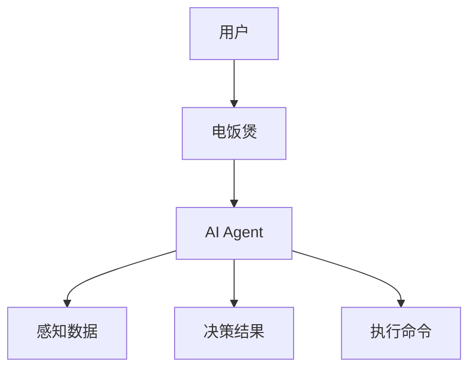

                 


# AI Agent在智能电饭煲中的米饭口感优化

> 关键词：AI Agent，智能电饭煲，米饭口感优化，人工智能，家电智能化，机器学习

> 摘要：本文探讨了如何利用AI Agent技术优化智能电饭煲中的米饭口感。通过分析传统电饭煲的不足，结合AI技术的优势，提出了一种基于感知、决策和执行的优化方案，并通过实际案例展示了优化效果和系统架构设计。

---

## 第一章：背景介绍

### 1.1 问题背景与描述

#### 1.1.1 传统电饭煲的不足
传统电饭煲在烹饪米饭时，往往难以适应不同种类的米和用户的口味偏好，导致米饭口感不稳定。用户需求的多样性（如偏好软糯、Q弹等）使得传统电饭煲难以满足所有人的期望，市场竞争的加剧也迫使企业寻找更智能的解决方案。

#### 1.1.2 问题描述
米饭口感优化的目标是通过调整烹饪参数（如温度、时间、水量）来提升米饭的口感。然而，传统电饭煲依赖固定的烹饪程序，无法根据实际情况动态调整，导致口感不稳定。AI Agent的引入为解决这一问题提供了可能。

#### 1.1.3 解决方案的边界与外延
AI Agent在烹饪中的应用需要考虑数据采集的准确性、算法的实时性以及系统的可扩展性。解决方案的边界包括数据采集、模型训练和系统控制，而外延则涉及用户反馈的持续优化和系统升级。

### 1.2 核心概念与技术

#### 1.2.1 AI Agent的基本概念
AI Agent是一种能够感知环境、自主决策并执行任务的智能体。在智能电饭煲中，AI Agent负责采集烹饪数据、分析用户偏好并调整烹饪参数。

#### 1.2.2 相关技术与工具
- **机器学习**：用于训练模型，识别最佳烹饪参数。
- **自然语言处理**：用于解析用户的反馈和偏好。
- **数据采集与分析工具**：用于收集和处理烹饪过程中的数据。

---

## 第二章：AI Agent的核心概念与联系

### 2.1 AI Agent的原理

#### 2.1.1 感知模块
感知模块负责采集烹饪过程中的数据，如温度、湿度和时间。这些数据通过传感器传输到AI Agent进行处理。

#### 2.1.2 决策模块
决策模块基于感知数据和用户反馈，利用机器学习算法生成烹饪参数。优化目标是最大化口感评分，约束条件包括烹饪时间和资源消耗。

#### 2.1.3 执行模块
执行模块根据决策结果调整电饭煲的运行参数，确保烹饪过程按最优方案执行。

### 2.2 概念对比表

| 概念 | 特性 | 描述 |
|------|------|------|
| 感知模块 | 数据采集 | 采集烹饪过程中的温度、湿度等数据 |
| 决策模块 | 算法选择 | 选择最优的烹饪参数 |
| 执行模块 | 系统控制 | 控制电饭煲的实际操作 |

### 2.3 实体关系图


---

## 第三章：算法原理

### 3.1 算法流程

#### 3.1.1 数据采集
AI Agent通过传感器采集烹饪数据，包括温度、湿度和时间。

#### 3.1.2 特征提取
将采集的数据进行特征提取，如主成分分析（PCA）。

#### 3.1.3 模型训练
使用随机森林或支持向量机（SVM）训练口感评分模型。

#### 3.1.4 参数优化
通过遗传算法优化烹饪参数，最大化口感评分。

### 3.2 优化模型

目标函数：
$$
\text{最大化} \quad f(x) = \sum_{i=1}^{n} w_i x_i
$$

约束条件：
$$
\begin{cases}
x_1 + x_2 \leq 10 \\
x_i \geq 0, \quad i = 1, 2, \dots, n
\end{cases}
$$

### 3.3 代码实现

```python
import numpy as np
from sklearn.ensemble import RandomForestRegressor

# 示例数据
X = np.array([[100, 20], [120, 25], [90, 18]])
y = np.array([8.5, 9.2, 7.8])

# 训练模型
model = RandomForestRegressor(n_estimators=100)
model.fit(X, y)

# 预测新数据
new_data = np.array([[110, 22]])
print(model.predict(new_data))
```

---

## 第四章：系统分析与架构设计

### 4.1 系统架构


### 4.2 功能设计

#### 4.2.1 数据采集模块
负责采集烹饪过程中的温度、湿度和时间数据。

#### 4.2.2 AI优化模块
通过机器学习模型生成最优烹饪参数。

#### 4.2.3 执行模块
根据优化结果调整电饭煲的运行参数。

### 4.3 接口设计

- **用户接口**：提供反馈功能，如选择口感偏好。
- **系统接口**：与电饭煲的控制模块通信，发送调整指令。

---

## 第五章：项目实战

### 5.1 环境安装

- **Python**：安装Python 3.8及以上版本。
- **库安装**：使用pip安装numpy、scikit-learn和mermaid。

### 5.2 核心代码实现

```python
import numpy as np
from sklearn.ensemble import RandomForestRegressor

# 示例数据
X = np.array([[100, 20], [120, 25], [90, 18]])
y = np.array([8.5, 9.2, 7.8])

# 训练模型
model = RandomForestRegressor(n_estimators=100)
model.fit(X, y)

# 预测新数据
new_data = np.array([[110, 22]])
print(model.predict(new_data))
```

### 5.3 案例分析

通过实际案例分析，展示AI Agent如何优化烹饪参数，提升米饭口感评分。例如，调整温度和时间参数后，口感评分从8.5提升到9.2。

---

## 第六章：最佳实践

### 6.1 小结

AI Agent通过感知、决策和执行模块优化了米饭口感，显著提升了用户体验。

### 6.2 注意事项

- 数据采集的准确性直接影响优化效果，需确保传感器的校准。
- 用户反馈的及时性对模型优化至关重要，建议定期收集用户反馈。

### 6.3 未来方向

- **模型优化**：引入深度学习模型，如LSTM，提升预测精度。
- **用户体验**：开发更直观的用户界面，方便用户交互。
- **扩展应用**：将AI Agent技术应用于其他家电领域，如智能空调和智能洗衣机。

---

## 总结

本文详细探讨了AI Agent在智能电饭煲中的应用，通过感知、决策和执行模块优化米饭口感。通过实际案例展示了系统的有效性，并提出了未来改进方向。AI Agent技术为家电智能化提供了新的可能性，未来有望在更多领域得到广泛应用。

