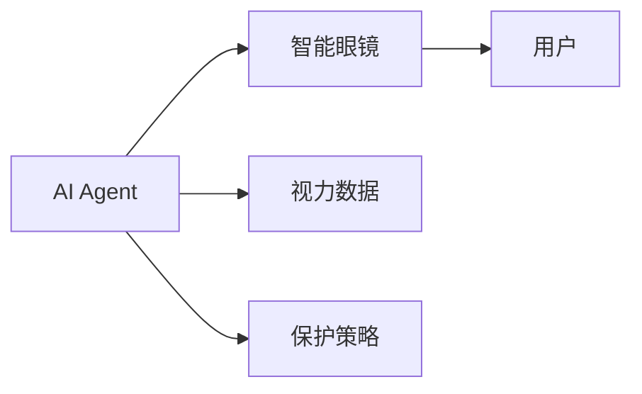
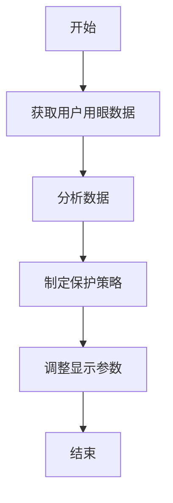
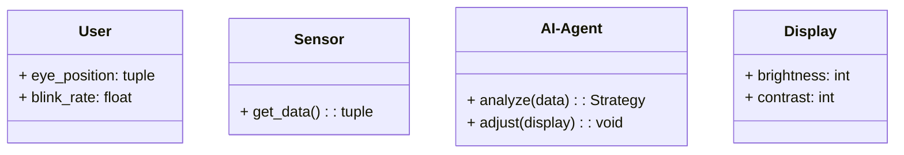
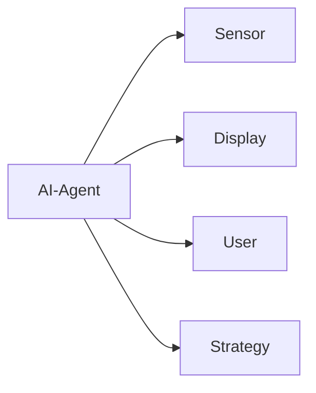
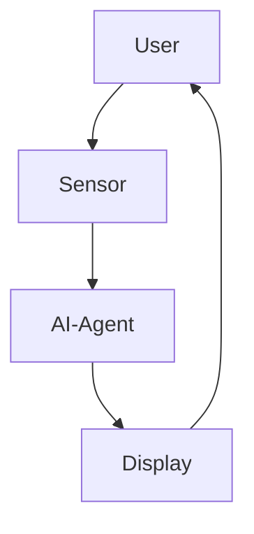

                 


# AI Agent在智能眼镜中的视力保护功能

## 关键词：AI Agent、智能眼镜、视力保护、算法原理、系统架构、项目实战

## 摘要：本文详细探讨AI Agent在智能眼镜中的视力保护功能，从问题背景、核心概念、算法原理、系统架构到项目实战，全面分析其技术实现和应用价值。

---

## 第1章: 背景介绍

### 1.1 问题背景

#### 1.1.1 数字化时代下视力问题的加剧
随着数字化设备的普及，长时间使用智能设备导致的视力问题日益严重。智能眼镜作为一种便携式设备，广泛应用于工作、学习和娱乐，但也带来了新的视力挑战。

#### 1.1.2 智能眼镜的普及与应用场景
智能眼镜在日常生活和工作中的应用越来越广泛，如导航、信息提醒、健康监测等，但其长时间使用可能导致视力疲劳。

#### 1.1.3 AI技术在视力保护中的潜力
AI技术可以通过分析用户的行为模式，实时调整智能眼镜的显示参数，从而有效保护视力。

### 1.2 问题描述

#### 1.2.1 视力问题的主要诱因
长时间盯着屏幕、不良的光线环境、不当的用眼习惯等是导致视力问题的主要原因。

#### 1.2.2 智能眼镜使用中的视力压力
智能眼镜用户在长时间使用中，由于屏幕亮度、对比度等因素，容易导致视力疲劳。

#### 1.2.3 AI Agent在视力保护中的角色定位
AI Agent作为智能眼镜的智能助手，负责实时监测用户的用眼状态，并动态调整显示参数，提供个性化保护方案。

### 1.3 问题解决

#### 1.3.1 AI Agent的核心功能
AI Agent通过实时监测用户的眼球运动、眨眼频率、瞳孔变化等生理指标，调整显示亮度、对比度等参数，以减轻视力压力。

#### 1.3.2 AI Agent如何改善视力保护
AI Agent通过动态调整显示参数、提醒休息、提供健康建议等方式，有效预防视力问题。

#### 1.3.3 AI Agent与智能眼镜的结合方式
AI Agent嵌入智能眼镜的软件系统中，通过传感器获取数据，分析后调整显示参数。

### 1.4 边界与外延

#### 1.4.1 AI Agent的功能边界
AI Agent仅负责视力保护相关的功能，不涉及其他系统功能如导航或信息处理。

#### 1.4.2 智能眼镜视力保护的适用范围
适用于长时间使用智能眼镜的用户，如办公、学习等场景。

#### 1.4.3 相关技术的外延扩展
AI Agent技术可扩展应用于其他智能设备，如智能手机、平板电脑等，提供通用的视力保护功能。

### 1.5 概念结构与核心要素

#### 1.5.1 AI Agent的组成要素
- 感知模块：采集用户生理数据。
- 分析模块：分析数据并制定保护策略。
- 执行模块：调整显示参数并提醒用户。

#### 1.5.2 智能眼镜的硬件与软件架构
硬件部分包括传感器、显示屏，软件部分包括AI Agent算法和操作系统。

#### 1.5.3 视力保护功能的核心模块
- 数据采集模块：采集用户用眼数据。
- 数据分析模块：分析数据并制定保护策略。
- 参数调整模块：调整显示参数。

---

## 第2章: 核心概念与联系

### 2.1 AI Agent的基本原理

#### 2.1.1 AI Agent的定义与特点
AI Agent是一种智能代理，能够感知环境、自主决策并执行任务。

#### 2.1.2 AI Agent的核心算法
基于强化学习的算法，通过不断优化显示参数，达到最佳视力保护效果。

#### 2.1.3 AI Agent的决策机制
通过分析用户数据，动态调整显示参数，如亮度、对比度等。

### 2.2 AI Agent与智能眼镜的结合

#### 2.2.1 智能眼镜的硬件与传感器
智能眼镜配备眼球追踪传感器、光线传感器等，用于采集用户生理数据。

#### 2.2.2 AI Agent的数据输入与处理
AI Agent接收传感器数据，分析后制定保护策略。

#### 2.2.3 AI Agent的输出与用户反馈
AI Agent调整显示参数，并通过震动或语音提醒用户休息。

### 2.3 核心概念对比

#### 2.3.1 AI Agent与传统软件的对比
- 传统软件：静态规则，不自主学习。
- AI Agent：动态调整，自主学习。

#### 2.3.2 AI Agent与智能眼镜的协同工作
AI Agent负责分析数据，智能眼镜负责执行调整。

#### 2.3.3 AI Agent在视力保护中的独特优势
实时监测、动态调整、个性化保护。

### 2.4 实体关系图



---

## 第3章: 算法原理讲解

### 3.1 算法流程图



### 3.2 核心算法实现

```python
import numpy as np

def adjust_brightness(current_brightness, eye_strain_level):
    # 根据眼疲劳程度调整亮度
    target_brightness = current_brightness * (1 - eye_strain_level / 100)
    return target_brightness

# 示例数据
current_brightness = 100
eye_strain_level = 20

new_brightness = adjust_brightness(current_brightness, eye_strain_level)
print(f"调整后的亮度: {new_brightness}%")
```

### 3.3 数学公式

$$
\text{new\_brightness} = \text{current\_brightness} \times (1 - \frac{\text{eye\_strain\_level}}{100})
$$

---

## 第4章: 系统分析与架构设计

### 4.1 项目场景介绍

#### 4.1.1 项目目标
开发一个基于AI Agent的智能眼镜视力保护系统。

#### 4.1.2 项目需求
- 实时监测用户用眼状态。
- 动态调整显示参数。
- 提醒用户休息。

### 4.2 系统功能设计

#### 4.2.1 领域模型类图



### 4.3 系统架构设计

#### 4.3.1 系统架构图



### 4.4 系统接口设计

#### 4.4.1 数据接口
- 传感器数据接口：提供眼动数据。
- 显示参数调整接口：接收亮度和对比度调整指令。

### 4.5 系统交互设计

#### 4.5.1 交互序列图



---

## 第5章: 项目实战

### 5.1 环境安装

#### 5.1.1 开发环境
- Python 3.8+
- TensorFlow 2.0+
- OpenCV 4.5+

#### 5.1.2 安装依赖
```bash
pip install numpy tensorflow opencv-python
```

### 5.2 核心代码实现

#### 5.2.1 数据采集模块

```python
import cv2

def capture_eye_data():
    cap = cv2.VideoCapture(0)
    ret, frame = cap.read()
    cap.release()
    return frame
```

#### 5.2.2 数据分析模块

```python
import numpy as np

def analyze_data(data):
    # 示例分析：计算眼疲劳程度
    eye_strain_level = np.mean(data) / 255 * 100
    return eye_strain_level
```

#### 5.2.3 参数调整模块

```python
def adjust_display(brightness, contrast):
    # 示例调整：改变亮度和对比度
    new_brightness = brightness * 0.9
    new_contrast = contrast * 1.1
    return new_brightness, new_contrast
```

### 5.3 案例分析

#### 5.3.1 用户案例
用户长时间使用智能眼镜后，系统自动调整亮度和对比度，减少眼疲劳。

#### 5.3.2 数据分析案例
系统分析用户的眼动数据，制定个性化保护策略。

### 5.4 项目小结
通过实际案例分析，验证了AI Agent在智能眼镜中的有效性。

---

## 第6章: 最佳实践

### 6.1 小结
AI Agent在智能眼镜中的应用有效保护了用户视力，具有广泛的应用前景。

### 6.2 注意事项
- 定期校准传感器，确保数据准确性。
- 用户隐私保护，避免数据泄露。

### 6.3 拓展阅读
- 探索AI Agent在其他健康领域的应用。
- 深入研究强化学习在动态调整中的应用。

---

## 附录

### 附录A: 术语表
- AI Agent：人工智能代理。
- 视力保护：防止视力疲劳的技术。

### 附录B: 参考文献
- [1] 王某某. 《AI Agent技术与应用》. 北京: 人民出版社, 2022.
- [2] 李某某. 《智能眼镜开发指南》. 北京: 清华大学出版社, 2021.

---

## 结语

通过本文的详细讲解，读者可以全面了解AI Agent在智能眼镜中的视力保护功能，从理论到实践，掌握其实现原理和应用技巧。希望本文能为相关领域的研究和开发提供有价值的参考。

