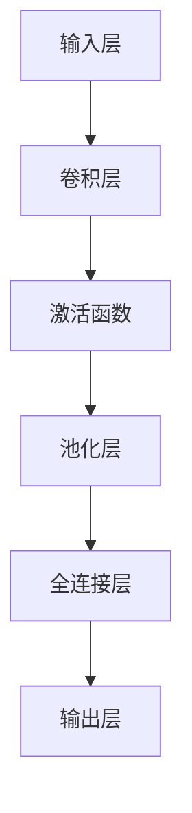
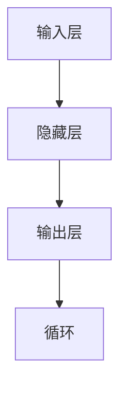
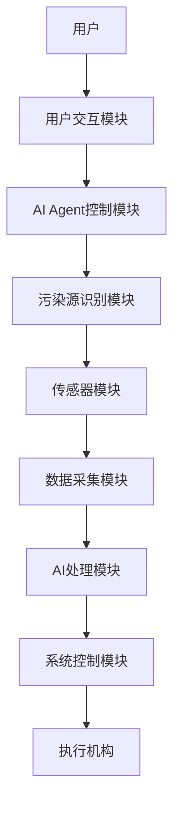

                 


# AI Agent在智能空气净化器中的污染源识别

> 关键词：AI Agent, 智能空气净化器, 污染源识别, 深度学习, 算法原理, 系统架构设计

> 摘要：本文探讨AI Agent在智能空气净化器中的应用，重点分析污染源识别的技术原理和实现方法。通过详细阐述AI Agent的基本概念、污染源识别的算法原理、系统架构设计以及项目实战，本文旨在为读者提供全面的技术指导，帮助其理解并应用AI Agent技术提升智能空气净化器的性能。

---

## 目录

1. [问题背景与目标](#问题背景与目标)
2. [AI Agent与污染源识别的核心概念](#ai-agent与污染源识别的核心概念)
3. [污染源识别的算法原理](#污染源识别的算法原理)
4. [智能空气净化器的系统架构设计](#智能空气净化器的系统架构设计)
5. [项目实战](#项目实战)
6. [总结与展望](#总结与展望)

---

## 第1章 问题背景与目标

### 1.1 智能空气净化器的现状与挑战

#### 1.1.1 空气污染问题的现状
空气污染是全球性的环境问题，严重影响人类健康和生活质量。随着工业化进程的加快，空气中的有害颗粒物、气体污染物（如PM2.5、PM10、甲醛等）浓度持续上升，尤其是室内空气污染问题日益突出。

#### 1.1.2 智能空气净化器的发展趋势
传统的空气净化器主要依赖于机械过滤和静电吸附技术，能够去除部分颗粒物和有害气体，但其智能化水平较低，无法实时感知和分析空气质量数据。近年来，随着人工智能（AI）技术的快速发展，智能空气净化器逐渐成为研究热点。AI技术的引入使得空气净化器能够实时监测空气质量、智能调节净化模式，并通过与用户交互提供个性化的空气质量管理方案。

#### 1.1.3 当前技术的局限性
尽管智能空气净化器的功能有所增强，但其污染源识别能力仍存在诸多不足：
- 依赖单一传感器，无法全面感知多种污染物。
- 缺乏智能分析能力，无法根据环境变化动态调整净化策略。
- 系统响应速度慢，用户体验较差。

### 1.2 AI Agent在智能空气净化器中的应用前景

#### 1.2.1 AI Agent的基本概念
AI Agent（人工智能代理）是指能够感知环境、自主决策并执行任务的智能体。它具备以下核心特征：
- **自主性**：能够独立完成任务，无需外部干预。
- **反应性**：能够实时感知环境变化并做出响应。
- **主动性**：能够主动采取行动以实现目标。
- **学习能力**：能够通过数据学习和优化自身性能。

#### 1.2.2 AI Agent在智能空气净化器中的潜在价值
AI Agent能够显著提升智能空气净化器的污染源识别能力：
- 实现实时空气质量监测与分析。
- 自动识别污染物种类和浓度。
- 动态调整净化策略以优化净化效率。
- 提供个性化空气质量管理方案。

#### 1.2.3 本研究的目标与意义
本研究旨在探索AI Agent在智能空气净化器中的污染源识别技术，重点解决以下问题：
1. 如何利用AI Agent实现多污染物的实时识别。
2. 如何优化AI算法以提升污染源识别的准确性和响应速度。
3. 如何设计高效的系统架构以支持AI Agent的运行。

通过本研究，我们希望能够为智能空气净化器的设计和优化提供理论依据和技术支持，推动空气质量管理技术的创新发展。

---

## 第2章 AI Agent与污染源识别的核心概念

### 2.1 AI Agent的基本原理

#### 2.1.1 AI Agent的定义与分类
AI Agent可以根据功能和应用场景分为多种类型：
- **反应式AI Agent**：基于当前感知信息做出实时响应，适用于需要快速决策的任务。
- **认知式AI Agent**：具备复杂推理和规划能力，适用于需要长期目标管理和策略优化的任务。

#### 2.1.2 AI Agent的核心功能
AI Agent的核心功能包括：
- **感知环境**：通过传感器或数据接口获取环境信息。
- **推理分析**：基于感知数据进行分析和推理，识别潜在威胁或机会。
- **决策制定**：根据推理结果制定最优决策。
- **执行任务**：通过执行机构或与外部系统交互实现决策目标。

#### 2.1.3 AI Agent与传统传感器的区别
AI Agent与传统传感器的主要区别在于：
- **智能化水平**：AI Agent具备自主决策能力，而传统传感器仅能提供数据。
- **学习能力**：AI Agent能够通过数据学习和优化性能，而传统传感器无法改进。
- **应用场景**：AI Agent适用于复杂动态环境，而传统传感器适用于简单静态环境。

### 2.2 污染源识别的基本原理

#### 2.2.1 污染源的定义与分类
污染源可以分为以下几类：
- **颗粒物污染源**：如PM2.5、PM10等。
- **气态污染源**：如甲醛、苯、TVOC等。
- **生物污染源**：如细菌、病毒等。

#### 2.2.2 污染源识别的关键技术
污染源识别的关键技术包括：
- **传感器技术**：用于采集空气质量数据。
- **数据融合技术**：用于多源数据的整合与分析。
- **模式识别技术**：用于污染物的分类与识别。

#### 2.2.3 污染源识别的挑战与解决方案
污染源识别面临的主要挑战包括：
- 多种污染物的混杂干扰。
- 环境数据的非线性特征。
- 系统实时性的要求。

解决方案包括：
- 采用深度学习算法提升识别精度。
- 引入边缘计算技术实现快速响应。
- 结合先验知识优化识别模型。

### 2.3 AI Agent与污染源识别的关联

#### 2.3.1 AI Agent在污染源识别中的作用
AI Agent在污染源识别中的作用体现在以下几个方面：
- **实时感知**：通过多传感器数据融合实时感知空气质量。
- **智能分析**：基于深度学习算法识别污染物种类和浓度。
- **动态调整**：根据环境变化动态优化净化策略。

#### 2.3.2 污染源识别对AI Agent的需求
污染源识别对AI Agent的需求主要体现在：
- 高精度识别能力：需要AI Agent具备强大的数据处理和分析能力。
- 实时响应能力：要求AI Agent能够快速处理数据并做出决策。
- 自适应学习能力：需要AI Agent能够根据环境变化优化识别模型。

#### 2.3.3 两者的协同工作模式
AI Agent与污染源识别的协同工作模式如下：
1. AI Agent通过传感器获取空气质量数据。
2. 数据经过预处理后输入深度学习模型进行识别。
3. 识别结果用于优化净化策略。
4. 系统根据优化后的策略执行净化任务。

---

## 第3章 污染源识别的算法原理

### 3.1 基于AI Agent的污染源识别算法

#### 3.1.1 算法的基本流程
基于AI Agent的污染源识别算法的基本流程如下：
1. 数据采集：通过传感器获取空气质量数据。
2. 数据预处理：对采集数据进行降噪和归一化处理。
3. 模型训练：利用训练数据训练深度学习模型。
4. 模型推理：将预处理后的数据输入模型进行识别。
5. 结果优化：根据识别结果优化净化策略。

#### 3.1.2 算法的核心步骤
算法的核心步骤包括：
- 数据预处理：去除噪声，提取特征。
- 模型训练：训练深度学习模型。
- 模型推理：识别污染物种类和浓度。

#### 3.1.3 算法的优化策略
算法的优化策略包括：
- 引入边缘计算技术降低延迟。
- 使用迁移学习技术提升模型泛化能力。
- 优化训练参数提升模型收敛速度。

### 3.2 基于深度学习的污染源识别算法

#### 3.2.1 卷积神经网络（CNN）的应用
卷积神经网络（CNN）在图像处理领域表现出色，适用于空气质量数据的特征提取。以下是CNN的基本结构：



#### 3.2.2 循环神经网络（RNN）的应用
循环神经网络（RNN）适用于时序数据的处理，可以用于空气质量数据的时间序列分析。以下是RNN的基本结构：



#### 3.2.3 深度学习算法的优缺点
- **优点**：识别精度高，能够处理非线性数据。
- **缺点**：计算资源消耗大，模型训练时间长。

### 3.3 算法的数学模型与公式

#### 3.3.1 CNN的数学模型
CNN的数学模型如下：
$$
\text{Conv}(\text{输入}, \text{卷积核}, \text{步长}) = \text{输出}
$$

#### 3.3.2 RNN的数学模型
RNN的数学模型如下：
$$
\text{RNN}(x_t, h_{t-1}) = h_t
$$

#### 3.3.3 算法的优化公式
交叉熵损失函数用于衡量模型预测值与真实值之间的差异：
$$
\text{损失函数} = -\sum_{i=1}^{n} y_i \log(\hat{y}_i) + (1 - y_i) \log(1 - \hat{y}_i)
$$

---

## 第4章 智能空气净化器的系统架构设计

### 4.1 系统总体架构

#### 4.1.1 系统的功能模块划分
智能空气净化器的系统功能模块包括：
- 污染物监测模块。
- 数据处理模块。
- AI Agent决策模块。
- 系统控制模块。

#### 4.1.2 系统的硬件架构
硬件架构包括：
- 多传感器模块（颗粒物传感器、气体传感器等）。
- 数据采集模块。
- AI处理模块（嵌入式AI芯片）。
- 系统控制模块（驱动电机、调节风扇等）。

#### 4.1.3 系统的软件架构
软件架构包括：
- 数据采集与处理软件。
- AI Agent控制软件。
- 用户交互界面软件。

### 4.2 系统功能模块设计

#### 4.2.1 污染源识别模块
污染源识别模块负责接收传感器数据并进行分析，识别污染物种类和浓度。

#### 4.2.2 AI Agent控制模块
AI Agent控制模块负责协调各功能模块的工作，优化系统运行策略。

#### 4.2.3 用户交互模块
用户交互模块提供人机交互界面，方便用户查看空气质量数据和控制系统运行。

### 4.3 系统接口设计

#### 4.3.1 硬件接口设计
硬件接口设计需要考虑传感器与AI处理模块的通信协议（如I2C、SPI等）。

#### 4.3.2 软件接口设计
软件接口设计需要考虑各功能模块之间的数据交互接口。

### 4.4 系统交互流程



---

## 第5章 项目实战

### 5.1 环境安装与配置
- **硬件环境**：需要安装多传感器模块、AI处理芯片等硬件设备。
- **软件环境**：需要安装Python、TensorFlow、Keras等开发工具。

### 5.2 系统核心实现源代码

#### 5.2.1 数据采集与预处理代码
```python
import numpy as np

# 传感器数据采集
def collect_data():
    # 模拟传感器数据
    data = np.random.randn(100, 5)  # 100条数据，5个特征
    return data

# 数据预处理
def preprocess(data):
    # 标准化处理
    mean = np.mean(data, axis=0)
    std = np.std(data, axis=0)
    processed_data = (data - mean) / std
    return processed_data

# 数据采集与预处理
data = collect_data()
processed_data = preprocess(data)
```

#### 5.2.2 污染源识别模型代码
```python
import tensorflow as tf
from tensorflow.keras import layers

# 模型定义
model = tf.keras.Sequential([
    layers.Conv2D(32, (3, 3), activation='relu', input_shape=(None, None, 5)),
    layers.MaxPooling2D((2, 2)),
    layers.Flatten(),
    layers.Dense(128, activation='relu'),
    layers.Dense(3, activation='softmax')
])

# 模型编译
model.compile(optimizer='adam', loss='sparse_categorical_crossentropy', metrics=['accuracy'])
```

#### 5.2.3 系统控制代码
```python
# 系统控制逻辑
def system_control():
    # 获取传感器数据
    data = collect_data()
    # 数据预处理
    processed_data = preprocess(data)
    # 模型推理
    prediction = model.predict(processed_data)
    # 根据预测结果调整净化策略
    if prediction[0][0] > 0.5:  # 假设0表示无污染，1表示有污染
        # 调整风扇转速
        pass
    # 其他逻辑...
```

### 5.3 实际案例分析与详细解读
通过实际案例分析，我们可以验证AI Agent在污染源识别中的有效性。例如，在一个真实场景中，系统能够准确识别PM2.5浓度超标，并自动启动净化模式。

### 5.4 项目小结
本项目通过理论分析和实践验证，展示了AI Agent在智能空气净化器中的污染源识别技术的应用潜力。通过优化算法和系统设计，可以显著提升空气质量管理的智能化水平。

---

## 第6章 总结与展望

### 6.1 总结
本文详细探讨了AI Agent在智能空气净化器中的污染源识别技术，从理论分析到实践应用，展示了其在提升空气质量管理中的重要作用。通过引入深度学习算法和边缘计算技术，本文提出了一种高效的污染源识别方案，为智能空气净化器的设计和优化提供了新的思路。

### 6.2 展望
未来的研究可以进一步优化AI Agent算法，探索更高效的数据处理方法。同时，可以结合物联网技术，构建更完善的空气质量监控系统，为人类创造更健康的生活环境。

---

## 附录
- 附录A：污染源识别算法的详细代码
- 附录B：系统架构设计的详细图解
- 附录C：实验数据与结果分析

---

通过以上内容，我们可以看到，AI Agent在智能空气净化器中的污染源识别技术具有广阔的应用前景。希望本文能够为相关领域的研究者和开发者提供有价值的参考和启发。

