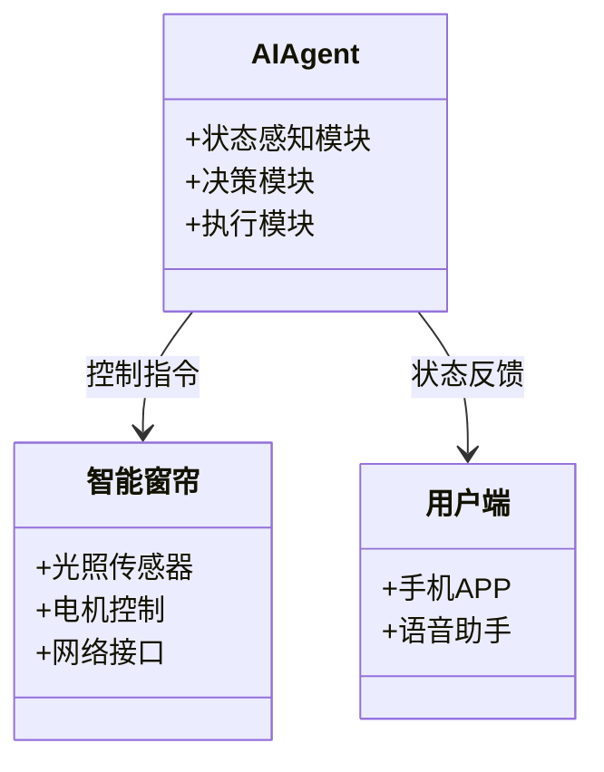
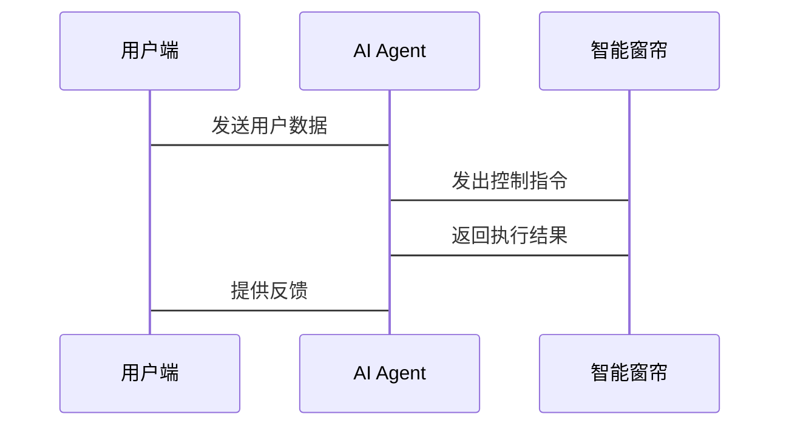

                 


```markdown
# AI Agent在智能窗帘中的昼夜节律调节

> 关键词：AI Agent，智能窗帘，昼夜节律，调节算法，系统架构

> 摘要：本文探讨AI Agent在智能窗帘中的应用，重点分析其如何通过调节昼夜节律改善用户体验。文章从背景、核心概念、算法原理、系统架构到项目实战，全面解析AI Agent在智能窗帘中的技术实现，旨在为技术读者提供深入的理论与实践指导。

---

# 第一部分: AI Agent与昼夜节律调节的背景介绍

## 第1章: 背景与问题背景

### 1.1 昼夜节律的重要性
- **1.1.1 昼夜节律的定义与生理意义**
  - 昼夜节律是由生物钟控制的生理周期，通常为24小时，影响人体的生理活动和行为模式。
  - 正常的昼夜节律对维持人体健康至关重要，有助于调节睡眠、情绪和认知功能。

- **1.1.2 昼夜节律紊乱对健康的影响**
  - 睡眠障碍：导致失眠、疲劳和注意力不集中。
  - 心理健康问题：增加抑郁和焦虑的风险。
  - 免疫系统功能下降：影响身体抵抗力。

- **1.1.3 智能窗帘在调节昼夜节律中的作用**
  - 通过调节光照强度和颜色，帮助用户维持或恢复正常的昼夜节律。
  - 智能窗帘可以根据用户的行为模式和环境光线自动调整，提供个性化的光照方案。

### 1.2 智能窗帘的现状
- **1.2.1 智能窗帘的基本功能**
  - 远程控制：通过手机APP或语音助手开关窗帘。
  - 自动调节：基于光照传感器和时间表自动开启或关闭。
  - 防隐私设计：避免外界窥视，保护用户隐私。

- **1.2.2 当前智能窗帘的技术瓶颈**
  - 缺乏智能化：大多数只能按照固定时间表运行，无法根据用户实时需求调整。
  - 传感器精度不足：光照传感器可能受环境因素干扰，影响准确性。
  - 用户体验差：复杂的设置和学习成本较高，限制了普及率。

- **1.2.3 用户需求与市场分析**
  - 健康意识提升：用户越来越关注健康，尤其是睡眠和情绪管理。
  - 智能家居普及：随着物联网技术的发展，用户期望更智能、更个性化的家居设备。
  - 市场潜力巨大：智能窗帘市场正在快速增长，AI技术的引入将进一步推动市场发展。

### 1.3 AI Agent的应用背景
- **1.3.1 AI Agent的定义与特点**
  - AI Agent是一种智能体，能够感知环境、执行任务并做出决策。
  - 具有自主性、反应性、目标导向和学习能力，能够适应复杂环境。

- **1.3.2 AI Agent在智能家居中的应用**
  - 家庭自动化：控制灯光、空调、窗帘等设备，优化居住环境。
  - 安全监控：通过AI Agent分析传感器数据，识别异常情况并采取措施。
  - 个性化服务：根据用户习惯提供定制化的家居体验。

- **1.3.3 AI Agent在昼夜节律调节中的潜力**
  - 实时感知环境：AI Agent可以监测光照、温度和声音等环境因素。
  - 用户行为分析：通过收集用户的作息习惯，预测需求并主动调节窗帘。
  - 个性化调节：根据用户的健康数据和偏好，提供精准的光照方案。

---

# 第二部分: AI Agent与昼夜节律调节的核心概念

## 第2章: 核心概念与原理

### 2.1 AI Agent的基本原理
- **2.1.1 AI Agent的定义与分类**
  - AI Agent可以分为简单反射型、基于模型的反应型、目标驱动型和实用驱动型。
  - 每种类型适用于不同的应用场景，AI Agent在智能窗帘中的应用属于目标驱动型。

- **2.1.2 AI Agent的核心算法**
  - 常见算法包括强化学习（如Q-learning）、遗传算法和神经网络。
  - 强化学习适合动态环境，能够通过试错优化策略。

- **2.1.3 AI Agent与传统算法的对比**
  - 传统算法如规则引擎基于固定的规则执行，缺乏灵活性。
  - AI Agent能够自适应环境，学习和优化策略，提供更智能的服务。

### 2.2 昼夜节律调节的原理
- **2.2.1 生物钟的基本机制**
  - 生物钟由大脑中的视交叉上核（SCN）控制，受光照、温度和饮食等因素影响。
  - 光线是调节生物钟的主要因素，尤其是蓝光对褪黑激素分泌的影响。

- **2.2.2 光照对昼夜节律的影响**
  - 白天适当暴露在自然光下有助于保持生物钟的正常运转。
  - 晚上减少蓝光暴露，避免干扰褪黑激素分泌，有助于入睡。

- **2.2.3 环境因素对昼夜节律的调节**
  - 环境光照、温度和声音等因素都会影响昼夜节律。
  - AI Agent可以根据这些因素动态调整窗帘的开合状态，优化光照条件。

### 2.3 AI Agent与昼夜节律调节的关系
- **2.3.1 AI Agent在昼夜节律调节中的角色**
  - AI Agent作为智能调节器，根据环境和用户需求调整窗帘状态。
  - 通过学习用户的作息习惯和偏好，提供个性化的调节方案。

- **2.3.2 昼夜节律调节对AI Agent的需求**
  - 需要实时感知环境和用户状态，动态调整策略。
  - 需要处理多模态数据，如光照、温度和用户行为数据。

- **2.3.3 AI Agent与昼夜节律调节的协同作用**
  - AI Agent通过调节光照环境，帮助用户维持或恢复正常的昼夜节律。
  - 昼夜节律调节为AI Agent提供反馈，优化其决策模型。

### 2.4 核心概念对比表
| 比较项            | AI Agent                          | 传统算法                            |
|-------------------|-----------------------------------|------------------------------------|
| 定义              | 具有感知、决策和执行能力的智能体  | 基于固定规则或模型的算法            |
| 特点              | 自适应、学习能力强                | 静态、固定规则                      |
| 优势              | 能够处理复杂和动态的环境          | 适用于规则明确、静态的场景          |
| 应用场景          | 智能家居、自动驾驶                | 流程自动化、数据处理                |

### 2.5 ER实体关系图
```mermaid
erd
    实体1: AI Agent
        属性: 状态、目标、环境感知
    实体2: 昼夜节律
        属性: 时间、光照强度、用户需求
    实体3: 智能窗帘
        属性: 窗帘状态、调节模式
    关系: AI Agent -> 昼夜节律 -> 智能窗帘
```

---

# 第三部分: AI Agent的算法原理

## 第3章: 算法原理与实现

### 3.1 强化学习算法的应用
- **3.1.1 算法选择**
  - 使用Q-learning算法，适合离散动作空间和有限状态的环境。
  - 通过奖励机制优化窗帘的开合策略。

- **3.1.2 算法流程**
  ```mermaid
  graph TD
      A[状态感知] --> B[决策]
      B --> C[选择动作]
      C --> D[执行动作]
      D --> E[获取奖励]
      E --> F[更新Q表]
      F --> A
  ```

- **3.1.3 算法实现代码**
  ```python
  import numpy as np
  import random

  # 状态和动作空间
  states = ['day', 'night']
  actions = ['open', 'close', 'half_open']

  # 初始化Q表
  Q = {s: {a: 0 for a in actions} for s in states}

  # 参数设置
  learning_rate = 0.1
  discount_factor = 0.9

  # 训练过程
  for _ in range(100):
      current_state = random.choice(states)
      current_action = random.choice(actions)
      next_state = random.choice(states)
      
      # 计算奖励
      if current_state == 'day' and current_action == 'open':
          reward = 1
      elif current_state == 'night' and current_action == 'close':
          reward = 1
      else:
          reward = -0.5
      
      # 更新Q表
      Q[current_state][current_action] += learning_rate * (reward + discount_factor * max(Q[next_state].values()) - Q[current_state][current_action])
  ```

### 3.2 数学模型与公式
- **状态转移方程**
  $$ Q(s, a) = Q(s, a) + \alpha (r + \gamma \max Q(s', a') - Q(s, a)) $$
  - 其中，$\alpha$是学习率，$\gamma$是折扣因子，$r$是奖励值。

- **奖励函数**
  - 当动作符合昼夜节律需求时，奖励为1。
  - 当动作不符合需求时，奖励为-0.5。

---

# 第四部分: 系统分析与架构设计

## 第4章: 系统分析与架构设计

### 4.1 问题场景介绍
- 用户需求：根据用户的作息时间、健康状况和环境光线，智能调节窗帘。
- 系统目标：实现AI Agent驱动的智能窗帘，优化用户的昼夜节律。

### 4.2 系统功能设计


### 4.3 系统架构设计


### 4.4 接口设计与交互流程
- **接口设计**
  - 用户端API：接收用户的作息时间和健康数据。
  - 智能窗帘API：控制窗帘的开合状态。
- **交互流程图**


---

# 第五部分: 项目实战与实现

## 第5章: 项目实战

### 5.1 环境安装与配置
- **安装Python和相关库**
  ```bash
  pip install numpy matplotlib scikit-learn
  ```

### 5.2 系统核心实现
```python
import numpy as np
from sklearn.neural_network import MLPClassifier

# 数据预处理
X = ...  # 特征数据
y = ...  # 标签数据

# 模型训练
model = MLPClassifier(hidden_layer_sizes=(100, 50), max_iter=1000)
model.fit(X, y)

# 模型预测
new_X = ...  # 新数据
predicted = model.predict(new_X)
```

### 5.3 实际案例分析
- **案例背景**
  - 用户A习惯早睡早起，但工作日晚上常熬夜，导致睡眠质量下降。
- **AI Agent调节**
  - 根据用户的作息习惯和光照数据，AI Agent调整窗帘在早晨提前开启，晚上延迟关闭，帮助用户建立规律的昼夜节律。

### 5.4 项目小结
- AI Agent通过学习用户行为和环境数据，能够智能调节窗帘，显著改善用户的昼夜节律和睡眠质量。
- 系统设计需要考虑多模态数据的融合和算法的实时性，确保调节策略的有效性和用户体验的舒适性。

---

# 第六部分: 最佳实践与总结

## 第6章: 最佳实践与总结

### 6.1 小结
- AI Agent在智能窗帘中的应用前景广阔，能够显著提升用户体验。
- 通过强化学习和神经网络等算法，系统能够动态调整窗帘状态，优化昼夜节律调节效果。

### 6.2 注意事项
- 数据隐私保护：确保用户数据的安全，避免泄露。
- 系统稳定性：确保AI Agent和智能窗帘的稳定运行，避免因系统故障影响用户体验。
- 用户教育：提高用户对AI Agent功能和优势的认知，促进产品的普及和应用。

### 6.3 拓展阅读
- 推荐阅读《强化学习实战》和《智能控制系统设计》，深入了解AI Agent和智能系统的设计与实现。

---

# 结语
通过本文的详细解析，读者可以全面了解AI Agent在智能窗帘中的昼夜节律调节应用，从背景、原理到实现，掌握核心技术和系统设计要点。希望本文能为相关领域的技术人员和研究者提供有价值的参考和启发。
```

