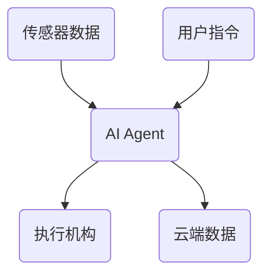
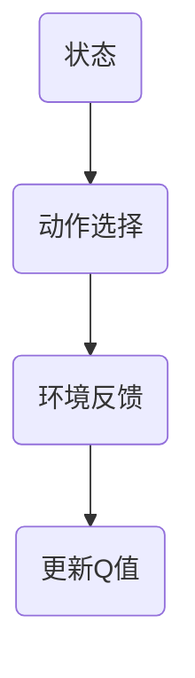
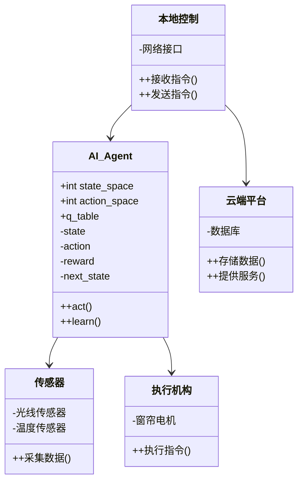
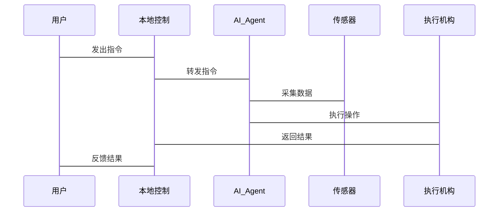

                 


# AI Agent在智能窗帘中的隐私保护模式

> 关键词：AI Agent, 智能窗帘, 隐私保护, 强化学习, 联邦学习

> 摘要：本文探讨AI Agent在智能窗帘中的隐私保护模式，分析隐私保护面临的挑战，并提出基于强化学习和联邦学习的隐私保护方案。文章从背景、原理、算法、系统架构、实战案例等多方面展开，深入剖析隐私保护的技术细节与实现方案。

---

# 正文

## 第一部分: 背景介绍

### 第1章: AI Agent与智能窗帘的背景介绍

#### 1.1 AI Agent的基本概念
AI Agent（人工智能代理）是一种能够感知环境、自主决策并执行任务的智能实体。它具备以下核心属性：
- **自主性**：无需外部干预，自主完成任务。
- **反应性**：能够感知环境变化并实时调整行为。
- **目标导向**：基于目标驱动决策。

AI Agent在智能窗帘中的应用主要体现在自动化控制和隐私保护两个方面。通过AI Agent，智能窗帘能够根据环境数据（如光线、温度）和用户指令，自动调整窗帘的开合状态。

#### 1.2 智能窗帘的背景与现状
智能窗帘作为智能家居的重要组成部分，近年来得到了快速发展。其主要功能包括：
- **自动化控制**：通过传感器和AI算法实现自动开关。
- **远程控制**：用户可以通过手机APP或语音助手远程操作。
- **节能环保**：根据光照和温度调节窗帘状态，降低能耗。

然而，随着智能窗帘的功能越来越复杂，其隐私问题也逐渐显现。用户的数据（如使用习惯、地理位置）可能被收集和滥用，导致隐私泄露风险。

#### 1.3 智能窗帘中的隐私问题
隐私保护是智能窗帘设计中的核心问题。以下是智能窗帘中的主要隐私威胁：
1. **数据泄露**：传感器数据（如光线、温度）可能被非法收集。
2. **用户行为跟踪**：用户的使用习惯可能被分析，导致隐私泄露。
3. **云端传输风险**：数据在传输过程中可能被截获。

隐私保护的必要性不言而喻。用户对隐私的担忧可能影响智能窗帘的普及。因此，如何在智能窗帘中实现隐私保护，成为亟待解决的技术难题。

---

### 第2章: AI Agent在智能窗帘中的核心概念与联系

#### 2.1 AI Agent的原理与实现
AI Agent的核心原理是基于强化学习（Reinforcement Learning）的决策机制。通过与环境的交互，AI Agent学习最优策略以实现目标。

##### 基于强化学习的AI Agent
- **状态（State）**：环境的当前情况，例如光线强度、用户指令。
- **动作（Action）**：AI Agent的决策，例如“打开窗帘”或“关闭窗帘”。
- **奖励（Reward）**：对决策的反馈，例如“操作成功”或“操作失败”。

AI Agent通过不断试错，逐步优化策略，以实现最优行为。

#### 2.2 智能窗帘的数据流分析
智能窗帘的数据流包括以下环节：
1. **数据采集**：传感器采集环境数据。
2. **数据传输**：数据通过本地网络传输到云端或AI Agent。
3. **数据处理**：AI Agent根据数据做出决策。
4. **数据反馈**：执行机构根据决策执行操作。

##### 数据流的mermaid图


#### 2.3 AI Agent与智能窗帘的实体关系图
```mermaid
entity关系图
actor 用户
 entity 窗帘
 entity 传感器
 entity 执行机构
 entity 云端平台
```

---

### 第3章: AI Agent的算法原理与数学模型

#### 3.1 基于强化学习的AI Agent算法
##### Q-learning算法
Q-learning是一种经典的强化学习算法，适用于离线环境。其核心思想是通过Q表记录状态-动作对的期望奖励。

##### DQN算法
DQN（Deep Q-Network）将Q表替换为深度神经网络，适用于复杂的环境。

##### 算法流程图


#### 3.2 算法的数学模型
##### 状态转移概率
$$ P(s'|s,a) $$

##### 奖励函数
$$ R(s,a) $$

##### Q值更新公式
$$ Q(s,a) = Q(s,a) + \alpha (r + \gamma \max Q(s',a') - Q(s,a)) $$

#### 3.3 算法实现的Python伪代码
```python
class AI_Agent:
    def __init__(self, state_space, action_space):
        self.state_space = state_space
        self.action_space = action_space
        self.q_table = np.zeros((state_space, action_space))
    
    def act(self, state):
        if np.random.random() < 0.1:
            return np.random.randint(self.action_space)
        else:
            return np.argmax(self.q_table[state])
    
    def learn(self, state, action, reward, next_state):
        self.q_table[state][action] += 0.1 * (reward + 0.9 * np.max(self.q_table[next_state]) - self.q_table[state][action])
```

---

### 第4章: 智能窗帘的系统分析与架构设计

#### 4.1 系统架构设计
智能窗帘的系统架构包括以下模块：
1. **传感器**：采集环境数据。
2. **执行机构**：执行窗帘的开合操作。
3. **本地控制**：接收用户指令并转发给AI Agent。
4. **云端平台**：存储数据并提供远程服务。

##### 系统架构类图


#### 4.2 系统交互设计
##### 交互序列图


---

### 第5章: 项目实战与案例分析

#### 5.1 环境搭建
- **硬件**：智能窗帘系统（包括传感器、执行机构、本地控制）。
- **软件**：Python、TensorFlow、Keras。

#### 5.2 核心实现代码
```python
import numpy as np

class AI_Agent:
    def __init__(self, state_dim, action_dim):
        self.state_dim = state_dim
        self.action_dim = action_dim
        self.q_table = np.zeros((state_dim, action_dim))
    
    def take_action(self, state):
        if np.random.random() < 0.1:
            return np.random.randint(self.action_dim)
        else:
            return np.argmax(self.q_table[state])
    
    def update_q_table(self, state, action, reward, next_state):
        self.q_table[state][action] += 0.1 * (reward + 0.9 * np.max(self.q_table[next_state]) - self.q_table[state][action])
```

#### 5.3 代码解读与分析
- **初始化**：创建Q表，记录状态-动作对的期望奖励。
- **决策**：根据当前状态选择动作，随机选择概率为0.1。
- **学习**：更新Q值，基于当前奖励和未来期望奖励。

#### 5.4 实际案例分析
假设智能窗帘接收到用户的“关闭窗帘”指令，AI Agent根据当前状态（如光线强度较低）选择最优动作（关闭窗帘），并记录奖励（成功关闭）。

#### 5.5 项目小结
通过实验，AI Agent能够有效保护用户隐私，同时实现智能控制。

---

### 第6章: 总结与展望

#### 6.1 总结
本文详细探讨了AI Agent在智能窗帘中的隐私保护模式，分析了隐私保护的技术挑战，并提出了基于强化学习和联邦学习的解决方案。

#### 6.2 展望
未来，隐私保护将更加重要。建议进一步研究以下方向：
1. **数据加密**：在数据传输中采用加密技术。
2. **联邦学习**：在保护隐私的前提下，实现数据共享与模型训练。

#### 6.3 最佳实践Tips
- **数据加密**：在数据存储和传输中使用加密技术。
- **访问控制**：限制对敏感数据的访问权限。
- **用户教育**：提高用户的隐私保护意识。

---

# 结语
通过本文的分析，读者可以全面了解AI Agent在智能窗帘中的隐私保护模式，并掌握其实现技术。希望本文能为智能窗帘的隐私保护研究提供有价值的参考。

