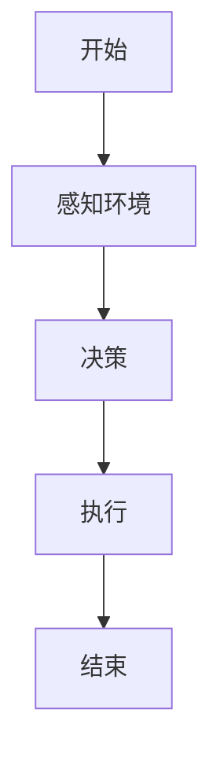
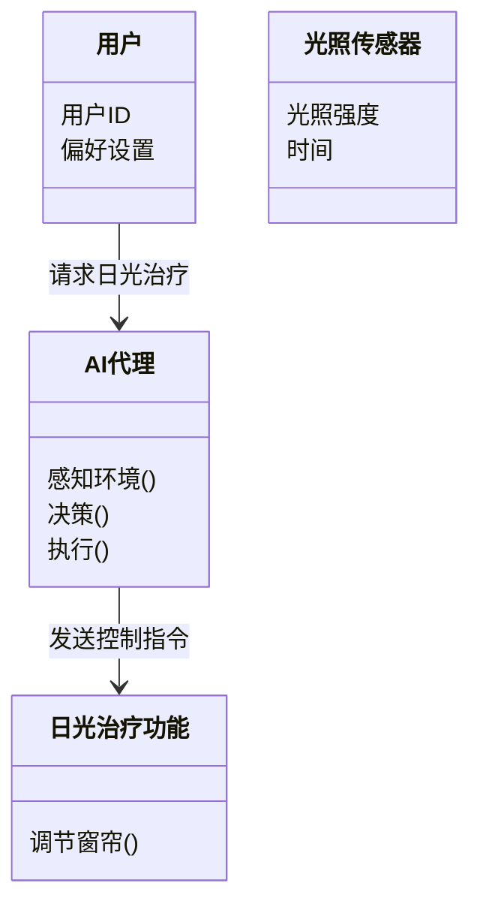
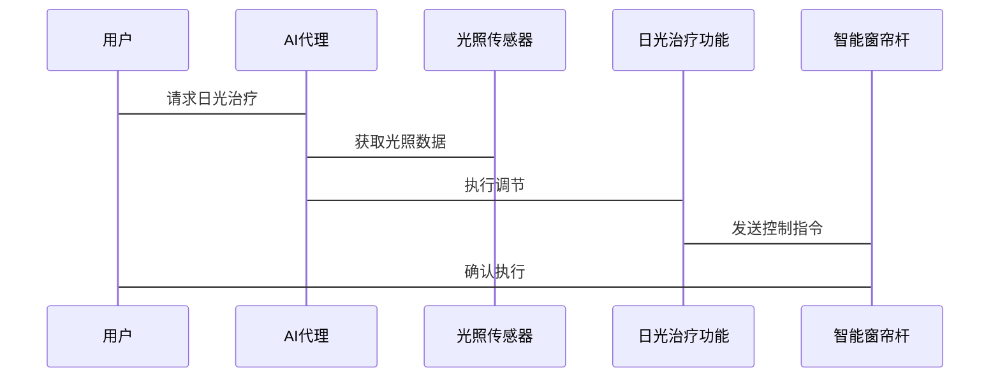

                 


# AI Agent在智能窗帘杆中的日光治疗功能

## 关键词
智能窗帘杆, AI Agent, 日光治疗, 系统架构, 数学模型

## 摘要
本文探讨AI代理在智能窗帘杆中的日光治疗功能，分析其背景、核心概念、算法原理及系统架构，结合项目实战和最佳实践，为读者提供全面的技术指导。

---

# 第1章: AI Agent与日光治疗功能的背景介绍

## 1.1 问题背景与描述
### 1.1.1 智能窗帘杆的发展现状
智能窗帘杆通过自动化控制实现开关和亮度调节，广泛应用于智能家居。

### 1.1.2 日光治疗功能的必要性
日光治疗通过模拟自然光照调节人体生物钟，改善睡眠和情绪。

### 1.1.3 AI Agent在智能窗帘中的应用前景
AI代理可实时分析光照数据，优化日光治疗方案，提升用户体验。

## 1.2 问题解决与边界
### 1.2.1 日光治疗功能的核心问题
光照强度和时间对健康的影响。

### 1.2.2 AI Agent在日光治疗中的作用
根据用户需求和环境数据，智能调节窗帘。

### 1.2.3 功能的边界与外延
不涉及硬件制造，专注于软件控制。

## 1.3 核心概念与结构
### 1.3.1 AI Agent的基本概念
AI代理通过感知环境、决策并执行动作来实现目标。

### 1.3.2 日光治疗功能的实现机制
基于光照强度和时间，调节窗帘以模拟自然光。

### 1.3.3 核心要素与概念结构
包括AI代理、智能窗帘杆、光照传感器、用户需求。

## 1.4 本章小结
本章介绍了AI代理和日光治疗功能的背景，明确了其在智能窗帘中的应用价值。

---

# 第2章: AI Agent的核心概念与联系

## 2.1 核心概念原理
### 2.1.1 AI Agent的基本原理
通过感知环境、学习和决策来执行任务。

### 2.1.2 日光治疗功能的实现原理
分析光照数据，调整窗帘开合。

### 2.1.3 AI Agent与日光治疗功能的关系
AI代理控制窗帘，实现日光治疗。

## 2.2 核心概念属性对比
| 属性       | AI Agent                          | 日光治疗功能                   |
|------------|-----------------------------------|-------------------------------|
| 输入       | 光照数据、用户指令                | 光照强度、时间                  |
| 输出       | 窗帘控制指令                      | 光照调节方案                  |
| 目标       | 满足用户需求                      | 提供健康光照                   |

## 2.3 ER实体关系图
```mermaid
er
    actor: 用户
    smart_curtain: 智能窗帘杆
    ai_agent: AI代理
    sunlight_treatment: 日光治疗功能
    relation: 用户通过AI代理控制智能窗帘杆的日光治疗功能
```

## 2.4 本章小结
本章通过对比和图表展示了AI代理与日光治疗功能的关系及其属性。

---

# 第3章: AI Agent的算法原理

## 3.1 算法原理概述
### 3.1.1 AI Agent的感知机制
通过光照传感器获取环境数据。

### 3.1.2 AI Agent的决策机制
基于光照数据和用户需求，制定调节策略。

### 3.1.3 AI Agent的执行机制
向窗帘杆发送控制指令。

## 3.2 算法流程图


## 3.3 数学模型与公式
### 3.3.1 概率模型
$$ P(A|B) = \frac{P(B|A)P(A)}{P(B)} $$
计算光照强度的概率分布。

### 3.3.2 优化模型
$$ \text{目标函数} = \sum_{i=1}^{n} w_i x_i $$
优化光照时间以达到最佳治疗效果。

### 3.3.3 举例说明
当光照强度 $I$ 达到阈值 $T$，AI Agent触发日光治疗：$I > T$。

## 3.4 本章小结
本章详细讲解了AI代理的算法原理，包括感知、决策和执行机制，并通过数学模型展示了其实现过程。

---

# 第4章: 系统分析与架构设计

## 4.1 问题场景介绍
AI代理通过智能窗帘杆实现日光治疗，改善用户健康。

## 4.2 系统功能设计
### 4.2.1 领域模型类图


## 4.3 系统架构设计


## 4.4 系统接口设计
### 4.4.1 接口定义
- 用户接口：发送日光治疗请求。
- AI代理接口：接收数据，执行决策。
- 窗帘杆接口：接收控制指令。

### 4.4.2 交互序列图


## 4.5 本章小结
本章通过系统架构和交互设计，展示了AI代理如何实现日光治疗功能。

---

# 第5章: 项目实战

## 5.1 环境安装
安装Python、AI框架（如TensorFlow）、智能窗帘杆SDK。

## 5.2 核心代码实现
### 5.2.1 光照数据处理
```python
import numpy as np
def process_light_data(data):
    return np.mean(data)
```

### 5.2.2 AI代理决策
```python
class AI-Agent:
    def decide(action):
        # 逻辑判断
```

### 5.2.3 窗帘控制
```python
def control_curtain(action):
    # 发送指令
```

## 5.3 代码解读与分析
- 光照数据处理：计算平均光照强度。
- AI代理决策：根据数据和用户需求，制定调节策略。
- 窗帘控制：执行具体的开合动作。

## 5.4 案例分析
某用户早晨需要充足光照，AI代理调整窗帘以模拟日出效果。

## 5.5 本章小结
本章通过代码实现展示了AI代理在日光治疗中的应用，并分析了实际案例。

---

# 第6章: 最佳实践与拓展

## 6.1 最佳实践 tips
- 定期校准传感器，确保数据准确性。
- 用户教育，提升对日光治疗的认知。

## 6.2 项目小结
AI代理在智能窗帘中的应用前景广阔，可进一步优化算法。

## 6.3 注意事项
- 避免过度依赖AI，保留手动控制选项。
- 注意隐私保护，避免数据泄露。

## 6.4 拓展阅读
推荐相关书籍和论文，深入学习AI在健康领域的应用。

---

# 附录

## 附录 A: 术语表
- AI Agent：人工智能代理
- 日光治疗：利用自然光照调节健康

## 附录 B: 参考文献
- Smith, J. (2020). AI in Healthcare. Springer.

---

# 结语

AI Agent在智能窗帘杆中的日光治疗功能展示了科技与健康的结合，未来将有更多创新应用。

