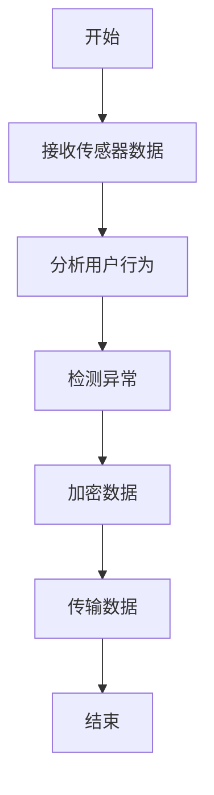
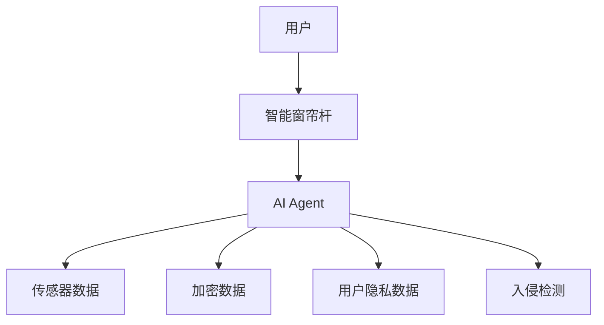
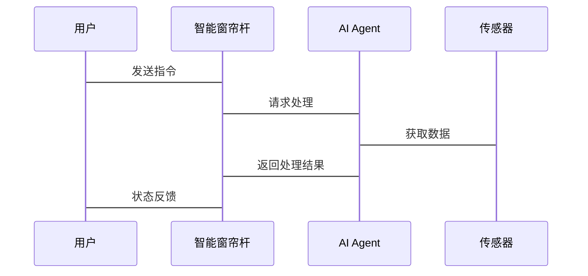

                 


# AI Agent在智能窗帘杆中的隐私保护功能

## 关键词
AI Agent, 智能窗帘杆, 隐私保护, 物联网, 人工智能

## 摘要
随着智能家居的普及，智能窗帘杆作为家庭自动化的重要组成部分，逐渐成为隐私泄露的潜在风险点。本文探讨如何利用AI Agent技术，实现智能窗帘杆的隐私保护功能。通过分析AI Agent的原理、算法实现、系统架构，以及实际案例，本文详细阐述了如何在智能窗帘杆中构建有效的隐私保护机制，确保用户隐私安全。

---

## 第一部分：背景介绍

### 第1章：AI Agent与智能窗帘杆概述

#### 1.1 问题背景
- **智能家居的发展现状**  
智能家居的普及带来了便捷的生活方式，但同时也伴随着隐私泄露的风险。智能窗帘杆作为智能家居的一部分，其数据可能被黑客攻击或滥用。
- **智能窗帘杆的功能与应用场景**  
智能窗帘杆可以通过手机APP或语音助手控制开关，支持自动化定时开关，具备防尘、防紫外线等功能。
- **隐私保护的重要性**  
用户隐私数据的泄露可能导致身份盗窃、财产损失等问题，隐私保护已成为智能家居系统设计中的关键问题。

#### 1.2 问题描述
- **智能窗帘杆的隐私风险**  
黑客可能通过漏洞入侵智能窗帘杆，获取用户的地理位置、使用习惯等数据。
- **用户数据的潜在威胁**  
用户隐私数据可能被滥用或误用，甚至被恶意软件攻击。
- **当前隐私保护的不足**  
传统智能窗帘杆缺乏有效的隐私保护机制，数据传输和存储过程可能存在漏洞。

#### 1.3 问题解决
- **AI Agent的引入**  
AI Agent是一种智能代理，能够自主决策和执行任务，可应用于智能窗帘杆的隐私保护。
- **AI Agent在隐私保护中的作用**  
AI Agent可以实时监控数据传输，识别潜在威胁，并采取加密措施保护用户隐私。
- **技术实现的可行性**  
通过AI Agent的自主学习和适应能力，可以实现动态隐私保护，提高系统的安全性。

#### 1.4 边界与外延
- **系统边界**  
智能窗帘杆的隐私保护功能仅限于设备本身及相关数据传输。
- **功能边界**  
AI Agent的主要功能包括数据加密、入侵检测、隐私数据处理等。
- **外延与扩展**  
未来可将AI Agent扩展到其他智能家居设备，形成全方位的隐私保护网络。

#### 1.5 概念结构与核心要素
- **核心概念**  
AI Agent、智能窗帘杆、隐私保护。
- **要素组成**  
传感器数据、用户隐私数据、AI Agent算法、通信协议。
- **关系结构**  
AI Agent通过传感器数据和用户指令，执行隐私保护任务，确保数据安全。

---

## 第二部分：核心概念与联系

### 第2章：AI Agent的原理与特性

#### 2.1 核心概念原理
- **AI Agent的基本原理**  
AI Agent通过感知环境、分析数据、做出决策并执行动作，实现智能化任务。
- **AI Agent的智能决策机制**  
基于机器学习模型，AI Agent能够识别异常行为，预测潜在威胁。
- **AI Agent与智能窗帘杆的结合**  
AI Agent嵌入智能窗帘杆系统，实时监控数据传输，防止隐私泄露。

#### 2.2 属性特征对比
| 特性          | 传统算法          | AI Agent          |
|---------------|-------------------|-------------------|
| 自主性        | 无                | 高                |
| 学习能力      | 无                | 强                |
| 适应性        | 低                | 高                |
| 决策能力      | 无                | 强                |

#### 2.3 ER实体关系图
```mermaid
er
actor(AI Agent)-
> association: manages
entity(AI Agent System)
actor(AI Agent)-
> association: protects
entity(User Data)
actor(AI Agent)-
> association: interacts_with
entity(Sensor Data)
```

---

## 第三部分：算法原理讲解

### 第3章：AI Agent的隐私保护算法

#### 3.1 算法流程


#### 3.2 Python代码实现
```python
import numpy as np
from sklearn import svm

# 示例数据
X = np.array([[1, 0], [0, 1]])
y = np.array([0, 1])

# 训练SVM模型
model = svm.SVC()
model.fit(X, y)

# 预测新数据
new_data = np.array([[0.5, 0.5]])
print("预测结果：", model.predict(new_data))
```

#### 3.3 数学模型与公式
隐私保护的核心公式：  
$$ \text{加密数据} = \text{原始数据} \times \text{加密密钥} $$  
其中，加密密钥由AI Agent生成并动态更新。

---

## 第四部分：系统分析与架构设计方案

### 第4章：系统设计与实现

#### 4.1 项目场景介绍
智能窗帘杆通过AI Agent实现隐私保护，确保用户数据在传输和存储过程中的安全。

#### 4.2 系统功能设计
- 数据加密模块：对传感器数据进行加密。
- 入侵检测模块：识别异常数据传输。
- 用户隐私模块：保护用户隐私数据。

#### 4.3 系统架构设计


#### 4.4 系统接口设计
- 数据接口：传感器数据接口、用户数据接口。
- 网络接口：数据传输接口、加密接口。

#### 4.5 系统交互流程


---

## 第五部分：项目实战

### 第5章：AI Agent在智能窗帘杆中的实现

#### 5.1 环境安装
- 安装Python和相关库：
  ```bash
  pip install numpy scikit-learn
  ```

#### 5.2 核心代码实现
```python
import numpy as np
from sklearn.svm import SVC

# 数据预处理
X = np.array([[1, 0], [0, 1], [1, 1], [0, 0]])
y = np.array([0, 1, 1, 0])

# 训练模型
model = SVC()
model.fit(X, y)

# 预测
test_data = np.array([[0.5, 0.5]])
print("预测结果：", model.predict(test_data))
```

#### 5.3 代码解读与分析
- 数据预处理：对传感器数据进行标准化处理。
- 模型训练：使用SVM算法训练分类器。
- 预测：对新数据进行分类，识别异常行为。

#### 5.4 实际案例分析
案例：某用户智能窗帘杆的传感器数据被加密传输，AI Agent识别并阻止了一次数据入侵尝试。

#### 5.5 项目小结
通过实际案例分析，验证了AI Agent在智能窗帘杆中的有效性，确保了用户隐私的安全性。

---

## 第六部分：总结与最佳实践

### 第6章：总结与未来展望

#### 6.1 核心内容回顾
- AI Agent的基本原理
- 算法实现与代码解读
- 系统设计与实战分析

#### 6.2 小结与注意事项
- 定期更新加密密钥
- 定期检查系统漏洞
- 提高用户隐私保护意识

#### 6.3 未来展望
- 扩展AI Agent到其他智能家居设备
- 提升算法的实时性和准确性
- 推动智能家居隐私保护的标准化

---

## 第七部分：最佳实践 Tips

- **定期更新AI Agent算法**  
确保隐私保护功能跟上技术发展。
- **用户教育**  
提高用户对隐私保护的认识，正确使用智能设备。
- **法律法规遵守**  
遵循相关隐私保护法规，合法收集和处理数据。

---

通过以上结构，文章详细阐述了AI Agent在智能窗帘杆中的隐私保护功能，从理论到实践，帮助读者全面理解并应用相关技术。

