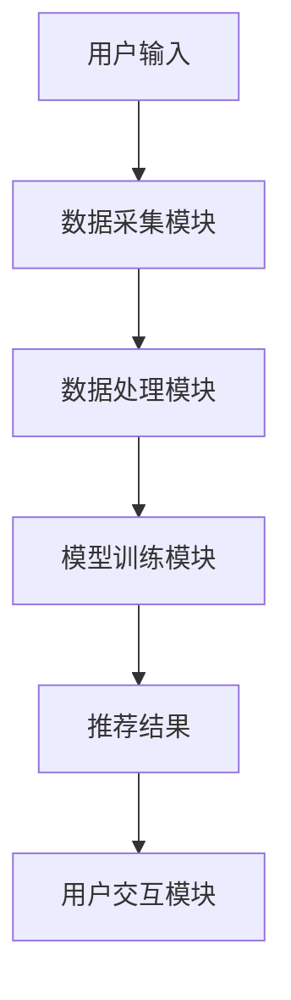

                 


# AI Agent在智能衣架中的穿搭灵感生成器

## 关键词：AI Agent, 智能衣架, 穿搭灵感, 生成器, 人工智能

## 摘要：  
本文深入探讨了AI Agent在智能衣架中的应用，特别是如何通过穿搭灵感生成器为用户提供个性化的穿搭建议。文章从AI Agent的基本概念出发，逐步分析其在智能衣架中的具体应用场景，详细讲解了穿搭灵感生成器的核心算法原理、系统架构设计以及实际项目实现。通过理论与实践相结合的方式，本文为读者提供了全面的技术视角，帮助他们理解AI Agent如何赋能智能衣架，提升用户的穿搭体验。

---

# 第一部分: AI Agent在智能衣架中的穿搭灵感生成器概述

## 第1章: AI Agent与智能衣架概述

### 1.1 AI Agent的基本概念
#### 1.1.1 什么是AI Agent
AI Agent（人工智能代理）是一种能够感知环境、做出决策并执行任务的智能实体。它通过传感器获取信息，利用算法处理数据，并通过执行器与环境互动。AI Agent的核心目标是通过自动化和智能化的方式解决实际问题。

#### 1.1.2 AI Agent的核心特征
- **自主性**：能够在没有外部干预的情况下独立运行。
- **反应性**：能够根据环境变化实时调整行为。
- **目标导向**：通过设定目标来指导决策和行动。
- **学习能力**：能够通过数据和经验不断优化自身的算法。

#### 1.1.3 AI Agent在智能衣架中的应用背景
智能衣架通过AI Agent技术，能够实时感知用户的穿着需求、环境条件（如天气、场合）以及服装搭配规则，从而为用户提供个性化的穿搭建议。AI Agent在这一过程中充当了用户的“智能助手”，帮助用户优化穿衣方案。

---

## 第2章: 智能衣架与穿搭灵感生成器

### 2.1 智能衣架的功能与特点
智能衣架是一种结合了物联网（IoT）和人工智能技术的服装管理与推荐系统。它通过传感器和AI算法，能够实时监测用户的穿衣习惯、服装库存以及环境信息，并通过智能推荐为用户提供最优的穿搭建议。

#### 2.1.1 数据采集与存储
智能衣架通过以下方式采集数据：
- **用户输入**：用户的穿衣记录、偏好设置。
- **环境传感器**：天气、温度、湿度等环境数据。
- **图像识别**：通过摄像头识别用户的穿着和服装款式。

#### 2.1.2 服装搭配规则
智能衣架内置了丰富的服装搭配规则，包括：
- **颜色搭配规则**：如色轮理论。
- **材质搭配规则**：如适合不同场合的材质组合。
- **风格搭配规则**：如休闲风格、商务风格等。

#### 2.1.3 用户界面与交互
智能衣架通过手机APP或智能镜像设备与用户交互，提供实时的穿搭建议和个性化推荐。

### 2.2 穿搭灵感生成器的定义与目标
穿搭灵感生成器是智能衣架的核心功能模块，它通过AI算法为用户提供创新的穿搭方案。其目标是基于用户的穿衣习惯、库存情况和环境条件，生成多样化的搭配建议，帮助用户提升穿衣品味和效率。

#### 2.2.1 搭配建议生成
- **个性化推荐**：基于用户的穿衣记录和偏好，推荐符合个人风格的搭配方案。
- **场景化推荐**：根据当前环境（如天气、场合）推荐适合的服装组合。
- **创新推荐**：通过AI算法生成用户未曾尝试过的搭配方案。

#### 2.2.2 生成器的核心优势
- **实时性**：能够根据实时环境和用户需求快速生成搭配建议。
- **个性化**：基于用户数据提供定制化推荐。
- **创新性**：通过AI算法探索新的搭配组合。

---

# 第二部分: 穿搭灵感生成器的核心概念与技术

## 第3章: AI Agent的核心概念与原理

### 3.1 AI Agent的核心概念
AI Agent在穿搭灵感生成器中的作用是通过感知用户需求、分析服装搭配规则，并生成最优的搭配建议。

#### 3.1.1 感知层
感知层负责采集用户需求和环境信息，包括：
- **用户数据**：用户的穿衣记录、偏好设置。
- **环境数据**：天气、场合等信息。
- **服装数据**：库存信息、服装属性（如颜色、材质、风格）。

#### 3.1.2 决策层
决策层负责分析数据并生成搭配建议，主要依赖以下技术：
- **规则引擎**：基于服装搭配规则生成初步建议。
- **机器学习模型**：通过深度学习算法优化推荐结果。
- **推理引擎**：结合用户需求和环境信息进行推理。

#### 3.1.3 执行层
执行层负责将搭配建议呈现给用户，包括：
- **推荐展示**：通过APP或镜像设备展示推荐结果。
- **反馈收集**：收集用户的反馈信息，用于优化算法。

### 3.2 AI Agent的原理与流程
AI Agent在穿搭灵感生成器中的工作流程如下：
1. **数据采集**：获取用户需求、环境信息和服装库存。
2. **数据处理**：对采集到的数据进行清洗和特征提取。
3. **搭配规则匹配**：基于规则引擎生成初步的搭配建议。
4. **模型优化**：通过机器学习算法优化推荐结果。
5. **结果生成**：将优化后的搭配建议呈现给用户。
6. **反馈优化**：收集用户反馈，不断优化模型。

---

## 第4章: 穿搭灵感生成器的算法原理

### 4.1 算法原理概述
穿搭灵感生成器的核心算法是基于机器学习的推荐系统，结合规则引擎和推理引擎实现搭配建议的生成。

#### 4.1.1 数据预处理
- **特征提取**：从用户数据、环境数据和服装数据中提取关键特征。
- **数据清洗**：去除噪声数据，确保数据质量。

#### 4.1.2 模型训练
- **特征工程**：构建适合模型输入的特征向量。
- **模型选择**：选择适合任务的机器学习模型（如协同过滤、深度学习模型）。
- **训练优化**：通过交叉验证和超参数优化提升模型性能。

#### 4.1.3 推荐生成
- **规则匹配**：基于服装搭配规则生成初步建议。
- **模型预测**：利用机器学习模型生成个性化推荐。
- **结果融合**：结合规则和模型输出生成最终推荐。

### 4.2 算法实现与代码示例

#### 4.2.1 环境安装
```bash
pip install numpy scikit-learn matplotlib
```

#### 4.2.2 核心代码实现
```python
import numpy as np
from sklearn.metrics.pairwise import cosine_similarity

# 示例数据：用户需求与服装属性
user_input = np.array([1, 0, 1, 1])  # 示例用户特征向量
# 服装属性矩阵（每行代表一件服装的特征向量）
clothing_features = np.array([
    [1, 1, 0, 0],
    [0, 1, 1, 0],
    [1, 0, 1, 0],
    [0, 0, 1, 1]
])

# 计算余弦相似度
similarity_matrix = cosine_similarity(user_input.reshape(1, -1), clothing_features)
# 找出最相似的服装
best_match = np.argmax(similarity_matrix)

print(f"推荐的服装索引：{best_match}")
```

#### 4.2.3 算法优化与解释
上述代码通过余弦相似度计算用户的特征向量与服装属性之间的相似度，从而生成推荐结果。在实际应用中，可以通过引入更复杂的模型（如深度学习模型）来提升推荐的准确性和创新性。

---

## 第5章: 系统架构设计与实现

### 5.1 系统架构概述
智能衣架的穿搭灵感生成器系统架构包括以下几个部分：
- **数据采集模块**：负责采集用户数据和环境数据。
- **数据处理模块**：对数据进行清洗和特征提取。
- **模型训练模块**：训练机器学习模型并生成推荐结果。
- **用户交互模块**：通过APP或镜像设备与用户交互。

#### 5.1.1 系统架构图


#### 5.1.2 系统功能设计
- **数据采集**：通过传感器和用户输入获取数据。
- **数据处理**：清洗和特征提取。
- **模型训练**：基于机器学习算法生成推荐结果。
- **用户交互**：展示推荐结果并收集反馈。

---

## 第6章: 项目实战与案例分析

### 6.1 项目实战
#### 6.1.1 环境安装
```bash
pip install numpy scikit-learn pandas
```

#### 6.1.2 核心代码实现
```python
import pandas as pd
from sklearn.cluster import KMeans

# 示例数据：用户需求与服装属性
data = pd.DataFrame({
    '用户ID': [1, 2, 3],
    '颜色偏好': [1, 2, 3],
    '材质偏好': [2, 1, 1],
    '风格偏好': [3, 2, 1]
})

# 数据预处理
X = data[['颜色偏好', '材质偏好', '风格偏好']]
model = KMeans(n_clusters=3)
model.fit(X)

# 预测聚类结果
data['推荐结果'] = model.predict(X)
print(data)
```

#### 6.1.3 案例分析
通过上述代码，我们可以将用户按照穿衣风格进行聚类，从而生成个性化的搭配建议。例如，用户ID=1的用户被聚类到第0组，推荐结果为0，表示其穿衣风格与该组用户的特征相符。

---

## 第7章: 最佳实践与小结

### 7.1 最佳实践
- **数据质量**：确保数据的准确性和完整性。
- **模型优化**：通过交叉验证和超参数优化提升模型性能。
- **用户体验**：设计直观的用户界面，确保用户能够轻松理解和使用推荐结果。

### 7.2 小结
本文详细探讨了AI Agent在智能衣架中的应用，特别是穿搭灵感生成器的核心算法和系统架构。通过理论与实践相结合的方式，本文为读者提供了全面的技术视角，帮助他们理解如何通过AI技术提升用户的穿衣体验。

---

# 结语

AI Agent在智能衣架中的应用前景广阔，随着技术的不断进步，未来的穿搭灵感生成器将更加智能化和个性化，为用户提供更加精准和创新的穿搭建议。

