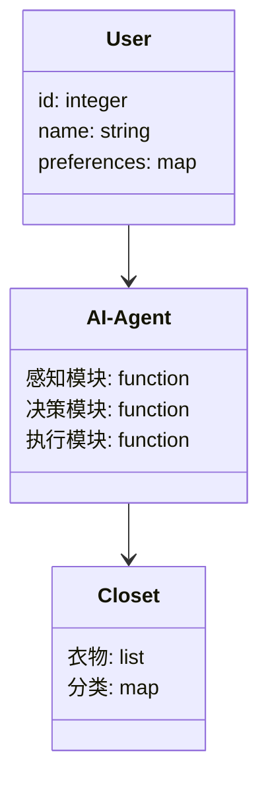

                 


```markdown
# AI Agent在智能衣柜中的季节性整理建议

> 关键词：AI Agent, 智能衣柜, 季节性整理, 衣柜管理, 人工智能

> 摘要：本文探讨了AI Agent在智能衣柜中的应用，重点分析了季节性整理的实现方法，包括感知、决策和执行模块，详细讲解了基于规则的推理和机器学习的推荐算法，结合系统架构设计和项目实战案例，展示了AI Agent如何提升衣柜管理效率。

---

## 第1章 AI Agent与智能衣柜概述

### 1.1 AI Agent的基本概念
- **1.1.1 什么是AI Agent**
  AI Agent（人工智能代理）是一种能够感知环境并采取行动以实现目标的智能体。在智能衣柜中，AI Agent负责收集数据、分析信息并提供整理建议。

- **1.1.2 AI Agent的核心特征**
  - 感知能力：通过传感器或API获取环境数据。
  - 决策能力：基于数据进行推理和决策。
  - 执行能力：通过用户交互或自动化设备执行操作。

- **1.1.3 AI Agent在智能衣柜中的应用**
  - 自动分类衣物。
  - 根据天气推荐穿搭。
  - 跟踪衣物使用情况。

### 1.2 智能衣柜的背景与现状
- **1.2.1 衣柜管理的传统方式**
  传统衣柜管理依赖人工分类和记忆，效率低下且容易出错。

- **1.2.2 智能衣柜的发展趋势**
  随着智能家居的发展，智能衣柜通过AI技术实现自动化管理。

- **1.2.3 季节性整理的需求分析**
  季节变化导致衣物需求变化，用户需要智能衣柜帮助整理和推荐衣物。

### 1.3 季节性整理的核心问题
- **1.3.1 衣物分类的挑战**
  衣物种类繁多，分类标准多样，需要高效的分类方法。

- **1.3.2 季节变化对衣柜管理的影响**
  不同季节需要不同的衣物组合，AI Agent需实时调整建议。

- **1.3.3 AI Agent如何解决这些问题**
  AI Agent通过机器学习算法分析历史数据，预测需求，优化整理策略。

## 第2章 AI Agent的核心概念与联系

### 2.1 AI Agent的核心原理
- **2.1.1 感知模块**
  - 通过传感器或外部API获取天气数据。
  - 示例：获取当前天气情况，判断是否需要换季衣物。

- **2.1.2 决策模块**
  - 基于规则的推理：制定简单的分类规则，如“气温低于5℃时推荐羽绒服”。
  - 机器学习的推荐：使用协同过滤算法预测用户偏好。

- **2.1.3 执行模块**
  - 通过用户交互确认建议。
  - 与智能家居设备联动，自动整理衣物。

### 2.2 实体关系分析
- **2.2.1 ER实体关系图**
  ```mermaid
  graph TD
      User-->AI-Agent
      AI-Agent-->Closet
      Closet-->Clothing
  ```

- **2.2.2 流程图分析**
  ```mermaid
  graph TD
      User->AI-Agent: 提供数据
      AI-Agent->Weather-API: 获取天气信息
      Weather-API->AI-Agent: 返回天气数据
      AI-Agent->Closet: 分析衣物
      Closet->AI-Agent: 提供衣物信息
      AI-Agent->User: 提供整理建议
  ```

## 第3章 算法原理讲解

### 3.1 基于规则的推理算法
- **算法步骤**
  1. 获取当前天气数据。
  2. 根据预设规则分类衣物。

- **代码示例**
  ```python
  def get_weather():
      import requests
      response = requests.get("http://api.weather.com/current")
      return response.json()

  def categorize_clothes(temperature):
      if temperature < 5:
          return "winter_clothes"
      elif temperature < 20:
          return "fall_clothes"
      else:
          return "summer_clothes"
  ```

### 3.2 机器学习的推荐算法
- **协同过滤算法**
  ```mermaid
  graph TD
      User-->AI-Agent: 用户数据
      AI-Agent->Database: 查询历史数据
      Database->AI-Agent: 返回相似用户的偏好
      AI-Agent->User: 提供推荐
  ```

- **数学模型**
  $$ P(i,j) = \frac{\sum_{k=1}^n sim(i,k) \times rat(j,k)}{\sum_{k=1}^n sim(i,k)} $$
  其中，$sim(i,k)$是用户i和k的相似度，$rat(j,k)$是用户k对物品j的评分。

## 第4章 系统分析与架构设计

### 4.1 系统工作场景
- **场景描述**
  用户登录系统，AI Agent分析天气和历史数据，生成整理建议。

### 4.2 领域模型


### 4.3 系统架构设计
- **分层架构**
  ```mermaid
  graph TD
      User-->Web-Interface
      Web-Interface->AI-Agent: 传递请求
      AI-Agent->Data-Collector: 获取数据
      Data-Collector->Database: 存储数据
      AI-Agent->Executor: 执行操作
  ```

### 4.4 接口设计
- **RESTful API**
  - 获取天气数据：`GET /api/weather`

## 第5章 项目实战

### 5.1 环境安装
- 安装Python和相关库：`pip install requests numpy`

### 5.2 核心代码实现
- 数据采集
  ```python
  import requests

  def fetch_weather_data():
      response = requests.get("http://api.weather.com")
      return response.json()
  ```

- 数据处理
  ```python
  from sklearn.cluster import KMeans

  def cluster_clothes(data):
      model = KMeans(n_clusters=3)
      model.fit(data)
      return model.labels_
  ```

### 5.3 案例分析
- **案例：用户A的衣柜整理**
  AI Agent分析用户的历史数据，推荐夏季衣物，整理步骤包括分类、建议和执行。

### 5.4 项目小结
- 通过实际案例展示AI Agent在衣柜管理中的应用。
- 强调代码实现的关键点，如数据预处理和模型选择。

## 第6章 最佳实践与总结

### 6.1 应用中的注意事项
- **数据隐私**：确保用户数据安全。
- **算法优化**：定期更新模型以适应用户需求变化。
- **用户体验**：设计友好的交互界面。

### 6.2 未来发展
- 预测AI Agent在衣柜管理中的进一步应用，如与物联网设备的深度集成。

### 6.3 小结
- 总结AI Agent在智能衣柜中的重要性。
- 鼓励读者进一步探索和实践。

---

# 结语

通过本文的详细讲解，读者可以全面了解AI Agent在智能衣柜中的应用，从基本概念到算法实现，再到系统设计和项目实战，为衣柜管理带来了新的可能性。希望本文能为相关领域的研究者和开发者提供有价值的参考。
```

