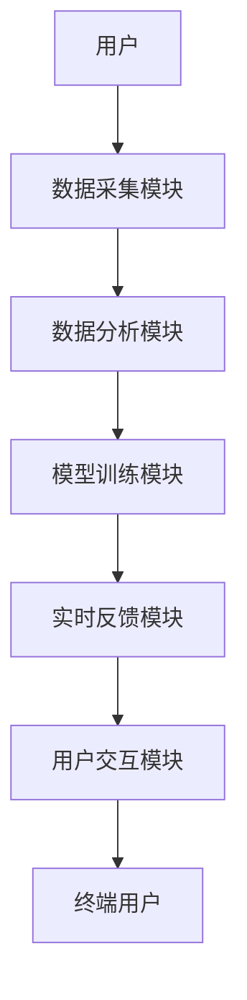

                 


# AI Agent在智能跑步鞋中的步态矫正指导

> **关键词**：AI Agent, 步态矫正, 智能跑步鞋, 运动科学, 数据驱动

> **摘要**：本文探讨AI Agent在智能跑步鞋中的应用，重点分析其在步态矫正中的原理、算法实现和系统设计。通过数据驱动的方法，AI Agent能够实时分析跑步者的步态特征，提供个性化的矫正建议，帮助提升跑步效率和预防运动损伤。文章详细介绍了AI Agent的核心算法、系统架构和实际案例，展示了其在智能跑步鞋中的巨大潜力。

---

## 正文

### 第1章: AI Agent与智能跑步鞋概述

#### 1.1 AI Agent的基本概念
AI Agent（人工智能代理）是一种能够感知环境、做出决策并执行任务的智能系统。它具备以下核心特点：
- **自主性**：能够在没有外部干预的情况下独立运作。
- **反应性**：能够实时感知环境并做出响应。
- **学习能力**：通过数据和反馈不断优化自身行为。

AI Agent与传统算法（如规则引擎）的区别在于其具备动态适应能力和自我优化能力。它能够根据实时数据调整策略，而不仅仅是基于预定义规则执行任务。

#### 1.2 智能跑步鞋的技术背景
智能跑步鞋是一种结合了传感器技术和人工智能的运动装备。它通过内置的传感器（如加速度计、陀螺仪、压力传感器等）收集跑步者的步态数据，并通过AI算法分析这些数据，提供个性化的反馈和建议。

智能跑步鞋的核心功能包括：
- **步态分析**：实时监测跑步者的步频、步长、步幅、姿态等关键指标。
- **个性化矫正建议**：根据步态特征提供针对性的矫正方案。
- **运动数据分析**：提供跑步效率、能量消耗等数据的详细报告。

#### 1.3 步态矫正的背景与意义
步态矫正是指通过调整跑步姿势、步伐节奏和力量分配，以减少运动损伤并提升跑步效率的过程。不良的步态（如过度内翻、外翻、步频过快或过慢等）可能导致跑步者受伤或降低跑步表现。

AI Agent在步态矫正中的作用主要体现在以下几个方面：
- **实时反馈**：通过传感器和AI算法，实时监测跑步者的步态特征，并提供即时反馈。
- **个性化建议**：根据个人的步态数据，提供定制化的矫正方案。
- **数据驱动优化**：通过长期的数据积累和分析，不断优化矫正策略。

### 第2章: AI Agent与步态矫正的核心概念

#### 2.1 AI Agent在步态矫正中的原理
AI Agent通过以下步骤实现步态矫正：
1. **数据采集**：通过传感器获取跑步者的步态数据，包括步频、步长、步幅、姿态等。
2. **数据预处理**：对采集的数据进行清洗、归一化和特征提取。
3. **模型训练**：使用机器学习算法（如强化学习、监督学习）训练步态矫正模型。
4. **实时分析**：根据实时数据，模型预测当前步态的健康程度，并提出矫正建议。
5. **反馈与优化**：根据用户反馈调整模型参数，持续优化矫正策略。

#### 2.2 步态矫正的核心概念与联系
为了更好地理解AI Agent在步态矫正中的作用，我们需要明确几个关键概念：
- **步态特征**：包括步频、步长、步幅、姿态等。
- **步态健康指数**：通过数据模型评估步态的健康程度。
- **矫正策略**：根据步态健康指数提出的矫正建议。

通过对比传统步态分析算法和AI Agent的步态矫正算法，可以发现AI Agent的优势在于其动态适应能力和个性化能力。

### 第3章: AI Agent的算法原理与实现

#### 3.1 AI Agent的核心算法
AI Agent的核心算法是强化学习（Reinforcement Learning）。通过强化学习，AI Agent能够在复杂的环境中做出最优决策。以下是强化学习的基本原理：

1. **环境与动作空间**：AI Agent需要与环境（如跑步者的步态数据）互动，并选择一个动作（如调整步频、步长等）。
2. **状态与奖励函数**：环境的状态决定了AI Agent的反馈，奖励函数用于评估动作的好坏。
3. **策略优化**：通过不断尝试和反馈，优化策略以最大化奖励。

#### 3.2 强化学习算法的实现
以下是强化学习算法的Python代码示例：

```python
import numpy as np
import gym

# 初始化环境
env = gym.make('CartPole-v1')
env.seed(1)

# 初始化策略参数
theta = np.random.randn(4, 1) / np.sqrt(4)

# 强化学习算法实现
def policy(x, theta):
    return np.tanh(np.dot(theta.T, x))

# 训练过程
for episode in range(1000):
    state = env.reset()
    total_reward = 0
    for step in range(200):
        action = np.argmax(policy(state, theta))
        state, reward, done, info = env.step(action)
        total_reward += reward
        if done:
            break
    # 更新策略参数（此处省略具体优化方法）
    pass

print(f"平均奖励：{total_reward / episode}")
```

### 第4章: 系统分析与架构设计

#### 4.1 系统功能设计
以下是步态矫正系统的功能模块：

1. **数据采集模块**：通过传感器采集跑步者的步态数据。
2. **数据分析模块**：对数据进行预处理和特征提取。
3. **模型训练模块**：使用机器学习算法训练步态矫正模型。
4. **实时反馈模块**：根据实时数据提供矫正建议。
5. **用户交互模块**：通过界面或语音与用户互动。

#### 4.2 系统架构设计
以下是系统架构的Mermaid图：



### 第5章: 项目实战与案例分析

#### 5.1 项目实战
以下是AI Agent步态矫正系统的Python代码示例：

```python
import numpy as np
import gym

# 初始化环境
env = gym.make('CartPole-v1')
env.seed(1)

# 初始化策略参数
theta = np.random.randn(4, 1) / np.sqrt(4)

# 强化学习算法实现
def policy(x, theta):
    return np.tanh(np.dot(theta.T, x))

# 训练过程
for episode in range(1000):
    state = env.reset()
    total_reward = 0
    for step in range(200):
        action = np.argmax(policy(state, theta))
        state, reward, done, info = env.step(action)
        total_reward += reward
        if done:
            break
    # 更新策略参数（此处省略具体优化方法）
    pass

print(f"平均奖励：{total_reward / episode}")
```

### 第6章: 总结与展望

#### 6.1 总结
AI Agent在智能跑步鞋中的步态矫正应用展示了人工智能技术在运动科学领域的巨大潜力。通过实时数据采集和智能算法分析，AI Agent能够提供个性化的矫正建议，帮助跑步者提升效率和减少损伤。

#### 6.2 展望
未来，随着AI技术的不断发展，智能跑步鞋的功能将更加智能化和个性化。AI Agent将不仅能够矫正步态，还能够预测运动损伤、优化训练计划，并与其他智能设备协同工作，为跑步者提供更加全面的服务。

---

**注意事项**：
- 本文中涉及的代码和算法仅为示例，实际应用中需要根据具体需求进行调整和优化。
- 数据隐私和安全问题需要注意，特别是在处理用户的健康数据时。
- AI Agent的优化需要结合实际应用场景和用户反馈不断改进。

**拓展阅读**：
- 《强化学习入门：基于Python的实现》
- 《人工智能在运动科学中的应用》

