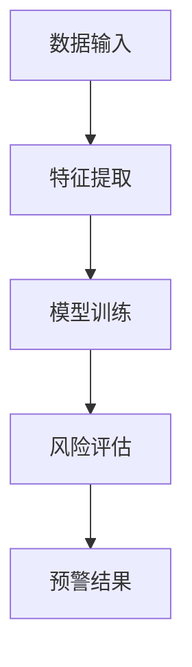
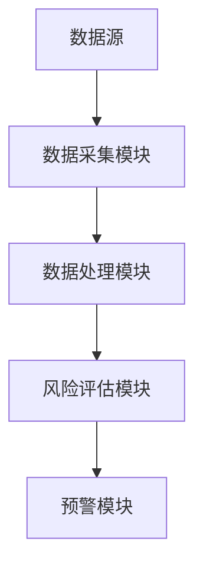
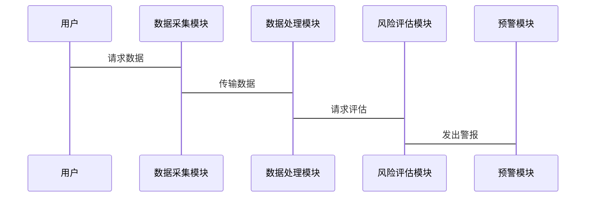

                 


# AI Agent在智能金融风险预警中的应用

> 关键词：AI Agent, 金融风险预警, 机器学习, 强化学习, 实时性, 准确性, 成本降低

> 摘要：本文详细探讨了AI Agent在智能金融风险预警中的应用，从基本概念、核心原理到算法实现，再到系统架构设计和实际项目案例，全面分析了AI Agent如何提升金融风险预警的效率和准确性。

---

## 第1章 AI Agent与金融风险预警概述

### 1.1 AI Agent的基本概念

AI Agent（人工智能代理）是指能够感知环境、自主决策并执行任务的智能体。AI Agent的核心特征包括自主性、反应性、目标导向性和社交能力。在金融领域，AI Agent可以用于实时数据分析、风险评估和决策支持。

### 1.2 金融风险预警的基本概念

金融风险预警是指通过分析金融市场中的各种数据，预测潜在风险并提前发出警报。金融风险的主要类型包括市场风险、信用风险和操作风险。金融风险预警的目的是通过及时发现和应对潜在风险，降低损失。

### 1.3 AI Agent在金融风险预警中的应用价值

AI Agent在金融风险预警中的应用价值主要体现在以下几点：
1. **提高风险预警的准确性**：AI Agent可以通过机器学习算法分析海量数据，发现潜在风险。
2. **提升风险预警的实时性**：AI Agent可以实时监控市场数据，快速响应风险变化。
3. **降低风险预警的成本**：AI Agent可以通过自动化分析减少人工干预，降低成本。

### 1.4 本章小结

本章介绍了AI Agent和金融风险预警的基本概念，并分析了AI Agent在金融风险预警中的应用价值，为后续章节奠定了基础。

---

## 第2章 AI Agent与金融风险预警的核心概念

### 2.1 AI Agent的工作原理

AI Agent的工作原理包括以下步骤：
1. **知识表示**：通过数据结构表示知识。
2. **感知与推理**：通过传感器或数据源获取信息，并进行推理。
3. **决策与执行**：基于推理结果做出决策，并执行相应的操作。

### 2.2 金融风险预警的关键要素

金融风险预警的关键要素包括：
1. **数据来源**：市场数据、财务数据、新闻数据等。
2. **风险评估模型**：用于评估风险的数学模型。
3. **预警阈值**：用于判断风险是否超出正常范围的临界值。

### 2.3 AI Agent与金融风险预警的结合

AI Agent与金融风险预警的结合主要体现在以下几个方面：
1. **数据流的处理流程**：AI Agent可以实时处理和分析金融市场数据。
2. **智能决策机制**：AI Agent可以通过强化学习优化决策策略。
3. **预警结果的反馈机制**：AI Agent可以根据反馈结果不断优化模型。

### 2.4 核心概念对比分析

#### 2.4.1 AI Agent与传统算法的对比

| 特性         | AI Agent                     | 传统算法                   |
|--------------|------------------------------|-----------------------------|
| 自主性       | 高                           | 低                         |
| 实时性       | 高                           | 一般                       |
| 可扩展性     | 高                           | 一般                       |

#### 2.4.2 金融风险预警与传统预警的对比

| 特性         | 金融风险预警                 | 传统预警                   |
|--------------|------------------------------|-----------------------------|
| 数据来源     | 多样化                       | 单一                       |
| 处理速度     | 实时                        | 周期性                     |
| 准确性       | 高                           | 一般                       |

### 2.5 本章小结

本章详细讲解了AI Agent与金融风险预警的核心概念，并通过对比分析展示了AI Agent的优势。

---

## 第3章 AI Agent在金融风险预警中的算法原理

### 3.1 基于机器学习的金融风险预警算法

#### 3.1.1 线性回归模型

线性回归模型用于预测金融市场的趋势，其数学模型为：
$$ y = \beta_0 + \beta_1x + \epsilon $$

其中，$y$是预测值，$x$是自变量，$\beta_0$和$\beta_1$是模型参数，$\epsilon$是误差项。

#### 3.1.2 支持向量机（SVM）

SVM用于分类问题，其目标是找到一个超平面，使得数据点被正确分类。SVM的数学模型为：
$$ y = \text{sign}(w \cdot x + b) $$

其中，$w$是权重向量，$x$是输入向量，$b$是偏置项。

#### 3.1.3 随机森林（Random Forest）

随机森林是一种集成学习算法，通过构建多个决策树并进行投票来提高准确性。

### 3.2 基于强化学习的AI Agent算法

#### 3.2.1 Q-Learning算法

Q-Learning是一种基于值的强化学习算法，其目标是找到最优策略。其数学模型为：
$$ Q(s, a) = Q(s, a) + \alpha (r + \gamma \max Q(s', a') - Q(s, a)) $$

其中，$s$是当前状态，$a$是动作，$\alpha$是学习率，$\gamma$是折扣因子，$s'$是下一个状态。

#### 3.2.2 Deep Q-Networks（DQN）

DQN是一种基于深度学习的强化学习算法，其核心是通过神经网络近似Q值函数。

#### 3.2.3 Policy Gradient方法

Policy Gradient方法是一种基于策略的强化学习算法，其目标是优化策略函数。其数学模型为：
$$ \theta = \theta + \alpha \nabla_\theta J(\theta) $$

其中，$\theta$是模型参数，$\alpha$是学习率，$\nabla_\theta J(\theta)$是梯度。

### 3.3 算法流程图



### 3.4 算法实现代码示例

```python
import numpy as np
from sklearn.ensemble import RandomForestClassifier

# 示例数据
X = np.array([[1, 2], [3, 4], [5, 6]])
y = np.array([0, 1, 0])

# 训练模型
model = RandomForestClassifier()
model.fit(X, y)

# 预测结果
new_X = np.array([[2, 3]])
print(model.predict(new_X))
```

---

## 第4章 系统分析与架构设计方案

### 4.1 问题场景介绍

金融风险预警系统需要实时监控市场数据，分析潜在风险，并及时发出警报。

### 4.2 系统功能设计

系统功能设计包括：
1. 数据采集模块：采集市场数据。
2. 数据处理模块：清洗和转换数据。
3. 风险评估模块：分析数据并评估风险。
4. 预警模块：发出风险警报。

### 4.3 系统架构设计



### 4.4 系统接口设计

系统接口设计包括：
1. 数据输入接口：接收市场数据。
2. 数据输出接口：输出风险评估结果。

### 4.5 系统交互序列图



---

## 第5章 项目实战

### 5.1 环境安装

安装Python和相关库：
```bash
pip install numpy scikit-learn matplotlib
```

### 5.2 系统核心实现源代码

```python
import numpy as np
from sklearn.ensemble import RandomForestClassifier
import matplotlib.pyplot as plt

# 示例数据
X = np.array([[1, 2], [3, 4], [5, 6]])
y = np.array([0, 1, 0])

# 训练模型
model = RandomForestClassifier()
model.fit(X, y)

# 可视化
plt.scatter(X[:, 0], X[:, 1], c=y)
plt.show()
```

### 5.3 代码应用解读与分析

上述代码展示了如何使用随机森林算法训练模型，并通过可视化工具展示数据分布。

### 5.4 实际案例分析

以股票市场为例，分析某只股票的风险等级，并发出预警。

### 5.5 项目小结

本章通过实际项目案例展示了AI Agent在金融风险预警中的应用，帮助读者更好地理解理论知识。

---

## 第6章 总结

### 6.1 小结

本文详细探讨了AI Agent在智能金融风险预警中的应用，从基本概念到算法实现，再到系统架构设计和实际项目案例，全面分析了AI Agent的优势。

### 6.2 注意事项

1. 数据来源的可靠性。
2. 模型的可解释性。
3. 系统的实时性。

### 6.3 未来趋势

随着AI技术的发展，AI Agent在金融风险预警中的应用将更加广泛和深入。

### 6.4 拓展阅读

推荐阅读《机器学习实战》和《强化学习入门》等书籍。

---

## 附录

### 附录A 术语表

- AI Agent：人工智能代理。
- 金融风险预警：预测金融市场风险的预警系统。

### 附录B 工具安装指南

安装Python和相关库：
```bash
pip install numpy scikit-learn matplotlib
```

### 附录C 参考文献

1. 周志华. 《机器学习实战》.
2. DeepMind. "Deep Q-Networks."

---

以上是《AI Agent在智能金融风险预警中的应用》的完整目录大纲和文章内容，希望对您有所帮助！

