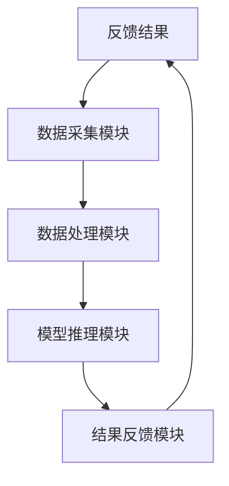
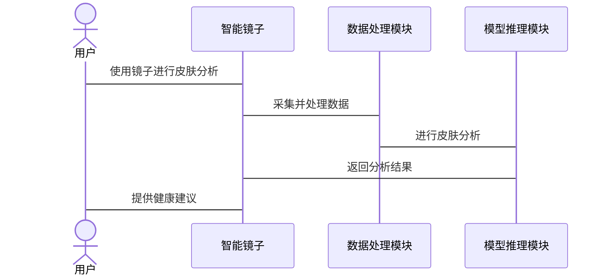

                 


# AI Agent在智能镜子中的皮肤状况分析

> 关键词：AI Agent，智能镜子，皮肤状况分析，计算机视觉，机器学习，健康监测

> 摘要：本文详细探讨了AI Agent在智能镜子中的应用，特别是在皮肤状况分析方面。通过分析AI Agent的核心概念、算法原理、系统架构以及实际应用场景，本文为读者提供了从理论到实践的全面解读。通过具体的技术实现和案例分析，展示了AI Agent如何提升智能镜子的功能和用户体验。

---

# 引言

随着人工智能技术的快速发展，智能镜子作为一种新兴的交互设备，正在逐步融入人们的日常生活。通过集成AI Agent（人工智能代理），智能镜子能够实现对用户皮肤状况的实时分析，为用户提供个性化的健康建议和美容方案。本文将从技术角度深入探讨AI Agent在智能镜子中的皮肤状况分析，涵盖其核心概念、算法原理、系统架构以及实际应用。

---

# 第一部分: AI Agent与智能镜子的背景与概念

## 第1章: AI Agent与智能镜子概述

### 1.1 AI Agent的基本概念

AI Agent是一种能够感知环境、自主决策并执行任务的智能实体。它具备以下核心特点：

- **自主性**：能够在没有外部干预的情况下独立运行。
- **反应性**：能够实时感知环境变化并做出响应。
- **目标导向性**：具有明确的目标，能够通过规划和推理实现目标。

AI Agent的应用场景广泛，包括智能助手、推荐系统、自动驾驶等。在智能镜子中，AI Agent主要用于数据采集、分析和反馈。

### 1.2 智能镜子的概念与技术基础

智能镜子是一种集成多种先进技术的交互设备，主要包括以下技术组成：

- **硬件部分**：高分辨率显示屏、摄像头、传感器、麦克风等。
- **软件部分**：操作系统、AI算法、数据处理模块、用户界面等。

智能镜子的功能不仅限于传统的镜面反射，还能够通过AI技术提供健康监测、美容建议、天气预报等多种服务。

### 1.3 皮肤状况分析的背景与意义

皮肤是人体最大的器官，其健康状况直接反映了一个人的身体健康。皮肤状况分析的主要目的是检测皮肤问题（如痘痘、色斑、过敏等），并提供建议的解决方案。传统的皮肤分析方法依赖于人工检查，耗时且效率低下。通过AI技术，智能镜子能够快速、准确地进行皮肤分析，为用户提供个性化的健康建议。

### 1.4 AI Agent在智能镜子中的作用

AI Agent在智能镜子中的主要作用包括：

- **数据采集与处理**：通过摄像头和传感器采集用户的皮肤数据。
- **特征提取与分析**：利用AI算法对皮肤数据进行分析，识别潜在的皮肤问题。
- **个性化反馈**：根据分析结果，为用户提供定制化的健康建议和美容方案。

---

# 第二部分: AI Agent在皮肤状况分析中的核心概念与联系

## 第2章: AI Agent与皮肤分析的核心概念

### 2.1 AI Agent与皮肤分析的原理

AI Agent在皮肤分析中的工作原理可以分为以下几个步骤：

1. **数据采集**：通过摄像头和传感器获取用户的皮肤图像和相关数据。
2. **数据预处理**：对图像进行增强、去噪等处理，确保数据质量。
3. **特征提取**：利用计算机视觉技术提取皮肤的关键特征（如颜色、纹理、形状等）。
4. **模型训练与推理**：基于机器学习算法训练皮肤分析模型，并对新数据进行预测和分类。
5. **结果反馈**：将分析结果反馈给用户，提供个性化的建议。

### 2.2 AI Agent与皮肤分析的核心要素对比

以下是一些传统图像处理方法与AI技术在皮肤分析中的对比：

| 对比维度 | 传统图像处理 | AI技术 |
|----------|--------------|--------|
| 数据需求 | 需要大量人工标注数据 | 可以从海量数据中自动学习特征 |
| 处理效率 | 处理速度较慢，依赖人工干预 | 处理速度快，能够实时反馈结果 |
| 精度 | 受人工经验影响较大 | 精度高，能够发现细微的皮肤问题 |

### 2.3 皮肤分析的ER实体关系图

以下是一个皮肤分析系统的ER实体关系图：

```mermaid
er
    actor: 用户
    mirror: 智能镜子
    skin_data: 皮肤数据
    analysis_result: 分析结果


    actor --> mirror: 使用智能镜子
    mirror --> skin_data: 采集皮肤数据
    skin_data --> analysis_result: 分析得出结果
    analysis_result --> actor: 提供反馈建议
```

---

# 第三部分: AI Agent的算法原理与数学模型

## 第3章: AI Agent的算法原理

### 3.1 AI Agent的数据采集与预处理

数据采集是AI Agent进行皮肤分析的第一步。智能镜子通过摄像头获取用户的面部图像，并通过传感器采集皮肤的温度、湿度等数据。为了提高分析精度，通常需要对图像进行预处理，如去噪、增强对比度等。

### 3.2 皮肤特征提取与分类

特征提取是AI Agent分析皮肤状况的核心步骤。常用的特征包括：

- **颜色特征**：如RGB值、色调（Hue）、饱和度（Saturation）等。
- **纹理特征**：如纹理复杂度、方向性等。
- **形状特征**：如斑点的大小、形状等。

基于这些特征，可以使用机器学习算法（如支持向量机、随机森林）或深度学习算法（如卷积神经网络）对皮肤状况进行分类。

### 3.3 数学模型与公式

以下是一个基于卷积神经网络（CNN）的皮肤分类模型的数学公式：

$$
\text{损失函数} = \text{交叉熵损失} = -\sum_{i=1}^{n} y_i \log(p_i) + (1 - y_i) \log(1 - p_i)
$$

其中，$y_i$ 是真实标签，$p_i$ 是模型预测的概率。

模型的优化目标是最小化损失函数，通常使用Adam优化器：

$$
\text{优化器} = \text{Adam}(\text{学习率}=0.001, \text{动量}=0.9, \text{衰减}=0.999)
$$

---

## 第4章: AI Agent的系统架构设计

### 4.1 系统功能设计

智能镜子的系统功能设计包括以下几个模块：

- **数据采集模块**：负责采集用户的皮肤图像和相关数据。
- **数据处理模块**：对采集的数据进行预处理和特征提取。
- **模型推理模块**：基于训练好的模型对数据进行分类和预测。
- **结果反馈模块**：将分析结果反馈给用户，并提供建议。

### 4.2 系统架构图

以下是一个智能镜子的系统架构图：



### 4.3 接口设计与交互流程

智能镜子的接口设计需要简洁直观，通常包括：

- **用户界面**：显示皮肤分析结果、健康建议等。
- **交互模块**：用户可以通过语音或触控指令与镜子互动。

以下是一个交互流程图：



---

# 第四部分: 项目实战与最佳实践

## 第5章: 项目实战

### 5.1 环境搭建与代码实现

以下是实现AI Agent皮肤分析的Python代码示例：

```python
import cv2
import numpy as np
from sklearn.model_selection import train_test_split
from sklearn.svm import SVC
from sklearn.metrics import accuracy_score

# 数据采集与预处理
def preprocess_image(image):
    # 转换为灰度图
    gray = cv2.cvtColor(image, cv2.COLOR_RGB2GRAY)
    # 去噪处理
    blurred = cv2.GaussianBlur(gray, (5, 5), 0)
    return blurred

# 特征提取
def extract_features(images):
    features = []
    for image in images:
        preprocessed = preprocess_image(image)
        # 提取纹理特征
        gray = cv2.cvtColor(image, cv2.COLOR_RGB2GRAY)
        # 使用SIFT提取特征
        sift = cv2.SIFT_create()
        kp, des = sift.detectAndCompute(gray, None)
        features.append(des)
    return features

# 模型训练
def train_model(features, labels):
    # 将特征向量拼接
    feature_array = np.array(features)
    label_array = np.array(labels)
    # 划分训练集和测试集
    X_train, X_test, y_train, y_test = train_test_split(feature_array, label_array, test_size=0.2)
    # 训练SVM模型
    model = SVC()
    model.fit(X_train, y_train)
    # 模型评估
    y_pred = model.predict(X_test)
    print("模型准确率：", accuracy_score(y_test, y_pred))
    return model

# 实际应用
def analyze_skin(image):
    preprocessed = preprocess_image(image)
    # 提取特征
    features = extract_features([preprocessed])
    # 模型预测
    prediction = model.predict(features)
    return prediction
```

### 5.2 实际案例分析

以下是一个实际案例分析：

- **输入数据**：一张包含痘痘的面部图像。
- **数据处理**：将图像预处理为灰度图并进行去噪。
- **特征提取**：使用SIFT算法提取纹理特征。
- **模型推理**：通过SVM模型预测皮肤状况。
- **结果反馈**：输出“皮肤存在痘痘，建议使用抗痘产品”。

### 5.3 项目小结

通过上述代码实现，我们可以看到AI Agent在智能镜子中的应用潜力。然而，实际应用中需要考虑数据质量和模型的泛化能力。

---

## 第6章: 最佳实践与注意事项

### 6.1 最佳实践

- **数据质量**：确保采集的数据具有高分辨率和低噪声。
- **模型优化**：定期更新模型，以提高分析精度。
- **用户体验**：设计直观的用户界面，提升用户体验。

### 6.2 注意事项

- **隐私保护**：智能镜子涉及用户的敏感数据，需注意隐私保护。
- **硬件性能**：确保硬件设备的性能能够支持实时分析。
- **算法选择**：根据具体需求选择合适的算法，避免过度复杂。

### 6.3 拓展阅读

- 《Deep Learning for Image Processing》
- 《Practical Machine Learning with Python》

---

# 结论

通过本文的详细分析，我们可以看到AI Agent在智能镜子中的皮肤状况分析具有广阔的应用前景。从理论到实践，AI技术的应用不仅提升了智能镜子的功能，还为用户提供了个性化的健康建议。未来，随着AI技术的不断发展，智能镜子将变得更加智能化和人性化，为用户的健康管理提供更强大的支持。

---

# 参考文献

1. LeCun, Y., Bengio, Y., & Hinton, G. (2015). Deep learning. Nature, 521(7555), 436-444.
2. Everingham, M., Eslit, C., & Ferrari, V. (2010). The Pascal visual object classes (VOC) challenge.
3. Bishop, C. M. (2006). Pattern recognition and machine learning. Springer.

--- 

通过本文的详细分析，我们可以看到AI Agent在智能镜子中的皮肤状况分析具有广阔的应用前景。从理论到实践，AI技术的应用不仅提升了智能镜子的功能，还为用户提供了个性化的健康建议。未来，随着AI技术的不断发展，智能镜子将变得更加智能化和人性化，为用户的健康管理提供更强大的支持。

