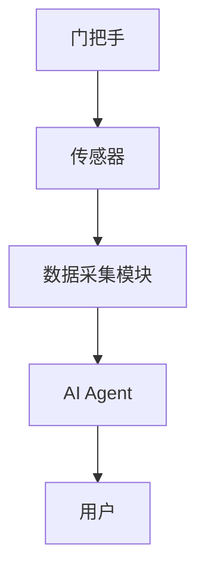
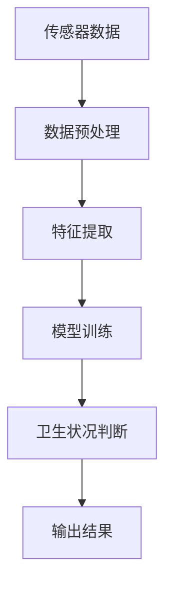
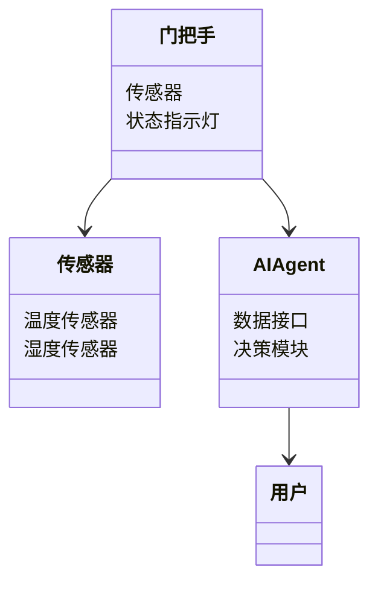
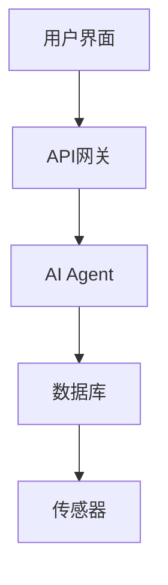
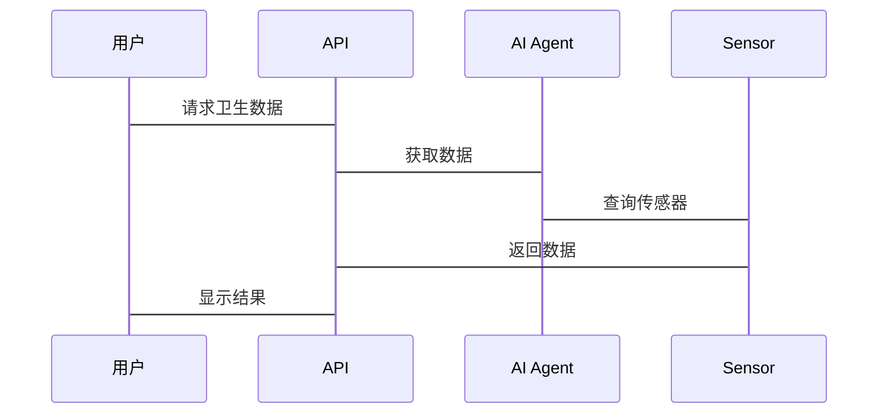

                 


# AI Agent在智能门把手中卫生状况监测

> 关键词：AI Agent, 智能门把手, 卫生监测, 物联网, 人工智能

> 摘要：本文探讨AI Agent在智能门把手中卫生状况监测的应用，分析其技术原理、系统设计及实际案例，展示如何通过AI技术提升公共卫生管理。

---

## 第1章: 背景介绍

### 1.1 问题背景

#### 1.1.1 公共卫生与门把手卫生的重要性
门把手作为高频接触点，是传播疾病的主要途径之一。特别是在医院、学校和办公楼等公共场所，门把手的卫生状况直接关系到公共健康。

#### 1.1.2 疫情防控中的门把手卫生问题
疫情爆发后，门把手的清洁频率和效果成为公众关注的焦点。传统的人工清洁和监测方法效率低下，难以实时掌握卫生状况。

#### 1.1.3 传统门把手卫生监测的局限性
传统方法依赖人工检查，存在时间滞后、数据不准确等问题，无法满足实时监测的需求。

### 1.2 问题描述

#### 1.2.1 门把手卫生监测的核心问题
如何实时、准确地监测门把手的卫生状况，及时提醒清洁人员进行处理。

#### 1.2.2 用户需求与痛点分析
用户需要实时了解门把手的卫生情况，清洁人员需要及时的清洁提醒，管理者需要数据支持决策。

#### 1.2.3 现有解决方案的不足
现有解决方案多为人工检查，缺乏智能化、实时化的监测手段。

### 1.3 问题解决

#### 1.3.1 AI Agent的概念与优势
AI Agent是一种智能代理，能够感知环境、自主决策并执行任务，适用于实时监测和自动化管理。

#### 1.3.2 AI Agent在门把手卫生监测中的应用价值
通过AI Agent实现自动监测、实时反馈和智能提醒，提升卫生管理效率。

#### 1.3.3 解决方案的可行性分析
结合物联网传感器和AI算法，AI Agent能够有效解决门把手卫生监测的难题。

### 1.4 边界与外延

#### 1.4.1 门把手卫生监测的边界条件
监测仅限于门把手表面的清洁度，不涉及其他区域。

#### 1.4.2 AI Agent功能的边界定义
AI Agent仅负责数据采集、分析和提醒，不直接参与清洁工作。

#### 1.4.3 相关领域的外延探讨
AI Agent技术可扩展应用于其他公共设施的卫生监测。

### 1.5 核心要素组成

#### 1.5.1 AI Agent的核心要素
感知模块、决策模块和执行模块。

#### 1.5.2 门把手卫生监测的关键指标
清洁度、细菌数量、污渍残留等。

#### 1.5.3 系统组成部分与功能模块
传感器、数据采集模块、AI Agent、用户交互界面。

---

## 第2章: 核心概念与联系

### 2.1 AI Agent的核心原理

#### 2.1.1 感知模块
AI Agent通过传感器采集门把手的环境数据，如温度、湿度和光照。

#### 2.1.2 决策模块
基于感知数据，AI Agent判断卫生状况，评估清洁程度。

#### 2.1.3 执行模块
根据决策结果，AI Agent触发清洁提醒或自动清洁设备。

### 2.2 核心概念对比

#### 2.2.1 不同AI Agent的特点对比
| 特性 | 基于规则的AI | 基于机器学习的AI | 基于深度学习的AI |
|------|----------------|---------------------|----------------------|
| 决策方式 | 预定义规则     | 数据驱动模型       | 复杂模式识别         |
| 适用场景 | 简单任务       | 中等复杂度任务     | 高复杂度任务         |

#### 2.2.2 门把手卫生监测的关键技术对比
| 技术 | 传统人工检查 | 基于图像识别的AI | 基于传感器的AI |
|------|---------------|--------------------|-------------------|
| 优点 | 成本低         | 准确率高           | 实时性强           |
| 缺点 | 效率低         | 依赖摄像头         | �易受环境干扰       |

#### 2.2.3 系统架构的优劣势对比
| 架构 | 单体架构 | 微服务架构 |
|------|----------|------------|
| 优点 | 简单易部署 | 高扩展性     |
| 缺点 | 扩展性差   | 复杂性高     |

### 2.3 ER实体关系图



---

## 第3章: 算法原理讲解

### 3.1 算法流程



### 3.2 算法实现

#### 3.2.1 卷积神经网络（CNN）

使用CNN对图像进行特征提取和分类。

```python
import tensorflow as tf
from tensorflow.keras import layers

model = tf.keras.Sequential([
    layers.Conv2D(32, (3,3), activation='relu', input_shape=(64, 64, 3)),
    layers.MaxPooling2D((2,2)),
    layers.Conv2D(64, (3,3), activation='relu'),
    layers.MaxPooling2D((2,2)),
    layers.Flatten(),
    layers.Dense(128, activation='relu'),
    layers.Dense(2, activation='softmax')
])

model.compile(optimizer='adam', loss='sparse_categorical_crossentropy', metrics=['accuracy'])
```

#### 3.2.2 数学公式

$$ \text{预测概率} = \frac{1}{1 + e^{-x}} $$

---

## 第4章: 系统分析与架构设计

### 4.1 问题场景介绍

#### 4.1.1 项目介绍
开发一个基于AI Agent的门把手卫生监测系统，实现实时监测和智能提醒。

### 4.2 系统功能设计

#### 4.2.1 领域模型



#### 4.2.2 系统架构



#### 4.2.3 接口设计
定义RESTful API接口，用于数据传输和指令执行。

#### 4.2.4 交互流程



---

## 第5章: 项目实战

### 5.1 环境安装

#### 5.1.1 安装Python和相关库
安装Python 3.8及以上版本，安装TensorFlow、Keras和OpenCV库。

### 5.2 系统核心实现

#### 5.2.1 传感器数据采集

```python
import numpy as np
import serial

ser = serial.Serial('COM3', 9600)
data = ser.readline().decode().strip()
```

#### 5.2.2 数据预处理

```python
def preprocess(data):
    # 数据清洗和归一化处理
    return normalized_data
```

#### 5.2.3 AI模型训练

```python
model.fit(x_train, y_train, epochs=10, batch_size=32)
```

### 5.3 实际案例分析

#### 5.3.1 案例分析
分析某办公楼门把手的卫生数据，展示AI Agent如何实时监测并提醒清洁。

---

## 第6章: 总结与展望

### 6.1 小结

AI Agent在智能门把手中卫生监测的应用前景广阔，能够显著提升公共卫生管理效率。

### 6.2 注意事项

- 确保传感器精度和模型准确性。
- 定期更新模型以适应环境变化。

### 6.3 拓展阅读

- 推荐阅读《深度学习入门》和《物联网开发指南》。

---

通过以上章节，我们详细探讨了AI Agent在智能门把手中卫生监测的应用，从理论到实践，为读者提供了全面的技术解读。

