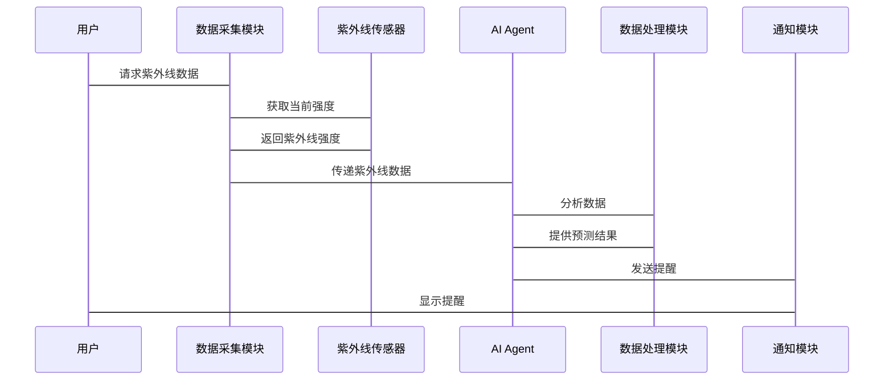

                 


# AI Agent在智能项链中的紫外线防护提醒

> **关键词**：AI Agent，紫外线防护，智能项链，可穿戴设备，机器学习

> **摘要**：本文探讨AI Agent在智能项链中的紫外线防护提醒应用。通过背景介绍、核心概念分析、算法原理、系统架构设计和项目实战，详细阐述AI Agent如何通过紫外线数据采集、处理和智能提醒，帮助用户有效防护紫外线伤害。文章结合理论与实践，提供深度的技术解析和实现方案。

---

## 第一部分：AI Agent在智能项链中的紫外线防护提醒概述

### 第1章：背景介绍

#### 1.1 紫外线防护的重要性
- **紫外线的危害**：紫外线UV-A、UV-B、UV-C对皮肤和眼睛的伤害，导致晒伤、皮肤癌和白内障等问题。
- **智能项链的发展现状**：可穿戴设备技术进步，智能项链具备健康监测功能。
- **AI Agent的应用背景**：利用AI技术实时监测紫外线强度，主动提醒用户防护。

#### 1.2 AI Agent的核心概念
- **AI Agent定义**：智能体，具备感知、决策和执行能力，用于自动化任务。
- **紫外线防护提醒系统**：实时监测紫外线强度，智能提醒用户采取防护措施。
- **AI Agent与紫外线防护的关系**：AI Agent通过数据处理和决策，优化紫外线防护提醒的效率和准确性。

---

### 第2章：AI Agent与紫外线防护提醒系统的原理

#### 2.1 AI Agent的原理
- **基本工作流程**：
  1. **数据采集**：接收紫外线传感器数据。
  2. **数据处理**：分析紫外线强度，判断是否超出安全阈值。
  3. **决策与提醒**：通过算法决定提醒策略，触发通知。
- **核心算法**：机器学习模型，如随机森林，用于预测紫外线强度。
- **决策机制**：基于紫外线强度和用户历史数据，动态调整提醒阈值。

#### 2.2 紫外线防护提醒系统的原理
- **紫外线检测技术**：使用紫外线传感器，实时采集UV指数。
- **数据采集与处理**：传感器数据预处理，去除噪声，特征提取。
- **提醒触发机制**：当紫外线强度超过阈值时，发送提醒通知。

#### 2.3 AI Agent与紫外线防护提醒系统的联系
- **系统架构**：AI Agent作为核心模块，与数据采集、处理和通知模块协同工作。
- **优化方向**：通过机器学习模型优化紫外线强度预测，提高提醒的准确性。

---

### 第3章：AI Agent的算法原理

#### 3.1 AI Agent的核心算法
- **机器学习算法**：随机森林用于紫外线强度分类，支持向量机用于回归预测。
- **自然语言处理**：解析用户反馈，优化提醒策略。
- **决策树算法**：构建决策树，基于紫外线强度和天气条件决策提醒方式。

#### 3.2 紫外线防护提醒系统的算法实现
- **数据预处理**：标准化紫外线数据，处理缺失值。
- **紫外线强度预测模型**：使用LSTM神经网络，预测未来紫外线强度。
- **提醒策略优化**：基于实时数据和用户行为，动态调整提醒阈值。

---

### 第4章：数学模型与公式

#### 4.1 AI Agent的数学模型
- **状态空间模型**：定义状态集合，状态转移基于紫外线强度变化。
- **动作空间模型**：定义可能的动作，如发送提醒或调整阈值。
- **概率模型**：计算紫外线强度超过阈值的概率，指导AI Agent的决策。

#### 4.2 紫外线强度预测模型
- **随机森林模型**：
  $$ 
  \text{预测强度} = \text{随机森林}(\text{输入特征})
  $$
- **LSTM模型**：
  $$
  f_{\text{LSTM}}(x_t) = \text{LSTM}(x_{t-1}, x_{t-2}, ..., x_1)
  $$

---

### 第5章：系统分析与架构设计

#### 5.1 问题场景介绍
- **用户需求**：实时了解紫外线强度，获取及时的防护提醒。
- **技术挑战**：传感器精度、数据处理效率、AI算法优化。

#### 5.2 系统功能设计
- **领域模型类图**：
  ```mermaid
  classDiagram
    class 用户 {
      用户ID, 历史数据, 通知记录
    }
    class 紫外线传感器 {
      传感器ID, 当前强度, 时间戳
    }
    class AI Agent {
      状态, 行为, 知识库
    }
    class 通知模块 {
      提醒类型, 提醒时间
    }
    用户 --> AI Agent: 提供数据
    AI Agent --> 通知模块: 发送提醒
    紫外线传感器 --> AI Agent: 传递数据
  ```

#### 5.3 系统架构设计
- **系统架构图**：
  ```mermaid
  architectureDiagram
    UI模块 --> 数据采集模块: 发送请求
    数据采集模块 --> AI Agent模块: 传输紫外线数据
    AI Agent模块 --> 通知模块: 发送提醒指令
  ```

#### 5.4 系统接口设计
- **API接口**：
  - 数据采集模块：`GET /api/sensor/data`
  - AI Agent模块：`POST /api/agent/decision`
  - 通知模块：`POST /api/notification/send`

#### 5.5 系统交互流程图


---

### 第6章：项目实战

#### 6.1 环境安装
- **开发环境**：Python 3.8及以上，安装必要的库：
  ```bash
  pip install numpy scikit-learn tensorflow
  ```

#### 6.2 核心代码实现
- **AI Agent核心代码**：
  ```python
  import numpy as np
  from sklearn.ensemble import RandomForestClassifier

  class AIAssistant:
      def __init__(self):
          self.model = RandomForestClassifier()

      def train(self, X, y):
          self.model.fit(X, y)

      def predict(self, X):
          return self.model.predict(X)
  ```

- **紫外线强度预测代码**：
  ```python
  import pandas as pd

  def preprocess_data(data):
      # 数据预处理
      return data.dropna()

  data = pd.read_csv('uv_data.csv')
  processed_data = preprocess_data(data)
  ```

#### 6.3 实际案例分析
- **案例分析**：假设紫外线强度为3，用户历史数据表明该强度下用户未采取防护措施，AI Agent预测紫外线强度将升至4，触发提醒。

---

### 第7章：最佳实践

#### 7.1 小结
- AI Agent通过实时数据处理和智能决策，优化紫外线防护提醒，有效保护用户健康。

#### 7.2 注意事项
- 确保传感器数据的准确性，避免因数据误差导致错误提醒。
- 定期更新AI模型，保持预测的准确性。

#### 7.3 拓展阅读
- 《机器学习实战》
- 《可穿戴设备与健康监测》

---

# 结语

AI Agent在智能项链中的紫外线防护提醒，不仅体现了AI技术的强大能力，也为可穿戴设备的应用开辟了新的方向。通过理论与实践的结合，我们展示了如何利用AI技术提升紫外线防护的效率和效果。未来，随着技术的进步，AI Agent将在更多领域发挥重要作用。

