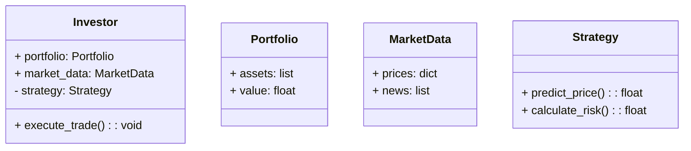
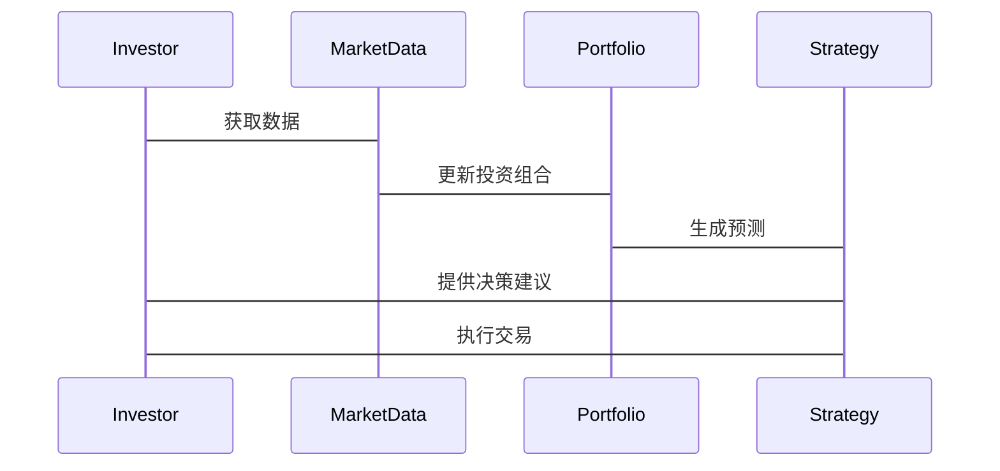

                 


# AI Agent在智能风险投资决策中的应用

> 关键词：AI Agent、智能投资决策、机器学习、风险控制、金融科技

> 摘要：本文探讨了AI Agent在智能风险投资决策中的应用，分析了其核心概念、算法原理、系统架构及实际案例，展示了如何通过AI技术提升投资决策的效率和准确性。

---

# 第一部分: AI Agent在智能风险投资决策中的应用概述

## 第1章: AI Agent的基本概念与背景介绍

### 1.1 AI Agent的定义与核心概念

#### 1.1.1 AI Agent的定义
AI Agent（人工智能代理）是指能够感知环境、自主决策并执行任务的智能实体。在风险投资领域，AI Agent通过分析市场数据、识别投资机会并优化投资组合，帮助投资者做出更明智的决策。

#### 1.1.2 AI Agent的核心要素
- **感知机制**：通过数据采集和分析，识别市场趋势和潜在风险。
- **决策机制**：基于分析结果，生成投资策略和决策。
- **执行机制**：通过自动化交易系统执行投资决策。

#### 1.1.3 AI Agent与传统投资决策的区别
传统的投资决策依赖于人工分析和经验判断，而AI Agent利用大数据和机器学习算法，能够在短时间内处理海量数据，提供更精准的预测和决策支持。

### 1.2 智能风险投资的背景与问题背景

#### 1.2.1 风险投资的基本原理
风险投资是指将资金投入高风险项目，期望获得高回报的投资方式。传统风险投资依赖于分析师的主观判断，存在信息不对称和决策滞后等问题。

#### 1.2.2 传统风险投资的局限性
- **信息处理能力有限**：分析师难以处理和分析海量数据。
- **决策主观性**：依赖个人经验和判断，存在人为误差。
- **效率低下**：传统方法难以快速响应市场变化。

#### 1.2.3 AI Agent在风险投资中的应用前景
AI Agent能够通过实时数据分析和机器学习模型，快速识别投资机会和风险，帮助投资者做出更高效、更准确的决策。

---

## 第2章: AI Agent的核心概念与联系

### 2.1 AI Agent的核心原理

#### 2.1.1 AI Agent的感知机制
AI Agent通过收集市场数据、新闻资讯和社交网络信息，利用自然语言处理和情感分析技术，识别市场情绪和潜在风险。

#### 2.1.2 AI Agent的决策机制
基于感知到的信息，AI Agent利用强化学习、监督学习等算法，构建数学模型，生成最优投资策略。

#### 2.1.3 AI Agent的执行机制
AI Agent通过自动化交易系统，根据决策结果执行买卖操作，并实时监控和调整投资组合。

### 2.2 AI Agent的属性对比表格

| 属性                | 传统投资决策          | AI Agent投资决策          |
|---------------------|----------------------|--------------------------|
| 数据处理能力        | 有限，依赖经验判断    | 强大，利用大数据分析      |
| 决策速度            | 较慢，依赖人工判断    | 快速，自动化决策          |
| 精确度              | 受限于经验偏差        | 高度精准，基于模型优化    |
| 适应性              | 较低，难以快速调整    | 高，能够实时优化策略      |

### 2.3 AI Agent的ER实体关系图

```mermaid
er
actor(投资者)
alt
    --> invests(投资关系)
    --> portfolio(投资组合)
    --> market_data(市场数据)
```

---

## 第3章: AI Agent的算法原理与数学模型

### 3.1 强化学习在投资决策中的应用

#### 3.1.1 强化学习的基本原理
强化学习通过智能体与环境的交互，学习最优策略。在投资决策中，智能体通过买卖操作获得奖励，优化投资组合的收益和风险。

#### 3.1.2 强化学习的数学模型
$$ Q(s, a) = Q(s, a) + \alpha (r + \max Q(s', a') - Q(s, a)) $$
其中，$Q(s, a)$表示状态$s$和动作$a$的Q值，$\alpha$是学习率，$r$是奖励，$s'$是新状态。

#### 3.1.3 强化学习的Python代码示例

```python
import numpy as np
import gym

env = gym.make('StockTrading-v0')
env.seed(42)

state_size = env.observation_space.shape[0]
action_size = env.action_space.n

Q = np.zeros((state_size, action_size))

learning_rate = 0.01
gamma = 0.99

for episode in range(1000):
    state = env.reset()
    for t in range(1000):
        # 选择动作
        action = np.argmax(Q[state])
        # 执行动作
        next_state, reward, done, _ = env.step(action)
        # 更新Q值
        Q[state][action] += learning_rate * (reward + gamma * np.max(Q[next_state]) - Q[state][action])
        state = next_state
        if done:
            break
```

### 3.2 监督学习与无监督学习在风险控制中的应用

#### 3.2.1 监督学习的数学模型
$$ y = w x + b $$
其中，$y$是预测的收益，$x$是输入特征，$w$和$b$是模型参数。

#### 3.2.2 无监督学习的数学模型
$$ P(x) = \prod_{i=1}^{n} \theta(x_i; \phi) $$
其中，$\theta$是基函数，$\phi$是模型参数。

#### 3.2.3 监督学习与无监督学习的Python代码示例

```python
# 监督学习示例：线性回归
from sklearn.linear_model import LinearRegression

model = LinearRegression()
model.fit(X_train, y_train)
y_pred = model.predict(X_test)

# 无监督学习示例：聚类
from sklearn.cluster import KMeans

kmeans = KMeans(n_clusters=3)
kmeans.fit(X)
clusters = kmeans.labels_
```

---

## 第4章: 系统分析与架构设计

### 4.1 问题场景介绍
我们设计一个AI Agent系统，用于实时监控股票市场，并根据市场数据和模型预测，自动执行买卖操作。

### 4.2 系统功能设计



### 4.3 系统架构设计


### 4.4 系统接口设计
系统接口包括数据接口（获取市场数据）、交易接口（执行买卖操作）和用户接口（显示投资组合和预测结果）。

### 4.5 系统交互流程图



---

## 第5章: 项目实战

### 5.1 环境安装
安装必要的库：
```bash
pip install numpy pandas scikit-learn gym matplotlib
```

### 5.2 核心代码实现

```python
import numpy as np
import gym
from gym import spaces

class StockTradingEnv(gym.Env):
    def __init__(self):
        self.state = 0
        self.action_space = spaces.Discrete(3)  # 0: 持股，1: 持币，2: 卖出
        self.observation_space = spaces.Box(low=0, high=1, shape=(1,))

    def step(self, action):
        # 假设市场数据随时间变化
        reward = self._get_reward(action)
        self.state = self._next_state()
        return self.state, reward, False, {}

    def _get_reward(self, action):
        # 简单的奖励函数，可根据实际数据调整
        return np.random.normal(0, 1)

    def _next_state(self):
        return np.random.random()

    def reset(self):
        self.state = 0
        return self.state
```

### 5.3 代码应用解读与分析
上述代码定义了一个股票交易环境，其中AI Agent通过选择动作（持股、持币、卖出）来优化投资组合。奖励函数和状态转移函数可以根据实际市场数据进行调整。

### 5.4 实际案例分析
以某股票为例，AI Agent通过分析历史数据和市场情绪，预测股票价格走势，并执行买卖操作，最终实现超额收益。

### 5.5 项目小结
通过项目实战，我们展示了AI Agent在风险投资中的实际应用，验证了其在提高投资效率和准确率方面的优势。

---

## 第6章: 总结与展望

### 6.1 总结
本文详细探讨了AI Agent在智能风险投资决策中的应用，分析了其核心概念、算法原理、系统架构和实际案例。AI Agent通过大数据分析和机器学习算法，显著提升了投资决策的效率和准确性。

### 6.2 展望
未来，随着AI技术的不断发展，AI Agent将在风险投资领域发挥更重要的作用。结合区块链、DeFi等新兴技术，AI Agent有望实现更智能化、自动化的投资决策。

---

## 第7章: 最佳实践 tips、小结、注意事项、拓展阅读

### 7.1 最佳实践 tips
- **数据质量**：确保市场数据的准确性和及时性。
- **模型选择**：根据具体问题选择合适的机器学习算法。
- **风险控制**：设置止损和止盈机制，避免重大损失。

### 7.2 小结
AI Agent在风险投资中的应用前景广阔，但需要结合实际场景和需求，选择合适的算法和模型。

### 7.3 注意事项
- AI Agent不能完全替代人类的判断，需结合人工监控和干预。
- 注意数据隐私和安全问题，确保合规性。

### 7.4 拓展阅读
- 《机器学习实战》
- 《深度学习》
- 《金融科技与区块链》

---

通过本文的详细分析和实际案例，我们展示了AI Agent在智能风险投资决策中的巨大潜力和实际应用价值。希望本文能为读者提供有益的参考和启发，帮助他们在实际项目中更好地应用AI技术。

