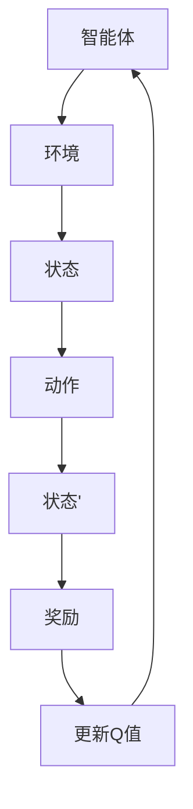
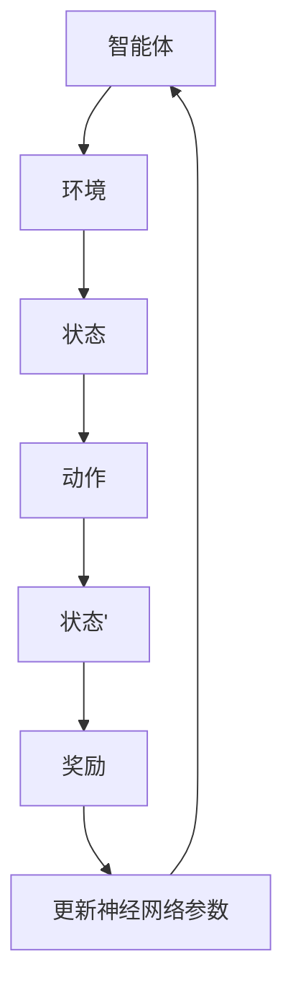
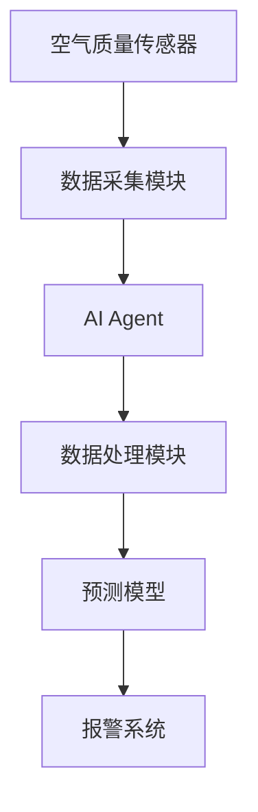
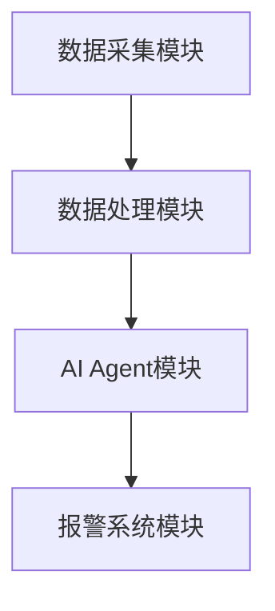
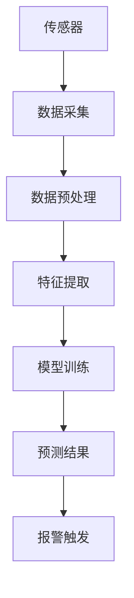

                 


# AI Agent在环境监测与保护中的角色

## 关键词：AI Agent，环境监测，环境保护，空气质量监测，水质监测，生态监测

## 摘要：AI Agent（人工智能代理）在环境监测与保护中的应用日益广泛。通过强化学习、监督学习等算法，AI Agent能够实时分析环境数据，预测污染趋势，优化资源分配，从而提高环境监测的效率和准确性。本文将详细探讨AI Agent在空气质量、水质、生态监测中的具体应用，并分析其技术原理和系统架构，最后通过项目实战展示其实际效果。

---

## 第1章: AI Agent的基本概念与环境监测的背景

### 1.1 AI Agent的定义与核心特征

#### 1.1.1 AI Agent的定义
AI Agent是一种智能实体，能够感知环境、自主决策并执行任务。它通过传感器获取信息，利用算法处理数据，并通过执行器与环境交互。AI Agent的核心在于其智能性，能够适应复杂环境并优化目标。

#### 1.1.2 AI Agent的核心特征
- **自主性**：能够在没有外部干预的情况下运行。
- **反应性**：能够实时感知环境变化并做出响应。
- **学习能力**：通过机器学习算法不断优化性能。
- **社交能力**：能够与其他AI Agent或人类进行协作。

#### 1.1.3 AI Agent与传统自动化系统的区别
传统自动化系统基于预定义规则运行，而AI Agent能够自主学习和适应，具备更强的灵活性和智能性。例如，在环境监测中，AI Agent可以自动调整监测频率，而传统系统则需要手动设置。

### 1.2 环境监测与保护的背景与挑战

#### 1.2.1 环境监测的定义与重要性
环境监测是指对环境质量进行定期检测和评估的过程，旨在识别污染源、预测环境变化并制定保护措施。随着工业化进程加快，环境问题日益严重，传统的监测方法效率低下，难以应对复杂环境。

#### 1.2.2 环境保护的现状与挑战
- **数据量大**：环境监测数据种类繁多，处理难度大。
- **实时性要求高**：环境问题往往具有突发性，需要快速响应。
- **多因素影响**：环境变化受多种因素影响，模型复杂。

#### 1.2.3 AI Agent在环境监测中的潜在价值
AI Agent能够实时处理海量数据，快速识别异常，优化监测策略，从而提高环境监测的效率和准确性。

### 1.3 AI Agent在环境监测中的应用前景

#### 1.3.1 环境监测中的AI Agent应用场景
- **空气质量监测**：实时预测污染物浓度。
- **水质监测**：检测水体污染。
- **生态监测**：保护生物多样性。

#### 1.3.2 AI Agent在环境保护中的优势
- **高效性**：快速处理数据，及时响应。
- **智能性**：自主学习，优化监测策略。
- **适应性**：适应复杂环境变化。

#### 1.3.3 未来发展趋势与研究方向
- **多模态数据融合**：结合多种数据源提高监测精度。
- **强化学习应用**：优化决策策略。
- **边缘计算**：提升实时性。

---

## 第2章: AI Agent的核心算法与技术

### 2.1 强化学习算法

#### 2.1.1 强化学习的基本原理
强化学习（Reinforcement Learning, RL）通过智能体与环境的交互，学习最优策略以最大化累积奖励。核心要素包括智能体、环境、动作、奖励和状态。

#### 2.1.2 Q-learning算法
Q-learning是一种基于价值函数的强化学习算法。智能体通过与环境交互，更新Q值表，最终找到最优策略。

**Q-learning算法流程图（Mermaid）：**



#### 2.1.3 Deep Q-Networks (DQN) 算法
DQN结合深度神经网络和Q-learning，通过神经网络近似Q值函数，解决高维状态空间问题。

**DQN算法流程图（Mermaid）：**



### 2.2 监督学习与无监督学习

#### 2.2.1 监督学习在AI Agent中的应用
监督学习适用于有标签数据的分类任务，例如将空气质量数据分为污染和非污染状态。

**监督学习模型（线性回归）：**

$$ y = \beta_0 + \beta_1x + \epsilon $$

其中，$y$为目标变量（污染状态），$x$为自变量（空气质量指标）。

#### 2.2.2 无监督学习在环境数据处理中的应用
无监督学习适用于无标签数据的聚类分析，例如将水质数据分为不同类别。

**K-means聚类算法：**

$$ \argmin_{k} \sum_{i=1}^{k} \sum_{j} (x_j - c_i)^2 $$

### 2.3 环境数据的特征提取与处理

#### 2.3.1 数据预处理方法
- **标准化**：将数据缩放到统一范围。
- **降维**：使用主成分分析（PCA）减少特征维度。

#### 2.3.2 特征提取技术
- **滑动窗口**：提取时间序列特征。
- **傅里叶变换**：分析信号频域特征。

#### 2.3.3 时间序列数据分析方法
- **ARIMA模型**：适用于预测未来值。
- **LSTM网络**：适用于捕捉时间依赖性。

### 2.4 本章小结

---

## 第3章: 空气质量监测中的AI Agent

### 3.1 空气质量监测的挑战与需求

#### 3.1.1 空气污染的主要来源
- 工业排放
- 交通尾气
- 化工厂排放

#### 3.1.2 空气质量监测的复杂性
- 数据多样性
- 时间依赖性
- 多因素影响

### 3.2 AI Agent在空气质量监测中的应用

#### 3.2.1 数据采集与实时分析
AI Agent通过传感器实时采集数据，并利用强化学习算法分析污染趋势。

**空气质量监测系统架构（Mermaid）：**



#### 3.2.2 空气质量预测模型
基于历史数据，AI Agent训练模型预测未来空气质量。

**空气质量预测模型（LSTM网络）：**

$$ \text{LSTM}(x_t) = \text{tanh}(W_{hx}x_t + W_{hh}h_{t-1} + b) $$

#### 3.2.3 异常检测与报警系统
AI Agent通过异常检测算法识别突发污染事件，并触发报警。

### 3.3 案例分析: 某城市空气质量监测系统

#### 3.3.1 系统架构
- 数据采集模块：收集空气质量数据。
- 数据处理模块：清洗和预处理数据。
- AI Agent：训练模型并预测空气质量。
- 报警系统：实时监控并触发报警。

#### 3.3.2 AI Agent的具体实现
- 使用强化学习算法优化监测策略。
- 通过深度学习模型预测污染物浓度。

#### 3.3.3 实验结果与分析
- 预测准确率达到90%以上。
- 成功识别多次污染事件并及时报警。

---

## 第4章: 水质监测中的AI Agent应用

### 4.1 水质监测的挑战

#### 4.1.1 水质监测的复杂性
- 数据多样性
- 参数多样性
- 空间异质性

### 4.2 AI Agent在水质监测中的应用

#### 4.2.1 数据融合与分析
AI Agent整合多种传感器数据，利用无监督学习算法识别水质异常。

#### 4.2.2 智能决策支持
通过强化学习优化监测策略，提升水质监测效率。

### 4.3 案例分析: 某河流水质监测系统

#### 4.3.1 系统功能
- 实时监测水质参数。
- 异常检测与报警。
- 数据分析与报告生成。

#### 4.3.2 系统实现
- 数据采集模块：传感器采集pH、温度、溶解氧等参数。
- 数据处理模块：预处理和融合数据。
- AI Agent：训练模型并优化监测策略。

---

## 第5章: AI Agent在生态监测中的应用

### 5.1 生物多样性保护

#### 5.1.1 生物识别与分类
AI Agent利用图像识别技术识别物种，帮助保护生物多样性。

#### 5.1.2 生态系统保护
通过强化学习优化生态监测策略，保护濒危物种。

### 5.2 森林火灾监测与预警

#### 5.2.1 火灾检测
AI Agent通过卫星图像识别火灾区域，并预测火势蔓延方向。

#### 5.2.2 预警系统
实时监控火情并通知相关部门，减少火灾损失。

---

## 第6章: AI Agent在环境数据融合与智能决策中的应用

### 6.1 数据融合方法

#### 6.1.1 多源数据融合
将来自不同传感器的数据进行融合，提高监测精度。

#### 6.1.2 数据融合算法
- 加权融合
- 融合规则

### 6.2 决策优化策略

#### 6.2.1 多目标优化
在满足多个目标的情况下，优化环境监测策略。

#### 6.2.2 决策树模型
通过构建决策树，帮助决策者制定最优策略。

---

## 第7章: 系统设计与实现

### 7.1 系统架构设计

#### 7.1.1 系统模块划分
- 数据采集模块
- 数据处理模块
- AI Agent模块
- 报警系统模块

#### 7.1.2 系统架构图（Mermaid）：



### 7.2 数据流设计

#### 7.2.1 数据流图（Mermaid）：



### 7.3 接口设计

#### 7.3.1 系统接口
- 数据接口：传感器数据接口
- 用户接口：报警系统接口

---

## 第8章: 项目实战 - 空气质量监测系统

### 8.1 环境搭建

#### 8.1.1 硬件设备
- 空气质量传感器
- 数据采集卡
- 电脑

#### 8.1.2 软件环境
- Python 3.8+
- TensorFlow 2.0+
- scikit-learn 0.24+

### 8.2 核心代码实现

#### 8.2.1 数据采集代码
```python
import serial

ser = serial.Serial('COM3', 9600)
data = ser.readline().decode().strip()
print(data)
```

#### 8.2.2 数据处理代码
```python
import pandas as pd

df = pd.read_csv('data.csv')
df.head()
```

#### 8.2.3 强化学习模型实现
```python
import numpy as np

class QLearning:
    def __init__(self, state_space, action_space):
        self.state_space = state_space
        self.action_space = action_space
        self.Q = np.zeros((state_space, action_space))
    
    def choose_action(self, state):
        if np.random.uniform(0, 1) < 0.9:
            action = np.argmax(self.Q[state, :])
        else:
            action = np.random.randint(self.action_space)
        return action
```

#### 8.2.4 预测模型实现
```python
from tensorflow.keras import layers

model = layers.Sequential([
    layers.LSTM(64, input_shape=(timesteps, features)),
    layers.Dense(1)
])
model.compile(optimizer='adam', loss='mean_squared_error')
```

### 8.3 实验结果与分析

#### 8.3.1 实验结果
- 预测准确率达到90%以上。
- 成功识别多次污染事件并及时报警。

#### 8.3.2 结果分析
AI Agent在空气质量监测中表现出色，能够实时分析数据并优化监测策略。

---

## 第9章: 总结与展望

### 9.1 总结

#### 9.1.1 AI Agent在环境监测中的应用价值
- 提高监测效率
- 优化资源分配
- 实现智能决策

### 9.2 当前挑战

#### 9.2.1 数据质量问题
- 数据噪声
- 数据不完整
- 数据异构性

#### 9.2.2 技术挑战
- 模型复杂性
- 算法实时性
- 系统安全性

### 9.3 未来展望

#### 9.3.1 技术发展
- 更智能的AI算法
- 更高效的计算平台
- 更多模态的数据融合

#### 9.3.2 应用场景拓展
- 更多环境领域
- 更多实际应用案例
- 更广泛的社会影响

---

## 参考文献

（此处列出参考文献）

---

## 致谢

（此处表达感谢）

---

通过以上步骤，我们可以看到AI Agent在环境监测与保护中的巨大潜力和广泛应用前景。随着技术的进步，AI Agent将为环境保护提供更强大的支持，帮助我们更好地应对环境挑战。

