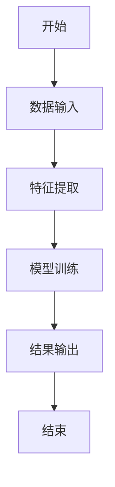

                 

# AI Agent在社交网络分析中的应用：舆情监测与影响力评估

> 关键词：AI Agent, 社交网络分析, 舆情监测, 影响力评估, 算法原理, 项目实战, 未来展望

> 摘要：本文深入探讨了AI Agent在社交网络分析中的应用，重点分析了舆情监测与影响力评估的核心算法与实现方法。通过详细讲解技术原理、项目实战和未来趋势，为读者提供全面的理论与实践指导。

---

# 第1章: AI Agent与社交网络分析概述

## 1.1 AI Agent的基本概念
### 1.1.1 AI Agent的定义与特点
人工智能代理（AI Agent）是指能够感知环境、自主决策并执行任务的智能实体。其特点包括自主性、反应性、目标导向和学习能力。

### 1.1.2 社交网络的基本概念与结构
社交网络是由用户节点和边（连接）组成的图结构，用户之间通过关注、点赞、评论等方式建立联系。

### 1.1.3 AI Agent在社交网络中的应用前景
AI Agent在社交网络中的应用包括舆情监测、影响力评估、用户行为预测等，能够显著提升社交网络分析的效率和准确性。

## 1.2 社交网络分析的核心问题
### 1.2.1 舆情监测的定义与目标
舆情监测是指通过分析社交网络中的文本数据，识别公众对某个事件或品牌的情感态度。

### 1.2.2 影响力评估的定义与目标
影响力评估是指通过分析用户的影响力，判断其在社交网络中的地位和作用。

### 1.2.3 问题背景与实际应用场景
舆情监测和影响力评估在品牌营销、政治选举、公共危机管理等领域有广泛应用。

## 1.3 本章小结
本章介绍了AI Agent和社交网络的基本概念，明确了舆情监测和影响力评估的核心问题和应用场景。

---

# 第2章: 社交网络分析的技术基础

## 2.1 数据收集与预处理
### 2.1.1 数据来源与采集方法
数据来源包括API接口、爬虫技术等，采集方法需考虑数据量和实时性。

### 2.1.2 数据清洗与特征提取
数据清洗包括去重、去噪声，特征提取包括文本分词、情感词分析。

### 2.1.3 数据存储与管理
常用数据库包括关系型数据库和图数据库，数据存储需考虑扩展性和查询效率。

## 2.2 社交网络分析的核心算法
### 2.2.1 基于规则的文本分析算法
例如，使用情感词典进行情感分类。

### 2.2.2 基于机器学习的情感分析算法
如支持向量机（SVM）和长短期记忆网络（LSTM）。

### 2.2.3 社交网络中的社区发现算法
如Louvain算法和K-means算法。

## 2.3 本章小结
本章介绍了社交网络分析的技术基础，包括数据处理方法和核心算法。

---

# 第3章: AI Agent的算法原理

## 3.1 AI Agent的核心算法
### 3.1.1 基于规则的AI Agent算法
通过预设规则实现简单的任务，如关键词匹配。

### 3.1.2 基于机器学习的AI Agent算法
如随机森林和梯度提升树。

### 3.1.3 基于深度学习的AI Agent算法
如Transformer模型和图神经网络。

## 3.2 算法原理的数学模型
### 3.2.1 基于规则的AI Agent模型
关键词匹配规则：$$text \in keywords$$。

### 3.2.2 基于机器学习的AI Agent模型
线性回归模型：$$y = w x + b$$。

### 3.2.3 基于深度学习的AI Agent模型
神经网络模型：$$f(x) = ReLU(Wx + b)$$。

## 3.3 算法流程图（使用Mermaid）

## 3.4 本章小结
本章详细讲解了AI Agent的核心算法及其数学模型，展示了算法流程。

---

# 第4章: 舆情监测的实现

## 4.1 舆情监测的核心算法
### 4.1.1 基于规则的舆情监测算法
通过关键词匹配识别情感倾向。

### 4.1.2 基于机器学习的舆情监测算法
使用SVM和LSTM模型进行情感分类。

### 4.1.3 基于深度学习的舆情监测算法
利用Transformer模型捕捉长距离依赖关系。

## 4.2 舆情监测的实现流程
### 4.2.1 数据采集与预处理
从社交媒体API获取数据并清洗。

### 4.2.2 文本特征提取与建模
使用TF-IDF提取特征，训练情感分类模型。

### 4.2.3 结果分析与可视化
生成情感分布图和热力图。

## 4.3 本章小结
本章详细讲解了舆情监测的实现流程，包括数据处理和算法选择。

---

# 第5章: 影响力评估的实现

## 5.1 影响力评估的核心算法
### 5.1.1 基于中心性指标的影响力评估
如度数中心性和介数中心性。

### 5.1.2 基于传播模型的影响力评估
如信息传播模型和扩散模型。

### 5.1.3 基于机器学习的影响力评估
使用聚类和分类模型评估影响力。

## 5.2 影响力评估的实现流程
### 5.2.1 数据采集与预处理
从社交网络获取用户数据并清洗。

### 5.2.2 模型训练与优化
基于用户行为数据训练影响力评估模型。

### 5.2.3 结果分析与可视化
生成影响力排名图和网络结构图。

## 5.3 本章小结
本章详细讲解了影响力评估的实现流程，包括数据处理和模型优化。

---

# 第6章: 项目实战

## 6.1 环境搭建与工具安装
### 6.1.1 开发环境搭建
安装Python、Jupyter Notebook和相关库。

### 6.1.2 数据集获取
获取社交网络数据集，如Twitter和微博数据。

## 6.2 系统核心实现
### 6.2.1 舆情监测系统实现
编写Python代码，实现舆情监测功能。

### 6.2.2 影响力评估系统实现
编写代码，实现影响力评估功能。

## 6.3 实际案例分析与详细解读
### 6.3.1 案例背景
以某品牌营销活动为例，分析舆情和影响力。

### 6.3.2 数据分析与结果解读
展示分析结果并解读。

## 6.4 本章小结
本章通过实际案例展示了AI Agent在舆情监测和影响力评估中的应用。

---

# 第7章: 未来展望与挑战

## 7.1 技术发展趋势
AI Agent在社交网络分析中的技术趋势，如多模态数据融合和增强学习。

## 7.2 当前存在的挑战
数据隐私、计算资源限制和算法解释性等问题。

## 7.3 未来研究方向
多模态分析、实时计算和个性化服务。

## 7.4 本章小结
本章展望了AI Agent在社交网络分析中的未来发展方向。

---

# 附录

## 附录A: 数据集说明
列出常用的社交网络数据集及其获取方式。

## 附录B: 工具与库说明
介绍常用的开发工具和Python库。

## 附录C: 参考文献
列出相关书籍和论文。

---

# 结束语

通过本文的系统讲解和实战案例，读者可以全面掌握AI Agent在社交网络分析中的应用，从理论到实践都能得到深入的理解和提升。

