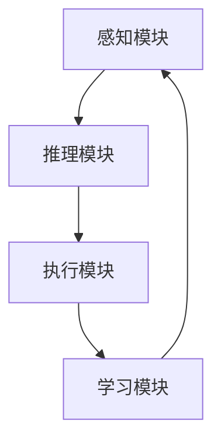
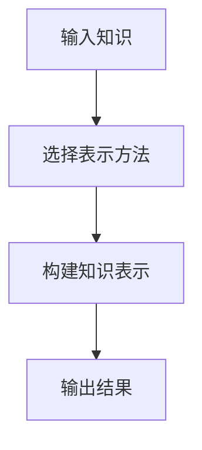
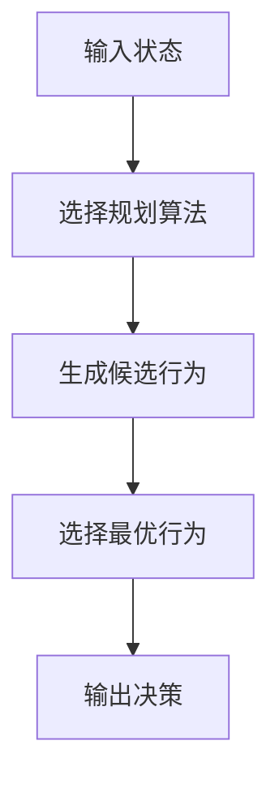
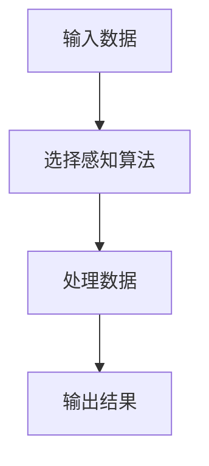
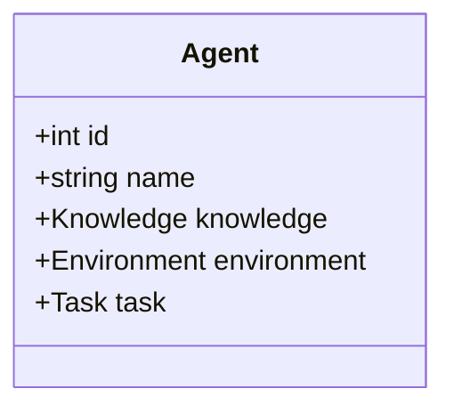
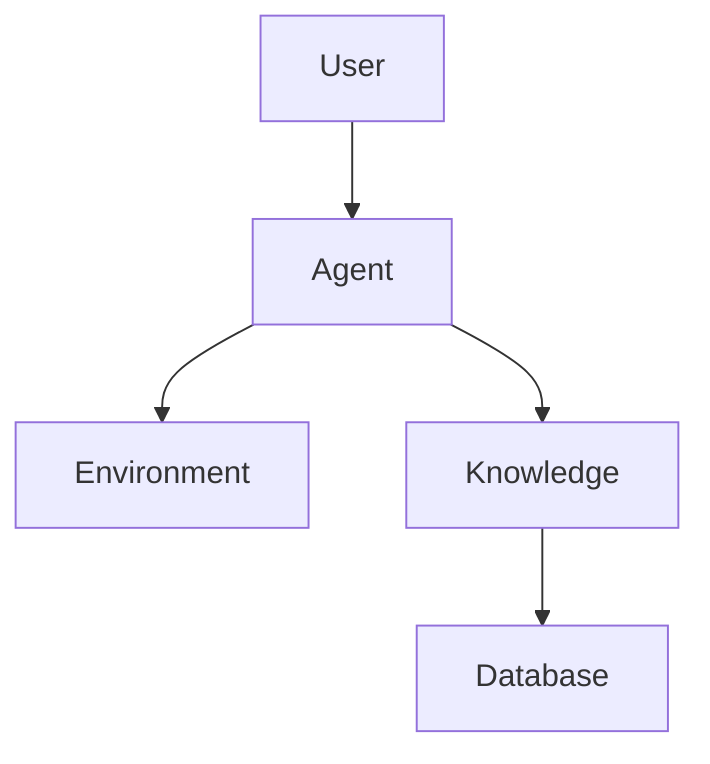
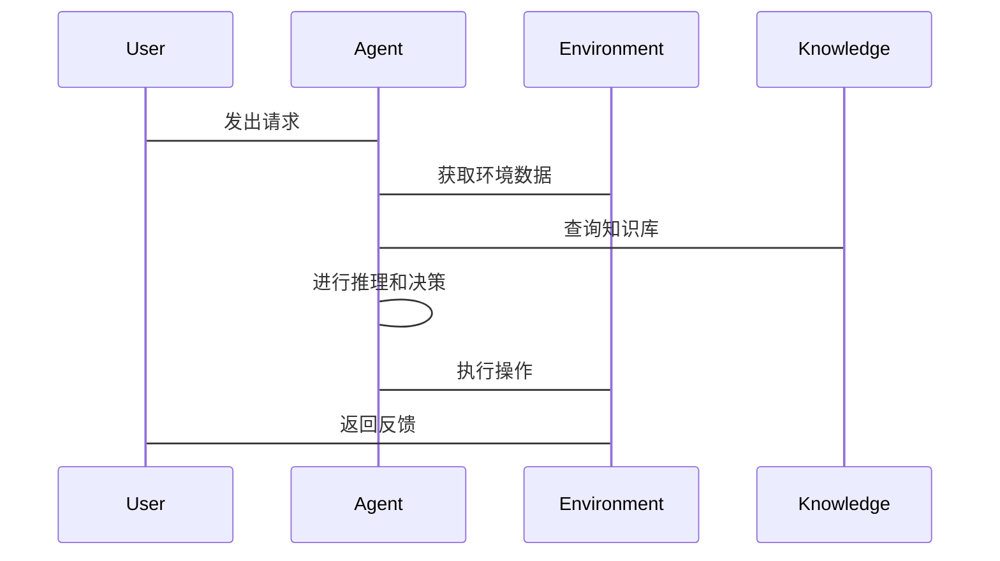

                 


# AI Agent基础概念：理解智能代理的核心

> **关键词**：AI Agent，智能代理，人工智能，算法原理，系统架构，项目实战  
>
> **摘要**：本文深入探讨AI Agent的核心概念、算法原理、系统架构设计及项目实战，帮助读者全面理解智能代理的本质。通过背景分析、概念解析、算法实现和实际案例，本文为AI Agent的学习与应用提供系统性指导。

---

## 第1章: AI Agent的背景与问题背景

### 1.1 AI Agent的定义与问题背景

#### 1.1.1 什么是AI Agent
AI Agent（人工智能代理）是指在计算机系统中，能够感知环境、自主决策并执行任务的智能实体。它能够根据环境输入做出反应，执行预设的目标任务，是一种具备智能特性的软件或实体系统。

#### 1.1.2 AI Agent的核心问题与挑战
AI Agent的核心问题包括：
- **环境感知**：如何准确感知和理解外部环境。
- **决策推理**：如何基于感知信息做出合理决策。
- **行为执行**：如何高效执行决策并反馈结果。
- **自主学习**：如何通过经验改进自身性能。

#### 1.1.3 AI Agent的边界与外延
AI Agent的边界在于其智能性和自主性。外延包括：
- **软件Agent**：基于规则或算法的程序。
- **物理Agent**：如自动驾驶汽车等实体设备。
- **人机协作Agent**：与人类协同工作的智能系统。

### 1.2 问题描述与解决方案

#### 1.2.1 AI Agent的核心问题
AI Agent的核心问题可以归纳为以下几点：
- 如何实现智能感知与决策。
- 如何在动态环境中保持稳定性和可靠性。
- 如何实现人机交互与协同。

#### 1.2.2 AI Agent的解决方案框架
AI Agent的解决方案通常包括以下步骤：
1. **环境建模**：建立环境模型，明确输入和输出。
2. **知识表示**：将问题转化为可计算的形式。
3. **算法设计**：设计算法以实现感知、推理和决策。
4. **系统实现**：将算法转化为具体代码或硬件实现。
5. **测试优化**：通过测试优化系统性能。

#### 1.2.3 AI Agent的实现目标
AI Agent的实现目标是：
- 提供高效的智能服务。
- 实现人机协同工作。
- 提供可靠的决策支持。

### 1.3 AI Agent的核心要素与概念结构

#### 1.3.1 AI Agent的核心要素
AI Agent的核心要素包括：
- **感知模块**：负责接收外部输入。
- **推理模块**：负责信息处理与决策。
- **执行模块**：负责输出操作。
- **学习模块**：负责优化与改进。

#### 1.3.2 AI Agent的概念结构
AI Agent的概念结构可以表示为一个模块化的系统：



#### 1.3.3 AI Agent的属性特征对比表格
| 属性       | 软件Agent | 物理Agent | 人机协作Agent |
|------------|-----------|-----------|---------------|
| 智能性     | 高         | 高         | 高             |
| 自主性     | 中         | 高         | 高             |
| 可解释性   | 低         | 中         | 高             |
| 响应速度   | 快         | 中         | 快             |

---

## 第2章: AI Agent的核心概念与联系

### 2.1 AI Agent的核心原理

#### 2.1.1 知识表示与推理机制
知识表示是AI Agent的核心，常用的形式包括：
- **一阶逻辑**：如谓词逻辑。
- **语义网络**：基于概念网络的知识表示。
- **概率推理**：基于概率的推理方法。

#### 2.1.2 行为规划与决策过程
行为规划通常包括：
- **目标设定**：明确任务目标。
- **路径规划**：规划从起点到目标的路径。
- **决策优化**：基于当前状态选择最优行为。

#### 2.1.3 状态感知与环境交互
AI Agent需要通过传感器或其他输入方式感知环境状态，常见的感知方法包括：
- **视觉感知**：通过摄像头或图像处理技术。
- **听觉感知**：通过麦克风或语音识别技术。
- **触觉感知**：通过触摸或力反馈技术。

### 2.2 AI Agent的属性特征对比

#### 2.2.1 不同类型AI Agent的特征对比
| 类型       | 基于规则的Agent | 基于知识的Agent | 基于学习的Agent |
|------------|------------------|------------------|------------------|
| 决策方式   | 确定性规则       | 知识推理         | 数据驱动学习     |
| 适应性     | 低               | 中               | 高               |
| 可解释性   | 高               | 中               | 低               |

#### 2.2.2 AI Agent与传统程序的区别
- **自主性**：AI Agent具备自主决策能力，而传统程序通常遵循固定的逻辑。
- **学习能力**：AI Agent可以基于经验优化性能，传统程序无法。
- **环境交互**：AI Agent需要与环境交互，传统程序通常不涉及。

### 2.3 AI Agent的ER实体关系图

```mermaid
erd
    User
    Agent
    Environment
    Task
    Interaction
    Knowledge
```

---

## 第3章: AI Agent的算法原理

### 3.1 AI Agent的核心算法

#### 3.1.1 知识表示算法
知识表示的常见算法包括：
- **一阶逻辑表示**：如谓词逻辑。
- **语义网络构建**：通过概念节点表示知识。
- **概率图模型**：如贝叶斯网络。

#### 3.1.2 行为规划算法
行为规划的常见算法包括：
- **A*算法**：用于路径规划。
- **强化学习**：通过奖励机制优化行为。
- **遗传算法**：通过进化策略优化决策。

#### 3.1.3 状态感知算法
状态感知的常见算法包括：
- **图像识别**：如卷积神经网络（CNN）。
- **语音识别**：如循环神经网络（RNN）。
- **目标检测**：如YOLO或Faster R-CNN。

### 3.2 AI Agent的算法流程图

#### 3.2.1 知识表示流程图


#### 3.2.2 行为规划流程图


#### 3.2.3 状态感知流程图


### 3.3 AI Agent的算法实现代码

#### 3.3.1 知识表示代码实现
```python
# 知识表示示例：一阶逻辑
def knowledge_representer():
    # 假设知识库中的知识表示为一阶逻辑形式
    knowledge = "所有人类都是 mortal."
    return knowledge
```

#### 3.3.2 行为规划代码实现
```python
# 行为规划示例：A*算法
import heapq

def a_star_search(start, goal, h):
    open_list = [start]
    g = {}
    g[start] = 0
    h[start] = h(start)
    while open_list:
        current = heapq.heappop(open_list)
        if current == goal:
            return current
        for neighbor in neighbors(current):
            new_g = g[current] + cost(current, neighbor)
            if neighbor not in g or new_g < g[neighbor]:
                g[neighbor] = new_g
                h[neighbor] = h(neighbor)
                heapq.heappush(open_list, neighbor)
    return None
```

#### 3.3.3 状态感知代码实现
```python
# 状态感知示例：图像识别
import cv2

def image_recognition(image):
    # 使用OpenCV进行图像识别
    gray = cv2.cvtColor(image, cv2.COLOR_BGR2GRAY)
    # 简单的图像处理
    return gray
```

### 3.4 AI Agent的数学模型与公式

#### 3.4.1 知识表示的数学模型
知识表示可以基于一阶逻辑，例如：
$$ \forall x (Human(x) \rightarrow Mortal(x)) $$

#### 3.4.2 行为规划的数学模型
强化学习中的Q-learning算法可以用以下公式表示：
$$ Q(s, a) = Q(s, a) + \alpha [r + \max Q(s', a') - Q(s, a)] $$

#### 3.4.3 状态感知的数学模型
图像识别中的边缘检测可以表示为：
$$ \frac{\partial I}{\partial x} = 0 $$

---

## 第4章: AI Agent的系统分析与架构设计

### 4.1 AI Agent的系统分析

#### 4.1.1 系统功能需求分析
AI Agent的系统功能需求包括：
- **感知环境**：接收输入数据。
- **知识表示**：处理和存储知识。
- **行为规划**：制定决策计划。
- **执行操作**：输出行为结果。

#### 4.1.2 系统性能需求分析
系统性能需求包括：
- **响应时间**：快速处理输入。
- **准确性**：保证决策的正确性。
- **可扩展性**：支持功能扩展。

### 4.2 AI Agent的系统架构设计

#### 4.2.1 领域模型设计
领域模型可以表示为：


#### 4.2.2 系统架构设计
系统架构可以表示为：


#### 4.2.3 系统接口设计
系统接口设计包括：
- **输入接口**：接收环境数据。
- **输出接口**：发送行为指令。
- **数据接口**：与知识库交互。

#### 4.2.4 系统交互设计
系统交互可以表示为：


### 4.3 AI Agent的系统实现代码

#### 4.3.1 系统核心实现源代码
```python
# 系统核心代码示例
class Agent:
    def __init__(self, id, name):
        self.id = id
        self.name = name
        self.knowledge = Knowledge()
        self.environment = Environment()
        self.task = Task()

    def process_input(self, input_data):
        # 处理输入数据
        pass

    def make_decision(self):
        # 基于知识库和环境数据做出决策
        pass

    def execute_action(self):
        # 执行决策操作
        pass
```

---

## 第5章: AI Agent的项目实战

### 5.1 项目介绍

#### 5.1.1 项目背景
本项目旨在实现一个基于AI Agent的智能助手，能够根据用户需求提供个性化服务。

#### 5.1.2 项目目标
- 实现用户需求的识别。
- 提供个性化的决策建议。
- 支持人机交互。

### 5.2 项目实现

#### 5.2.1 环境安装
需要安装的环境包括：
- Python 3.8+
- OpenCV
- NumPy
- TensorFlow

#### 5.2.2 代码实现
```python
# 代码实现示例：用户需求识别
def user_request_classifier(request):
    # 假设使用机器学习模型进行分类
    model = load_model("request_classifier.h5")
    prediction = model.predict(request)
    return prediction
```

#### 5.2.3 代码应用解读与分析
通过上述代码，我们可以实现用户需求的分类和识别，进而提供相应的决策建议。

### 5.3 项目小结

#### 5.3.1 实践经验总结
- 知识表示与行为规划是AI Agent的核心。
- 系统架构设计需要考虑可扩展性和可维护性。

#### 5.3.2 注意事项
- 确保系统的安全性。
- 提供良好的用户交互体验。

#### 5.3.3 拓展阅读
推荐阅读《强化学习（深入理解）》和《人工智能系统设计》等书籍。

---

## 第6章: 最佳实践与小结

### 6.1 最佳实践 tips
- **模块化设计**：确保系统的可维护性。
- **数据质量**：数据是AI Agent的核心。
- **用户体验**：提供直观的交互界面。

### 6.2 小结
通过本文的介绍，读者可以全面理解AI Agent的核心概念、算法原理和系统设计。AI Agent作为人工智能的重要组成部分，将在未来的应用中发挥越来越重要的作用。

### 6.3 注意事项
- 确保系统的稳定性和可靠性。
- 定期更新和优化AI模型。

### 6.4 拓展阅读
推荐阅读以下书籍：
- 《人工智能：一种现代的方法》
- 《强化学习：原理与应用》
- 《机器学习实战》

---

通过以上内容，我们完成了对AI Agent基础概念的全面解析。希望本文能够为读者提供有价值的参考和启发。

