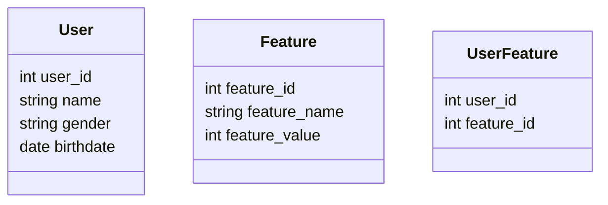
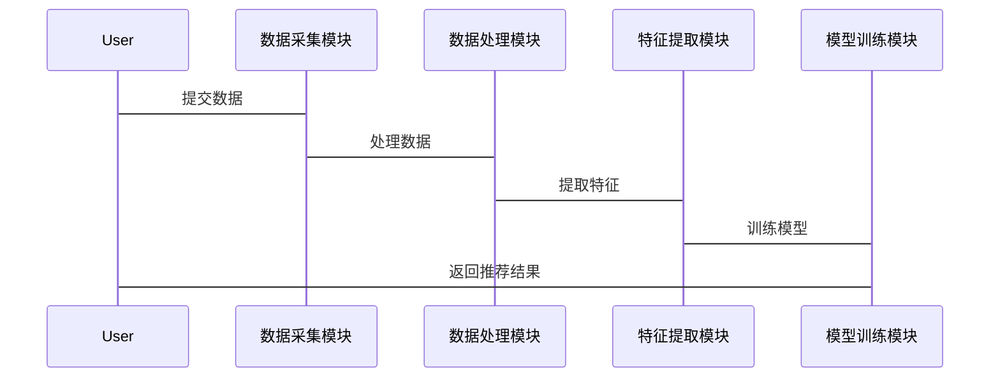

                 


# AI Agent的个性化：用户画像与偏好学习

> 关键词：AI Agent，用户画像，偏好学习，个性化推荐，机器学习，深度学习

> 摘要：本文深入探讨了AI Agent个性化的核心技术——用户画像与偏好学习。通过分析用户画像的构建方法、偏好学习的算法原理以及个性化推荐系统的实现，本文为读者提供了从理论到实践的全面指导。文章结合实际案例，详细讲解了如何利用机器学习和深度学习技术实现个性化推荐，帮助读者在实际应用中构建高效的个性化AI Agent。

---

# 第一部分: AI Agent的个性化基础

## 第1章: AI Agent与个性化概述

### 1.1 AI Agent的基本概念

#### 1.1.1 AI Agent的定义与特点
AI Agent（人工智能代理）是指能够感知环境并采取行动以实现目标的智能实体。其特点包括自主性、反应性、目标导向性和社交能力。AI Agent广泛应用于推荐系统、自然语言处理、机器人等领域。

#### 1.1.2 个性化在AI Agent中的重要性
个性化是AI Agent提供差异化服务的关键。通过分析用户的行为、偏好和特征，AI Agent能够为用户提供更精准的服务，提升用户体验和满意度。

#### 1.1.3 用户画像与偏好学习的定义
用户画像是基于用户数据构建的用户特征模型，用于描述用户的属性、行为和偏好。偏好学习则是通过分析用户数据，推断用户的兴趣和偏好，从而实现个性化推荐。

### 1.2 用户画像与偏好学习的背景

#### 1.2.1 用户画像的起源与发展
用户画像是个性化服务的基础，起源于市场营销领域，随着大数据和机器学习技术的发展，用户画像是构建个性化AI Agent的重要工具。

#### 1.2.2 偏好学习的理论基础
偏好学习基于概率论和统计学，通过分析用户的行为数据，推断用户的偏好和兴趣。

#### 1.2.3 个性化推荐的现状与挑战
个性化推荐在电商、新闻等领域广泛应用，但面临数据稀疏性、冷启动问题和计算复杂性等挑战。

### 1.3 个性化AI Agent的应用场景

#### 1.3.1 电商推荐系统
通过分析用户的购买记录和浏览行为，推荐个性化商品。

#### 1.3.2 个性化新闻推荐
根据用户的阅读历史和兴趣，推荐相关文章。

#### 1.3.3 智能音箱与语音助手
通过分析用户的语音指令和历史交互，提供个性化服务。

### 1.4 本章小结
本章介绍了AI Agent的基本概念、个性化的重要性以及用户画像与偏好学习的定义。通过分析应用场景，读者可以理解个性化AI Agent的核心价值。

---

# 第二部分: 用户画像与偏好学习的核心概念

## 第2章: 用户画像的构建与分析

### 2.1 用户画像的构建过程

#### 2.1.1 数据采集与预处理
通过日志数据、用户调查等渠道采集用户数据，并进行清洗和特征提取。

#### 2.1.2 特征提取与选择
从用户数据中提取关键特征，如年龄、性别、兴趣爱好等，并进行特征选择以减少维度。

#### 2.1.3 用户画像的可视化
通过图表和模型展示用户画像，帮助理解用户特征。

### 2.2 用户画像的属性特征对比

#### 2.2.1 用户画像的维度分析
分析用户画像的各个维度，如 demographics、行为特征、兴趣特征等。

#### 2.2.2 用户画像的特征对比表
通过表格对比不同用户的特征，找出差异和共性。

#### 2.2.3 用户画像的ER实体关系图

```mermaid
er
  actor User {
    [ID] User_ID (PK)
    [String] Name
    [String] Gender
    [Date] Birthdate
  }
  actor Feature {
    [ID] Feature_ID (PK)
    [String] Feature_Name
    [Integer] Feature_Value
  }
  relation M2M User-Feature {
    [Integer] User_ID (FK)
    [Integer] Feature_ID (FK)
  }
```

### 2.3 用户画像的特征提取与建模

#### 2.3.1 基于统计的特征提取
通过统计方法提取用户行为数据中的特征，如点击率、购买频率等。

#### 2.3.2 基于机器学习的特征提取
利用聚类、分类等机器学习算法提取用户特征。

#### 2.3.3 基于深度学习的特征提取
通过神经网络模型自动提取用户的深层特征。

---

## 第3章: 偏好学习的核心原理

### 3.1 偏好学习的基本原理

#### 3.1.1 偏好学习的定义与特点
偏好学习通过分析用户的偏好数据，推断用户的兴趣和需求。

#### 3.1.2 偏好学习的数学模型
基于矩阵分解的方法，构建用户-物品的偏好矩阵。

#### 3.1.3 偏好学习的算法框架
包括协同过滤、基于内容的推荐和深度学习推荐等方法。

### 3.2 偏好学习的核心算法

#### 3.2.1 协同过滤算法


#### 3.2.2 基于内容的推荐算法
基于物品的特征进行推荐，通过计算相似度进行推荐。

#### 3.2.3 深度学习推荐算法
利用神经网络模型捕捉用户的深层特征，如注意力机制等。

### 3.3 偏好学习的挑战与解决方案

#### 3.3.1 数据稀疏性问题
通过混合推荐算法和数据增强技术解决数据稀疏性问题。

#### 3.3.2 动态偏好处理
利用在线学习和增量学习方法处理用户偏好的动态变化。

#### 3.3.3 偏好学习的可解释性
通过可视化和可解释的模型提升用户对推荐结果的理解。

---

# 第三部分: 用户画像与偏好学习的算法实现

## 第4章: 用户画像的特征提取与建模

### 4.1 用户画像的特征提取

#### 4.1.1 基于统计的特征提取
通过统计方法提取用户的行为特征，如点击率、购买频率等。

#### 4.1.2 基于机器学习的特征提取
利用聚类、分类等算法提取用户特征。

#### 4.1.3 基于深度学习的特征提取
通过神经网络模型自动提取用户的深层特征。

### 4.2

---

## 第5章: 偏好学习的算法实现

### 5.1 协同过滤算法实现

#### 5.1.1 协同过滤的原理
基于用户相似性或物品相似性进行推荐。

#### 5.1.2 协同过滤的代码实现

```python
import pandas as pd
from sklearn.metrics.pairwise import cosine_similarity

# 数据预处理
df = pd.read_csv('user_data.csv')
user_item_matrix = df.pivot_table('rating', 'user_id', 'item_id').fillna(0)

# 计算相似度
similarity_matrix = cosine_similarity(user_item_matrix.T)

# 推荐算法
def recommend(user_id):
    user_vector = user_item_matrix.iloc[user_id]
    similarities = user_vector.dot(similarity_matrix)
    # 找出相似度最高的前k个用户
    top_k_users = similarities.argsort()[::-1][:5]
    recommended_items = user_item_matrix.iloc[top_k_users].sum()
    return recommended_items
```

### 5.2 深度学习推荐算法实现

#### 5.2.1 基于神经网络的推荐模型

```python
import keras
from keras.layers import Dense, Input, Concatenate
from keras.models import Model

# 输入层
user_input = Input(shape=(num_users,))
item_input = Input(shape=(num_items,))

# 模型层
user_embedding = Dense(64, activation='relu')(user_input)
item_embedding = Dense(64, activation='relu')(item_input)
concat = Concatenate()([user_embedding, item_embedding])
output = Dense(1, activation='sigmoid')(concat)

# 定义模型
model = Model(inputs=[user_input, item_input], outputs=output)
model.compile(optimizer='adam', loss='binary_crossentropy')
```

---

## 第6章: 系统分析与架构设计

### 6.1 系统功能设计

#### 6.1.1 领域模型设计



#### 6.1.2 系统架构设计

```mermaid
container 用户画像系统 {
    component 数据采集模块
    component 数据处理模块
    component 特征提取模块
    component 模型训练模块
}
```

### 6.2 系统接口设计

#### 6.2.1 接口定义



---

## 第7章: 项目实战

### 7.1 电商推荐系统案例

#### 7.1.1 环境搭建
安装必要的库，如Python、TensorFlow、Keras等。

#### 7.1.2 系统核心实现

```python
import pandas as pd
from sklearn.metrics.pairwise import cosine_similarity

# 数据加载
df = pd.read_csv('user_data.csv')

# 特征提取
user_item_matrix = df.pivot_table('rating', 'user_id', 'item_id').fillna(0)

# 协同过滤算法
similarity_matrix = cosine_similarity(user_item_matrix.T)

def recommend(user_id):
    user_vector = user_item_matrix.iloc[user_id]
    similarities = user_vector.dot(similarity_matrix)
    top_k_users = similarities.argsort()[::-1][:5]
    recommended_items = user_item_matrix.iloc[top_k_users].sum()
    return recommended_items

# 调用推荐
print(recommend(1))
```

#### 7.1.3 案例分析与优化

通过分析推荐结果，优化算法参数和模型结构，提升推荐准确率。

### 7.2 最佳实践

#### 7.2.1 小结
总结项目实施的关键步骤和成果。

#### 7.2.2 注意事项
注意事项包括数据质量、模型选择和性能优化。

#### 7.2.3 拓展阅读
推荐相关领域的进一步学习资料。

---

## 第8章: 结语

个性化AI Agent的实现依赖于用户画像和偏好学习的技术。通过构建详细的用户画像和精准的偏好学习，AI Agent能够为用户提供更智能化、个性化的服务。未来，随着技术的不断进步，个性化AI Agent将在更多领域发挥重要作用。

--- 

**关键词**：AI Agent，用户画像，偏好学习，个性化推荐，机器学习，深度学习

**摘要**：本文深入探讨了AI Agent个性化的核心技术——用户画像与偏好学习。通过分析用户画像的构建方法、偏好学习的算法原理以及个性化推荐系统的实现，本文为读者提供了从理论到实践的全面指导。文章结合实际案例，详细讲解了如何利用机器学习和深度学习技术实现个性化推荐，帮助读者在实际应用中构建高效的个性化AI Agent。

