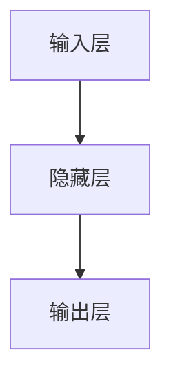
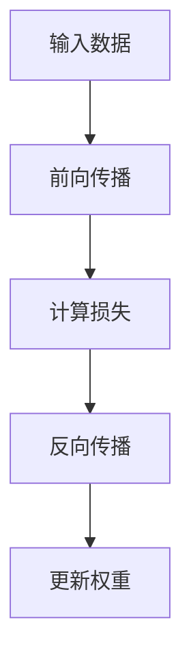
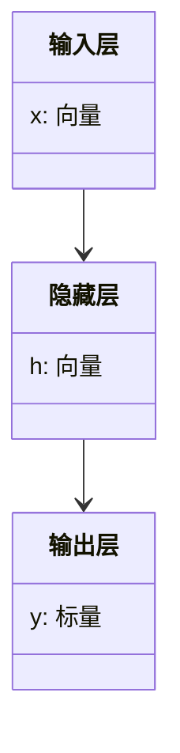
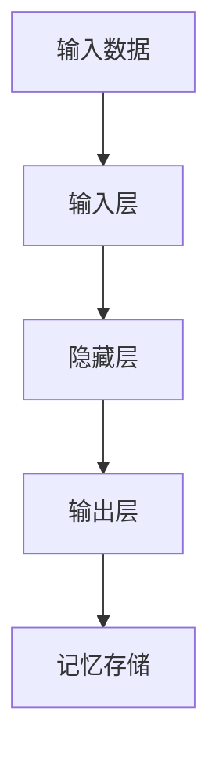
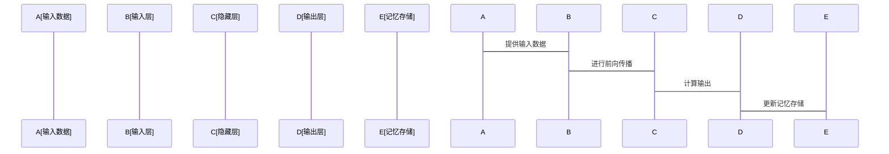

                 


# AI Agent的可微分神经计算机：增强记忆能力

## 关键词：AI Agent, 可微分神经计算机, 记忆网络, 神经网络, 增强学习

## 摘要：  
本文探讨了AI Agent在增强记忆能力方面的创新应用，重点介绍了可微分神经计算机（Differentiable Neural Computer, DNC）这一前沿技术。通过结合神经网络与可微分计算，DNC能够实现高效的记忆存储与检索，从而提升AI Agent的智能水平。本文从背景介绍、核心原理、算法实现、系统架构到实际应用，全面解析了DNC在AI Agent中的应用潜力和实现方法，为相关领域的研究者和开发者提供了理论支持与实践指导。

---

# 第一部分: AI Agent与可微分神经计算机的背景介绍

## 第1章: AI Agent的基本概念与应用

### 1.1 AI Agent的定义与特点
- **定义**: AI Agent是指具有自主决策能力和目标导向行为的智能体，能够感知环境、执行任务并优化自身行为。
- **特点**:  
  - 目标导向性: 明确的目标驱动行为。
  - 自主性: 能够在无外部干预的情况下独立运作。
  - 反应性: 能够实时感知环境并做出反应。
  - 学习能力: 通过经验或数据不断优化自身性能。

### 1.2 可微分神经计算机的背景
- **神经计算机的概念**: 神经计算机是一种模拟人脑神经网络的计算模型，通过神经元之间的连接和权重调整实现信息处理。
- **可微分计算的引入**: 可微分计算使得神经网络的权重更新过程更加高效，为神经计算机的优化提供了新的思路。
- **结合的意义**: 将可微分计算引入神经计算机，使得神经网络的训练更加高效，同时增强了其在记忆和推理任务中的表现。

### 1.3 AI Agent与可微分神经计算机的结合
- **结合的必要性**: AI Agent需要强大的记忆和推理能力来完成复杂任务，而传统的神经网络在记忆存储和检索方面存在局限性。
- **结合的核心目标**: 借助可微分神经计算机的高效记忆能力，提升AI Agent的智能水平。
- **结合的应用前景**: 在机器人、自动驾驶、智能助手等领域具有广泛的应用潜力。

---

# 第二部分: 可微分神经计算机的核心概念与联系

## 第2章: 可微分神经计算机的核心原理

### 2.1 可微分神经计算机的结构
- **神经网络的基本结构**: 由输入层、隐藏层和输出层组成，神经元之间通过权重连接。
- **可微分神经计算机的创新点**: 引入可微分计算，使得神经网络的权重更新过程更加高效。
- **数学模型**:  
  - 输入: \( x \in \mathbb{R}^n \)
  - 输出: \( y \in \mathbb{R}^m \)
  - 权重矩阵: \( W \in \mathbb{R}^{m \times n} \)
  - 损失函数: \( L = \frac{1}{2} (y - \hat{y})^2 \)

### 2.2 可微分神经计算机的优势
- **高效性**: 通过可微分计算，神经网络的训练过程更加高效。
- **准确性**: 可微分计算能够优化神经网络的权重，提升模型的准确性。
- **可解释性**: 通过分析权重的变化，可以更好地理解模型的决策过程。

### 2.3 可微分神经计算机与传统神经网络的对比

| 对比维度                | 传统神经网络                     | 可微分神经计算机                 |
|-------------------------|----------------------------------|---------------------------------|
| 权重更新方式            | 随机梯度下降                    | 可微分计算优化                  |
| 计算效率                | 较低                            | 较高                            |
| 可解释性                | 较低                            | 较高                            |

---

# 第三部分: 可微分神经计算机的算法原理

## 第3章: 可微分神经计算机的算法流程

### 3.1 算法的整体流程
- **输入数据的处理**: 将输入数据转化为神经网络的输入格式。
- **神经网络的前向传播**: 通过神经网络的前向传播计算输出。
- **损失函数的计算**: 根据输出与实际值计算损失。
- **反向传播与参数更新**: 通过反向传播更新神经网络的权重。

### 3.2 算法的数学模型

#### 神经网络的数学表示
- 输入: \( x \in \mathbb{R}^n \)
- 隐藏层: \( h = W_1 x + b_1 \)
- 输出层: \( y = W_2 h + b_2 \)

#### 损失函数
- 均方误差: \( L = \frac{1}{2} (y - \hat{y})^2 \)

#### 反向传播
- 梯度计算: \( \frac{\partial L}{\partial W_2} = (h)(y - \hat{y}) \)
- 权重更新: \( W_2 = W_2 - \eta \frac{\partial L}{\partial W_2} \)

### 3.3 算法的优化技巧
- **学习率调整**: 动态调整学习率以加速收敛。
- **批量归一化**: 在前向传播过程中对输入数据进行归一化处理。

---

## 图表展示（使用Mermaid）

### 神经网络结构图


### 算法流程图


---

# 第四部分: 可微分神经计算机的系统架构设计

## 第4章: 系统功能设计

### 4.1 问题场景介绍
- **目标**: 设计一个基于可微分神经计算机的AI Agent，提升其记忆能力。
- **问题**: 传统神经网络在记忆存储和检索方面存在不足。

### 4.2 系统功能设计
- **记忆存储**: 通过可微分神经计算机实现高效的记忆存储。
- **记忆检索**: 基于输入查询，从记忆存储中检索相关信息。
- **推理与决策**: 结合记忆信息进行推理和决策。

### 4.3 系统架构设计

#### 领域模型图


#### 系统架构图


### 4.4 系统接口设计
- **输入接口**: 接收外部输入数据。
- **输出接口**: 输出处理结果。
- **记忆接口**: 提供记忆存储和检索功能。

### 4.5 系统交互流程



---

# 第五部分: 可微分神经计算机的项目实战

## 第5章: 项目实现与案例分析

### 5.1 环境安装
- **Python版本**: 3.8+
- **依赖库安装**: `numpy`, `tensorflow`

### 5.2 核心代码实现

#### 神经网络实现
```python
import numpy as np

class NeuralNetwork:
    def __init__(self, input_size, hidden_size, output_size):
        self.W1 = np.random.randn(hidden_size, input_size)
        self.b1 = np.zeros((hidden_size, 1))
        self.W2 = np.random.randn(output_size, hidden_size)
        self.b2 = np.zeros((output_size, 1))
    
    def forward(self, x):
        self.z1 = np.dot(self.W1, x) + self.b1
        self.z2 = np.dot(self.W2, self.z1) + self.b2
        return self.z2
    
    def backward(self, y, x, learning_rate=0.1):
        delta3 = (y - self.z2)
        dW2 = (1/m)*delta3 * self.z1.T
        db2 = (1/m)*np.sum(delta3, axis=1, keepdims=True)
        delta2 = np.dot(self.W2.T, delta3)
        dW1 = (1/m)*delta2 * x.T
        db1 = (1/m)*np.sum(delta2, axis=1, keepdims=True)
        self.W2 += learning_rate * dW2
        self.b2 += learning_rate * db2
        self.W1 += learning_rate * dW1
        self.b1 += learning_rate * db1
```

### 5.3 案例分析
- **训练数据**: 使用MNIST手写数字数据集。
- **训练过程**: 进行多次迭代训练，优化神经网络的权重。
- **测试结果**: 在测试集上评估模型的准确率。

---

## 第六部分: 最佳实践与总结

### 6.1 小结
- 可微分神经计算机通过引入可微分计算，显著提升了神经网络的训练效率和模型性能。
- 在AI Agent中的应用，进一步增强了其记忆和推理能力。

### 6.2 注意事项
- **模型复杂度**: 避免模型过于复杂导致的计算开销过大。
- **数据质量**: 确保训练数据的多样性和代表性。

### 6.3 未来展望
- **算法优化**: 进一步优化可微分计算的效率。
- **应用场景拓展**: 探索更多领域的应用潜力。

### 6.4 拓展阅读
- 建议深入研究可微分计算在其他领域的应用，如自然语言处理和计算机视觉。

---

# 结语
通过本文的系统介绍，读者可以全面了解AI Agent的可微分神经计算机的原理、算法和应用。希望本文能够为相关领域的研究者和开发者提供有价值的参考和启发。

