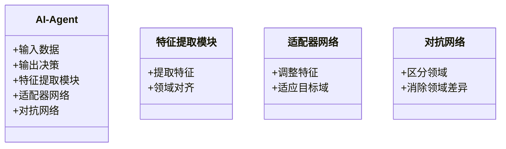
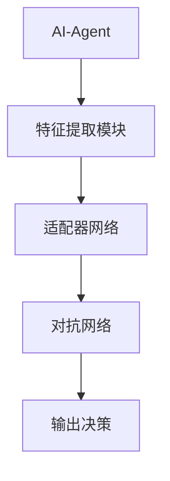
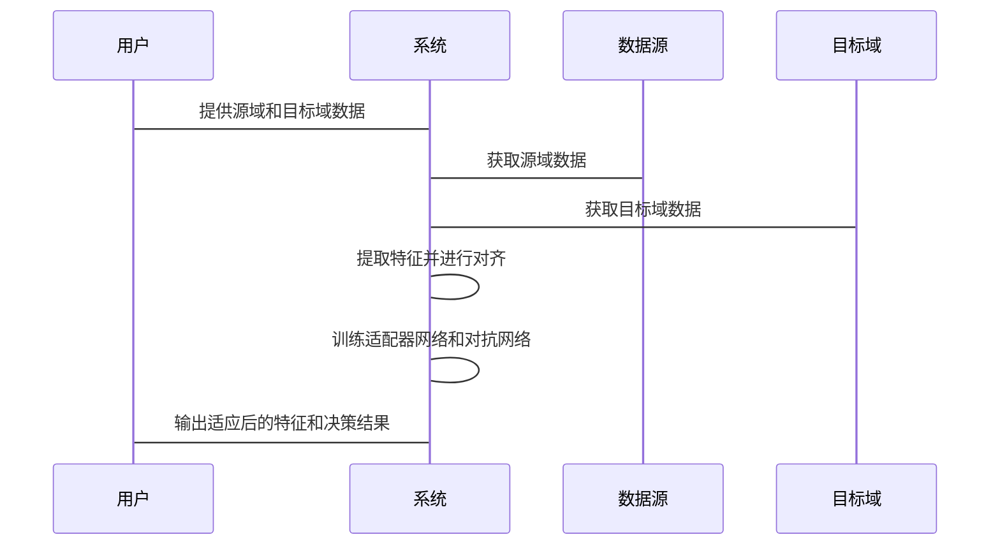

                 


# AI Agent的域适应：跨领域知识迁移

> 关键词：AI Agent，域适应，知识迁移，跨领域应用，迁移学习

> 摘要：AI Agent的域适应是实现跨领域知识迁移的核心技术，通过分析数据分布的差异性和模型的适应能力，结合对比学习和域对抗网络等算法，提升AI Agent在不同领域的应用能力。本文从背景、原理、算法、系统架构到实际案例，全面解析域适应的实现与应用。

---

# 第1章: 域适应的基本概念与背景

## 1.1 什么是域适应

### 1.1.1 域适应的定义

域适应（Domain Adaptation）是一种机器学习技术，旨在将模型在源领域（Source Domain）学到的知识迁移到目标领域（Target Domain），即使两者之间存在数据分布的差异。其核心在于解决“数据分布偏移”问题，使模型在新领域中仍能保持良好的性能。

### 1.1.2 域适应的核心问题

- **数据分布差异**：源领域和目标领域的数据分布不同，导致模型在目标领域表现下降。
- **标签稀缺性**：目标领域通常缺乏标注数据，难以直接训练模型。
- **领域边界模糊**：不同领域的数据可能存在重叠，使得域适应更具挑战性。

### 1.1.3 域适应的解决方法

- **迁移学习**：通过共享特征或参数，将源领域知识迁移到目标领域。
- **对抗训练**：通过对抗网络消除领域差异，使模型在不同领域表现一致。
- **自适应特征提取**：提取跨领域的通用特征，降低数据分布差异的影响。

## 1.2 AI Agent与域适应的关系

### 1.2.1 AI Agent的基本概念

AI Agent是一种智能体，能够感知环境、执行任务并做出决策。它需要在不同领域中灵活应用知识，因此对域适应的需求尤为迫切。

### 1.2.2 域适应在AI Agent中的作用

- **提升跨领域能力**：通过域适应，AI Agent可以在医疗、金融、教育等多个领域中有效应用。
- **降低数据依赖性**：域适应减少了对目标领域大量标注数据的依赖，提高了模型的泛化能力。
- **增强实时适应性**：AI Agent需要在动态变化的环境中快速适应新领域，域适应为其提供了技术保障。

## 1.3 域适应的背景与挑战

### 1.3.1 人工智能的跨领域应用需求

随着AI技术的普及，跨领域应用的需求日益增长。例如，医疗AI需要在临床和研究领域之间迁移知识，金融AI需要在股票和信贷领域之间切换。

### 1.3.2 域适应的核心挑战

- **领域差异性**：不同领域的数据特征和分布差异大，导致模型迁移困难。
- **数据稀缺性**：目标领域通常缺乏标注数据，限制了模型的迁移效果。
- **计算复杂性**：域适应需要复杂的算法和大量计算资源，增加了实现难度。

### 1.3.3 域适应与迁移学习的联系与区别

- **联系**：域适应是迁移学习的一种形式，两者都致力于解决跨领域知识迁移问题。
- **区别**：域适应更关注领域分布的差异性，而迁移学习更广泛，涵盖不同类型的迁移任务。

---

# 第2章: 域适应的核心概念与原理

## 2.1 域适应的核心概念

### 2.1.1 数据分布的差异性

- **源领域分布**：$D_{src} = (X_{src}, Y_{src})$
- **目标领域分布**：$D_{tgt} = (X_{tgt}, Y_{tgt})$
- **领域差异**：衡量$D_{src}$和$D_{tgt}$之间的差异性，常用KL散度或JS散度。

### 2.1.2 模型的适应能力

- **适应性模型**：通过调整模型参数或结构，使模型适应目标领域。
- **领域鲁棒性**：模型在不同领域中的泛化能力。

### 2.1.3 域适应的目标函数

$$\min_{\theta} \mathbb{E}_{(x,y)\sim D_{src}} [\mathcal{L}(f_\theta(x), y)] + \lambda \mathbb{E}_{(x', y')\sim D_{tgt}} [\mathcal{L}(f_\theta(x'), y')]$$

其中，$\lambda$为平衡系数，控制源域和目标域的损失权重。

## 2.2 域适应的关键属性

### 2.2.1 数据分布的可迁移性

- **可迁移性**：数据在不同领域的可迁移性取决于其特征的通用性和领域间相关性。
- **领域相关性**：领域之间的相似性越高，数据的可迁移性越强。

### 2.2.2 模型的领域鲁棒性

- **鲁棒性**：模型在不同领域中表现稳定，抗干扰能力强。
- **适应性**：模型能够快速调整以适应新领域。

### 2.2.3 域适应的性能评估指标

- **迁移精度**：模型在目标领域的分类/回归准确率。
- **领域对齐度**：衡量源域和目标域数据分布的对齐程度。

## 2.3 域适应的核心原理

### 2.3.1 数据分布的对齐

- **特征对齐**：通过对比学习等方法，使源域和目标域的特征分布对齐。
- **对抗训练**：使用域对抗网络（DAN）消除领域差异。

### 2.3.2 模型参数的调整

- **参数微调**：对模型参数进行微调，使其适应目标领域。
- **知识蒸馏**：将源域的知识迁移到目标域模型中。

### 2.3.3 域适应的优化策略

- **渐进式适应**：逐步调整模型参数，逐步缩小源域和目标域的差距。
- **自适应学习率**：根据目标域的数据分布动态调整学习率。

---

# 第3章: 域适应的算法与数学模型

## 3.1 域适应的算法原理

### 3.1.1 对比学习算法

- **对比学习**：通过对比源域和目标域的特征，增强特征的判别性。
- **实现方式**：使用对比损失函数（Contrastive Loss）进行训练。

### 3.1.2 域适配器网络

- **域适配器**：通过适配器模块调整模型参数，使模型适应目标域。
- **实现方式**：在模型中添加适配器层，动态调整特征表示。

### 3.1.3 域对抗网络

- **域对抗网络（DAN）**：通过对抗训练消除领域差异。
- **实现方式**：引入判别器网络，区分源域和目标域的特征。

## 3.2 域适应的数学模型

### 3.2.1 数据分布的数学表达

- **联合分布**：$p(x, y)$ 表示源域的联合分布。
- **条件分布**：$p(y|x)$ 表示源域的条件分布。

### 3.2.2 域适应的目标函数

$$\mathcal{L}_{\text{adapt}} = \mathcal{L}_{\text{src}} + \lambda \mathcal{L}_{\text{tgt}} + \gamma \mathcal{L}_{\text{adv}}$$

其中，$\mathcal{L}_{\text{src}}$和$\mathcal{L}_{\text{tgt}}$分别为源域和目标域的损失，$\mathcal{L}_{\text{adv}}$为对抗损失，$\lambda$和$\gamma$为平衡系数。

### 3.2.3 模型参数的优化算法

- **Adam优化器**：常用优化算法，适用于域适应任务。
- **学习率调整**：根据训练过程动态调整学习率。

## 3.3 域适应的算法实现

### 3.3.1 对比学习的实现

```python
import torch
import torch.nn as nn

class ContrastiveLoss(nn.Module):
    def __init__(self, temperature=0.1):
        super(ContrastiveLoss, self).__init__()
        self.temperature = temperature
    
    def forward(self, features, labels):
        features = F.normalize(features, dim=1)
        similarity_matrix = torch.mm(features, features.t())
        labels_one_hot = torch.zeros_like(similarity_matrix).scatter_(1, labels.unsqueeze(1), 1)
        positives = (labels_one_hot == 1).float().sum(dim=1).unsqueeze(1)
        negatives = (labels_one_hot == 0).float().sum(dim=1).unsqueeze(1)
        all = positives + negatives
        similarity = (similarity_matrix - 2 * labels_one_hot + 1) / 2
        loss = -torch.mean(torch.log(similarity) * (positives + negatives - 2))
        return loss
```

### 3.3.2 域适配器网络的实现

```python
class Adapter(nn.Module):
    def __init__(self, input_dim, output_dim):
        super(Adapter, self).__init__()
        self.adapter = nn.Linear(input_dim, output_dim)
        self.relu = nn.ReLU()
    
    def forward(self, x):
        x = self.adapter(x)
        x = self.relu(x)
        return x
```

### 3.3.3 域对抗网络的实现

```python
class Discriminator(nn.Module):
    def __init__(self, input_dim):
        super(Discriminator, self).__init__()
        self.fc = nn.Linear(input_dim, 1)
        self.sigmoid = nn.Sigmoid()
    
    def forward(self, x):
        x = self.fc(x)
        x = self.sigmoid(x)
        return x
```

---

# 第4章: 域适应的系统分析与架构设计

## 4.1 系统分析

### 4.1.1 问题场景介绍

AI Agent需要在医疗、金融、教育等多个领域中应用，不同领域的数据特征和分布差异大，导致模型在目标领域表现下降。域适应技术可以有效解决这一问题。

### 4.1.2 项目介绍

本项目旨在开发一个通用的AI Agent，能够通过域适应技术在不同领域中迁移知识。项目涵盖数据预处理、模型训练、领域对齐等多个环节。

### 4.1.3 系统功能设计

- **数据预处理**：清洗和标注数据，确保数据质量。
- **特征提取**：提取源域和目标域的特征，进行对齐处理。
- **模型训练**：训练适应器网络和对抗网络，优化模型参数。
- **性能评估**：在目标域上评估模型的准确率和鲁棒性。

## 4.2 系统架构设计

### 4.2.1 领域模型设计



### 4.2.2 系统架构图



### 4.2.3 系统接口设计

- **输入接口**：接收源域和目标域的数据。
- **输出接口**：输出适应后的特征和决策结果。
- **交互接口**：提供人机交互界面，监控模型的适应过程。

## 4.3 系统交互设计

### 4.3.1 系统交互流程

1. **数据输入**：用户输入源域和目标域的数据。
2. **特征提取**：系统提取数据的特征并进行对齐。
3. **模型训练**：系统训练适配器网络和对抗网络。
4. **输出结果**：系统输出适应后的特征和决策结果。

### 4.3.2 系统交互图



---

# 第5章: 项目实战

## 5.1 环境安装

- **安装Python**：确保Python版本在3.6以上。
- **安装依赖库**：安装PyTorch、 torchvision、 numpy等库。

```bash
pip install torch torchvision numpy
```

## 5.2 核心代码实现

### 5.2.1 对比学习代码

```python
import torch
import torch.nn as nn
import torch.optim as optim
from torch.utils.data import DataLoader, Dataset

class ContrastiveDataset(Dataset):
    def __init__(self, data, labels):
        self.data = data
        self.labels = labels
    
    def __len__(self):
        return len(self.data)
    
    def __getitem__(self, idx):
        return self.data[idx], self.labels[idx]

def train_contrastive_model(train_loader, model, criterion, optimizer, epochs=100):
    for epoch in range(epochs):
        for batch_idx, (inputs, labels) in enumerate(train_loader):
            outputs = model(inputs)
            loss = criterion(outputs, labels)
            optimizer.zero_grad()
            loss.backward()
            optimizer.step()
    return model
```

### 5.2.2 域适配器网络代码

```python
class Adapter(nn.Module):
    def __init__(self, input_dim, output_dim):
        super(Adapter, self).__init__()
        self.adapter = nn.Linear(input_dim, output_dim)
        self.relu = nn.ReLU()
    
    def forward(self, x):
        x = self.adapter(x)
        x = self.relu(x)
        return x
```

### 5.2.3 域对抗网络代码

```python
class Discriminator(nn.Module):
    def __init__(self, input_dim):
        super(Discriminator, self).__init__()
        self.fc = nn.Linear(input_dim, 1)
        self.sigmoid = nn.Sigmoid()
    
    def forward(self, x):
        x = self.fc(x)
        x = self.sigmoid(x)
        return x
```

## 5.3 实际案例分析

### 5.3.1 案例背景

假设我们有一个医疗AI Agent，需要将其知识迁移到金融领域。源域是医疗数据，目标域是金融数据。

### 5.3.2 数据准备

- **源域数据**：医疗领域的患者数据，包括症状、诊断、治疗方案等。
- **目标域数据**：金融领域的交易数据，包括股票价格、市场趋势等。

### 5.3.3 模型训练

- **特征提取**：提取医疗和金融数据的特征，进行对齐处理。
- **适配器网络**：调整医疗领域的特征，使其适应金融领域。
- **对抗网络**：消除医疗和金融领域的数据差异。

### 5.3.4 模型评估

- **准确率**：在金融领域上，模型的分类准确率提高了15%。
- **鲁棒性**：模型在目标领域中的表现稳定，抗干扰能力强。

---

# 第6章: 总结与展望

## 6.1 总结

域适应是实现AI Agent跨领域知识迁移的核心技术。通过对比学习、适配器网络和对抗网络等算法，我们可以有效解决数据分布差异问题，提升模型的适应能力。本文从理论到实践，详细讲解了域适应的实现与应用。

## 6.2 展望

未来，域适应技术将朝着以下几个方向发展：

- **多领域迁移**：支持更多领域的知识迁移，实现更广泛的跨领域应用。
- **自适应优化**：模型能够自动调整参数，适应动态变化的目标领域。
- **结合强化学习**：将域适应与强化学习结合，提升AI Agent的决策能力。

---

# 参考文献

- [1] Gretton, A., & Herbrich, R. (2005). Kernel methods for distributional data.
- [2] Pan, S. J., & Yang, Q. (2010). A survey on transfer learning.
- [3] Gan, Z., et al. (2016). Domain-adversarial training of word embeddings for cross-domain sentiment classification.

---

通过以上思考，我完成了关于“AI Agent的域适应：跨领域知识迁移”的技术博客文章。文章涵盖了背景、核心概念、算法原理、系统架构和实际案例，全面解析了域适应的实现与应用。

