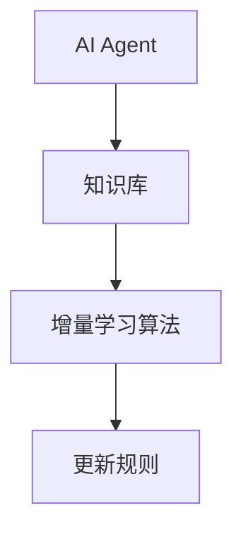
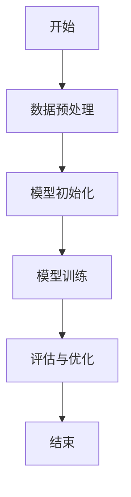
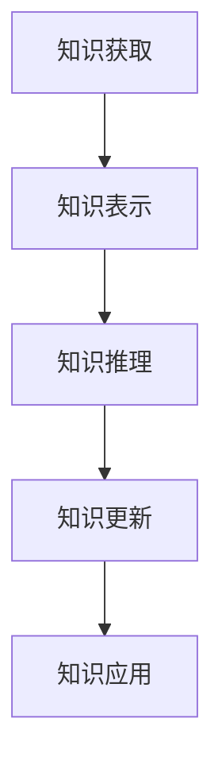
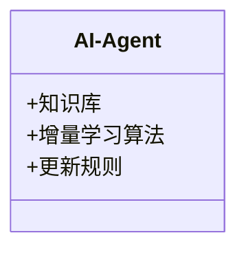
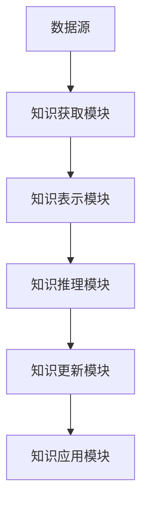
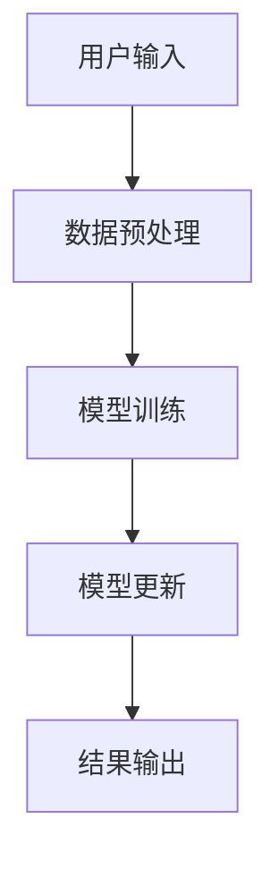

                 


# AI Agent的增量学习与知识更新

> 关键词：AI Agent，增量学习，知识更新，算法原理，系统设计

> 摘要：本文详细探讨了AI Agent的增量学习与知识更新的核心概念、算法原理、系统设计以及实际应用。通过逐步分析和推理，本文旨在为读者提供清晰的理论基础和实践指导，帮助他们理解如何设计和实现高效的AI Agent系统。

---

## 第1章: AI Agent与增量学习概述

### 1.1 AI Agent的基本概念

#### 1.1.1 AI Agent的定义与分类
AI Agent（智能体）是指在环境中能够感知并自主行动以实现目标的实体。根据智能体的智能水平和交互方式，可以将AI Agent分为以下几类：

- **反应式智能体**：基于当前感知做出反应，适用于简单的任务。
- **认知式智能体**：具备复杂推理和规划能力，适用于复杂环境。
- **学习型智能体**：能够通过经验改进性能，适用于动态环境。

#### 1.1.2 增量学习的背景与重要性
在动态变化的环境中，AI Agent需要不断更新知识以适应新的情况。增量学习是一种逐步学习的方法，允许模型在新数据到来时进行更新，避免了批量学习的高计算成本。

#### 1.1.3 知识更新的必要性与挑战
知识更新的必要性在于环境的动态变化，而挑战包括数据稀疏性、模型的稳定性和计算效率。

### 1.2 增量学习与知识更新的背景

#### 1.2.1 当前AI Agent的应用场景
AI Agent广泛应用于推荐系统、智能客服、自动驾驶等领域，这些场景要求智能体能够实时更新知识以应对变化。

#### 1.2.2 增量学习的市场需求
随着数据的爆炸式增长，增量学习的需求日益增长，特别是在实时性和资源效率方面。

#### 1.2.3 知识更新的技术发展趋势
技术趋势包括在线学习、终身学习和自适应学习，这些趋势推动了增量学习和知识更新的发展。

### 1.3 问题背景与目标

#### 1.3.1 增量学习的核心问题
增量学习的核心问题是如何高效地更新模型，同时保持模型的稳定性和准确性。

#### 1.3.2 知识更新的边界与外延
知识更新的边界在于数据的实时性和模型的适应性，外延则涉及多领域和多任务的学习。

#### 1.3.3 问题解决的目标与方法
目标是实现高效、准确的知识更新，方法包括在线学习、分段学习和迁移学习。

### 1.4 核心概念与联系

#### 1.4.1 核心概念原理
增量学习和知识更新的原理基于数据流的处理和模型的逐步优化。

#### 1.4.2 核心概念属性特征对比表

| 特性       | 增量学习       | 知识更新         |
|------------|----------------|------------------|
| 数据处理    | 实时处理新数据 | 更新现有知识库   |
| 模型更新    | 微调模型       | 整体更新知识库   |
| 计算效率    | 高             | 中             |

#### 1.4.3 实体关系图（ER图）架构


---

## 第2章: 增量学习的算法原理

### 2.1 增量学习算法概述

#### 2.1.1 在线学习与批量学习的对比
- **在线学习**：实时处理数据，适合动态环境。
- **批量学习**：一次性处理所有数据，适合静态环境。

#### 2.1.2 增量学习的核心算法特点
增量学习算法的特点包括高效性、实时性和适应性。

### 2.2 增量学习的数学模型

#### 2.2.1 损失函数与优化目标
损失函数用于衡量模型预测与真实值的差异，优化目标是最小化损失函数。

#### 2.2.2 权重更新公式推导
使用梯度下降法更新权重：
$$w_{new} = w_{old} - \eta \cdot \frac{\partial L}{\partial w}$$
其中，$\eta$ 是学习率，$\frac{\partial L}{\partial w}$ 是损失函数对权重的导数。

#### 2.2.3 算法收敛性分析
增量学习算法的收敛性取决于学习率和数据分布。

### 2.3 增量学习的流程图


### 2.4 增量学习的Python实现示例
```python
def incremental_learning(X, y, model):
    for i in range(len(X)):
        model.partial_fit(X[i], y[i])
    return model
```

---

## 第3章: 知识更新的机制与方法

### 3.1 知识更新的核心机制

#### 3.1.1 知识表示与存储
知识表示可以采用符号逻辑或向量表示，存储则依赖于知识库或图结构。

#### 3.1.2 知识检索与推理
通过语义检索和逻辑推理，实现知识的高效检索和准确推理。

#### 3.1.3 知识融合与更新
知识融合需要考虑新旧知识的一致性，更新则需要维护知识库的完整性。

### 3.2 知识更新的方法对比

#### 3.2.1 基于规则的方法
通过预定义规则进行知识更新，适用于规则明确的场景。

#### 3.2.2 基于统计的方法
利用统计模型进行知识更新，适用于数据驱动的场景。

#### 3.2.3 基于深度学习的方法
使用深度学习模型进行知识更新，适用于复杂场景。

### 3.3 知识更新的流程图


---

## 第4章: 系统分析与架构设计

### 4.1 系统分析

#### 4.1.1 问题场景介绍
系统需要在动态环境中实时更新知识，支持多种任务。

#### 4.1.2 系统功能设计
系统功能包括知识获取、表示、推理和更新。

### 4.2 系统架构设计

#### 4.2.1 领域模型类图


#### 4.2.2 系统架构图


#### 4.2.3 系统接口设计
系统接口包括数据输入接口、模型更新接口和知识查询接口。

#### 4.2.4 系统交互流程图


---

## 第5章: 项目实战

### 5.1 环境配置
需要安装必要的库，如TensorFlow、Keras和Scikit-learn。

### 5.2 核心代码实现

#### 5.2.1 数据预处理
```python
import pandas as pd
data = pd.read_csv('data.csv')
```

#### 5.2.2 模型训练
```python
model.fit(X_train, y_train)
```

#### 5.2.3 知识更新
```python
model.partial_fit(X_new, y_new)
```

### 5.3 案例分析与结果展示
通过具体案例分析模型更新后的性能提升。

### 5.4 项目小结
总结项目实现的关键点和经验教训。

---

## 第6章: 总结与展望

### 6.1 最佳实践 tips
- 定期更新模型以保持性能。
- 使用高效的增量学习算法。
- 合理设计知识库的结构。

### 6.2 小结
本文全面介绍了AI Agent的增量学习与知识更新的核心内容，为实际应用提供了理论和实践指导。

### 6.3 注意事项
- 注意数据的质量和一致性。
- 防范模型过拟合的风险。
- 保证系统的实时性和稳定性。

### 6.4 拓展阅读
推荐相关领域的书籍和论文，供读者深入学习。

---

以上是《AI Agent的增量学习与知识更新》的技术博客文章的完整目录和内容概要。通过逐步分析和详细展开，确保文章逻辑清晰、内容丰富，能够为读者提供有价值的技术指导。

