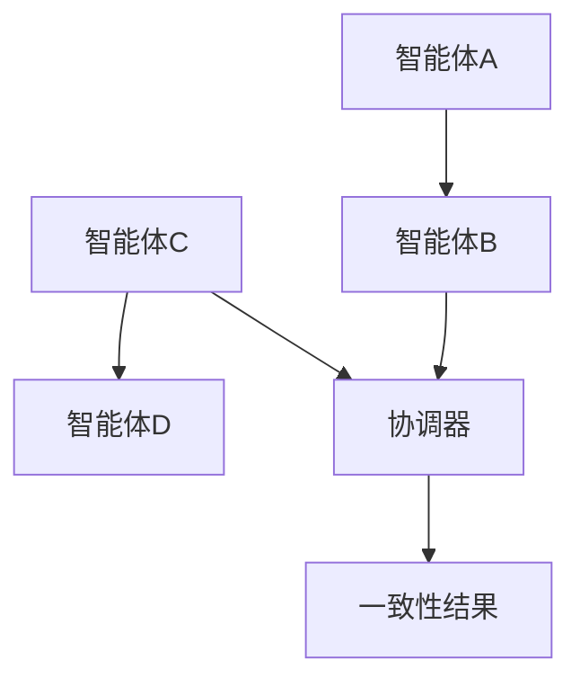
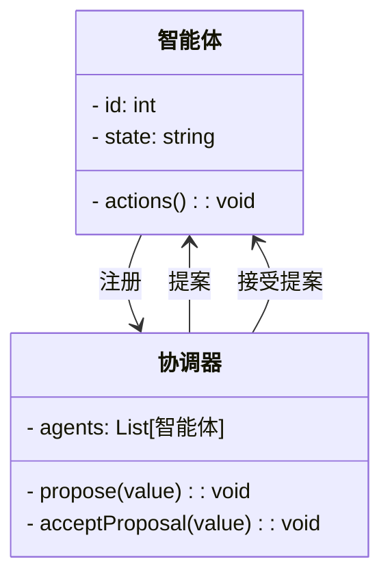

                 


# AI Agent的多智能体协同决策机制

> 关键词：AI Agent，多智能体，协同决策，分布式计算，一致性算法，强化学习

> 摘要：  
本文深入探讨了AI Agent在多智能体协同决策中的核心机制，从基础概念到算法原理，从系统设计到项目实战，全面解析多智能体协同决策的实现方法。文章首先介绍了AI Agent与多智能体系统的基本概念，随后分析了协同决策的核心机制，包括协作机制、通信协议和决策模型。接着，详细讲解了多智能体系统中的关键算法，如一致性算法和博弈论模型。最后，通过项目实战和最佳实践，给出了实际应用中的解决方案和注意事项。本文旨在为AI Agent的多智能体协同决策研究提供理论基础和实践指导。

---

## 第1章: AI Agent与多智能体系统基础

### 1.1 AI Agent的基本概念

#### 1.1.1 什么是AI Agent
AI Agent（人工智能代理）是指能够感知环境并采取行动以实现目标的智能实体。它可以是一个软件程序、一个机器人，甚至是一个虚拟角色。AI Agent的核心目标是通过感知和行动来优化其决策结果。

#### 1.1.2 AI Agent的核心特征
AI Agent具有以下几个核心特征：
1. **自主性**：能够在没有外部干预的情况下独立运作。
2. **反应性**：能够实时感知环境并做出反应。
3. **目标导向性**：所有行为都以实现特定目标为导向。
4. **学习能力**：能够通过经验改进自身的决策能力。

#### 1.1.3 多智能体系统的基本概念
多智能体系统（Multi-Agent System，MAS）是由多个智能体组成的分布式系统，这些智能体能够通过协作完成复杂的任务。多智能体系统的关键在于智能体之间的协同与通信。

---

### 1.2 多智能体协同决策的背景与意义

#### 1.2.1 协同决策的定义
协同决策是指多个智能体通过协作，共同完成复杂决策任务的过程。与单智能体决策相比，协同决策能够利用多个智能体的互补优势，提高决策的准确性和效率。

#### 1.2.2 多智能体协同决策的应用场景
多智能体协同决策广泛应用于以下领域：
1. **分布式计算**：如分布式系统中的任务分配。
2. **智能交通**：如自动驾驶车辆的协同决策。
3. **智能城市**：如城市交通管理系统的优化。
4. **游戏AI**：如多人在线游戏中的智能体协作。

#### 1.2.3 协同决策的核心价值
协同决策的核心价值在于通过多个智能体的协作，实现个体智能的叠加和增强，从而完成单个智能体无法完成的复杂任务。

---

### 1.3 多智能体系统的关键挑战

#### 1.3.1 信息共享与同步
多智能体系统中的信息共享是一个关键挑战。如何确保各个智能体之间的信息一致性和实时性，是协同决策的核心问题。

#### 1.3.2 决策冲突与协调
多个智能体在决策过程中可能会出现冲突。如何通过协调机制解决冲突，是多智能体协同决策的核心挑战之一。

#### 1.3.3 系统复杂性与可扩展性
随着智能体数量的增加，系统的复杂性和可扩展性问题逐渐凸显。如何设计高效的系统架构，是多智能体协同决策的一个重要研究方向。

---

## 第2章: 多智能体协同决策的核心机制

### 2.1 协作机制

#### 2.1.1 基于博弈论的协作
博弈论是研究多智能体协作的重要工具。通过分析智能体之间的博弈关系，可以找到最优的协作策略。

#### 2.1.2 基于规则的协作
基于规则的协作是指通过预定义的规则来实现智能体之间的协作。这种方式简单易实现，但在复杂场景下可能表现不佳。

#### 2.1.3 基于学习的协作
基于学习的协作是指通过机器学习算法，使智能体能够从经验中学习协作策略。这种方法能够适应复杂的动态环境，但实现难度较大。

---

### 2.2 通信与信息共享

#### 2.2.1 多智能体通信模型
多智能体通信模型包括以下几种：
1. **直接通信**：智能体之间直接交换信息。
2. **间接通信**：通过中间媒介进行信息交换。
3. **基于协议的通信**：通过预定义的通信协议进行信息交换。

#### 2.2.2 信息同步与一致性
信息同步是指确保所有智能体之间的信息一致性的过程。一致性算法是实现信息同步的关键工具。

#### 2.2.3 分布式信息管理
分布式信息管理是指在多智能体系统中，各个智能体独立管理自己的信息，并通过协作实现信息的共享和同步。

---

### 2.3 决策模型与算法

#### 2.3.1 基于一致性算法的决策
一致性算法是实现多智能体系统中信息同步的核心算法。通过一致性算法，可以确保所有智能体之间的信息一致。

#### 2.3.2 基于分布式计算的决策
分布式计算是指将任务分解成多个子任务，由不同的智能体分别完成，最后将结果汇总。这种方法能够提高系统的并行性和效率。

#### 2.3.3 基于强化学习的决策
强化学习是一种通过智能体与环境交互来学习最优策略的方法。在多智能体系统中，强化学习可以用于复杂决策任务的优化。

---

## 第3章: 多智能体系统的核心算法原理

### 3.1 分布式一致性算法

#### 3.1.1 基本原理
一致性算法的基本原理是通过智能体之间的通信，确保所有智能体之间达成一致。常用的一致性算法包括Paxos、Raft和Gossip等。

#### 3.1.2 算法流程图（Mermaid）



#### 3.1.3 Python实现示例
以下是一个简单的Paxos算法实现示例：

```python
class Paxos:
    def __init__(self, proposer):
        self.proposer = proposer
        self.acceptors = []
    
    def propose_value(self, value):
        # 提案者向所有接受者发送提案
        for acceptor in self.acceptors:
            acceptor.receiveProposal(value)
    
    def accept Proposal(self, value):
        # 接受者接收提案并确认
        pass
```

---

### 3.2 博弈论与纳什均衡

#### 3.2.1 基本概念
博弈论是研究多个智能体之间博弈关系的数学理论。纳什均衡是指在博弈中，每个智能体的策略都是最优的，且不存在任何智能体能够单方面改变策略以获得更好的结果。

#### 3.2.2 纳什均衡的数学模型
纳什均衡的数学模型可以表示为：

$$ \text{对于所有智能体 } i, \text{策略 } s_i \text{ 是纳什均衡策略，当且仅当对于任意智能体 } j, \text{智能体 } i \text{ 的策略 } s_i \text{ 在智能体 } j \text{ 的策略 } s_j \text{ 下是最佳反应。} $$

#### 3.2.3 应用场景分析
博弈论与纳什均衡在多智能体协同决策中的应用非常广泛，例如在拍卖、市场定价和资源分配等领域。

---

## 第4章: 多智能体系统中的数学模型与公式

### 4.1 一致性算法的数学模型

一致性算法的数学模型可以通过以下公式表示：

$$ \text{对于任意智能体 } i, \text{其状态 } s_i \text{ 应该满足 } s_i = s_j \text{ 对所有智能体 } j。 $$

### 4.2 强化学习的数学模型

强化学习的数学模型可以通过以下公式表示：

$$ Q(s, a) = r + \gamma \max_{a'} Q(s', a') $$

其中：
- \( Q(s, a) \) 表示在状态 \( s \) 下采取行动 \( a \) 的期望回报。
- \( r \) 表示立即回报。
- \( \gamma \) 表示折扣因子。
- \( Q(s', a') \) 表示在下一个状态 \( s' \) 下采取行动 \( a' \) 的期望回报。

---

## 第5章: 系统分析与架构设计

### 5.1 问题场景介绍
假设我们正在设计一个多智能体协同决策系统，用于智能交通管理。系统需要协调多个自动驾驶车辆的行动，以避免碰撞并提高交通效率。

### 5.2 项目介绍
我们的目标是设计一个能够实现多辆自动驾驶车辆协同决策的系统。

### 5.3 系统功能设计（领域模型Mermaid类图）



### 5.4 系统架构设计（Mermaid架构图）


---

## 第6章: 项目实战

### 6.1 环境安装
首先，安装必要的Python库，例如Paxos算法实现可能需要以下库：
```bash
pip install numpy
pip install matplotlib
```

### 6.2 核心代码实现

```python
class Agent:
    def __init__(self, id):
        self.id = id
        self.state = None
    
    def receiveProposal(self, value):
        self.state = value
    
    def sendState(self):
        return self.state

class Coordinator:
    def __init__(self, num_agents):
        self.agents = [Agent(i) for i in range(num_agents)]
    
    def propose(self, value):
        for agent in self.agents:
            agent.receiveProposal(value)
    
    def getConsensus(self):
        states = [agent.sendState() for agent in self.agents]
        return all(s == states[0] for s in states)
```

### 6.3 代码解读与分析
上述代码实现了一个简单的Paxos算法。`Agent`类表示一个智能体，`Coordinator`类负责协调多个智能体的状态一致性。

### 6.4 实际案例分析
假设我们有三个智能体，初始状态分别为`A`、`B`和`C`。通过协调器的提议，最终所有智能体的状态都变为`A`，实现了状态一致性。

### 6.5 项目小结
通过本项目，我们实现了多智能体系统中的一致性算法，验证了Paxos算法在实际应用中的有效性。

---

## 第7章: 最佳实践与总结

### 7.1 小结
多智能体协同决策是一个复杂但极具挑战性的领域。通过本文的介绍，我们了解了AI Agent的基本概念、多智能体系统的核心机制，以及实现中的关键算法。

### 7.2 注意事项
在实际应用中，需要注意以下几点：
1. **系统复杂性**：随着智能体数量的增加，系统的复杂性和可扩展性问题会逐渐凸显。
2. **信息同步**：确保智能体之间的信息一致性和实时性是实现协同决策的关键。
3. **算法选择**：根据具体场景选择合适的算法，避免过度复杂化。

### 7.3 拓展阅读
建议读者进一步阅读以下内容：
1. 分布式系统中的经典一致性算法。
2. 强化学习在多智能体系统中的应用。
3. 多智能体系统的博弈论模型。

---

通过本文的详细介绍，我们希望能够为读者提供一个多智能体协同决策的全面指南，帮助他们在实际应用中更好地理解和实现相关技术。

