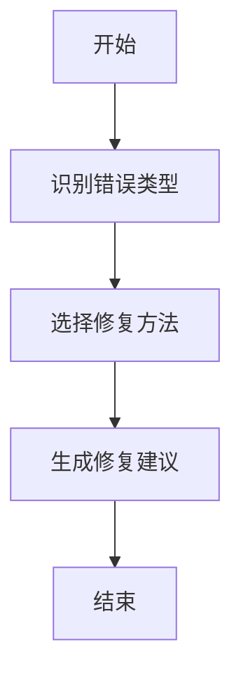
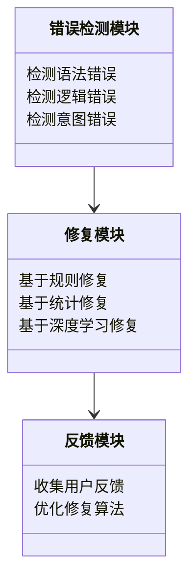
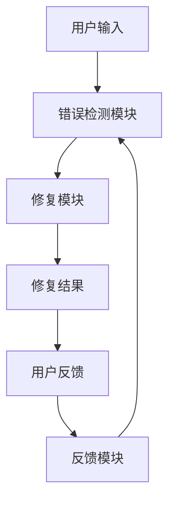
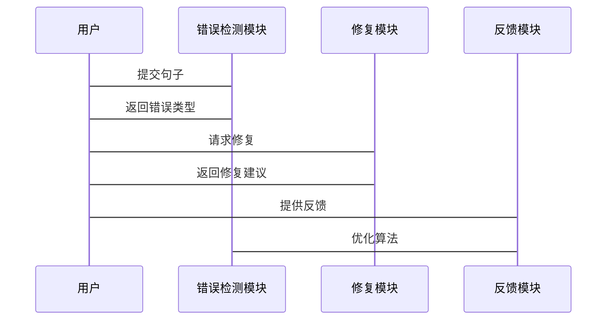

                 


# AI Agent的对话修复：处理交互中的错误

> 关键词：AI Agent, 对话修复, 错误检测, 自然语言处理, 用户意图, 反馈机制

> 摘要：AI Agent在对话中的错误修复是实现高效、自然人机交互的关键。本文深入探讨对话修复的核心概念，分析错误检测与修复的算法原理，设计系统的架构，并通过实际案例展示修复过程。同时，本文提供最佳实践建议，帮助开发者优化AI Agent的对话能力。

---

## 第一部分：背景介绍

### 第1章：AI Agent与对话修复概述

#### 1.1 AI Agent的基本概念
- **1.1.1 AI Agent的定义与分类**
  - AI Agent是能够感知环境并自主决策的智能体，分为简单反射型、基于模型的反应型、目标驱动型和效用驱动型。
- **1.1.2 对话在AI Agent中的重要性**
  - 对话是AI Agent与用户交互的主要方式，直接影响用户体验和系统实用性。
- **1.1.3 对话修复的背景与意义**
  - 对话中的错误可能导致误解，修复错误可提升用户体验和系统可靠性。

#### 1.2 对话中的错误类型
- **1.2.1 语法错误**
  - 用户输入的句子结构不正确，如“我去了公园，然后下雨了”。
- **1.2.2 逻辑错误**
  - 句子本身正确，但逻辑不通，如“如果下雨，那么晴天”。
- **1.2.3 上下文不连贯**
  - 对话前后缺乏逻辑联系，如“你能告诉我明天的天气吗？”，接着问“你能帮我预定酒店吗？”。
- **1.2.4 用户意图识别错误**
  - 系统未能正确理解用户的意图，如用户说“我饿了”，系统误认为是查询天气。

#### 1.3 对话修复的重要性
- **1.3.1 提升用户体验**
  - 及时修复错误可避免用户困惑，提升交互流畅度。
- **1.3.2 增强系统可靠性**
  - 减少错误响应，提升用户对系统的信任。
- **1.3.3 促进自然流畅的对话**
  - 修复错误使对话更自然，减少机械式响应。

---

## 第二部分：核心概念与联系

### 第2章：对话修复的核心概念

#### 2.1 错误检测与修复的机制
- **2.1.1 错误检测**
  - 通过自然语言处理技术识别语法、逻辑和意图错误。
- **2.1.2 错误修复**
  - 根据错误类型生成修复建议，如重新生成正确的句子或调整逻辑。

#### 2.2 错误检测方法对比
- 下表展示了三种主要错误检测方法的优缺点对比：

| 方法             | 优点                     | 缺点                     |
|------------------|--------------------------|--------------------------|
| 基于规则         | 实现简单，规则明确       | 需手动维护规则，扩展性差 |
| 基于统计         | 数据驱动，结果更准确     | 需大量数据，计算复杂     |
| 基于深度学习       | 强大学习能力，自动提取特征 | 需大量计算资源，训练时间长 |

#### 2.3 错误修复的流程
- 下图展示了错误修复的流程图：



---

## 第三部分：算法原理讲解

### 第3章：错误检测与修复的算法原理

#### 3.1 错误检测算法
- **基于规则的错误检测**
  - 使用预定义的语法规则检测错误，例如检查句子的主谓一致。
- **基于统计的错误检测**
  - 利用语言模型计算句子的概率，选择概率最低的句子作为错误。
- **基于深度学习的错误检测**
  - 使用循环神经网络（RNN）或 transformer 模型检测错误。

#### 3.2 错误修复算法
- **基于规则的修复**
  - 根据错误类型生成正确的句子，例如将“我去了公园，然后下雨了”改为“我去了公园后下雨了”。
- **基于生成模型的修复**
  - 使用生成对抗网络（GAN）或变体模型生成更自然的修复建议。

#### 3.3 数学模型
- 错误检测的数学模型如下：

  错误概率计算：$$P(error) = \prod_{i=1}^{n} P(word_i | error)$$

- 修复模型的数学模型如下：

  修复建议生成：$$P(correction | error) = \sum_{j=1}^{m} P(correction_j | error)$$

---

## 第四部分：系统分析与架构设计方案

### 第4章：对话修复系统的架构设计

#### 4.1 项目介绍
- 本项目旨在开发一个AI Agent对话修复系统，用于检测和修复对话中的错误。

#### 4.2 系统功能设计
- 下图展示了系统功能模块的类图：



#### 4.3 系统架构设计
- 下图展示了系统的整体架构：



#### 4.4 系统接口设计
- 系统接口包括：
  - 错误检测模块接口：接收输入句子，返回错误类型。
  - 修复模块接口：接收错误类型，返回修复建议。
  - 反馈模块接口：接收用户反馈，优化修复算法。

#### 4.5 系统交互流程
- 下图展示了系统交互流程：



---

## 第五部分：项目实战

### 第5章：AI Agent对话修复的实现

#### 5.1 环境安装
- 需要安装的工具和库包括：
  - Python 3.x
  - Natural Language Toolkit (nltk)
  - TensorFlow或PyTorch
  - transformers库

#### 5.2 核心代码实现
- 错误检测模块代码示例：

  ```python
  import nltk
  from transformers import pipeline

  def detect_error(sentence):
      # 语法错误检测
      grammar_errors = nltk.check sent_tokenize(sentence)
      # 逻辑错误检测
      logical_errors = check_logical_consistency(sentence)
      return grammar_errors, logical_errors
  ```

- 修复模块代码示例：

  ```python
  def generate_corrections(sentence, error_type):
      if error_type == 'grammar':
          return grammar_corrector(sentence)
      elif error_type == 'logic':
          return logic_corrector(sentence)
  ```

#### 5.3 修复案例分析
- 案例1：用户输入“我去了公园，然后下雨了”，系统检测到逻辑错误，并将其修复为“我去了公园后下雨了”。

#### 5.4 项目小结
- 本项目展示了AI Agent对话修复的实现过程，从错误检测到修复建议，再到用户反馈的优化，体现了系统设计的完整性和实用性。

---

## 第六部分：最佳实践与总结

### 第6章：最佳实践与总结

#### 6.1 最佳实践
- **选择合适的错误检测方法**：根据具体需求选择基于规则、统计或深度学习的方法。
- **优化修复算法**：通过用户反馈不断优化修复模型，提升修复准确率。
- **处理边缘情况**：考虑用户输入的多样性，设计鲁棒的错误检测和修复机制。

#### 6.2 小结
- 本文详细探讨了AI Agent对话修复的核心概念、算法原理和系统设计，通过实际案例展示了修复过程。
- 对话修复是实现高效人机交互的关键，未来可以进一步研究如何结合反馈机制优化修复效果。

#### 6.3 注意事项
- 在实际应用中，需注意数据隐私问题，确保用户输入的安全性。
- 定期更新错误检测规则和修复模型，以适应语言的变化和用户需求的多样化。

#### 6.4 拓展阅读
- 推荐阅读相关论文，如“Neural Approaches to Text Correction”和“Improving Dialogue Systems with User Feedback”。

---

通过本文的详细讲解，读者可以全面理解AI Agent对话修复的技术细节，并能够实际应用这些知识开发高效的对话修复系统。

