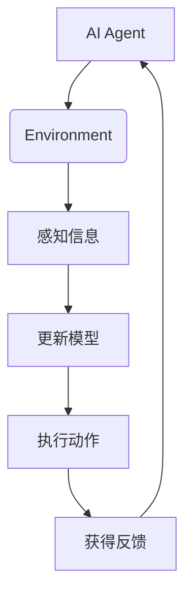
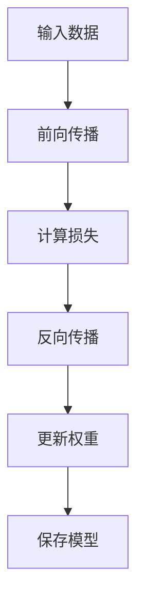
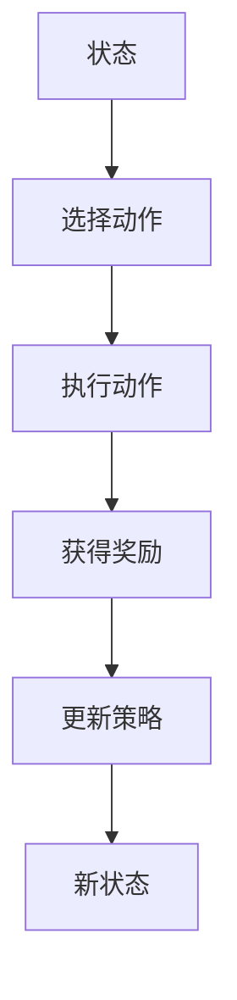
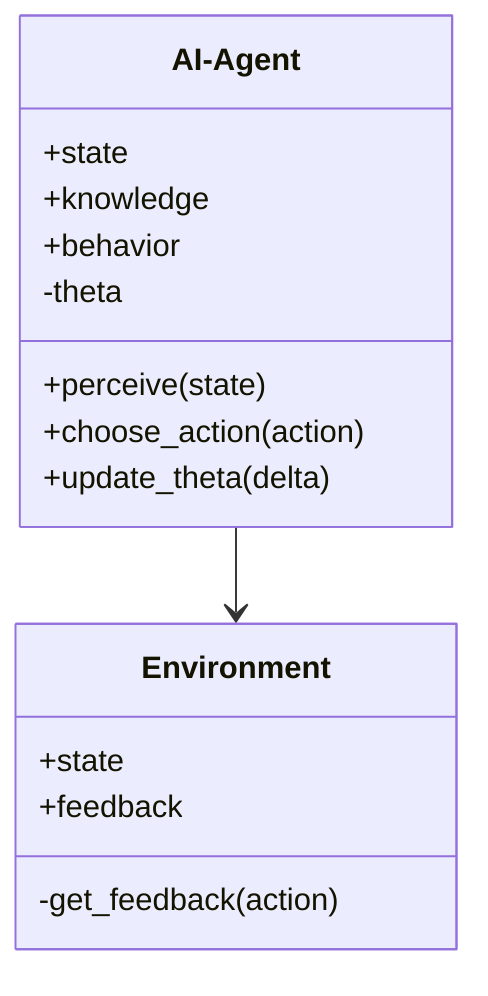
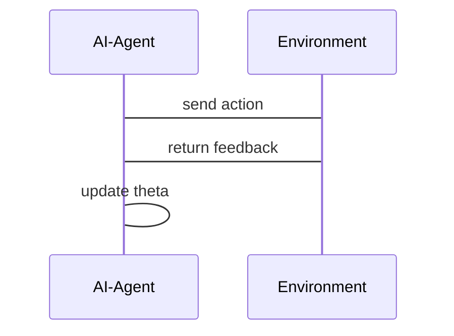

                 


# AI Agent的持续学习与适应机制

## 关键词：AI Agent，持续学习，自适应机制，强化学习，神经网络，数学模型

## 摘要：本文探讨AI Agent在持续学习与自适应机制中的核心原理、算法实现及系统设计。通过分析强化学习和神经网络的结合，详细讲解模型的数学表达式和流程图，提供实际案例和系统架构设计，帮助读者掌握AI Agent的持续进化能力。

---

# 第一部分: AI Agent的背景与基础

## 第1章: AI Agent的背景与基础

### 1.1 AI Agent的基本概念

#### 1.1.1 什么是AI Agent
AI Agent（人工智能代理）是指能够感知环境、自主决策并执行任务的智能实体。它可以是一个软件程序、机器人或其他智能系统，通过传感器获取信息，并通过执行器与环境互动。

#### 1.1.2 AI Agent的类型与特点
AI Agent可以分为以下几类：
1. **简单反射型Agent**：基于当前感知做出反应，无内部状态。
2. **基于模型的反射型Agent**：维护环境模型，用于决策。
3. **目标驱动型Agent**：为实现特定目标而行动。
4. **实用驱动型Agent**：追求效用函数的最大化。
5. **学习型Agent**：通过经验改进性能。

特点：
- **自主性**：无需外部干预，自主决策。
- **反应性**：实时感知环境并做出反应。
- **目标导向**：为实现特定目标而行动。
- **适应性**：根据环境变化调整行为。

#### 1.1.3 AI Agent的应用场景
AI Agent广泛应用于各个领域：
- **智能助手**：如Siri、Alexa，帮助用户完成任务。
- **自动驾驶**：通过感知环境实时调整驾驶策略。
- **机器人控制**：在制造业中执行精确操作。
- **游戏AI**：在电子游戏中实现智能对手。
- **推荐系统**：根据用户行为推荐个性化内容。

### 1.2 持续学习与适应机制的重要性

#### 1.2.1 为什么需要持续学习
AI Agent在动态环境中工作时，会面临不断变化的任务需求和环境条件。静态模型无法适应这些变化，因此需要持续学习能力，以实时更新知识和策略。

#### 1.2.2 适应机制的核心作用
适应机制使AI Agent能够根据新信息调整其模型和策略，以应对变化。例如，在自动驾驶中，适应机制可以实时调整驾驶模型以应对天气变化或道路障碍。

#### 1.2.3 持续学习与适应的边界与外延
持续学习和适应的边界在于如何定义“变化”和“任务”。适应机制需要区分短期调整和长期学习，确保模型在稳定性和适应性之间找到平衡。

### 1.3 本章小结
本章介绍了AI Agent的基本概念、类型和应用场景，并强调了持续学习与适应机制的重要性。通过理解这些内容，读者可以为后续章节的学习打下坚实的基础。

---

# 第二部分: 核心概念与理论基础

## 第2章: 持续学习与自适应机制的核心原理

### 2.1 持续学习的基本原理

#### 2.1.1 持续学习的定义与特点
持续学习是指AI Agent在任务执行过程中，通过与环境互动不断更新知识和策略的能力。其特点包括实时性、渐进性和累积性。

#### 2.1.2 持续学习的算法框架
持续学习的算法通常包括以下步骤：
1. **感知环境**：获取当前环境信息。
2. **更新模型**：基于新信息调整模型参数。
3. **执行动作**：根据更新后的模型做出决策。

#### 2.1.3 持续学习与在线学习的区别与联系
- **区别**：持续学习强调实时性和连续性，而在线学习通常指数据流中的学习。
- **联系**：持续学习可以看作是一种特殊的在线学习形式。

### 2.2 自适应机制的实现原理

#### 2.2.1 自适应机制的定义与特点
自适应机制是指AI Agent能够根据环境反馈调整其行为策略的能力。其特点包括动态性、反馈驱动性和目标导向性。

#### 2.2.2 自适应机制的核心算法
自适应机制的核心算法包括：
1. **强化学习**：通过奖励机制调整行为策略。
2. **在线更新**：实时更新模型参数以适应新环境。

#### 2.2.3 自适应机制与强化学习的关系
自适应机制依赖于强化学习来调整行为策略，而强化学习则通过自适应机制实现动态调整。

### 2.3 持续学习与自适应机制的对比分析

#### 2.3.1 核心概念对比表格

| **对比维度** | **持续学习** | **自适应机制** |
|--------------|--------------|----------------|
| 目标          | 更新知识      | 调整行为策略    |
| 输入          | 环境信息      | 反馈与状态      |
| 输出          | 知识模型      | 行为决策        |
| 实现方法      | 在线学习      | 强化学习        |

#### 2.3.2 ER实体关系图架构
```mermaid
er
  entity AI-Agent {
    id: int
    knowledge: map
    behavior: map
  }
  entity Environment {
    id: int
    state: map
    feedback: map
  }
  AI-Agent --> Environment
```

#### 2.3.3 mermaid流程图展示


### 2.4 本章小结
本章详细介绍了持续学习和自适应机制的核心原理，通过对比分析和图形展示，帮助读者理解两者的关系和区别。

---

## 第3章: 持续学习算法的数学模型

### 3.1 基于神经网络的持续学习模型

#### 3.1.1 神经网络的基本结构
神经网络由输入层、隐藏层和输出层组成，通过权重参数传递信息。

#### 3.1.2 持续学习的神经网络模型
持续学习模型通过在线更新权重参数适应新数据。

#### 3.1.3 模型的数学表达式
神经网络的输出可以表示为：
$$ y = \sigma(Wx + b) $$
其中，$W$ 是权重矩阵，$x$ 是输入向量，$b$ 是偏置项，$\sigma$ 是激活函数。

### 3.2 自适应机制的数学模型

#### 3.2.1 自适应机制的数学表达式
自适应机制通过强化学习调整策略，数学表达式为：
$$ \theta_{t+1} = \theta_t + \alpha \nabla J(\theta_t) $$
其中，$\theta$ 是策略参数，$\alpha$ 是学习率，$\nabla J$ 是目标函数的梯度。

#### 3.2.2 模型的优化算法
优化算法通常使用随机梯度下降（SGD）：
$$ \theta_{t+1} = \theta_t - \eta \nabla J(\theta_t) $$
其中，$\eta$ 是学习率。

#### 3.2.3 模型的收敛性分析
模型收敛性依赖于学习率和优化算法的选择。较小的学习率有助于稳定收敛，但可能需要更多迭代。

### 3.3 算法实现的mermaid流程图



### 3.4 本章小结
本章通过数学模型和流程图详细讲解了持续学习算法的实现过程，帮助读者理解其背后的原理。

---

## 第4章: 基于强化学习的自适应算法

### 4.1 强化学习的基本原理

#### 4.1.1 强化学习的定义与特点
强化学习通过智能体与环境的交互，学习策略以最大化累积奖励。

#### 4.1.2 强化学习的算法框架
强化学习通常包括状态、动作、奖励和策略四个核心要素。

#### 4.1.3 强化学习与自适应机制的结合
自适应机制通过强化学习调整策略，使智能体在动态环境中保持最优表现。

### 4.2 基于强化学习的自适应算法实现

#### 4.2.1 算法流程图


#### 4.2.2 算法实现的Python代码示例
```python
import numpy as np

class AI-Agent:
    def __init__(self, state_space, action_space):
        self.state_space = state_space
        self.action_space = action_space
        self.theta = np.random.randn(state_space, 1)

    def perceive(self, state):
        return np.dot(self.theta, state)

    def choose_action(self, state):
        q = self.perceive(state)
        return np.argmax(q)

    def update_theta(self, delta):
        self.theta += delta

# 示例使用
agent = AI-Agent(4, 2)
state = np.array([1, 0, 0, 0])
action = agent.choose_action(state)
```

#### 4.2.3 算法实现的代码解读与分析
上述代码定义了一个简单的AI Agent，通过感知状态选择动作，并根据反馈更新参数。通过不断迭代，Agent能够适应新环境。

### 4.3 本章小结
本章通过强化学习详细讲解了自适应算法的实现，通过代码示例帮助读者理解其应用。

---

## 第5章: 系统分析与架构设计

### 5.1 问题场景介绍

#### 5.1.1 问题背景
AI Agent需要在动态环境中完成复杂任务，如自动驾驶、智能客服等。

#### 5.1.2 项目介绍
以智能客服系统为例，设计一个能够持续学习和适应客户需求的AI Agent。

### 5.2 系统功能设计

#### 5.2.1 领域模型mermaid类图


#### 5.2.2 系统架构设计mermaid架构图


#### 5.2.3 系统接口设计
AI Agent与环境交互的接口包括：
- `get_feedback(action)`：获取反馈。
- `update_theta(delta)`：更新参数。

#### 5.2.4 系统交互mermaid序列图


### 5.3 本章小结
本章通过系统分析与架构设计，展示了AI Agent在复杂任务中的实现过程。

---

## 第6章: 项目实战

### 6.1 环境安装与配置

#### 6.1.1 环境需求
安装Python、numpy、mermaid等工具。

#### 6.1.2 安装命令
```bash
pip install numpy mermaid
```

### 6.2 系统核心实现源代码

#### 6.2.1 AI Agent实现
```python
import numpy as np

class AI-Agent:
    def __init__(self, input_dim, output_dim):
        self.theta = np.random.randn(input_dim, output_dim)

    def forward(self, x):
        return np.dot(x, self.theta)

    def backward(self, x, delta):
        self.theta += delta

# 示例使用
agent = AI-Agent(4, 2)
x = np.array([1, 0, 0, 0])
y = agent.forward(x)
```

#### 6.2.2 环境实现
```python
class Environment:
    def __init__(self):
        pass

    def get_feedback(self, action):
        return np.random.randn()
```

### 6.3 代码解读与分析

#### 6.3.1 AI Agent实现解读
AI Agent通过感知输入，计算输出，并根据反馈更新参数。

#### 6.3.2 环境实现解读
环境根据AI Agent的动作返回反馈，用于更新模型。

### 6.4 功能测试与优化

#### 6.4.1 功能测试
测试AI Agent在不同输入下的输出是否符合预期。

#### 6.4.2 性能优化
通过调整学习率和优化算法，提高模型的收敛速度和准确率。

### 6.5 本章小结
本章通过项目实战，展示了AI Agent的实现过程，帮助读者掌握实际应用技能。

---

## 第7章: 最佳实践与小结

### 7.1 最佳实践

#### 7.1.1 数据质量的重要性
高质量的数据是模型表现的基础。

#### 7.1.2 模型调参技巧
合理选择学习率和优化算法，避免过拟合。

#### 7.1.3 持续学习与自适应机制的结合
将持续学习与自适应机制有机结合，提高模型的适应能力。

### 7.2 本章小结
总结全文内容，强调持续学习与自适应机制的重要性，并展望未来的研究方向。

### 7.3 注意事项

#### 7.3.1 数据安全
确保数据的隐私和安全。

#### 7.3.2 模型泛化能力
避免模型过拟合，确保其泛化能力。

#### 7.3.3 系统稳定性
确保系统在动态环境中的稳定性。

### 7.4 拓展阅读

#### 7.4.1 推荐书籍
1. 《深度学习》
2. 《强化学习入门》

#### 7.4.2 推荐博客与技术文章
1. https://towardsdatascience.com/continuous-learning-in-ai-agents
2. https://medium.com/exploringartificialintellgence/adaptive-algorithms

---

# 结语
通过本文的详细讲解，读者可以全面理解AI Agent的持续学习与适应机制，并能够在实际项目中应用这些知识。未来的研究方向将更加关注如何提高模型的泛化能力和稳定性，以应对更复杂的挑战。

