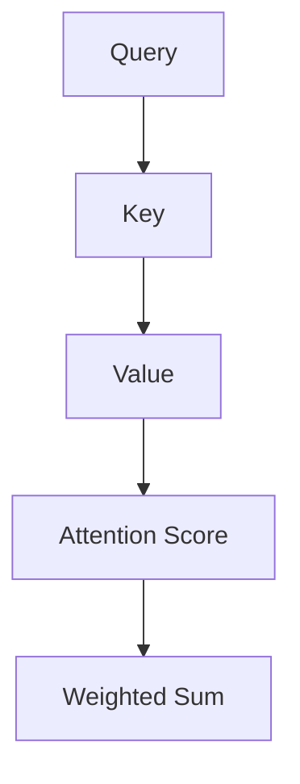
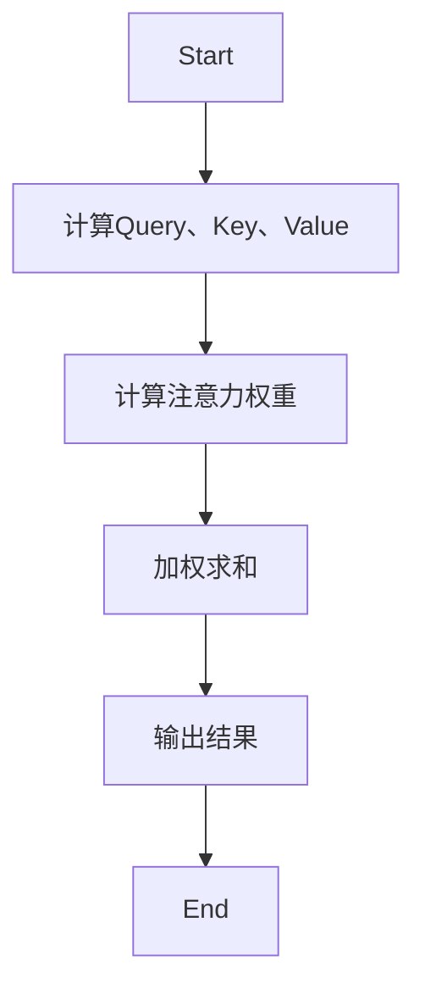
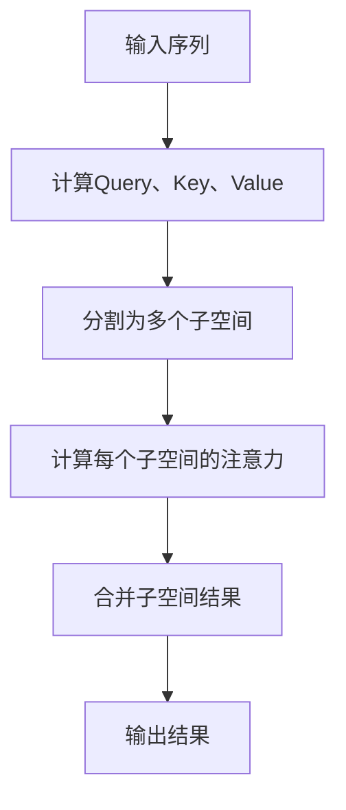
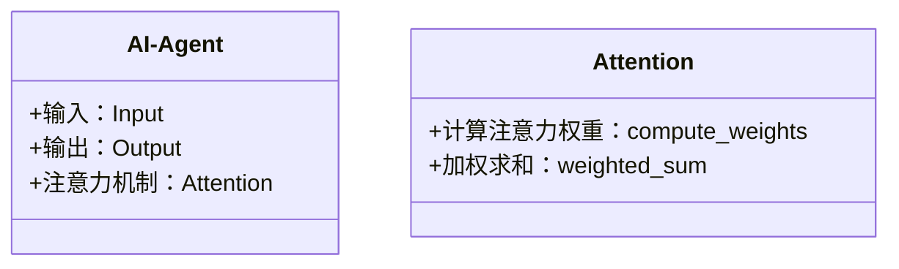
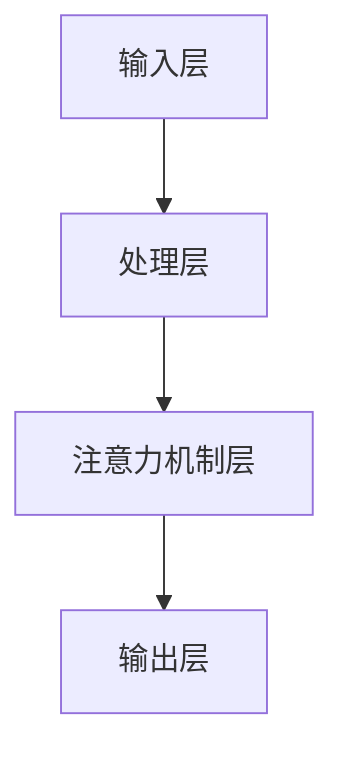
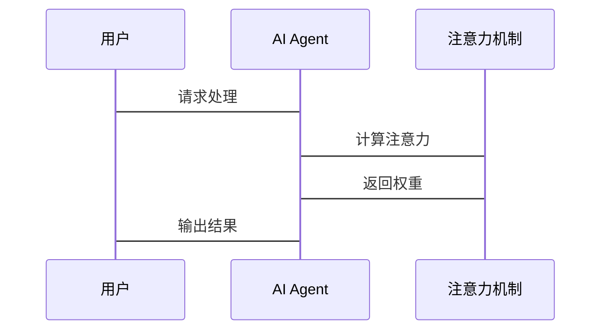

                 


# AI Agent的注意力机制：提升信息处理效率

> 关键词：AI Agent、注意力机制、信息处理效率、自注意力机制、多头注意力

> 摘要：注意力机制在AI Agent的信息处理中扮演着关键角色，通过自注意力机制和多头注意力机制，提升信息处理的效率和准确性。本文详细阐述了注意力机制的核心概念、算法原理、系统架构设计以及项目实战，帮助读者全面理解并应用这一技术。

---

## 第一部分: AI Agent的注意力机制基础

### 第1章: 注意力机制的背景与问题背景

#### 1.1 注意力机制的背景
人工智能（AI）在信息处理领域的应用日益广泛，但信息量的爆炸性增长使得传统的处理方式效率低下。注意力机制的引入为AI Agent提供了一种高效的解决方案，使它们能够聚焦于关键信息，提升处理效率。

##### 1.1.1 人工智能与信息处理的演进
人工智能的发展推动了信息处理技术的进步，从早期的规则驱动到现在的深度学习，信息处理方式不断优化。注意力机制作为深度学习中的一个重要概念，极大地提升了模型的效率和准确性。

##### 1.1.2 注意力机制的起源与概念
注意力机制最初在自然语言处理领域得到应用，如Transformer模型。其核心思想是让模型在处理信息时，能够根据上下文动态分配权重，关注重要的部分。

##### 1.1.3 AI Agent的核心问题与挑战
AI Agent在处理信息时，面临信息过载和处理效率低下的问题。注意力机制通过聚焦关键信息，帮助AI Agent高效地完成任务。

#### 1.2 问题背景与描述
信息处理效率低下是AI Agent面临的主要问题之一。注意力机制通过优化信息筛选和处理流程，解决了这一问题。

##### 1.2.1 信息处理效率低下问题
传统方法在处理大量信息时，效率低下，且容易忽略关键信息。注意力机制通过动态权重分配，提升处理效率。

##### 1.2.2 注意力机制在信息筛选中的作用
注意力机制能够动态分配权重，帮助模型关注重要信息，从而提高信息处理的准确性和效率。

##### 1.2.3 AI Agent中的注意力机制应用
在AI Agent中，注意力机制被广泛应用于自然语言处理、图像识别等领域，帮助模型高效处理信息。

#### 1.3 注意力机制的边界与外延
注意力机制的应用范围和未来发展需要明确界定。

##### 1.3.1 注意力机制的适用范围
适用于需要动态权重分配的任务，如机器翻译、语音识别等。

##### 1.3.2 与相关概念的区分
与传统卷积神经网络等方法的区别在于其动态性和灵活性。

##### 1.3.3 注意力机制的未来发展
随着研究的深入，注意力机制将更加智能化和多样化，应用范围也将进一步扩大。

### 第2章: 注意力机制的核心概念与联系

#### 2.1 注意力机制的原理
自注意力机制通过计算查询、键、值的相似性，实现信息的聚焦。

##### 2.1.1 自注意力机制的定义与特点
自注意力机制允许模型在处理每个元素时，考虑所有其他元素的信息，从而捕捉全局依赖关系。

##### 2.1.2 多头注意力机制的原理
多头注意力机制通过并行计算多个子空间的注意力，提升了模型的表达能力。

##### 2.1.3 注意力机制的数学模型
自注意力机制的计算公式如下：
$$
\text{Attention}(Q, K, V) = \text{softmax}\left(\frac{QK^T}{\sqrt{d_k}}\right)V
$$

#### 2.2 关键属性特征对比
通过对比不同注意力机制的属性，帮助读者更好地理解其优缺点。

##### 2.2.1 不同注意力机制的对比表格
| 特性 | 单头注意力 | 多头注意力 |
|------|------------|------------|
| 表达能力 | 较弱 | 较强 |
| 计算复杂度 | 较低 | 较高 |
| 应用场景 | 简单任务 | 复杂任务 |

##### 2.2.2 属性特征的详细说明
单头注意力适用于简单任务，而多头注意力在复杂任务中表现更佳。

##### 2.2.3 优缺点分析
多头注意力计算复杂度较高，但表达能力更强，适用于复杂场景。

#### 2.3 ER实体关系图与 Mermaid 流程图

##### 2.3.1 实体关系图


##### 2.3.2 Mermaid 流程图


---

## 第二部分: 注意力机制的算法原理

### 第3章: 注意力机制的算法原理

#### 3.1 自注意力机制的数学模型
自注意力机制通过计算序列中每个元素与其他元素的相关性，实现信息的聚焦。

##### 3.1.1 数学模型
$$
\text{Attention}(Q, K, V) = \text{softmax}\left(\frac{QK^T}{\sqrt{d_k}}\right)V
$$

##### 3.1.2 示例
假设输入序列为$x_1, x_2, x_3$，计算每个元素的注意力权重并求和。

#### 3.2 多头注意力机制的算法流程
多头注意力机制通过并行计算多个子空间的注意力，提升模型的表达能力。

##### 3.2.1 算法流程


##### 3.2.2 Python代码示例
```python
import torch

def multi_head_attention(query, key, value, num_heads):
    # 线性变换
    q = linear(query, d_model//num_heads)
    k = linear(key, d_model//num_heads)
    v = linear(value, d_model//num_heads)
    
    # 计算注意力权重
    attention_weights = softmax((q @ k.T) / sqrt(d_k), dim=-1)
    
    # 加权求和
    output = (attention_weights @ v).view(batch_size, -1, num_heads, d_model//num_heads)
    output = output.permute(0, 2, 1, 3).contiguous().view(batch_size, -1, d_model)
    return output
```

---

## 第三部分: 系统分析与架构设计方案

### 第4章: 系统分析与架构设计

#### 4.1 应用场景
注意力机制广泛应用于自然语言处理、计算机视觉等领域。

#### 4.2 系统功能设计
##### 4.2.1 领域模型


##### 4.2.2 系统架构图


#### 4.3 接口设计
##### 4.3.1 输入接口
- 输入数据格式：JSON
- 输入处理函数：process_input

##### 4.3.2 输出接口
- 输出数据格式：JSON
- 输出处理函数：process_output

#### 4.4 交互序列图


---

## 第四部分: 项目实战

### 第5章: 项目实战

#### 5.1 环境安装
- 安装Python和相关库（如TensorFlow、PyTorch）
- 安装Mermaid和LaTeX工具

#### 5.2 核心实现代码
##### 5.2.1 注意力机制实现
```python
def attention(input_seq, key_size, value_size, num_units):
    query = tf.layers.dense(input_seq, units=num_units)
    key = tf.layers.dense(input_seq, units=num_units)
    value = tf.layers.dense(input_seq, units=num_units)
    
    attention_weights = tf.nn.softmax(tf.matmul(query, key, transpose_b=True) / tf.sqrt(num_units))
    output = tf.matmul(attention_weights, value)
    return output
```

##### 5.2.2 应用案例分析
在自然语言处理任务中，注意力机制帮助模型更好地捕捉语义信息。

#### 5.3 项目小结
通过项目实战，读者可以深入理解注意力机制的实现和应用。

---

## 第五部分: 最佳实践与总结

### 第6章: 最佳实践与总结

#### 6.1 小结
注意力机制在AI Agent中的应用显著提升了信息处理效率。

#### 6.2 注意事项
- 注意力机制的计算复杂度较高，需合理选择应用场景。
- 需根据具体任务调整参数，避免过拟合。

#### 6.3 拓展阅读
推荐阅读相关论文和书籍，深入理解注意力机制的原理和应用。

---

通过以上结构，文章详细讲解了AI Agent的注意力机制，从理论到实践，帮助读者全面理解和应用这一技术。

