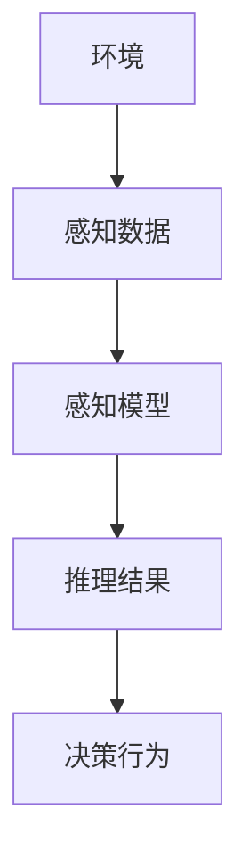
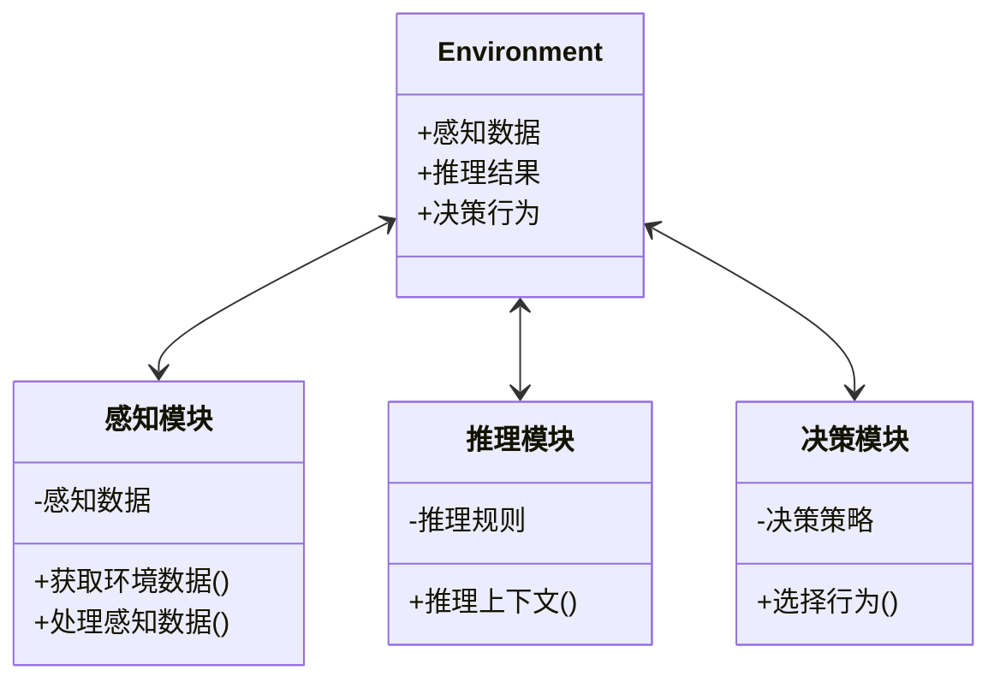
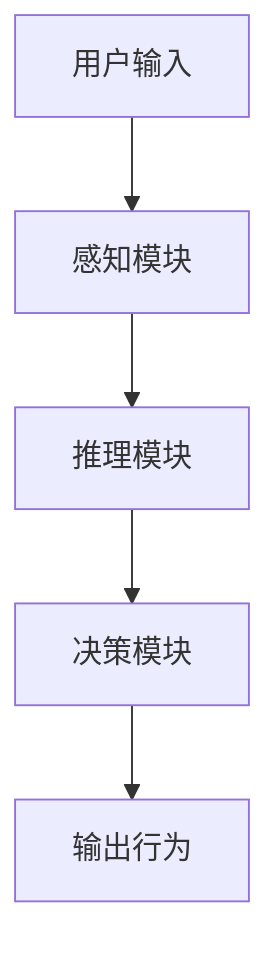
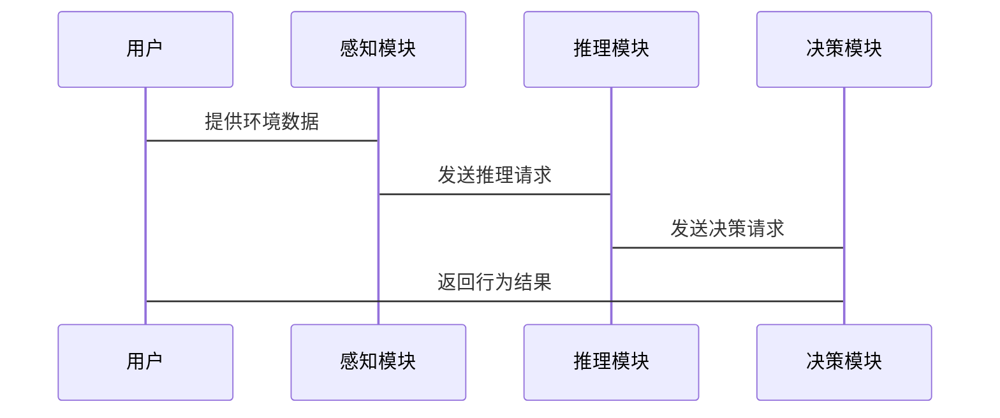

                 


# AI Agent的环境感知：上下文理解与适应

---

## 关键词  
AI Agent, 环境感知, 上下文理解, 环境适应, 多模态感知, 强化学习, 注意力机制

---

## 摘要  
本文深入探讨了AI Agent在环境感知中的上下文理解与适应能力，分析了环境感知的核心概念、技术原理和系统架构，结合实际案例详细讲解了AI Agent的环境感知实现过程。文章从理论到实践，系统性地介绍了环境感知的关键技术，包括多模态感知、意图识别、注意力机制和强化学习等，并通过具体实现展示了AI Agent如何在复杂环境中实现高效感知与适应。通过本文的讲解，读者可以全面理解AI Agent的环境感知能力，并掌握其实现的关键技术与方法。

---

## 第一部分: AI Agent的环境感知基础

## 第1章: AI Agent与环境感知概述

### 1.1 AI Agent的基本概念  
AI Agent（人工智能代理）是指能够感知环境、自主决策并执行任务的智能实体。它通过与环境交互，利用感知信息完成特定目标。AI Agent的核心特征包括自主性、反应性、目标导向性和学习能力。

- **自主性**：AI Agent能够独立决策，无需外部干预。  
- **反应性**：AI Agent能够实时感知环境并做出反应。  
- **目标导向性**：AI Agent的行为以实现特定目标为导向。  
- **学习能力**：AI Agent能够通过经验改进性能。

环境感知是AI Agent实现目标的基础，它决定了AI Agent如何理解和适应环境。

---

### 1.2 环境感知的背景与挑战  

环境感知是指AI Agent通过传感器或其他信息源获取环境信息，并理解这些信息的能力。环境感知的背景与挑战如下：

- **背景**：随着AI技术的发展，AI Agent需要在复杂多变的环境中完成任务，例如智能助手、自动驾驶和智能机器人等。  
- **挑战**：环境感知面临数据多样性、实时性、噪声干扰和动态变化等问题。  
- **外延**：环境感知不仅包括物理环境，还包括语义环境，例如语言、意图和情感等。

环境感知的动态性和复杂性要求AI Agent具备灵活的适应能力。

---

### 1.3 上下文理解与适应的必要性  

上下文理解是指AI Agent能够理解环境中的上下文信息，例如对话中的语境、任务的相关背景等。环境适应则是指AI Agent根据环境信息动态调整行为。两者的关系如下：

- **上下文理解的核心作用**：上下文理解是环境感知的关键，它帮助AI Agent理解环境中的隐含信息。  
- **环境适应的动态性**：环境适应要求AI Agent能够根据环境变化实时调整行为。  
- **关系**：上下文理解为环境适应提供信息支持，而环境适应则验证了上下文理解的准确性。

---

## 第2章: AI Agent环境感知的核心概念  

### 2.1 环境感知的关键技术  

环境感知的关键技术包括：

- **多模态感知技术**：结合视觉、听觉、触觉等多种感知方式，提高感知的全面性。  
- **意图识别技术**：通过分析用户行为或语言，识别用户的意图。  
- **上下文记忆机制**：存储和管理感知到的上下文信息，以便后续使用。

---

### 2.2 环境感知的核心要素  

环境感知的核心要素包括：

- **感知数据的采集与处理**：通过传感器或其他信息源获取数据，并进行预处理。  
- **知识表示与推理**：将感知信息表示为知识，并通过推理引擎进行推理。  
- **动作决策与反馈**：根据推理结果做出决策，并通过反馈机制优化行为。

---

### 2.3 环境感知的系统架构  

环境感知的系统架构设计原则包括：

- **分层架构设计**：将系统分为感知层、推理层和决策层，每一层负责不同的功能。  
- **模块化设计原则**：将系统划分为独立模块，便于维护和扩展。  
- **可扩展性与灵活性**：系统架构应具备良好的扩展性和灵活性，以适应环境的变化。

---

## 第3章: 环境感知的核心概念与联系  

### 3.1 感知模型的原理分析  

感知模型的原理分析包括：

- **基于规则的感知模型**：通过预定义的规则匹配感知数据，例如简单的逻辑判断。  
- **基于统计的学习模型**：通过统计方法学习感知数据的分布，例如朴素贝叶斯分类器。  
- **基于深度学习的感知模型**：通过神经网络学习感知数据的特征，例如卷积神经网络（CNN）和循环神经网络（RNN）。

---

### 3.2 感知模型的属性特征对比  

以下是感知模型的属性特征对比表：

| 感知模型       | 基础原理             | 优势                     | 劣势                     |
|----------------|----------------------|--------------------------|--------------------------|
| 基于规则       | 预定义规则           | 实现简单，易于解释       | 依赖规则的完整性         |
| 基于统计       | 统计学习             | 能够处理复杂数据         | 需要大量数据，易受噪声影响 |
| 基于深度学习   | 神经网络             | 高精度，能够处理非结构化数据 | 需要大量计算资源         |

---

### 3.3 实体关系图的架构设计  

以下是环境感知的实体关系图：



---

## 第4章: 环境感知的算法原理  

### 4.1 注意力机制的原理  

注意力机制是一种用于序列数据处理的机制，广泛应用于自然语言处理领域。其工作流程如下：

1. **输入序列**：输入一个序列，例如文本序列。  
2. **计算注意力权重**：通过计算每个位置的注意力权重，确定每个位置的重要性。  
3. **加权求和**：将注意力权重与输入序列进行加权求和，得到最终的注意力向量。

以下是一个简单的注意力机制实现示例：

```python
def attention(query, keys, values):
    # 计算查询与键的相似度
    scores = torch.matmul(query, keys.T) / torch.sqrt(torch.sum(keys**2, dim=-1))
    # 计算注意力权重
    attention_weights = torch.softmax(scores, dim=-1)
    # 加权求和
    output = torch.matmul(attention_weights, values)
    return output
```

其数学模型如下：

$$
\text{attention}(q, k, v) = \text{softmax}\left(\frac{q \cdot k}{\sqrt{d_k}}\right) \cdot v
$$

---

### 4.2 强化学习在环境适应中的应用  

强化学习是一种通过试错方法学习策略的技术，广泛应用于环境适应。以下是一个简单的Q-learning算法实现示例：

```python
import numpy as np

class QLearning:
    def __init__(self, state_space, action_space, alpha=0.1, gamma=0.9):
        self.state_space = state_space
        self.action_space = action_space
        self.alpha = alpha
        self.gamma = gamma
        self.q_table = np.zeros((state_space, action_space))

    def choose_action(self, state, epsilon=0.1):
        if np.random.random() < epsilon:
            return np.random.randint(self.action_space)
        return np.argmax(self.q_table[state])

    def update_q_table(self, state, action, reward, next_state):
        self.q_table[state, action] = self.q_table[state, action] + self.alpha * (reward + self.gamma * np.max(self.q_table[next_state]) - self.q_table[state, action])
```

其数学模型如下：

$$
Q(s, a) = Q(s, a) + \alpha \left(r + \gamma \max Q(s', a') - Q(s, a)\right)
$$

---

## 第5章: 环境感知的系统分析与架构设计  

### 5.1 问题场景介绍  

假设我们正在开发一个智能助手AI Agent，需要实现环境感知功能，以便更好地理解用户的意图和需求。

---

### 5.2 系统功能设计  

以下是系统功能设计的领域模型类图：



---

### 5.3 系统架构设计  

以下是系统架构设计的架构图：



---

### 5.4 系统接口设计  

以下是系统接口设计的序列图：



---

## 第6章: 项目实战：上下文理解与环境适应的实现  

### 6.1 环境搭建  

以下是环境搭建的步骤：

1. 安装Python和必要的库（如TensorFlow、PyTorch）。  
2. 安装Mermaid和PlantUML用于绘制图表。  
3. 配置开发环境（如Jupyter Notebook或VS Code）。  

---

### 6.2 核心代码实现  

以下是上下文理解与环境适应的核心代码实现示例：

```python
class AI-Agent:
    def __init__(self):
        self.context = {}
    
    def perceive_environment(self, data):
        # 处理感知数据
        self.context['current_context'] = data
    
    def adapt_environment(self):
        # 根据上下文调整行为
        pass
```

---

### 6.3 案例分析与经验总结  

以智能助手为例，分析上下文理解与环境适应的实际应用。通过具体案例，总结实现过程中遇到的问题及解决方案。

---

## 第7章: 总结与展望  

### 7.1 小结  

本文系统性地介绍了AI Agent的环境感知能力，包括核心概念、技术原理和系统架构，并通过具体案例展示了环境感知的实现过程。

---

### 7.2 注意事项  

在实际应用中，需要注意以下几点：  
- 数据的实时性和准确性。  
- 系统的可扩展性和灵活性。  
- 模型的泛化能力和鲁棒性。  

---

### 7.3 拓展阅读  

推荐以下书籍和论文：  
1. 《Deep Learning》（Ian Goodfellow等著）  
2. 《Reinforcement Learning: Theory and Algorithms》  
3. 《Attention Is All You Need》（论文）  

---

## 结语  

通过本文的讲解，读者可以全面理解AI Agent的环境感知能力，并掌握其实现的关键技术与方法。未来，随着技术的进步，AI Agent的环境感知能力将更加智能化和人性化。

