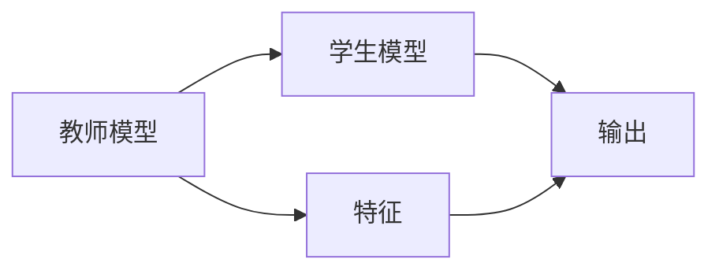
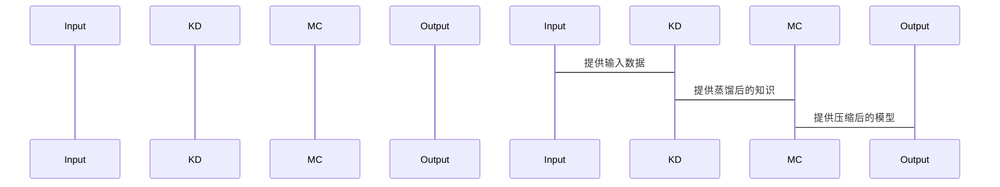
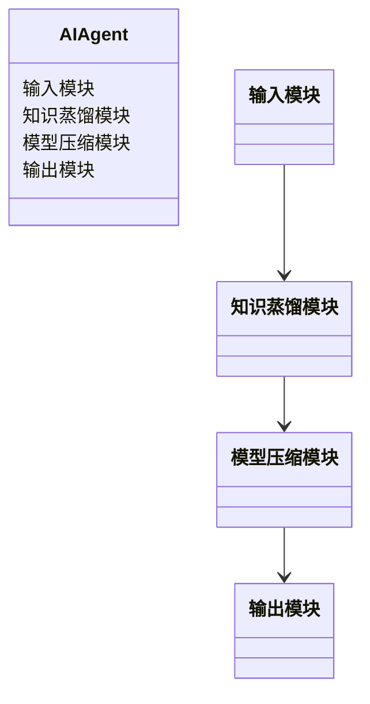

                 


# AI Agent的知识蒸馏与模型压缩

> 关键词：知识蒸馏，模型压缩，AI Agent，深度学习，模型优化

> 摘要：知识蒸馏和模型压缩是提升AI Agent性能和效率的关键技术。本文从基础知识到实际应用，全面解析知识蒸馏与模型压缩的原理、算法、系统设计及优化策略，帮助读者掌握AI Agent的核心技术。

---

# 第一部分: AI Agent的知识蒸馏与模型压缩基础

# 第1章: AI Agent与知识蒸馏概述

## 1.1 AI Agent的基本概念
### 1.1.1 AI Agent的定义与特点
AI Agent（人工智能代理）是指能够感知环境、自主决策并执行任务的智能体。其特点包括：
- **自主性**：无需外部干预，自主完成任务。
- **反应性**：能够实时感知环境并做出响应。
- **目标导向性**：基于目标驱动行为。
- **学习能力**：通过数据和经验优化性能。

### 1.1.2 AI Agent的应用场景
AI Agent广泛应用于自动驾驶、智能助手、推荐系统、机器人控制等领域。例如：
- 自动驾驶中的路径规划与决策。
- 智能助手（如Siri、Alexa）中的自然语言处理。
- 推荐系统中的用户行为预测。

### 1.1.3 知识蒸馏的背景与意义
知识蒸馏是一种将复杂模型的知识迁移到简单模型的技术，其意义在于：
- **提升效率**：减少计算资源消耗。
- **降低部署成本**：在资源受限的环境中运行。
- **优化性能**：在保持或提升性能的同时减少模型大小。

---

## 1.2 知识蒸馏的核心原理
### 1.2.1 知识蒸馏的基本概念
知识蒸馏通过教师模型（Teacher）和学生模型（Student）的协作，将教师模型的知识迁移到学生模型。教师模型通常是一个复杂的大型模型，而学生模型是一个较小的、易于部署的模型。

### 1.2.2 知识蒸馏的关键技术
- **软标签蒸馏**：教师模型输出概率分布，学生模型通过匹配这些概率分布进行学习。
- **硬标签蒸馏**：直接迁移类别标签。
- **特征蒸馏**：迁移中间层特征。

### 1.2.3 知识蒸馏与模型压缩的关系
知识蒸馏是模型压缩的一种技术，两者相辅相成。知识蒸馏通过知识迁移降低模型复杂度，模型压缩则通过技术手段进一步减少模型大小。

---

## 1.3 模型压缩技术的基本原理
### 1.3.1 模型压缩的定义与目标
模型压缩旨在在不显著降低性能的前提下，减少模型的参数数量和计算复杂度。目标包括：
- **减少存储空间**。
- **降低计算成本**。
- **提升运行效率**。

### 1.3.2 模型压缩的主要方法
- **参数剪枝**：移除冗余参数。
- **量化**：将模型参数从高精度（如32位浮点）降低到低精度（如8位整数）。
- **知识蒸馏**：通过教师模型指导学生模型。

### 1.3.3 知识蒸馏与压缩的结合
知识蒸馏可以通过提供软标签或特征来辅助模型压缩，进一步提升压缩后模型的性能。

---

## 1.4 本章小结
本章介绍了AI Agent的基本概念、应用场景，以及知识蒸馏和模型压缩的核心原理。知识蒸馏通过迁移教师模型的知识提升学生模型性能，而模型压缩则通过减少模型复杂度提升效率。

---

# 第2章: 知识蒸馏与模型压缩的核心概念

## 2.1 知识蒸馏的数学模型
### 2.1.1 知识蒸馏的损失函数
知识蒸馏的损失函数通常由两部分组成：
1. **学生模型的交叉熵损失**：$L_{CE}(S, Y)$，其中$S$是学生模型的输出，$Y$是真实标签。
2. **蒸馏损失**：$L_{dist}(T, S)$，其中$T$是教师模型的输出。

总损失为：
$$L = \alpha L_{CE}(S, Y) + (1-\alpha) L_{dist}(T, S)$$

其中$\alpha$是平衡系数。

### 2.1.2 蒸馏过程的数学表达
蒸馏过程可以表示为：
$$T = f_T(X), \quad S = f_S(X)$$
其中$X$是输入，$f_T$和$f_S$分别是教师模型和学生模型的前向传播函数。

### 2.1.3 蒸馏温度对结果的影响
蒸馏温度$T$控制教师模型输出的软标签的分布宽度。温度越高，分布越宽，学生模型更容易学习到类间关系；温度越低，分布越集中，学生模型更专注于具体类别。

---

## 2.2 模型压缩的数学模型
### 2.2.1 参数剪枝的数学表达
参数剪枝通过优化目标函数：
$$\min_{\theta} \frac{1}{2}\lambda\|\theta\|_0 + L(\theta)$$
其中$\lambda$是惩罚系数，$\|\theta\|_0$是参数的L0范数，表示非零参数的数量。

### 2.2.2 量化压缩的数学原理
量化通过将连续的参数值映射到离散的值集来减少参数数量。例如，将32位浮点数量化为8位整数。

### 2.2.3 知识蒸馏与压缩的联合优化
联合优化的目标是最小化压缩后的模型误差，同时最大化蒸馏效果：
$$\min_{\theta} L_{dist}(T, S) + L_{compress}(\theta)$$

---

## 2.3 知识蒸馏与模型压缩的对比分析
### 2.3.1 对比表格

| 技术 | 知识蒸馏 | 模型压缩 |
|------|----------|----------|
| 目标 | 知识迁移 | 减少模型复杂度 |
| 方法 | 软标签/特征迁移 | 剪枝/量化 |
| 优点 | 保持性能 | 提高效率 |
| 缺点 | 需要教师模型 | 可能降低性能 |

### 2.3.2 实体关系图



---

## 2.4 本章小结
本章通过数学模型和对比分析，详细讲解了知识蒸馏和模型压缩的核心概念及其联系。知识蒸馏通过迁移知识提升性能，模型压缩通过减少复杂度提升效率。

---

# 第3章: 知识蒸馏与模型压缩的算法原理

## 3.1 知识蒸馏算法的实现流程
### 3.1.1 教师模型与学生模型的构建
教师模型通常是一个预训练的大型模型，如BERT或ResNet。学生模型是一个小型模型，如MobileNet或TinyBERT。

### 3.1.2 蒸馏损失的计算与优化
蒸馏损失计算公式：
$$L_{dist} = \sum_{i=1}^n (T_i - S_i)^2$$
其中$T_i$和$S_i$分别是教师模型和学生模型的输出概率。

### 3.1.3 蒸馏过程中的温度调整策略
温度调整通常采用线性或指数退火策略。例如：
$$T = T_{\text{initial}} \times e^{-k \times \text{epoch}}$$

---

## 3.2 模型压缩算法的实现流程
### 3.2.1 参数剪枝的实现步骤
1. 训练教师模型。
2. 生成教师模型的软标签。
3. 剪枝学生模型的冗余参数。
4. 使用蒸馏损失优化学生模型。

### 3.2.2 量化压缩的实现细节
量化通常采用K-means聚类或神经网络量化方法。例如：
1. 将参数划分为$K$个簇。
2. 使用量化函数将参数映射到簇中心。

### 3.2.3 知识蒸馏与压缩的联合优化策略
联合优化通常采用交替优化策略：
1. 固定教师模型，优化学生模型的压缩参数。
2. 更新教师模型以适应压缩后的学生模型。

---

## 3.3 算法对比与优化
### 3.3.1 算法复杂度对比
- 知识蒸馏：时间复杂度与教师模型规模相关。
- 模型压缩：时间复杂度与剪枝策略相关。

### 3.3.2 算法性能对比
- 知识蒸馏：性能提升显著，但依赖教师模型。
- 模型压缩：性能损失较小，但需要优化策略。

---

## 3.4 本章小结
本章详细讲解了知识蒸馏与模型压缩的算法原理，包括实现流程、数学模型和优化策略。通过对比分析，明确了不同技术的优缺点和适用场景。

---

# 第4章: 系统分析与架构设计方案

## 4.1 系统分析
### 4.1.1 系统目标与需求分析
系统目标：设计一个高效的AI Agent，支持知识蒸馏和模型压缩技术。

需求分析：
1. 支持多种知识蒸馏方法。
2. 提供灵活的模型压缩策略。
3. 实现高效的系统架构。

### 4.1.2 系统功能模块划分
- **输入模块**：接收输入数据。
- **知识蒸馏模块**：实现知识蒸馏过程。
- **模型压缩模块**：实现模型压缩过程。
- **输出模块**：生成最终输出。

### 4.1.3 系统边界与交互
系统边界包括输入数据源和输出结果展示。交互流程如下：



---

## 4.2 系统架构设计
### 4.2.1 系统架构图


### 4.2.2 系统功能设计
- **输入模块**：接收输入数据并预处理。
- **知识蒸馏模块**：执行知识蒸馏过程。
- **模型压缩模块**：执行模型压缩过程。
- **输出模块**：生成最终输出并展示。

---

## 4.3 本章小结
本章通过系统分析和架构设计，明确了AI Agent的知识蒸馏与模型压缩系统的实现流程和交互关系。系统架构设计为后续的实现提供了清晰的指导。

---

# 第5章: 项目实战

## 5.1 项目介绍
### 5.1.1 项目背景
设计一个基于知识蒸馏和模型压缩的AI Agent，用于图像分类任务。

### 5.1.2 项目目标
1. 实现知识蒸馏过程。
2. 实现模型压缩过程。
3. 验证压缩后模型的性能。

---

## 5.2 环境安装
### 5.2.1 安装Python
```bash
python --version
```

### 5.2.2 安装依赖库
```bash
pip install numpy torch matplotlib
```

---

## 5.3 核心代码实现
### 5.3.1 教师模型实现
```python
import torch
class TeacherModel(torch.nn.Module):
    def __init__(self):
        super().__init__()
        self.fc = torch.nn.Linear(784, 10)
    def forward(self, x):
        return torch.nn.functional.softmax(self.fc(x), dim=1)
```

### 5.3.2 学生模型实现
```python
class StudentModel(torch.nn.Module):
    def __init__(self):
        super().__init__()
        self.fc = torch.nn.Linear(784, 500, bias=False)
        self.fc2 = torch.nn.Linear(500, 10)
    def forward(self, x):
        x = torch.nn.functional.relu(self.fc(x))
        return torch.nn.functional.softmax(self.fc2(x), dim=1)
```

### 5.3.3 知识蒸馏训练过程
```python
def train_teacher():
    teacher = TeacherModel()
    criterion = torch.nn.CrossEntropyLoss()
    optimizer = torch.optim.Adam(teacher.parameters(), lr=0.001)
    for epoch in range(10):
        for batch in train_loader:
            inputs, labels = batch
            outputs = teacher(inputs)
            loss = criterion(outputs, labels)
            optimizer.zero_grad()
            loss.backward()
            optimizer.step()
    return teacher

def train_student(teacher):
    student = StudentModel()
    criterion_dist = lambda outputs, soft_labels: torch.nn.MSELoss()(outputs, soft_labels)
    optimizer = torch.optim.Adam(student.parameters(), lr=0.001)
    for epoch in range(10):
        for batch in train_loader:
            inputs, labels = batch
            with torch.no_grad():
                soft_labels = teacher(inputs)
            outputs = student(inputs)
            loss_dist = criterion_dist(outputs, soft_labels)
            loss_total = loss_dist
            optimizer.zero_grad()
            loss_total.backward()
            optimizer.step()
    return student
```

---

## 5.4 项目小结
本章通过一个具体的项目实战，展示了AI Agent的知识蒸馏与模型压缩技术的实现过程。代码实现包括教师模型、学生模型和训练过程。

---

# 第6章: 最佳实践与注意事项

## 6.1 最佳实践
### 6.1.1 知识蒸馏的注意事项
1. **教师模型选择**：选择合适的教师模型。
2. **蒸馏温度调整**：根据任务调整温度。
3. **训练策略优化**：结合数据增强和正则化。

### 6.1.2 模型压缩的注意事项
1. **剪枝策略选择**：选择适合模型的剪枝方法。
2. **量化精度调整**：根据性能需求调整量化精度。
3. **联合优化策略**：结合蒸馏与压缩技术。

---

## 6.2 小结
知识蒸馏与模型压缩是提升AI Agent性能和效率的重要技术。通过最佳实践，可以进一步优化模型性能，降低计算成本。

---

# 结语

知识蒸馏与模型压缩是AI Agent领域的重要技术，能够有效提升模型性能和效率。本文通过系统化的分析和实战案例，全面介绍了这些技术的核心原理和实现方法。希望读者能够通过本文深入理解AI Agent的知识蒸馏与模型压缩技术，并将其应用到实际项目中。

--- 

如果您对本文有任何疑问或需要进一步的技术支持，请随时联系我！

