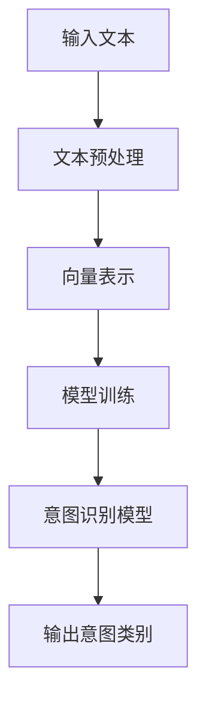
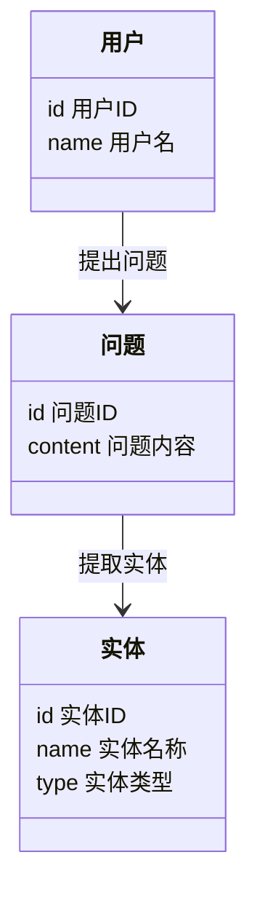
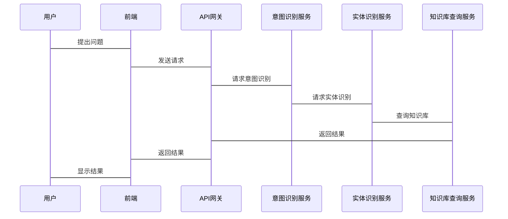

                 


# AI Agent的语义理解：超越关键词匹配

**关键词**：语义理解，AI Agent，关键词匹配，意图识别，实体识别，NLP，深度学习

**摘要**：  
AI Agent的语义理解技术是实现智能化交互的核心，超越传统的关键词匹配，通过意图识别和实体理解，提升人机交互的准确性和智能化水平。本文深入分析语义理解的背景、核心概念、算法原理、数学模型、系统架构，结合项目实战，全面阐述如何实现超越关键词匹配的语义理解。

---

## 第一部分: AI Agent语义理解的背景与核心概念

### 第1章: 问题背景与问题描述

#### 1.1 传统关键词匹配的局限性
##### 1.1.1 关键词匹配的基本概念
关键词匹配是一种基于字符串匹配的技术，常用于搜索引擎和信息检索系统。用户输入关键词，系统返回包含关键词的匹配结果。然而，这种方法无法理解用户的真实意图，容易产生误解。

##### 1.1.2 关键词匹配在实际应用中的问题
- **误匹配**：例如，输入“apple pen”时，可能匹配到“Apple公司的产品介绍”，而非“苹果形状的笔”。
- **缺乏上下文理解**：无法根据上下文判断关键词的语义。
- **用户体验差**：用户需要多次调整关键词才能获得满意的结果。

##### 1.1.3 语义理解的必要性
语义理解通过分析文本的上下文和意图，提供更准确的匹配结果，提升用户体验和系统智能化水平。

#### 1.2 语义理解的核心目标
##### 1.2.1 语义理解的定义与特点
语义理解（Semantic Understanding）是指系统能够理解文本的深层含义，包括意图、实体、情感等信息。

##### 1.2.2 语义理解与关键词匹配的主要区别
| **维度**       | **关键词匹配**               | **语义理解**                  |
|----------------|------------------------------|-----------------------------|
| **目标**       | 匹配关键词                   | 理解上下文和意图             |
| **方法**       | 基于字符串匹配               | 基于上下文和模型分析         |
| **应用效果**   | 可能产生误匹配               | 提高准确性，减少误匹配       |

##### 1.2.3 语义理解在AI Agent中的作用
- 提供更智能的交互体验。
- 支持复杂的用户需求，例如对话系统中的意图识别。
- 优化信息检索结果，提升用户满意度。

#### 1.3 问题解决方法与边界
##### 1.3.1 语义理解的主要解决方法
- **基于规则的方法**：通过预定义的规则进行意图识别。
- **基于统计的方法**：利用概率模型分析上下文。
- **基于深度学习的方法**：使用神经网络模型学习语义表示。

##### 1.3.2 语义理解的边界与外延
- **边界**：语义理解不解决语法分析问题，仅关注语义。
- **外延**：语义理解可以结合情感分析、实体识别等技术，扩展应用场景。

##### 1.3.3 核心概念与组成要素
| **要素**       | **描述**                     |
|----------------|------------------------------|
| **意图识别**   | 理解用户的操作意图           |
| **实体识别**   | 识别文本中的关键实体         |
| **上下文分析** | 分析文本的上下文关系         |

### 第2章: 语义理解的核心概念与联系

#### 2.1 语义理解的原理概述
语义理解通过分析文本的上下文、语法结构和语义关系，提取深层次的信息，例如意图和实体。

#### 2.2 核心概念的属性特征对比
| **概念**       | **属性特征**                |
|----------------|-----------------------------|
| **意图识别**   | 基于上下文判断用户意图       |
| **实体识别**   | 识别文本中的具体实体（人名、地名等） |
| **上下文分析** | 分析文本的语义关系           |

#### 2.3 ER实体关系图架构
使用ER图展示实体之间的关系，例如用户、产品、订单等实体之间的关系。

```mermaid
erd
  entity 用户 {
    id 用户ID
    name 用户名
  }
  entity 产品 {
    id 产品ID
    name 产品名称
    price 价格
  }
  entity 订单 {
    id 订单ID
    用户ID
    产品ID
    订单时间
  }
  用户 --> 订单: 下订单
  产品 --> 订单: 被订购
```

---

## 第3章: 语义理解的算法原理讲解

### 3.1 基于深度学习的意图识别算法

#### 3.1.1 算法流程
1. **数据预处理**：将文本数据转换为向量表示。
2. **模型训练**：使用神经网络模型训练意图识别模型。
3. **模型推理**：输入文本，模型输出意图类别。

#### 3.1.2 Mermaid流程图


#### 3.1.3 Python源代码实现
```python
import numpy as np
from sklearn.feature_extraction.text import TfidfVectorizer
from sklearn.svm import SVC

# 数据预处理
texts = ["apple pen", "banana pen"]
vectorizer = TfidfVectorizer()
X = vectorizer.fit_transform(texts)

# 模型训练
model = SVC()
model.fit(X.toarray(), ["product", "fruit"])

# 模型推理
new_text = "apple pen"
new_X = vectorizer.transform([new_text]).toarray()
predicted_class = model.predict(new_X)
print(predicted_class)
```

#### 3.1.4 数学模型与公式
- **TF-IDF计算公式**：$TF_{t,d} = \frac{\text{词t在文档d中的频率}}{\text{词t在所有文档中的总数}}$
- **余弦相似度**：$similarity = \frac{\vec{A} \cdot \vec{B}}{|\vec{A}| |\vec{B}|}$

---

### 第4章: 数学模型与公式

#### 4.1 概率论与统计模型
- **条件概率**：$P(A|B) = \frac{P(B|A)P(A)}{P(B)}$
- **贝叶斯定理**：用于分类问题，例如 spam 和 ham 的分类。

#### 4.2 信息论与熵
- **熵公式**：$H(X) = -\sum_{x} P(x) \log P(x)$
- **条件熵公式**：$H(X|Y) = \sum_{y} P(y) H(X|y)$

#### 4.3 向量空间模型
- **词向量表示**：使用 word2vec 或 GloVe 将词转换为向量。
- **句子向量表示**：使用句子的词向量进行加权求和，得到句子向量。

---

## 第5章: 系统分析与架构设计方案

### 5.1 问题场景介绍
设计一个智能客服系统，通过语义理解识别用户的问题，提供准确的回答。

### 5.2 系统功能设计
- **意图识别模块**：识别用户的问题类型。
- **实体识别模块**：提取问题中的关键实体。
- **知识库查询模块**：根据意图和实体查询知识库，返回答案。

#### 5.2.1 领域模型Mermaid类图


#### 5.2.2 系统架构Mermaid架构图


#### 5.2.3 系统交互Mermaid序列图


---

## 第6章: 项目实战

### 6.1 环境安装与配置
- **Python 3.8+**
- **库的安装**：`pip install numpy scikit-learn`

### 6.2 系统核心实现源代码
```python
from sklearn.feature_extraction.text import TfidfVectorizer
from sklearn.svm import SVC

# 数据预处理
texts = ["apple pen", "banana pen"]
vectorizer = TfidfVectorizer()
X = vectorizer.fit_transform(texts)

# 模型训练
model = SVC()
model.fit(X.toarray(), ["product", "fruit"])

# 模型推理
new_text = "apple pen"
new_X = vectorizer.transform([new_text]).toarray()
predicted_class = model.predict(new_X)
print(predicted_class)
```

### 6.3 代码解读与分析
- **数据预处理**：将文本数据转换为TF-IDF向量表示。
- **模型训练**：使用SVM分类器训练意图识别模型。
- **模型推理**：输入新文本，模型输出意图类别。

### 6.4 实际案例分析
假设用户输入“apple pen”，模型识别其意图为“product”，返回相关信息。

---

## 第7章: 最佳实践、小结与注意事项

### 7.1 最佳实践
- **选择合适的算法**：根据具体场景选择合适的方法，例如深度学习适合复杂场景。
- **数据质量**：确保数据标注准确，避免影响模型性能。
- **模型调优**：通过交叉验证和超参数优化提升模型性能。

### 7.2 小结
语义理解超越关键词匹配，通过意图识别和实体理解，显著提升人机交互的准确性和智能化水平。

### 7.3 注意事项
- **数据隐私**：处理用户数据时需注意隐私保护。
- **模型鲁棒性**：确保模型在不同场景下表现稳定。
- **持续学习**：定期更新模型以应对语言变化和新需求。

### 7.4 拓展阅读
- 《自然语言处理入门》
- 《深度学习实战》
- 《AI Agent设计与实现》

---

通过以上内容，我们系统地介绍了AI Agent语义理解的核心概念、算法原理、系统架构和项目实战，帮助读者全面掌握超越关键词匹配的语义理解技术。

