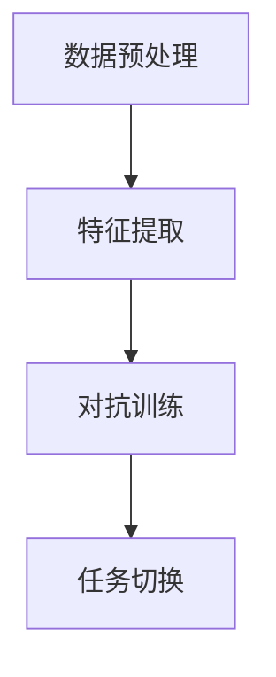
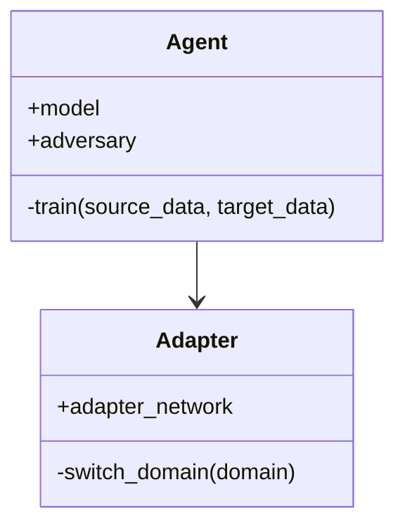
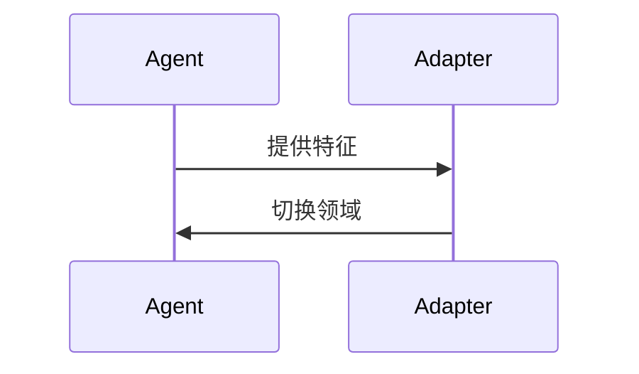

                 


---

# AI Agent的非监督域适应：跨领域泛化

## 关键词：AI Agent，非监督域适应，跨领域泛化，机器学习，深度学习，迁移学习

## 摘要：本文深入探讨了AI Agent在非监督域适应与跨领域泛化中的核心原理、算法实现及系统架构。通过数学模型、算法流程图和系统架构图的详细讲解，结合实际项目案例分析，为读者提供了一套系统化的理论与实践相结合的方法论，帮助读者理解并掌握AI Agent在不同领域中的泛化应用能力。

---

# 第1章: AI Agent的非监督域适应与跨领域泛化的背景介绍

## 1.1 问题背景与问题描述

### 1.1.1 AI Agent的定义与核心概念
AI Agent（人工智能代理）是指能够感知环境、自主决策并执行任务的智能实体。其核心能力包括感知、推理、规划、学习和执行。

### 1.1.2 非监督域适应的定义与特点
非监督域适应是指在没有标签数据的情况下，将模型在源领域上学到的知识迁移到目标领域的过程。其特点包括无标签依赖、适应性强、鲁棒性高。

### 1.1.3 跨领域泛化的概念与应用场景
跨领域泛化是指AI Agent在多个不同领域之间灵活切换并执行任务的能力。应用场景包括自然语言处理、计算机视觉、机器人控制等。

### 1.1.4 问题的边界与外延
非监督域适应与跨领域泛化的边界在于数据是否标注，以及任务的多样性。外延则包括多领域迁移学习、自适应学习等。

### 1.1.5 核心概念的结构与组成要素
非监督域适应的结构包括特征提取、领域适应、模型优化；跨领域泛化的结构包括领域切换、任务转换、结果评估。

## 1.2 问题解决与技术路径

### 1.2.1 非监督域适应的核心思想
通过对抗训练和概率生成模型，实现跨领域特征对齐。

### 1.2.2 跨领域泛化的实现方法
基于自适应网络和领域适配器，实现任务切换和领域迁移。

### 1.2.3 技术路径的选择与优化
选择无监督学习框架，优化特征提取模块，增强领域适配能力。

## 1.3 本章小结

---

# 第2章: 核心概念与联系

## 2.1 非监督域适应的核心原理

### 2.1.1 非监督学习的基本原理
基于数据分布，学习潜在特征表示，不依赖标签信息。

### 2.1.2 域适应的核心机制
通过对抗训练，使源域和目标域的特征分布对齐。

### 2.1.3 非监督域适应的数学模型
$$ P(x,y) = \sum_{i} \lambda_i P_i(x,y) $$

## 2.2 跨领域泛化的概念与实现

### 2.2.1 跨领域泛化的定义
AI Agent在多个领域间灵活切换并执行任务的能力。

### 2.2.2 跨领域泛化的实现方法
基于自适应网络和领域适配器，实现任务切换和领域迁移。

### 2.2.3 跨领域泛化的优缺点对比

| 优缺点 | 非监督域适应 | 跨领域泛化 |
|--------|--------------|-----------|
| 优点   | 无标签依赖   | 多领域适用 |
| 缺点   | 需要目标域数据 | 依赖适配器 |

## 2.3 核心概念的联系与对比

### 2.3.1 非监督域适应与跨领域泛化的联系
非监督域适应是实现跨领域泛化的基础，通过特征对齐实现跨领域任务。

### 2.3.2 非监督域适应与监督学习的对比
监督学习依赖标签，非监督域适应不依赖标签，适应性更强。

### 2.3.3 跨领域泛化与迁移学习的对比
迁移学习专注于单一领域，跨领域泛化注重多领域切换。

## 2.4 本章小结

---

# 第3章: 非监督域适应与跨领域泛化的算法原理

## 3.1 算法原理概述

### 3.1.1 非监督域适应的算法框架
- 特征提取
- 对抗训练
- 领域适配

### 3.1.2 跨领域泛化的算法框架
- 任务切换
- 领域适配
- 自适应网络

## 3.2 非监督域适应的数学模型

### 3.2.1 非监督学习的数学表达
$$ p(x) = \sum_{i=1}^{n} \lambda_i p_i(x) $$

### 3.2.2 域适应的数学模型
$$ D(x,y) = \arg\max_{\theta} \min_{\phi} \mathcal{L}(\theta, \phi) $$

## 3.3 跨领域泛化的数学模型

### 3.3.1 跨领域泛化的数学表达
$$ f(x) = \arg\max_{y} \sum_{i=1}^{m} \lambda_i P_i(y|x) $$

### 3.3.2 跨领域泛化的数学公式
$$ L = \mathcal{L}_{\text{adv}} + \mathcal{L}_{\text{cls}} $$

## 3.4 算法实现

### 3.4.1 非监督域适应算法实现
```python
class Agent:
    def __init__(self):
        self.model = self._build_model()
        self.adversary = self._build_adversary()

    def _build_model(self):
        # 特征提取网络
        pass

    def _build_adversary(self):
        # 对抗网络
        pass

    def train(self, source_data, target_data):
        # 对抗训练
        pass
```

### 3.4.2 跨领域泛化算法实现
```python
class CrossDomainAgent:
    def __init__(self):
        self.adapter = self._build_adapter()
        self.task_switcher = self._build_task_switcher()

    def _build_adapter(self):
        # 领域适配器
        pass

    def _build_task_switcher(self):
        # 任务切换网络
        pass

    def switch_domain(self, domain):
        # 切换领域
        pass
```

## 3.5 本章小结

---

# 第4章: 系统分析与架构设计

## 4.1 系统功能设计

### 4.1.1 系统功能模块
- 数据预处理模块
- 特征提取模块
- 对抗训练模块
- 任务切换模块

### 4.1.2 系统功能流程
1. 数据预处理：加载源域和目标域数据
2. 特征提取：提取数据特征
3. 对抗训练：对齐源域和目标域特征
4. 任务切换：切换到目标领域

## 4.2 系统架构设计

### 4.2.1 系统架构图


### 4.2.2 系统类图


### 4.2.3 系统接口设计
- 输入接口：数据预处理接口
- 输出接口：特征提取接口

## 4.3 系统交互设计

### 4.3.1 交互流程


## 4.4 本章小结

---

# 第5章: 项目实战

## 5.1 环境安装与配置

### 5.1.1 环境要求
- Python 3.8+
- TensorFlow 2.0+
- PyTorch 1.9+

### 5.1.2 安装依赖
```bash
pip install numpy tensorflow pytorch
```

## 5.2 系统核心实现

### 5.2.1 特征提取模块实现
```python
def extract_features(data):
    # 特征提取代码
    pass
```

### 5.2.2 对抗训练模块实现
```python
def adversarial_train(source_features, target_features):
    # 对抗训练代码
    pass
```

## 5.3 代码应用解读与分析

### 5.3.1 代码实现步骤
1. 数据加载与预处理
2. 特征提取与对齐
3. 对抗训练与评估
4. 任务切换与测试

## 5.4 实际案例分析

### 5.4.1 案例背景
假设目标领域为医疗数据，源领域为金融数据。

### 5.4.2 案例分析
通过对医疗数据和金融数据的特征对齐，实现跨领域分类任务。

## 5.5 本章小结

---

# 第6章: 最佳实践与总结

## 6.1 最佳实践 tips

### 6.1.1 数据预处理建议
确保数据质量和多样性。

### 6.1.2 模型选择建议
选择适合任务的模型架构。

### 6.1.3 超参数调优建议
通过实验确定最优参数。

## 6.2 未来研究方向

### 6.2.1 更高效的对抗训练方法
探索新的对抗策略。

### 6.2.2 更强大的领域适配器设计
优化适配器结构。

### 6.2.3 多领域迁移学习
扩展到更多领域。

## 6.3 本章小结

---

# 附录

## 附录A: 参考文献
1. 深度学习基础
2. 对抗训练综述
3. 跨领域泛化研究

## 附录B: 索引
- 非监督域适应：第3章
- 跨领域泛化：第4章

---

# 结束语

感谢您的阅读，希望本文能为您提供关于AI Agent的非监督域适应与跨领域泛化的深入见解。如需进一步探讨，欢迎随时联系！

