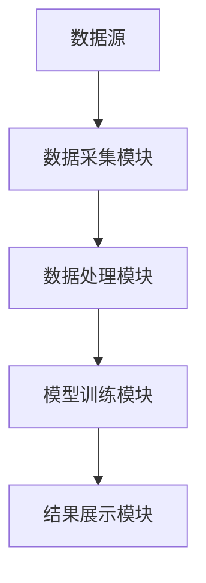

                 


# AI辅助的ESG投资影响评估

## 关键词：ESG投资、人工智能、自然语言处理、机器学习、投资评估

## 摘要：  
本文探讨了人工智能在ESG（环境、社会、治理）投资影响评估中的应用。通过分析ESG的核心要素，结合AI技术，展示了如何利用数据处理、模型构建和结果解释等步骤，提升ESG评估的效率和准确性。文章详细介绍了系统架构设计、算法原理、项目实战等内容，为投资者和科技人员提供了深入的技术见解。

---

# 第一部分: ESG投资与AI辅助评估的背景

## 第1章: ESG投资与AI辅助评估的背景

### 1.1 ESG投资的定义与重要性

#### 1.1.1 ESG投资的核心概念  
ESG（环境、社会、治理）投资是一种关注企业可持续发展能力的投资策略，通过评估企业在环境、社会责任和公司治理方面的表现，帮助投资者做出更全面的投资决策。

#### 1.1.2 ESG投资的全球发展趋势  
随着全球对可持续发展的关注增加，ESG投资在全球范围内快速增长。机构投资者越来越依赖ESG评估来优化投资组合，降低风险。

#### 1.1.3 ESG投资对企业的价值  
ESG表现优秀的企业通常具有更强的抗风险能力和长期盈利能力，这使得ESG投资成为企业提升竞争力和吸引投资者的重要手段。

### 1.2 AI技术在金融领域的应用

#### 1.2.1 AI在金融分析中的作用  
AI技术在金融领域的应用主要体现在数据处理、预测分析和风险评估等方面。AI能够快速处理大量非结构化数据，提取关键信息。

#### 1.2.2 AI如何辅助投资决策  
AI通过分析市场数据、企业信息和宏观经济指标，帮助投资者做出更明智的投资决策。特别是在ESG评估中，AI能够快速识别企业潜在的风险和机会。

#### 1.2.3 ESG与AI结合的潜力  
将AI技术应用于ESG评估，能够显著提高评估的效率和准确性。AI不仅能够处理大量数据，还能通过深度学习模型发现隐藏的模式和趋势。

---

# 第二部分: ESG评估的核心要素与AI结合的原理

## 第2章: ESG评估的核心要素分析

### 2.1 环境（E）要素

#### 2.1.1 环境因素的量化指标  
环境因素包括碳排放、能源消耗、资源利用效率等。这些指标需要通过数据收集和分析来量化。

#### 2.1.2 环境数据的收集与处理  
环境数据来源多样，包括企业报告、政府数据和第三方评估机构的数据。AI技术可以帮助自动收集和清洗这些数据。

#### 2.1.3 环境风险的评估方法  
通过机器学习模型，AI可以预测企业的环境风险，如碳排放超标的可能性，并提出相应的改进建议。

### 2.2 社会（S）要素

#### 2.2.1 社会责任的评估标准  
社会责任包括员工权益、社区参与、公平劳动条件等。AI可以通过文本分析评估企业社会责任报告的真实性。

#### 2.2.2 社会数据的来源与整合  
社会数据来源于企业社会责任报告、新闻报道和社会调查。AI技术能够整合这些数据，进行深度分析。

#### 2.2.3 社会影响的量化模型  
通过构建社会影响模型，AI可以量化企业在社会责任方面的表现，帮助投资者做出更明智的决策。

### 2.3 治理（G）要素

#### 2.3.1 公司治理结构的分析  
治理结构包括董事会构成、高管薪酬、股权结构等。AI可以通过自然语言处理技术分析公司治理报告，识别潜在风险。

#### 2.3.2 治理数据的采集与处理  
治理数据来源于企业年报、监管文件和媒体报道。AI可以帮助自动提取关键信息，进行数据清洗和预处理。

#### 2.3.3 治理风险的评估指标  
通过机器学习模型，AI可以评估企业的治理风险，如高管腐败、董事会独立性不足等。

## 第3章: AI技术在ESG评估中的应用原理

### 3.1 数据处理与特征提取

#### 3.1.1 数据清洗与预处理  
数据清洗是将不完整、错误或重复的数据进行处理，确保数据质量。预处理包括数据标准化和归一化。

#### 3.1.2 特征工程的实现  
特征工程是通过选择和创建特征，提高模型的性能。例如，将文本数据转换为数值向量。

#### 3.1.3 数据标准化与归一化  
数据标准化是将数据按比例缩放到同一范围内，归一化是将数据转换到0-1范围。

### 3.2 模型构建与训练

#### 3.2.1 机器学习模型的选择  
选择合适的机器学习模型，如线性回归、支持向量机（SVM）和随机森林。这些模型适用于回归和分类任务。

#### 3.2.2 深度学习模型的训练  
深度学习模型，如神经网络，适用于复杂的数据模式识别。使用训练数据训练模型，优化模型参数。

#### 3.2.3 模型调优与优化  
通过交叉验证和网格搜索，优化模型参数，提高模型的准确性和泛化能力。

### 3.3 结果解释与可解释性

#### 3.3.1 模型解释性的重要性  
模型解释性是投资者理解AI决策过程的关键。解释性差的模型难以被投资者信任和使用。

#### 3.3.2 可解释性模型的选择  
选择可解释性强的模型，如线性回归和决策树，避免使用复杂的深度学习模型。

#### 3.3.3 结果的可视化与解读  
通过可视化工具，如热力图和散点图，展示模型结果，帮助投资者理解AI的决策过程。

---

# 第三部分: 系统架构与算法实现

## 第4章: 系统架构设计方案

### 4.1 系统功能模块划分

#### 4.1.1 数据采集模块  
负责从多种数据源（如企业报告、新闻媒体）收集数据。

#### 4.1.2 数据处理模块  
对收集到的数据进行清洗、预处理和特征提取。

#### 4.1.3 模型训练模块  
使用机器学习和深度学习模型训练ESG评估模型。

#### 4.1.4 结果展示模块  
将模型输出结果以可视化方式展示给投资者。

### 4.2 系统架构图



### 4.3 系统接口设计

#### 4.3.1 数据接口规范  
定义数据接口的标准，确保数据源和系统模块之间的兼容性。

#### 4.3.2 模型接口设计  
定义模型接口的标准，确保不同模型可以无缝集成到系统中。

#### 4.3.3 用户界面交互  
设计直观的用户界面，方便投资者理解和使用系统。

## 第5章: 算法原理与实现

### 5.1 ESG评估的机器学习模型

#### 5.1.1 线性回归模型  
线性回归用于预测连续型变量，如企业的碳排放量。

$$ y = \beta_0 + \beta_1x_1 + \beta_2x_2 + ... + \beta_nx_n $$

#### 5.1.2 支持向量机模型  
SVM用于分类任务，如将企业分为高风险和低风险。

$$ \text{最大化} \quad \frac{1}{2}||\mathbf{w}||^2 $$
$$ \text{约束} \quad y_i(\mathbf{w} \cdot \mathbf{x}_i + b) \geq 1 $$

### 5.2 基于深度学习的ESG评估

#### 5.2.1 神经网络结构  
神经网络由输入层、隐藏层和输出层组成，用于处理复杂的非线性数据。


---

# 第四部分: 项目实战与总结

## 第6章: 项目实战

### 6.1 环境安装与配置

```python
# 示例代码：安装必要的库
import numpy as np
import pandas as pd
from sklearn.model_selection import train_test_split
from sklearn.linear_model import LinearRegression
```

### 6.2 系统核心实现源代码

```python
# 示例代码：使用线性回归模型进行ESG评估
data = pd.read_csv('esg_data.csv')
X = data[['环境因素', '社会因素', '治理因素']]
y = data['ESG评分']

X_train, X_test, y_train, y_test = train_test_split(X, y, test_size=0.2)

model = LinearRegression()
model.fit(X_train, y_train)

score = model.score(X_test, y_test)
print(f'模型准确度：{score}')
```

### 6.3 代码应用解读与分析  
上述代码展示了如何使用线性回归模型进行ESG评分预测。首先，读取数据，然后将特征变量和目标变量分开，接着进行数据分割，最后训练模型并评估模型的准确性。

### 6.4 实际案例分析  
以某企业为例，分析其环境、社会和治理因素，并使用模型预测其ESG评分，评估投资风险和潜在回报。

### 6.5 项目小结  
通过项目实战，展示了AI在ESG评估中的应用潜力，证明了AI技术能够显著提高评估效率和准确性。

---

## 第7章: 总结与展望

### 7.1 总结  
本文详细探讨了AI在ESG投资影响评估中的应用，从理论到实践，展示了如何利用AI技术提升ESG评估的效率和准确性。

### 7.2 未来展望  
随着AI技术的不断发展，未来在ESG评估中的应用将更加广泛和深入。例如，结合区块链技术，可以提高数据的安全性和透明度。同时，强化学习的应用将使模型更加智能，能够处理更复杂的问题。

---

通过以上步骤，本文系统地介绍了AI在ESG投资影响评估中的应用，为投资者和科技人员提供了宝贵的技术参考。

