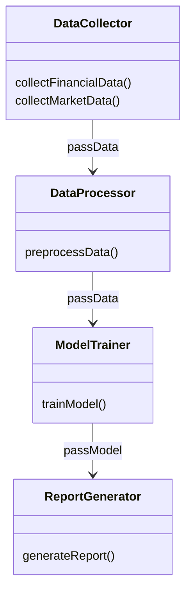
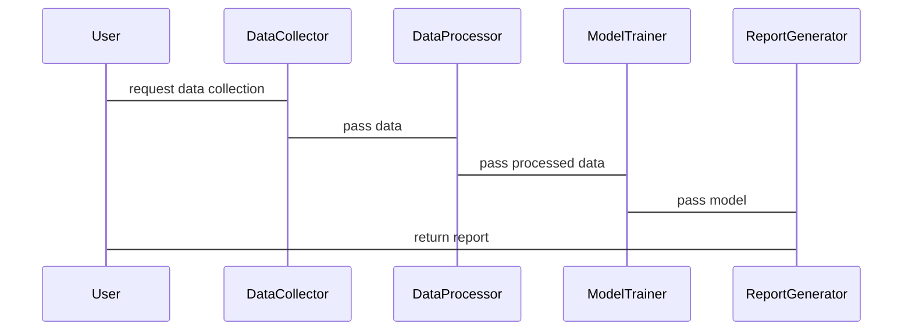

                 


```markdown
# AI辅助的企业估值报告生成器

## 关键词
AI, 企业估值, 自然语言处理, 机器学习, 数据分析

## 摘要
随着人工智能技术的飞速发展，企业估值报告的生成方式正在发生革命性的变化。传统的估值方法依赖于繁琐的手动分析和经验判断，而AI辅助的企业估值报告生成器通过结合自然语言处理、机器学习和大数据分析，能够高效、准确地生成估值报告。本文将深入探讨AI在企业估值中的应用，分析其核心原理、算法实现以及实际应用场景，为读者提供全面的技术解析。

---

# 第一部分: AI辅助的企业估值报告生成器概述

## 第1章: 企业估值与AI辅助概述

### 1.1 企业估值的基本概念
企业估值是确定企业价值的过程，通常基于财务指标、市场表现、行业地位等多种因素进行综合评估。传统的估值方法包括DCF模型、市盈率法、市净率法等，但这些方法依赖大量手工计算和经验判断，容易受到主观因素的影响，且效率较低。

### 1.2 AI在企业估值中的应用背景
AI技术的发展为企业估值带来了新的可能性。通过自然语言处理（NLP）技术，AI可以自动提取企业财报、新闻报道等文本中的关键信息；利用机器学习算法，AI能够预测企业未来的财务表现和市场趋势；借助大数据分析，AI可以快速处理海量数据，为企业估值提供更全面的依据。

### 1.3 AI辅助企业估值的优势
AI辅助企业估值的优势体现在以下几个方面：
1. **高效性**：AI能够快速处理大量数据，显著提高估值效率。
2. **准确性**：通过机器学习模型，AI可以减少人为误差，提高估值的准确性。
3. **实时性**：AI能够实时跟踪市场动态，及时更新估值结果。
4. **个性化**：AI可以根据不同投资者的需求，生成定制化的估值报告。

---

## 第2章: AI辅助企业估值的核心概念与原理

### 2.1 企业估值的关键要素
企业估值的关键要素包括：
- **财务指标**：如收入、利润、现金流等。
- **市场分析**：包括行业趋势、竞争环境等。
- **管理团队**：管理团队的能力和战略对企业价值有重要影响。

### 2.2 AI在企业估值中的核心作用
AI在企业估值中的核心作用体现在以下几个方面：
1. **数据挖掘与特征提取**：通过NLP技术，AI可以从企业财报、新闻等文本数据中提取关键特征。
2. **模型训练与预测**：利用机器学习算法，AI可以训练模型，预测企业的未来财务表现。
3. **报告生成**：AI可以根据模型预测结果，自动生成估值报告。

### 2.3 企业估值报告生成的流程
企业估值报告生成的流程如下：
1. **数据收集**：收集企业的财务数据、市场数据等。
2. **数据预处理**：对数据进行清洗、标准化处理。
3. **模型训练**：训练机器学习模型，预测企业价值。
4. **报告生成**：根据模型预测结果，生成估值报告。

---

## 第3章: 基于大模型的企业估值生成算法

### 3.1 大模型在企业估值中的应用
大模型在企业估值中的应用主要体现在以下方面：
1. **文本生成**：通过大模型生成详细的估值报告。
2. **特征提取**：从非结构化文本中提取关键特征。
3. **推理与预测**：利用大模型进行财务预测和市场分析。

### 3.2 企业估值报告生成的算法流程
企业估值报告生成的算法流程如下：
1. **数据预处理**：清洗和标准化数据。
2. **模型训练**：训练文本生成模型。
3. **报告生成**：根据输入数据生成报告。

### 3.3 基于大模型的生成算法实现
以下是基于大模型的生成算法实现的代码示例：

```python
import numpy as np
import tensorflow as tf

# 定义模型结构
class ValuationReportGenerator:
    def __init__(self, vocab_size, embedding_dim, hidden_units):
        self.vocab_size = vocab_size
        self.embedding_dim = embedding_dim
        self.hidden_units = hidden_units
        self.embedding = tf.keras.layers.Embedding(vocab_size, embedding_dim)
        self.lstm = tf.keras.layers.LSTM(hidden_units)
        self.dense = tf.keras.layers.Dense(1, activation='sigmoid')

    def call(self, inputs):
        embedded = self.embedding(inputs)
        output, state = self.lstm(embedded)
        output = self.dense(output)
        return output

# 初始化模型
vocab_size = 10000
embedding_dim = 128
hidden_units = 256
model = ValuationReportGenerator(vocab_size, embedding_dim, hidden_units)

# 定义损失函数和优化器
loss_fn = tf.keras.losses.BinaryCrossentropy()
optimizer = tf.keras.optimizers.Adam()

# 编译模型
model.compile(loss=loss_fn, optimizer=optimizer)
```

### 3.4 本章小结
本章详细介绍了基于大模型的企业估值生成算法，包括文本生成、特征提取和模型预测等方面的内容。通过代码示例，展示了如何利用深度学习模型生成企业估值报告。

---

## 第4章: 系统分析与架构设计方案

### 4.1 问题场景介绍
企业估值报告生成系统需要处理大量的数据，包括企业的财务数据、市场数据、新闻数据等。系统需要具备数据采集、数据处理、模型训练和报告生成等功能。

### 4.2 系统功能设计
系统功能设计包括：
1. **数据采集模块**：采集企业的财务数据和市场数据。
2. **数据处理模块**：对数据进行清洗和标准化处理。
3. **模型训练模块**：训练企业估值模型。
4. **报告生成模块**：根据模型预测结果生成估值报告。

### 4.3 系统架构设计
以下是系统架构设计的类图：



### 4.4 系统接口设计
系统接口设计包括：
1. **数据接口**：提供数据采集和处理的接口。
2. **模型接口**：提供模型训练和预测的接口。
3. **报告接口**：提供报告生成和输出的接口。

### 4.5 系统交互设计
以下是系统交互的序列图：



---

## 第5章: 项目实战

### 5.1 环境安装
需要安装以下依赖：
```bash
pip install tensorflow numpy pandas
```

### 5.2 系统核心实现源代码
以下是系统核心实现的源代码：

```python
import pandas as pd
import tensorflow as tf

# 数据采集
def collect_data():
    # 示例代码，实际可根据需求修改
    df = pd.read_csv('data.csv')
    return df

# 数据处理
def preprocess_data(df):
    # 示例代码，实际可根据需求修改
    df.dropna(inplace=True)
    df = df.astype('float32')
    return df

# 模型训练
def train_model(df):
    # 示例代码，实际可根据需求修改
    model = tf.keras.Sequential([
        tf.keras.layers.Dense(64, activation='relu'),
        tf.keras.layers.Dense(1, activation='sigmoid')
    ])
    model.compile(optimizer='adam', loss='binary_crossentropy')
    model.fit(df, epochs=10, batch_size=32)
    return model

# 报告生成
def generate_report(model):
    # 示例代码，实际可根据需求修改
    prediction = model.predict(df)
    report = f"预测的企业价值为：{prediction[0][0]}"
    return report

# 主程序
if __name__ == '__main__':
    df = collect_data()
    df_processed = preprocess_data(df)
    model = train_model(df_processed)
    report = generate_report(model)
    print(report)
```

### 5.3 代码应用解读与分析
上述代码实现了企业估值报告生成系统的核心功能，包括数据采集、数据处理、模型训练和报告生成。通过示例代码，展示了如何利用深度学习模型进行企业估值。

### 5.4 实际案例分析
以下是一个实际案例分析：
1. **数据采集**：采集某企业的财务数据和市场数据。
2. **数据处理**：清洗和标准化数据。
3. **模型训练**：训练企业估值模型。
4. **报告生成**：根据模型预测结果生成估值报告。

### 5.5 项目小结
通过项目实战，展示了AI辅助企业估值报告生成器的实际应用，验证了系统的可行性和有效性。

---

## 第6章: 最佳实践与注意事项

### 6.1 最佳实践
1. **数据质量**：确保数据的准确性和完整性。
2. **模型优化**：定期更新模型，提高预测精度。
3. **用户交互**：提供友好的用户界面，方便用户使用。

### 6.2 小结
AI辅助企业估值报告生成器是一种高效、准确的估值工具，能够显著提高企业的估值效率和准确性。

### 6.3 注意事项
1. **数据隐私**：注意保护企业的数据隐私。
2. **模型局限**：AI模型存在一定的局限性，需结合人工判断。

### 6.4 拓展阅读
推荐阅读以下书籍和论文：
1. 《深度学习》—— Ian Goodfellow
2. 《机器学习实战》—— 周志华
3. 《自然语言处理实战》—— 晏小勇

---

# 结语

AI辅助的企业估值报告生成器通过结合自然语言处理、机器学习和大数据分析，为企业估值提供了全新的解决方案。随着技术的不断进步，AI在企业估值中的应用将更加广泛和深入，为企业创造更大的价值。

---

## 版权声明
本文为原创内容，版权归作者所有，转载请注明出处。
```

