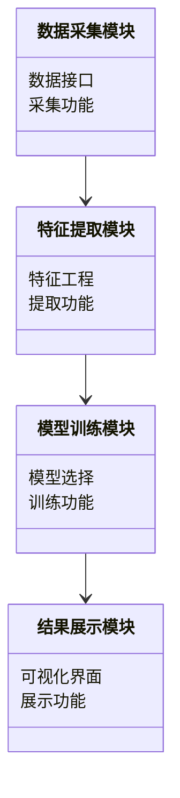
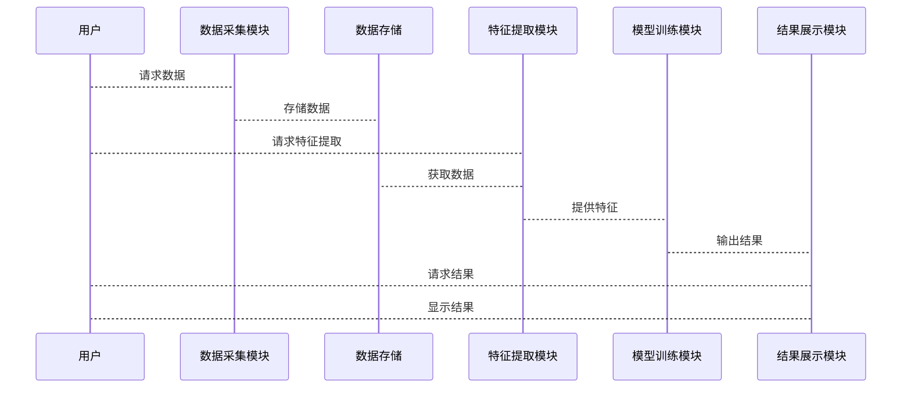

                 


# AI辅助的企业信用迁移矩阵估计

**关键词**：企业信用迁移矩阵，人工智能，信用风险评估，机器学习，金融模型

**摘要**：本文探讨了如何利用人工智能技术来估计企业信用迁移矩阵。文章首先介绍了信用迁移矩阵的基本概念和应用场景，然后详细讲解了AI在信用评估中的优势及其实现流程。接着，从数学模型和算法原理的角度分析了信用迁移矩阵的构建方法，包括随机森林、支持向量机和神经网络等算法的应用。文章还提供了系统架构设计和项目实战，展示了如何在实际场景中部署和应用这些模型。最后，总结了AI辅助企业信用迁移矩阵估计的最佳实践和未来发展方向。

---

# 第1章: 企业信用迁移矩阵概述

## 1.1 信用迁移矩阵的基本概念

### 1.1.1 信用迁移矩阵的定义
信用迁移矩阵是一种用于描述企业信用等级随时间变化的概率转移模型。它通过矩阵形式表示企业在不同信用等级之间的转移概率，帮助企业评估和管理信用风险。

### 1.1.2 信用迁移矩阵的作用
- **信用风险评估**：预测企业在未来一段时间内的信用等级变化，从而评估其违约风险。
- **信用等级划分**：基于转移概率对企业进行信用评级，为金融决策提供依据。
- **动态信用管理**：实时监控企业信用状况，及时调整信用策略。

### 1.1.3 与传统信用评分模型的区别
传统的信用评分模型通常基于静态数据，预测企业违约概率。而信用迁移矩阵则是动态模型，考虑了企业信用等级的时变性，能够捕捉企业信用状况的变化趋势。

## 1.2 信用迁移矩阵的应用场景

### 1.2.1 信用风险评估
- 银行贷款审批：评估借款企业的信用风险，决定贷款额度和利率。
- 投资决策：帮助投资者评估投资项目的信用风险，优化投资组合。

### 1.2.2 信用等级划分
- 企业评级：根据转移概率对企业进行信用评级，指导市场定价。
- 监管合规：金融机构需符合监管要求，准确评估客户信用等级。

### 1.2.3 动态信用管理
- 实时监控：跟踪企业信用变化，及时调整信用策略。
- 风险预警：识别高风险企业，提前采取防范措施。

## 1.3 企业信用迁移矩阵的必要性

### 1.3.1 传统信用评估方法的局限性
- 静态评估：无法捕捉企业信用变化的动态特征。
- 数据不足：传统模型依赖少量历史数据，难以捕捉复杂信用变化。

### 1.3.2 信用迁移矩阵的优势
- 动态性：能够反映信用等级的时变性，提供更准确的信用评估。
- 全局视角：考虑企业信用等级之间的相互影响，提供整体信用评估。

### 1.3.3 对企业信用管理的重要性
- 提高风险管理能力：通过动态模型准确评估信用风险，优化资源配置。
- 增强决策能力：基于实时信用变化，制定更有效的信用策略。

## 1.4 本章小结

---

# 第2章: AI在企业信用评估中的应用

## 2.1 AI技术在信用评估中的优势

### 2.1.1 数据处理能力
- 大数据分析：AI能够处理海量数据，提取有用的特征信息。
- 自动特征工程：利用机器学习算法自动提取复杂的特征，提高模型准确性。

### 2.1.2 模型训练能力
- 高维特征建模：AI能够处理高维特征，构建复杂的信用评估模型。
- 动态调整：基于实时数据动态调整模型参数，保持模型的准确性。

### 2.1.3 实时分析能力
- 实时监控：AI可以实时分析企业信用变化，提供及时的信用评估结果。
- 快速响应：在信用风险发生前，及时采取应对措施。

## 2.2 信用迁移矩阵的AI辅助方法

### 2.2.1 数据预处理与特征提取
- 数据清洗：处理缺失值、异常值，确保数据质量。
- 特征工程：提取对企业信用迁移有影响的关键特征，如财务指标、市场表现等。

### 2.2.2 AI算法在信用迁移矩阵中的应用
- **监督学习算法**：如随机森林、支持向量机（SVM）用于分类任务，预测企业信用等级转移。
- **无监督学习算法**：如聚类分析用于发现潜在的信用风险群组。
- **深度学习算法**：如神经网络用于捕捉复杂的信用迁移模式。

### 2.2.3 信用迁移矩阵的动态调整
- 在线学习：基于流数据动态更新模型，保持信用评估的准确性。
- 模型调参：根据新数据调整模型参数，优化信用迁移矩阵的预测能力。

## 2.3 企业信用迁移矩阵的AI实现流程

### 2.3.1 数据收集与清洗
- 数据来源：收集企业的财务数据、市场数据、行业数据等。
- 数据清洗：处理缺失值、重复值，标准化数据格式。

### 2.3.2 特征工程与模型选择
- 特征提取：选择对企业信用迁移有显著影响的特征，如财务比率、市场表现、管理团队稳定性等。
- 模型选择：根据数据特点选择合适的AI算法，如随机森林、神经网络等。

### 2.3.3 模型训练与评估
- 训练数据集：使用历史数据训练模型，评估模型的准确性。
- 验证数据集：验证模型的泛化能力，调整模型参数。

### 2.3.4 模型部署与应用
- 部署模型：将训练好的模型部署到生产环境，实时处理信用迁移数据。
- 应用场景：在企业信用评估、风险预警、投资决策中应用模型。

## 2.4 本章小结

---

# 第3章: 企业信用迁移矩阵的数学模型

## 3.1 信用迁移矩阵的数学定义

### 3.1.1 矩阵的元素表示
- 矩阵元素：$P_{ij}$ 表示企业从信用等级 $i$ 迁移到信用等级 $j$ 的概率。

### 3.1.2 矩阵的行与列含义
- 行表示当前信用等级，列表示目标信用等级。
- 矩阵总和：每一行的概率之和为1，表示从某一信用等级转移到其他等级的总概率为1。

### 3.1.3 矩阵的标准化处理
- 矩阵标准化：将矩阵归一化处理，确保每一行的概率之和为1。

## 3.2 信用迁移矩阵的计算公式

### 3.2.1 迁移概率的计算
- 迁移概率：$P_{ij} = \frac{\text{企业从 } i \text{ 迁移到 } j \text{ 的次数}}{\text{总迁移次数}}$
- 示例：计算企业从AA级迁移到A级的概率。

### 3.2.2 迁移矩阵的构建
- 矩阵构建步骤：
  1. 收集企业信用等级变化的历史数据。
  2. 统计每对信用等级之间的迁移次数。
  3. 计算每对信用等级之间的迁移概率。
  4. 构建信用迁移矩阵。

### 3.2.3 迁移矩阵的验证
- 矩阵验证：检查矩阵是否满足概率矩阵的性质，如行和为1，非负元素等。

## 3.3 信用迁移矩阵的应用公式

### 3.3.1 信用风险评估
- 风险评估公式：$\text{违约概率} = \sum_{j \in \text{违约等级}} P_{ij}$

### 3.3.2 信用迁移概率的加权计算
- 加权计算：$P_{\text{total}} = \sum_{k=1}^{n} w_k P_{kj}$，其中 $w_k$ 是权重。

## 3.4 本章小结

---

# 第4章: AI算法在信用迁移矩阵中的实现

## 4.1 监督学习算法的应用

### 4.1.1 随机森林算法
- 算法原理：随机森林通过构建多个决策树，投票决定最终结果。
- 应用步骤：
  1. 数据预处理：清洗数据，提取特征。
  2. 模型训练：使用随机森林算法训练信用迁移模型。
  3. 模型评估：计算准确率、召回率等指标。

### 4.1.2 支持向量机（SVM）
- 算法原理：SVM通过构建超平面，将数据分为不同类别。
- 应用步骤：
  1. 数据特征提取：选择对企业信用迁移有影响的特征。
  2. 模型训练：使用SVM算法训练信用迁移模型。
  3. 模型评估：计算分类准确率。

## 4.2 无监督学习算法的应用

### 4.2.1 聚类分析
- 算法原理：聚类分析将数据分成多个簇，每个簇代表一类信用等级。
- 应用步骤：
  1. 数据预处理：清洗数据，标准化特征。
  2. 模型训练：使用聚类算法（如K-means）对信用等级进行聚类。
  3. 模型评估：计算聚类的准确率。

## 4.3 深度学习算法的应用

### 4.3.1 神经网络
- 算法原理：神经网络通过多层感知机，学习复杂的信用迁移模式。
- 应用步骤：
  1. 数据预处理：清洗数据，提取特征。
  2. 模型训练：使用神经网络算法训练信用迁移模型。
  3. 模型评估：计算预测准确率。

## 4.4 本章小结

---

# 第5章: 系统架构设计

## 5.1 系统功能设计

### 5.1.1 功能模块
- 数据采集模块：收集企业信用数据。
- 特征提取模块：提取信用相关特征。
- 模型训练模块：训练信用迁移矩阵模型。
- 结果展示模块：展示信用迁移结果。

### 5.1.2 领域模型（Mermaid 类图）


## 5.2 系统架构设计（Mermaid 架构图）


## 5.3 系统接口设计

### 5.3.1 数据接口
- 数据输入接口：接收企业信用数据。
- 数据输出接口：输出信用迁移矩阵结果。

### 5.3.2 模型接口
- 模型输入接口：接收特征数据。
- 模型输出接口：输出信用迁移概率。

## 5.4 系统交互流程（Mermaid 序列图）



## 5.5 本章小结

---

# 第6章: 项目实战：信用迁移矩阵的AI实现

## 6.1 项目背景与目标

### 6.1.1 项目背景
- 项目目标：构建一个基于AI的企业信用迁移矩阵估计系统。

### 6.1.2 项目需求
- 数据收集：收集企业信用数据。
- 模型训练：训练信用迁移矩阵模型。
- 系统部署：部署系统并进行测试。

## 6.2 环境安装与配置

### 6.2.1 安装Python环境
- 安装步骤：
  1. 下载并安装Python。
  2. 安装必要的Python包，如scikit-learn、numpy、pandas等。

### 6.2.2 安装机器学习库
- 安装步骤：
  1. 使用pip安装scikit-learn、xgboost等库。

## 6.3 系统核心实现

### 6.3.1 数据预处理代码
```python
import pandas as pd
import numpy as np

# 读取数据
data = pd.read_csv('credit_data.csv')

# 数据清洗
data.dropna()
data = data[~data.duplicated()]
```

### 6.3.2 模型训练代码
```python
from sklearn.ensemble import RandomForestClassifier
from sklearn.metrics import accuracy_score

# 特征提取
X = data.drop('target', axis=1)
y = data['target']

# 模型训练
model = RandomForestClassifier()
model.fit(X, y)

# 模型评估
y_pred = model.predict(X)
print(accuracy_score(y, y_pred))
```

## 6.4 项目实战总结

### 6.4.1 项目成果
- 成功构建了基于AI的企业信用迁移矩阵估计系统。

### 6.4.2 实践经验
- 数据清洗和特征提取是项目成功的关键。
- 模型选择和调优能够显著提高预测准确率。

## 6.5 本章小结

---

# 第7章: 高级主题：信用迁移矩阵的优化与应用

## 7.1 模型优化

### 7.1.1 参数调优
- 随机森林：调整n_estimators、max_depth等参数。
- 神经网络：调整学习率、层数等参数。

### 7.1.2 模型解释性
- 使用SHAP值解释模型预测结果，了解每个特征对信用迁移的影响。

## 7.2 模型应用

### 7.2.1 信用风险预警
- 实时监控企业信用变化，及时发出预警信号。

### 7.2.2 投资组合优化
- 基于信用迁移矩阵优化投资组合，降低整体风险。

## 7.3 模型维护

### 7.3.1 模型更新
- 定期重新训练模型，更新信用迁移矩阵。

### 7.3.2 数据更新
- 定期更新数据，保持模型的准确性和相关性。

## 7.4 本章小结

---

# 第8章: 总结与展望

## 8.1 总结

### 8.1.1 核心内容回顾
- 介绍了信用迁移矩阵的基本概念和应用场景。
- 探讨了AI在信用迁移矩阵中的应用方法。
- 提供了系统架构设计和项目实战经验。

## 8.2 未来展望

### 8.2.1 技术发展
- 深度学习在信用迁移矩阵中的应用将进一步深入。
- 多模态数据的融合将提升模型的预测能力。

### 8.2.2 应用拓展
- 在更多金融领域的应用，如保险、投资等领域。
- 在非金融领域的拓展，如供应链管理、企业风险管理等。

## 8.3 最佳实践 Tips

### 8.3.1 数据处理
- 数据清洗和特征工程是项目成功的关键。
- 注意数据的时序性，处理时间序列数据。

### 8.3.2 模型选择
- 根据数据特点选择合适的算法。
- 结合业务需求选择模型，不能一味追求高准确率。

### 8.3.3 系统部署
- 确保系统的实时性和稳定性。
- 定期更新模型和数据，保持系统的准确性。

## 8.4 本章小结

---

# 参考文献

（此处列出参考文献的具体内容）

---

通过以上目录，您可以逐步深入地学习和应用AI辅助的企业信用迁移矩阵估计技术。

