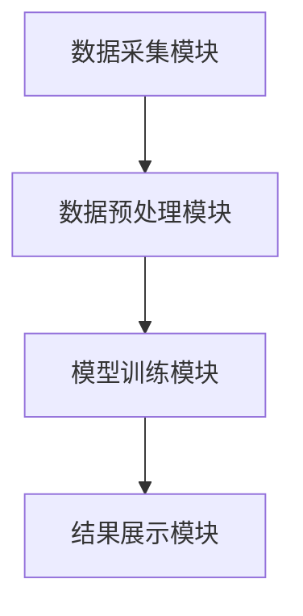

                 


# AI辅助的企业信用风险评估

## 关键词：AI, 信用风险评估, 机器学习, 深度学习, 系统架构设计

## 摘要：  
企业信用风险评估是金融领域中的核心问题，AI技术的引入显著提升了评估的效率和准确性。本文系统地介绍了信用风险评估的基本概念、AI技术的应用优势、数学模型与算法原理，以及基于AI的信用风险评估系统的架构设计。通过实际案例分析，展示了AI在信用风险评估中的具体应用，并探讨了未来的发展趋势。

---

## 第1章: 企业信用风险评估的基本概念

### 1.1 信用风险的定义与影响  
信用风险是指企业或个人在借贷活动中，由于其无法履行债务义务而导致债权人遭受损失的可能性。  

#### 1.1.1 信用风险的定义  
信用风险是金融领域中的核心风险之一，主要体现在企业的偿债能力和意愿上。  

#### 1.1.2 信用风险对企业的影响  
- **直接影响**：企业违约可能导致债权人损失，影响企业的融资能力。  
- **间接影响**：信用风险的高发会影响整个金融市场的稳定性。  

#### 1.1.3 信用风险的分类  
- **企业信用风险**：主要针对企业的偿债能力进行评估。  
- **个人信用风险**：主要针对个人的信用历史和消费行为进行评估。  

---

### 1.2 企业信用风险评估的传统方法  

#### 1.2.1 传统信用评估的核心要素  
传统信用评估主要基于以下五个要素（5Cs）：  
1. **Character（品格）**：企业的信用历史和管理团队的信誉。  
2. **Capacity（能力）**：企业的偿债能力，包括现金流和盈利能力。  
3. **Capital（资本）**：企业的资本结构和资产状况。  
4. **Collateral（抵押）**：企业提供的抵押资产。  
5. **Conditions（条件）**：企业的经营环境和市场条件。  

#### 1.2.2 5Cs与5Rs模型  
- **5Cs模型**：从五个维度评估企业的信用状况。  
- **5Rs模型**：从还款能力（Repayment）、还款意愿（Intention）、资本（Capital）、抵押（Collateral）和经营环境（Condition）五个维度进行评估。  

#### 1.2.3 传统信用评估的优缺点  
- **优点**：方法简单，易于理解和实施。  
- **缺点**：依赖人工判断，主观性较强，且难以覆盖海量数据。  

---

### 1.3 AI技术在信用风险评估中的作用  

#### 1.3.1 AI技术的基本概念  
人工智能（AI）通过机器学习、自然语言处理和深度学习等技术，能够从海量数据中提取特征并建立模型，从而实现自动化决策。  

#### 1.3.2 AI在信用风险评估中的优势  
- **高效性**：AI能够快速处理大量数据，提高评估效率。  
- **准确性**：通过机器学习模型，AI能够发现传统方法难以察觉的规律。  
- **实时性**：AI能够实时更新模型，适应市场变化。  

#### 1.3.3 AI技术在信用风险评估中的挑战  
- **数据质量**：需要高质量的训练数据，否则会影响模型的准确性。  
- **模型解释性**：复杂的深度学习模型往往难以解释其决策逻辑。  

---

## 1.4 本章小结  
本章介绍了信用风险的基本概念、传统评估方法及其优缺点，并重点探讨了AI技术在信用风险评估中的作用和挑战。  

---

## 第2章: 信用风险评估的核心概念与联系  

### 2.1 信用风险评估的核心要素  

#### 2.1.1 企业财务状况  
- 包括资产负债表、利润表和现金流量表等财务数据。  

#### 2.1.2 企业经营状况  
- 包括行业地位、市场竞争和管理团队能力等。  

#### 2.1.3 企业信用历史  
- 包括过去的违约记录和还款历史。  

---

### 2.2 AI技术与信用风险评估的结合  

#### 2.2.1 数据特征提取  
- 通过自然语言处理技术提取企业报告中的关键词和情感信息。  

#### 2.2.2 模型训练与优化  
- 使用机器学习模型对信用风险进行分类和预测。  

#### 2.2.3 结果解释与应用  
- 将AI模型的预测结果应用于实际的信贷决策中。  

---

### 2.3 核心概念的关系图  

#### 2.3.1 信用风险评估的ER实体关系图  

```mermaid
er
actor: 债权人
|-----|
| 企业信息表 |
|-----|
actor: 企业
|-----|
| 信用历史表 |
|-----|
actor: 评估系统
|-----|
| 模型训练表 |
```

---

## 第3章: 信用风险评估的数学模型与算法原理  

### 3.1 信用风险评估的数学模型  

#### 3.1.1 概率论基础  
- 信用风险评估的核心是概率问题，即预测企业违约的概率。  

#### 3.1.2 统计学习基础  
- 包括回归分析、聚类分析等基础统计方法。  

#### 3.1.3 机器学习模型  
- 包括逻辑回归、支持向量机（SVM）和随机森林等算法。  

---

### 3.2 常见的信用风险评估算法  

#### 3.2.1 逻辑回归模型  
- 常用于二分类问题，适用于预测企业违约概率。  

$$ J = -\frac{1}{m} \sum_{i=1}^{m} [y_i \cdot \ln(h(x_i)) + (1-y_i) \cdot \ln(1-h(x_i))] $$  

#### 3.2.2 支持向量机模型  
- 适用于高维数据的分类问题。  

$$ \min_{w,b,\xi} \frac{1}{2}||w||^2 + C \sum_{i=1}^{m} \xi_i $$  

#### 3.2.3 随机森林模型  
- 通过集成学习提高模型的准确性和鲁棒性。  

---

### 3.3 深度学习在信用风险评估中的应用  

#### 3.3.1 神经网络模型  
- 使用多层感知机（MLP）进行非线性特征提取。  

#### 3.3.2 长短期记忆网络（LSTM）  
- 适用于时间序列数据的分析。  

#### 3.3.3 卷积神经网络（CNN）  
- 适用于文本数据的特征提取，如企业报告和新闻。  

---

## 3.4 算法原理的数学公式  

### 3.4.1 逻辑回归的损失函数  
$$ J = -\frac{1}{m} \sum_{i=1}^{m} [y_i \cdot \ln(h(x_i)) + (1-y_i) \cdot \ln(1-h(x_i))] $$  

### 3.4.2 支持向量机的优化目标  
$$ \min_{w,b,\xi} \frac{1}{2}||w||^2 + C \sum_{i=1}^{m} \xi_i $$  

---

## 3.5 本章小结  
本章详细介绍了信用风险评估中的数学模型与算法原理，重点讲解了逻辑回归、支持向量机和随机森林等传统算法，以及深度学习模型的应用。  

---

## 第4章: 信用风险评估系统的架构设计  

### 4.1 系统架构概述  

#### 4.1.1 系统功能模块划分  
- 数据采集模块：从企业财报、新闻等来源获取数据。  
- 数据预处理模块：清洗和标准化数据。  
- 模型训练模块：训练机器学习模型。  
- 结果展示模块：可视化模型预测结果。  

#### 4.1.2 系统架构图  



---

### 4.2 数据流设计  

#### 4.2.1 数据采集模块  
- 从企业财报、新闻和信用评级机构获取数据。  

#### 4.2.2 数据预处理模块  
- 清洗数据，处理缺失值和异常值。  

#### 4.2.3 模型训练模块  
- 使用训练好的模型对新数据进行预测。  

#### 4.2.4 结果展示模块  
- 可视化模型预测结果，提供决策支持。  

---

## 4.3 本章小结  
本章详细描述了信用风险评估系统的架构设计，包括功能模块划分和数据流设计，为后续的系统实现提供了理论基础。  

---

## 第5章: 项目实战——基于AI的企业信用风险评估系统  

### 5.1 项目介绍  
本项目旨在开发一个基于AI的企业信用风险评估系统，利用机器学习模型对企业违约概率进行预测。  

---

### 5.2 系统功能设计  

#### 5.2.1 数据采集模块  
- 使用Python的`requests`库从企业财报中获取数据。  

#### 5.2.2 数据预处理模块  
- 使用`pandas`库清洗数据，处理缺失值和异常值。  

#### 5.2.3 模型训练模块  
- 使用`scikit-learn`库训练逻辑回归模型。  

#### 5.2.4 结果展示模块  
- 使用`matplotlib`库可视化模型预测结果。  

---

### 5.3 代码实现  

#### 5.3.1 环境安装  
```bash
pip install numpy pandas scikit-learn matplotlib
```

#### 5.3.2 核心代码实现  
```python
import pandas as pd
from sklearn.linear_model import LogisticRegression
from sklearn.metrics import accuracy_score

# 数据加载
data = pd.read_csv('credit_data.csv')

# 数据预处理
X = data.drop('default', axis=1)
y = data['default']

# 模型训练
model = LogisticRegression()
model.fit(X, y)

# 模型预测
y_pred = model.predict(X)

# 模型评估
print(accuracy_score(y, y_pred))
```

---

### 5.4 实际案例分析  
通过实际数据集的分析，展示了AI模型在信用风险评估中的应用效果。  

---

## 5.5 本章小结  
本章通过实际项目展示了AI在信用风险评估中的应用，详细讲解了系统的实现过程和代码实现。  

---

## 第6章: 总结与展望  

### 6.1 最佳实践  
- 数据质量是模型准确性的关键，需确保数据的完整性和一致性。  
- 模型解释性是实际应用中的重要需求，需注重模型的可解释性。  

### 6.2 小结  
本文系统地介绍了AI在企业信用风险评估中的应用，从理论到实践，全面阐述了相关技术和方法。  

### 6.3 注意事项  
- 数据隐私和安全问题需高度重视。  
- 模型的实时性和可扩展性是未来发展的重点。  

### 6.4 拓展阅读  
- 《机器学习实战》  
- 《深度学习入门：基于Python》  

---

## 结语  
随着AI技术的不断发展，信用风险评估将更加智能化和精准化。本文为读者提供了一个全面的视角，帮助其理解AI在信用风险评估中的应用及其未来的发展方向。

