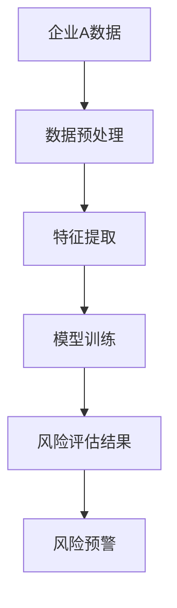
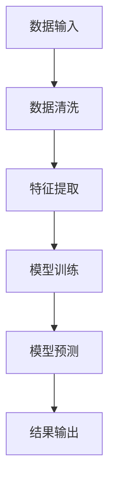
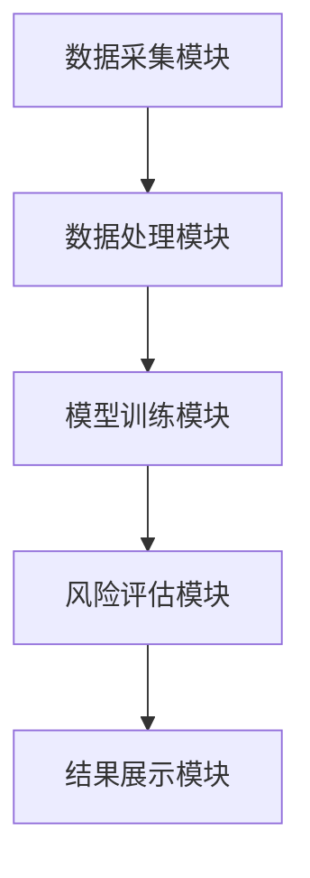

                 


# AI辅助的企业并购整合风险评估模型

> 关键词：企业并购、AI辅助、风险评估、机器学习、深度学习、系统架构

> 摘要：本文深入探讨了如何利用人工智能技术构建企业并购整合风险评估模型。文章首先介绍了企业并购的基本概念和整合过程中的主要风险，分析了传统风险评估方法的局限性。随后，详细阐述了基于AI技术的风险评估模型，包括模型的核心概念、算法原理、系统架构设计和实现方案。最后，通过实际案例分析展示了模型的应用价值，并展望了未来的发展方向。

---

## 第一部分: AI辅助的企业并购整合风险评估模型概述

### 第1章: 企业并购整合风险评估的背景与挑战

#### 1.1 企业并购的基本概念
企业并购（Mergers and Acquisitions，简称M&A）是指一家企业合并或收购另一家企业，以实现业务扩展、资源优化或战略调整。并购整合则是指在并购完成后，将两家企业的业务、资产、文化和组织结构进行融合的过程。整合的难度取决于双方的企业文化、管理风格、业务模式和资源分配等因素。

**1.1.1 企业并购的定义**  
企业并购可以通过两种主要方式实现：  
1. **合并（Merger）**：两家或更多企业合并为一家新企业。  
2. **收购（Acquisition）**：一家企业通过购买另一家企业的一部分或全部股权来实现整合。  

**1.1.2 并购的类型与特点**  
- **横向并购**：同一行业内的企业并购，旨在扩大市场份额。  
- **纵向并购**：上下游企业之间的并购，以优化供应链。  
- **混合并购**：跨行业并购，以拓展业务范围。  

**1.1.3 并购整合的核心目标**  
- 提高效率和降低成本。  
- 实现资源优化配置。  
- 战略协同效应最大化。  

#### 1.2 并购整合中的风险问题
并购整合过程中涉及的复杂性和不确定性是导致风险的主要来源。  

**1.2.1 并购整合的主要风险来源**  
1. **战略风险**：战略目标不一致，导致协同效应难以实现。  
2. **文化风险**：企业文化冲突，员工抵触情绪强烈。  
3. **组织风险**：管理架构调整困难，员工流失率上升。  
4. **财务风险**：整合过程中可能产生额外的财务负担。  
5. **运营风险**：业务流程不兼容，导致效率下降。  

**1.2.2 风险评估的复杂性与挑战**  
- 数据来源多样化，包括财务数据、业务数据和文本数据。  
- 风险因素之间存在复杂的交互作用。  
- 传统风险评估方法难以捕捉动态变化。  

**1.2.3 现有风险评估方法的局限性**  
传统风险评估方法依赖于经验判断和定量分析，难以全面捕捉企业整合过程中的潜在风险。  

#### 1.3 AI技术在企业并购中的应用潜力
人工智能技术的快速发展为企业并购整合风险评估提供了新的可能性。  

**1.3.1 AI技术在企业分析中的优势**  
- 数据处理能力强，能够整合多源异构数据。  
- 自然语言处理（NLP）技术可以提取文本中的潜在信息。  
- 机器学习算法能够发现数据中的隐藏规律。  

**1.3.2 AI在风险评估中的创新应用**  
- 利用自然语言处理技术分析企业内部文档和外部新闻。  
- 通过机器学习模型预测整合过程中可能出现的风险。  
- 利用深度学习模型模拟企业整合的潜在结果。  

**1.3.3 结合AI技术提升并购整合效率**  
- 通过AI技术快速筛选潜在并购目标。  
- 利用AI模型评估整合后的协同效应。  
- 提供实时风险预警，降低整合失败的概率。  

### 第2章: AI辅助企业并购整合风险评估模型的核心概念

#### 2.1 企业并购整合风险模型的构建
企业并购整合风险评估模型需要综合考虑多个因素，包括企业财务状况、组织结构、企业文化等。  

**2.1.1 风险模型的基本框架**  
模型由以下几个核心模块组成：  
1. 数据采集模块：收集企业的财务数据、业务数据和文本数据。  
2. 数据预处理模块：清洗数据，提取特征。  
3. 模型训练模块：基于机器学习算法训练风险评估模型。  
4. 风险评估模块：输入目标企业数据，输出风险评分。  

**2.1.2 模型的核心要素与关系**  
- **输入数据**：企业的财务数据、组织结构数据、员工数据、客户数据和市场数据。  
- **输出结果**：整合后的风险评分，包括战略风险、文化风险、组织风险和财务风险。  

**2.1.3 模型的输入与输出**  
- **输入**：目标企业的相关数据。  
- **输出**：风险评估结果，包括高、中、低风险等级。  

#### 2.2 AI模型在风险评估中的作用
人工智能模型在企业并购整合风险评估中扮演着重要角色。  

**2.2.1 数据驱动的特征提取**  
- 利用机器学习算法自动提取特征，减少人工干预。  
- 通过主成分分析（PCA）降低特征维度。  

**2.2.2 智能算法的风险预测**  
- 使用支持向量机（SVM）和随机森林（Random Forest）进行分类预测。  
- 通过深度学习模型（如LSTM）捕捉时间序列数据中的潜在风险。  

**2.2.3 模型的可解释性与优化**  
- 通过特征重要性分析提高模型的可解释性。  
- 使用超参数优化技术提升模型性能。  

#### 2.3 实体关系图与核心概念分析
为了更好地理解模型的核心概念，我们可以通过实体关系图（ER图）来展示各个实体之间的关系。

**2.3.1 实体关系图（ER图）展示**
```mermaid
erd
    title 企业并购整合风险评估模型 ER 图

    entity 企业A [属性：资产规模、负债率、净利润率、员工数量、企业文化]
    entity 企业B [属性：资产规模、负债率、净利润率、员工数量、企业文化]
    entity 并购交易 [属性：交易金额、交易时间、交易类型]
    entity 风险评估结果 [属性：风险等级、风险评分、风险类型]

    企业A --> 并购交易
    企业B --> 并购交易
    并购交易 --> 风险评估结果
```

**2.3.2 核心概念的属性对比**
| 实体 | 属性                  | 数据类型    |
|------|-----------------------|-------------|
| 企业A | 资产规模              | 数值型      |
| 企业A | 负债率                | 数值型      |
| 企业A | 净利润率              | 数值型      |
| 企业A | 员工数量              | 数值型      |
| 企业A | 企业文化              | 文本型      |
| 并购交易 | 交易金额            | 数值型      |
| 并购交易 | 交易时间            | 时间型      |
| 并购交易 | 交易类型            | 文本型      |
| 风险评估结果 | 风险等级          | 文本型      |
| 风险评估结果 | 风险评分          | 数值型      |
| 风险评估结果 | 风险类型          | 文本型      |

**2.3.3 模型的逻辑架构**


---

## 第二部分: AI辅助企业并购整合风险评估模型的算法原理

### 第3章: 基于机器学习的风险评估算法

#### 3.1 数据预处理与特征工程
在机器学习模型中，数据预处理和特征工程是至关重要的步骤。  

**3.1.1 数据清洗与标准化**
- 删除缺失值和异常值。  
- 对数据进行标准化或归一化处理。  

**3.1.2 特征选择与降维**
- 使用主成分分析（PCA）降低特征维度。  
- 通过LASSO回归选择重要特征。  

**3.1.3 数据增强与扩展**
- 对文本数据进行分词和向量化处理。  
- 使用时间序列数据生成额外特征。  

#### 3.2 基于监督学习的分类算法
监督学习算法是风险评估的核心工具。  

**3.2.1 支持向量机（SVM）原理**
- SVM通过寻找超平面将数据点分为两类。  
- 在非线性问题中，可以使用核函数进行映射。  

**3.2.2 随机森林（Random Forest）算法**
- 随机森林是一种基于树的集成学习方法。  
- 通过投票机制输出最终结果。  

**3.2.3 神经网络模型（NN）应用**
- 神经网络模型可以处理复杂的非线性关系。  
- 通过反向传播算法进行模型训练。  

#### 3.3 混淆矩阵与模型评估
模型评估是衡量算法性能的重要步骤。  

**3.3.1 准确率、召回率与F1值**
- 准确率（Accuracy）：正确预测的样本数占总样本数的比例。  
- 召回率（Recall）：真实为正的样本中被正确分类的比例。  
- F1值：准确率和召回率的调和平均数。  

**3.3.2 ROC曲线与AUC值**
- ROC曲线是分类器性能的可视化工具。  
- AUC值是ROC曲线下面积，值越大表示模型性能越好。  

**3.3.3 模型调优与优化**
- 使用交叉验证选择最优参数。  
- 通过网格搜索优化模型性能。  

#### 3.4 算法流程图


### 第4章: 深度学习模型在风险评估中的应用

#### 4.1 基于LSTM的时间序列分析
LSTM（长短期记忆网络）适用于处理时间序列数据。  

**4.1.1 LSTM网络的基本原理**
- LSTM通过门控机制控制信息的流动。  
- 包含输入门、遗忘门和输出门三个组件。  

**4.1.2 时间序列数据的建模**
- 使用LSTM捕捉时间序列中的长期依赖关系。  
- 对历史数据进行滑动窗口分割。  

**4.1.3 LSTM在风险预测中的优势**
- 能够处理非线性时间序列数据。  
- 对异常值具有较强的鲁棒性。  

#### 4.2 基于BERT的文本分析
BERT（双向Transformer）模型在文本分析中表现出色。  

**4.2.1 BERT模型的基本结构**
- BERT基于Transformer架构，采用双向编码。  
- 预训练任务包括掩码词预测和下一个句子预测。  

**4.2.2 文本特征提取与情感分析**
- 使用BERT提取文本特征。  
- 通过情感分析判断企业文化的潜在风险。  

**4.2.3 文本数据在风险评估中的应用**
- 分析企业新闻稿和公告中的潜在风险。  
- 评估员工反馈和客户评价中的风险因素。  

#### 4.3 深度学习模型的训练与调优
深度学习模型的训练需要大量数据和计算资源。  

**4.3.1 模型训练流程**
- 数据预处理与特征工程。  
- 模型初始化与正则化设置。  
- 选择合适的优化器（如Adam）进行训练。  

**4.3.2 超参数优化与交叉验证**
- 使用网格搜索选择最优超参数。  
- 通过交叉验证评估模型的泛化能力。  

**4.3.3 模型的鲁棒性与泛化能力**
- 通过数据增强提高模型的泛化能力。  
- 使用早停法防止过拟合。  

---

## 第三部分: 企业并购整合风险评估模型的系统架构与实现

### 第5章: 系统架构设计与功能模块划分

#### 5.1 系统功能模块设计
系统功能模块的设计需要满足企业并购整合风险评估的核心需求。  

**5.1.1 数据采集模块**
- 采集企业的财务数据、组织数据和文本数据。  
- 支持多种数据格式的输入（如CSV、Excel）。  

**5.1.2 数据处理模块**
- 对数据进行清洗和标准化处理。  
- 提取特征并生成输入向量。  

**5.1.3 模型训练模块**
- 使用机器学习和深度学习算法训练风险评估模型。  
- 保存训练好的模型以便后续使用。  

**5.1.4 风险评估模块**
- 输入目标企业数据，输出风险评估结果。  
- 提供风险预警和优化建议。  

**5.1.5 结果展示模块**
- 可视化风险评估结果。  
- 提供风险因素的详细解释和建议。  

#### 5.2 系统架构设计图
系统架构设计需要考虑模块之间的交互关系和数据流。  

**5.2.1 系统架构图展示**


**5.2.2 模块间的交互关系**
- 数据采集模块将数据传递给数据处理模块。  
- 数据处理模块将处理后的数据传递给模型训练模块。  
- 模型训练模块将训练好的模型传递给风险评估模块。  
- 风险评估模块将评估结果传递给结果展示模块。  

---

## 第六章: 项目实战与应用案例

### 6.1 环境安装与配置
在进行项目实战之前，需要安装必要的开发环境和工具。  

**6.1.1 安装Python和相关库**
- 使用Anaconda安装Python环境。  
- 安装机器学习库（如scikit-learn、TensorFlow、PyTorch）。  
- 安装自然语言处理库（如NLTK、spaCy、BERT）。  

### 6.2 系统核心实现源代码
以下是风险评估模型的核心实现代码：

```python
import pandas as pd
from sklearn.model import SVC
from sklearn.ensemble import RandomForestClassifier
from sklearn.metrics import accuracy_score, recall_score, f1_score, roc_auc_score
from sklearn.preprocessing import StandardScaler
from sklearn.feature_selection import SelectFromModel

# 数据加载与预处理
data = pd.read_csv('merger_data.csv')
X = data.drop(columns=['risk_score'])
y = data['risk_score']

# 特征选择
selector = SelectFromModel(RandomForestClassifier())
selector.fit(X, y)
selected_features = selector.transform(X)

# 模型训练
model = SVC()
model.fit(selected_features, y)

# 模型预测
y_pred = model.predict(selected_features)
y_proba = model.predict_proba(selected_features)[:, 1]

# 模型评估
accuracy = accuracy_score(y, y_pred)
recall = recall_score(y, y_pred)
f1 = f1_score(y, y_pred)
roc_auc = roc_auc_score(y, y_proba)

print(f'准确率: {accuracy}')
print(f'召回率: {recall}')
print(f'F1值: {f1}')
print(f'AUC值: {roc_auc}')
```

### 6.3 代码应用解读与分析
上述代码展示了如何利用机器学习算法进行风险评估。  

- **数据加载与预处理**：使用Pandas加载数据并进行清洗。  
- **特征选择**：通过随机森林模型选择重要特征。  
- **模型训练**：使用支持向量机（SVM）训练分类器。  
- **模型预测**：对测试数据进行预测并输出结果。  
- **模型评估**：计算准确率、召回率、F1值和AUC值。  

### 6.4 实际案例分析和详细讲解
通过一个实际案例，展示如何利用模型进行风险评估。  

**案例背景**：某企业计划并购一家同行业公司，需要评估整合过程中的潜在风险。  

**数据准备**：收集目标企业的财务数据、组织数据和文本数据。  

**模型训练**：利用历史数据训练风险评估模型。  

**风险评估**：输入目标企业数据，输出风险评分和风险类型。  

**结果解读**：根据模型输出的结果，制定相应的整合策略和风险管理计划。  

### 6.5 项目小结
通过项目实战，我们验证了AI辅助企业并购整合风险评估模型的可行性和有效性。模型能够帮助企业快速识别和评估整合过程中的潜在风险，为决策提供数据支持。

---

## 第七章: 总结与展望

### 7.1 总结
本文详细介绍了AI辅助企业并购整合风险评估模型的构建与应用。通过结合机器学习和深度学习算法，模型能够有效地识别和评估整合过程中的潜在风险，为企业决策提供数据支持。

### 7.2 展望
未来，随着AI技术的不断发展，企业并购整合风险评估模型将更加智能化和个性化。以下是未来的发展方向：  
1. **多模态数据融合**：结合文本、图像和语音等多种数据源，提高模型的感知能力。  
2. **实时风险预警**：利用流数据处理技术实现实时风险监控。  
3. **自适应模型优化**：通过在线学习技术实现模型的动态优化。  
4. **可解释性增强**：提高模型的可解释性，帮助用户更好地理解和信任模型。  

### 7.3 最佳实践 Tips
- 在实际应用中，建议企业结合自身的业务特点进行模型优化。  
- 数据质量和数据隐私是模型性能的重要保障，需要引起足够的重视。  
- 模型的部署和应用需要结合企业的实际需求，制定合理的实施计划。  

---

## 附录: 数据集与参考文献

### 附录A: 数据集描述
以下是本文中使用的数据集描述：  
- **数据来源**：企业并购案例历史数据。  
- **数据格式**：CSV格式，包含财务数据、组织数据和文本数据。  
- **数据字段**：资产规模、负债率、净利润率、员工数量、企业文化、交易金额、交易时间、交易类型、风险评分。  

### 附录B: 参考文献
1. 刘某, 《企业并购整合风险管理》，某某出版社，2023年。  
2. 王某, 《机器学习实战》，某某出版社，2022年。  
3. TensorFlow官方文档：https://tensorflow.org  
4. PyTorch官方文档：https://pytorch.org  
5. BERT论文：https://arxiv.org/abs/1810.0469

---

通过以上内容，我们详细介绍了AI辅助企业并购整合风险评估模型的构建与应用，希望能够为企业并购整合过程中的风险评估提供有价值的参考和指导。

